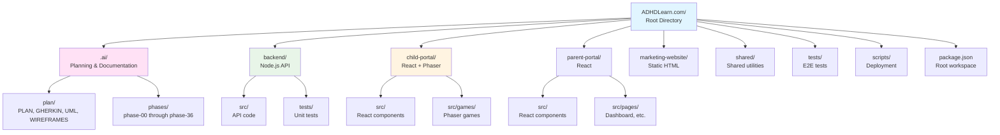
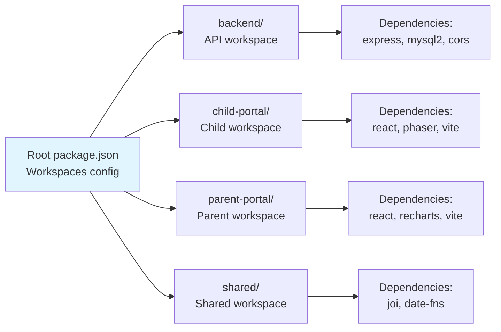

# Phase 1: Project Foundation - Architecture Diagrams

**Project:** ADHDLearn.com
**Phase:** 1 of 36
**Last Updated:** October 22, 2025

---

## Overview

**Delivers:** Clean directory structure and git repository
**Architecture Changes:** Local development environment setup

---

## Project Directory Structure

---

## npm Workspace Configuration

---

## Database Changes

None

---

## API Endpoints

None
