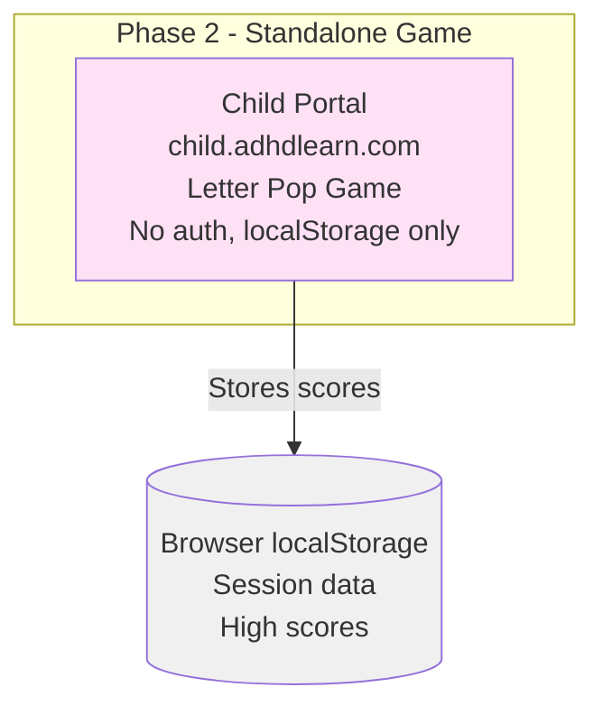
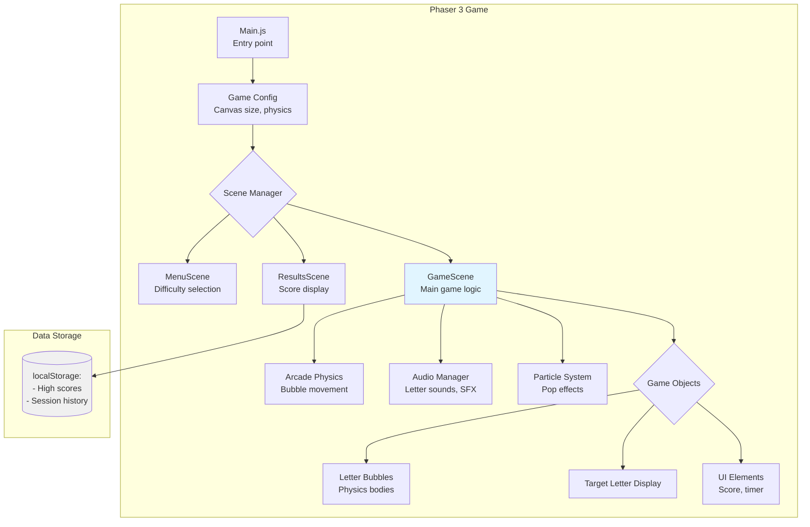
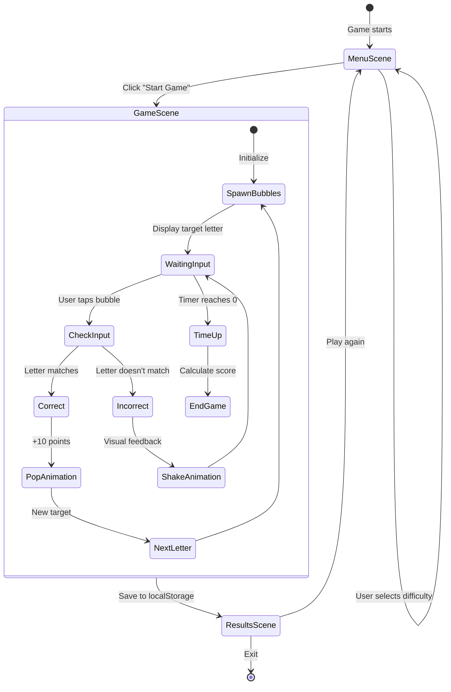

# Phase 2: Letter Pop Standalone - Architecture Diagrams

**Project:** ADHDLearn.com
**Phase:** 2 of 36
**Last Updated:** October 22, 2025

---

## Overview

**Delivers:** Aurora can play Letter Pop from her tablet
**Architecture Changes:** Phaser 3 game deployed, no backend integration yet

---

## Phase 2 Architecture

---

## Phaser Game Architecture

---

## Game Scene Flow

---

## Database Changes

None (localStorage only)

---

## API Endpoints

None (standalone game)
