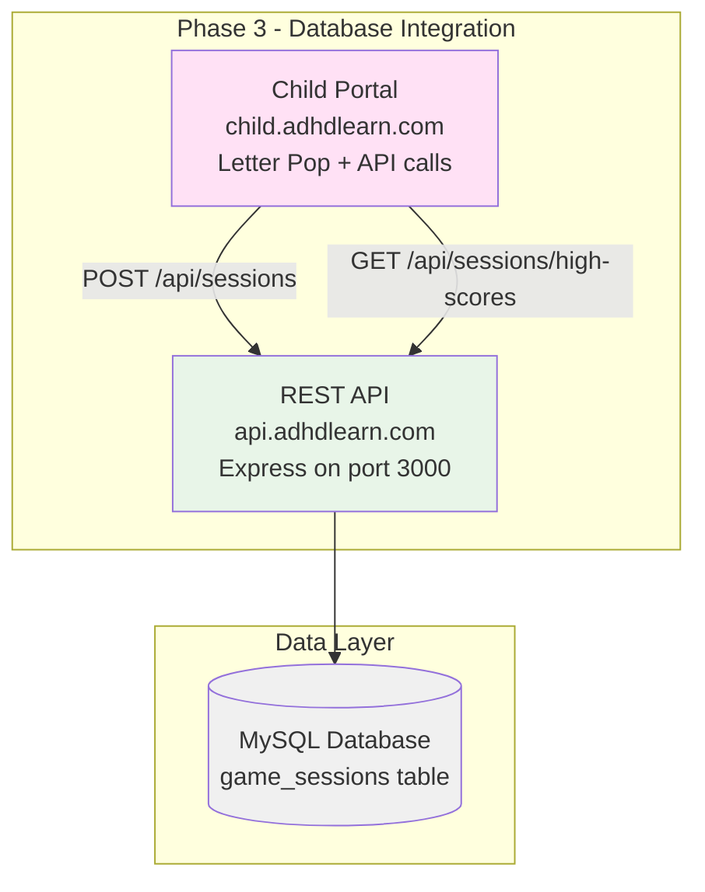
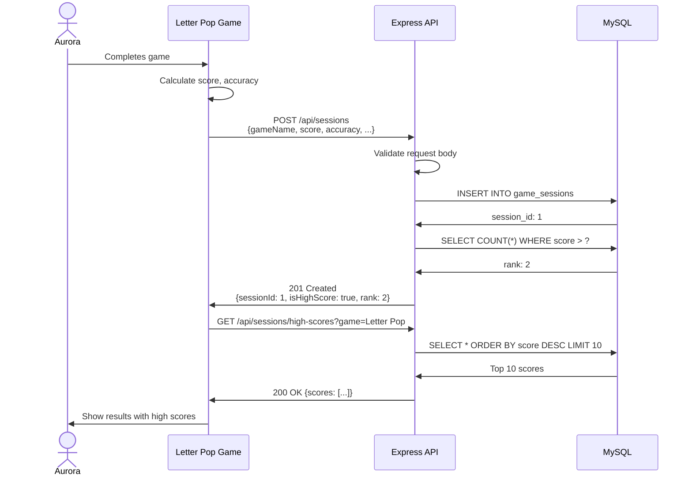
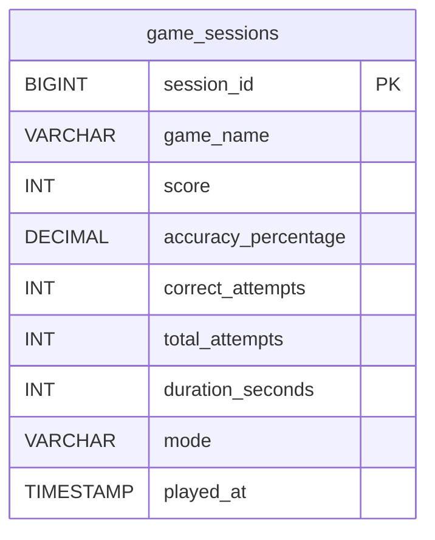
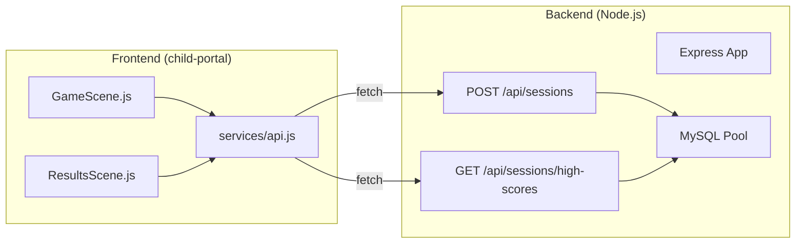

# Phase 3: Database + Simple Backend - Architecture Diagrams

**Project:** ADHDLearn.com
**Phase:** 3 of 36
**Last Updated:** October 22, 2025

---

## Overview

**Delivers:** Scores persist in database
**Architecture Changes:** MySQL database + Express API added

---

## Phase 3 Architecture

---

## API Request/Response Flow

---

## Database Schema

---

## Component Structure

---

## Database Changes

**New Table:** `game_sessions`
- Stores all game session data
- Indexed on (game_name, score) for high score queries
- Indexed on played_at for chronological queries

---

## API Endpoints

**POST /api/sessions**
- Creates new game session record
- Returns isHighScore and rank

**GET /api/sessions/high-scores**
- Returns top N scores for a game
- Ordered by score DESC
