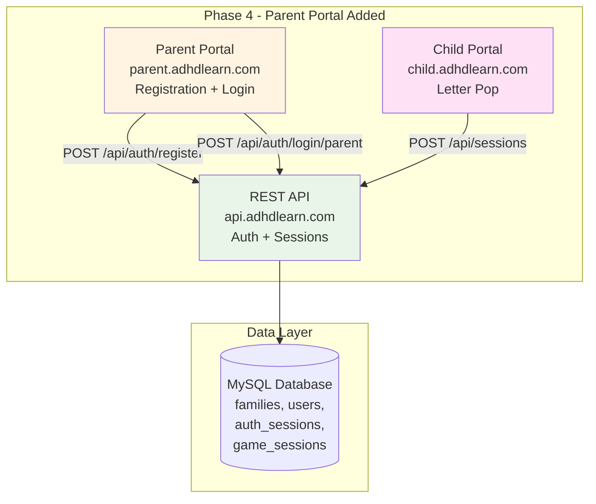
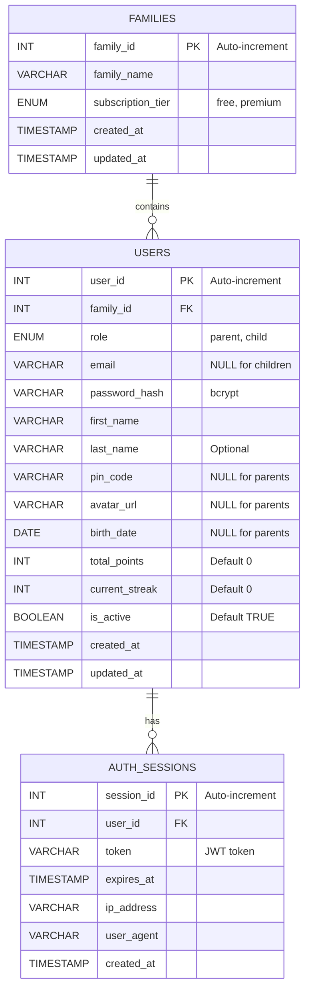
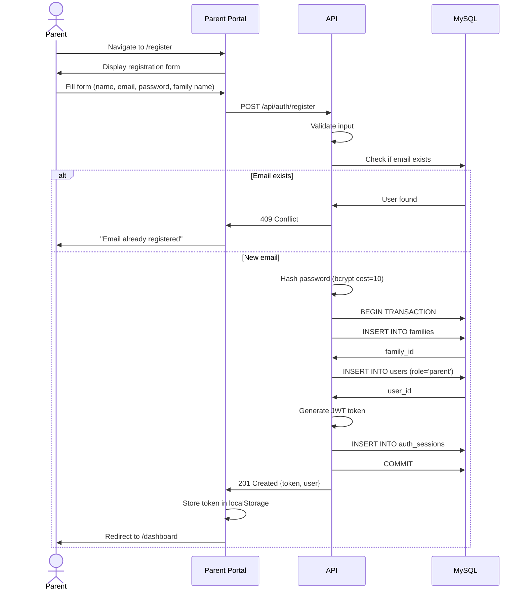
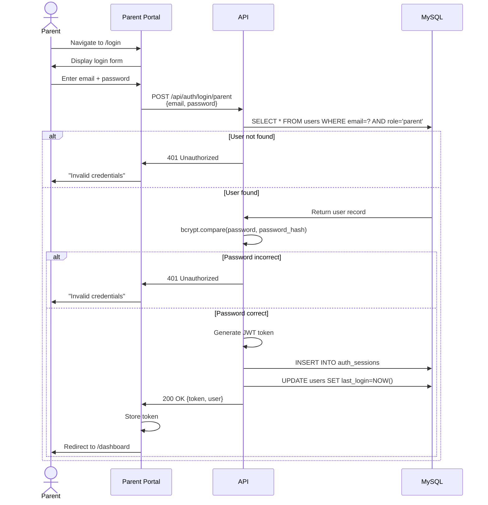
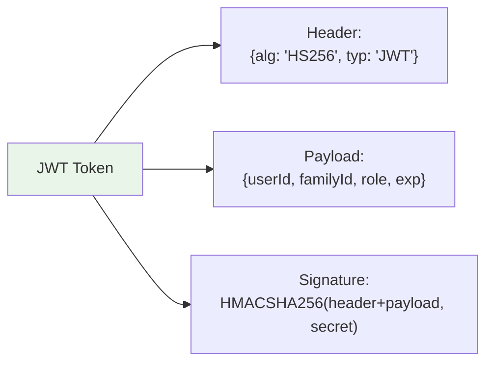

# Phase 4: Architecture Diagrams

**Project:** ADHDLearn.com
**Phase:** 4 of 36
**Last Updated:** October 22, 2025

---

**Delivers:** You can create an account and login
**Architecture Changes:** User authentication system added

### Phase 4 Architecture

### Database ERD (Phase 4)

### Parent Registration Flow

### Parent Login Flow

### JWT Token Structure

### Database Changes

**New Tables:**
- `families` - Family/account information
- `users` - Parent and child users
- `auth_sessions` - JWT token sessions

### API Endpoints

| Method | Endpoint | Purpose |
|--------|----------|---------|
| POST | `/api/auth/register` | Register new family + parent |
| POST | `/api/auth/login/parent` | Parent email/password login |
| POST | `/api/auth/logout` | Invalidate token |
| GET | `/api/auth/me` | Get current user info |

---

