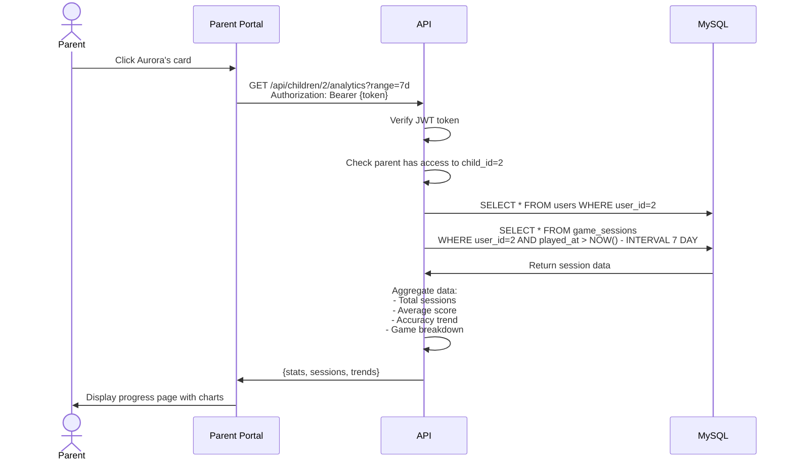

# Phase 5: Architecture Diagrams

**Project:** ADHDLearn.com
**Phase:** 5 of 36
**Last Updated:** October 22, 2025

---


**Delivers:** Parents see their children's Letter Pop scores
**Architecture Changes:** Parent dashboard with analytics

### Phase 5 Architecture

No architecture diagram changes (same as Phase 4), but significant frontend component additions.

### Parent Dashboard Component Tree

```mermaid
graph TB
    App[App.tsx]
    App --> AuthProvider[AuthProvider<br/>Context]
    App --> Router[React Router]

    Router --> Dashboard[DashboardPage]

    Dashboard --> Header[Header<br/>Logo, user menu, notifications]
    Dashboard --> Overview[OverviewStats<br/>Total sessions, streak, time]
    Dashboard --> ChildCards[ChildrenGrid]
    Dashboard --> Activity[RecentActivityFeed]

    ChildCards --> ChildCard[ChildCard × N]

    ChildCard --> Avatar[Avatar]
    ChildCard --> ChildStats["Stats:<br/>- Sessions today<br/>- Current streak<br/>- Average score"]
    ChildCard --> ViewButton[View Progress Button]

    ViewButton --> ProgressPage[ProgressPage<br/>(detailed analytics)]

    style Dashboard fill:#fff4e1
    style ChildCard fill:#e1f5ff
```

### Data Flow: View Child Progress



### Database Changes

**Modified Tables:**
- `game_sessions` - Add `user_id` column (nullable for backwards compatibility)

```sql
ALTER TABLE game_sessions
ADD COLUMN user_id INT NULL,
ADD FOREIGN KEY (user_id) REFERENCES users(user_id);
```

### API Endpoints

| Method | Endpoint | Purpose |
|--------|----------|---------|
| GET | `/api/children/:id/analytics` | Get child analytics |
| GET | `/api/children/:id/sessions` | Get child session history |
| GET | `/api/families/:id/children` | List all children in family |

---

