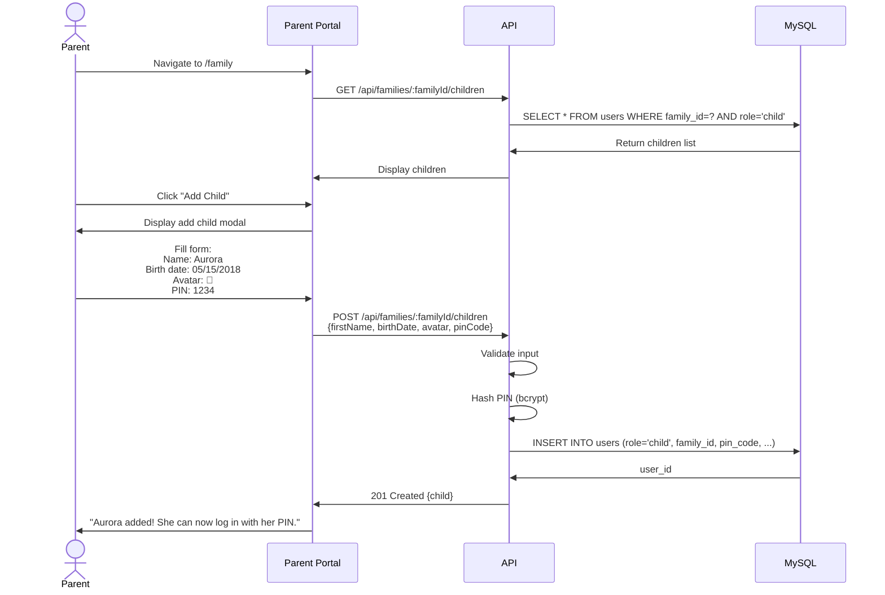

# Phase 6: Architecture Diagrams

**Project:** ADHDLearn.com
**Phase:** 6 of 36
**Last Updated:** October 22, 2025

---

**Delivers:** Parents can add children with avatars and PINs
**Architecture Changes:** Child management endpoints

### Database Changes

No new tables, but `users` table now actively uses child fields:
- `pin_code` (bcrypt hashed 4-digit PIN)
- `avatar_url` (emoji or image URL)
- `birth_date` (for age calculation)

### Add Child Flow

### API Endpoints

| Method | Endpoint | Purpose |
|--------|----------|---------|
| POST | `/api/families/:id/children` | Add child to family |
| PUT | `/api/children/:id` | Update child info |
| DELETE | `/api/children/:id` | Archive child (soft delete) |

---

