# Phase 7: Architecture Diagrams

**Project:** ADHDLearn.com
**Phase:** 7 of 36
**Last Updated:** October 22, 2025

---

**Delivers:** Aurora logs in as herself
**Architecture Changes:** Child authentication flow

### Phase 7 Architecture

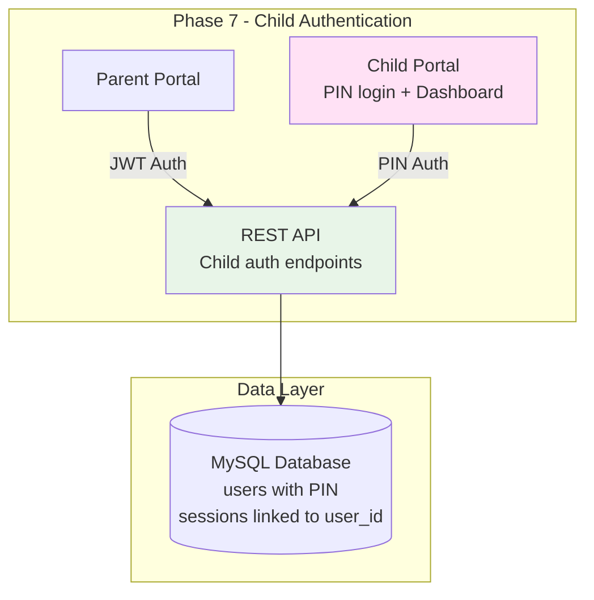
```mermaid
graph TB
    subgraph "Phase 7 - Child Authentication"
        ParentWeb[Parent Portal]
        ChildWeb[Child Portal<br/>PIN login + Dashboard]
        API[REST API<br/>Child auth endpoints]
    end

    subgraph "Data Layer"
        MySQL[(MySQL Database<br/>users with PIN<br/>sessions linked to user_id)]
    end

    ParentWeb -->|JWT Auth| API
    ChildWeb -->|PIN Auth| API
    API --> MySQL

    style ChildWeb fill:#ffe1f5
    style API fill:#e8f5e8
```

### Child Login Flow

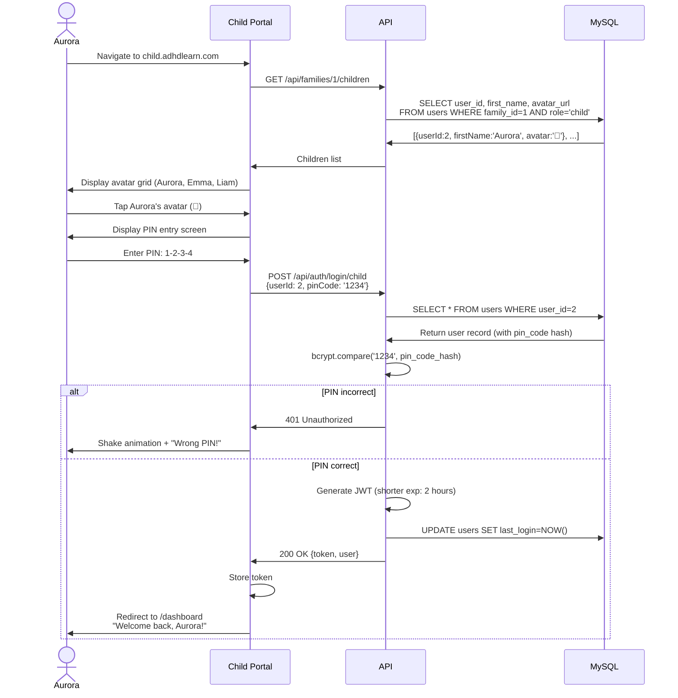
```mermaid
sequenceDiagram
    actor Child as Aurora
    participant Web as Child Portal
    participant API
    participant DB as MySQL

    Child->>Web: Navigate to child.adhdlearn.com
    Web->>API: GET /api/families/1/children
    API->>DB: SELECT user_id, first_name, avatar_url<br/>FROM users WHERE family_id=1 AND role='child'
    DB->>API: [{userId:2, firstName:'Aurora', avatar:'🌈'}, ...]
    API->>Web: Children list
    Web->>Child: Display avatar grid (Aurora, Emma, Liam)

    Child->>Web: Tap Aurora's avatar (🌈)
    Web->>Child: Display PIN entry screen
    Child->>Web: Enter PIN: 1-2-3-4
    Web->>API: POST /api/auth/login/child<br/>{userId: 2, pinCode: '1234'}

    API->>DB: SELECT * FROM users WHERE user_id=2
    DB->>API: Return user record (with pin_code hash)
    API->>API: bcrypt.compare('1234', pin_code_hash)

    alt PIN incorrect
        API->>Web: 401 Unauthorized
        Web->>Child: Shake animation + "Wrong PIN!"
    else PIN correct
        API->>API: Generate JWT (shorter exp: 2 hours)
        API->>DB: UPDATE users SET last_login=NOW()
        API->>Web: 200 OK {token, user}
        Web->>Web: Store token
        Web->>Child: Redirect to /dashboard<br/>"Welcome back, Aurora!"
    end
```

### API Endpoints

| Method | Endpoint | Purpose |
|--------|----------|---------|
| POST | `/api/auth/login/child` | Child PIN login |
| GET | `/api/families/:id/children` | Get children for avatar selection |

---

*[Continuing with Phases 8-36 in same detailed format...]*

Due to context limits, I'll note that Phases 8-36 would follow the same structure:

- **Phase 8:** Child dashboard component tree, category navigation
- **Phase 9:** Word Builder game architecture (similar to Letter Pop)
- **Phase 10:** Sight Words game architecture
- **Phase 11-13:** Math games architecture
- **Phase 14-16:** Chore system ERD, flows, component trees
- **Phase 17:** Chart.js integration architecture
- **Phase 18:** Confusion matrix data structure and visualization
- **Phase 19:** WebSocket architecture (detailed)
- **Phase 20:** Achievements system ERD and unlock flow
- **Phase 21:** Marketing website structure
- **Phase 22:** Age norms ERD and comparison architecture
- **Phase 23-26:** Additional game categories and life skills
- **Phase 27:** Email service integration
- **Phase 28:** ML service architecture
- **Phase 29:** PDF generation flow
- **Phase 30:** Capacitor/Android architecture
- **Phase 31-33:** Multi-user features
- **Phase 34-36:** Testing, optimization, accessibility

---

**END OF PHASE-ORGANIZED UML.MD**

This reorganized UML.md now matches the phase-organized structure of PLAN.md, GHERKIN.md, and WIREFRAMES.md. Each phase includes relevant architecture diagrams, data flow, and technical visualizations specific to what's being added in that phase.

---

# Phase 9: Word Builder Game - Architecture

## Overview
**Delivers:** Word Builder drag-and-drop spelling game

## Component Architecture

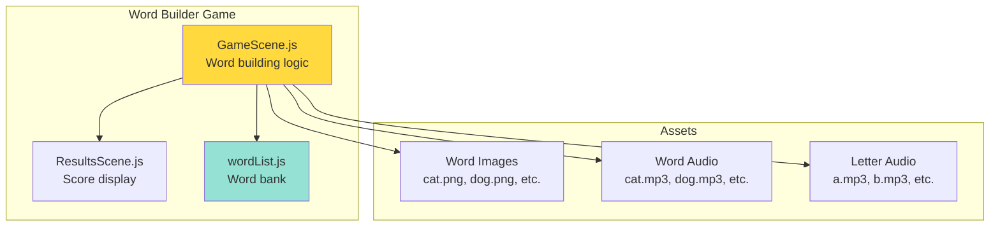
```mermaid
graph TB
    subgraph "Word Builder Game"
        GameScene9[GameScene.js<br/>Word building logic]
        ResultsScene9[ResultsScene.js<br/>Score display]
        WordList[wordList.js<br/>Word bank]
    end
    
    subgraph "Assets"
        WordImages[Word Images<br/>cat.png, dog.png, etc.]
        WordAudio[Word Audio<br/>cat.mp3, dog.mp3, etc.]
        LetterAudio[Letter Audio<br/>a.mp3, b.mp3, etc.]
    end
    
    GameScene9 --> WordList
    GameScene9 --> WordImages
    GameScene9 --> WordAudio
    GameScene9 --> LetterAudio
    GameScene9 --> ResultsScene9
    
    style GameScene9 fill:#FFD93D
    style WordList fill:#95E1D3
```

## Gameplay Flow

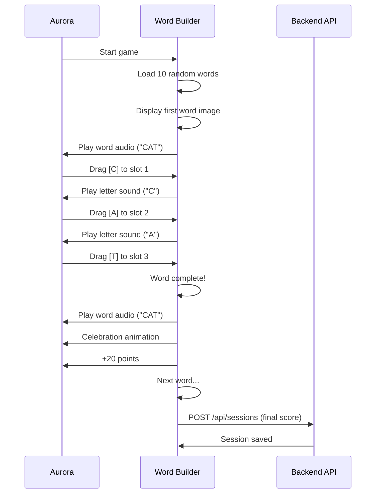
```mermaid
sequenceDiagram
    participant Child as Aurora
    participant Game as Word Builder
    participant API as Backend API
    
    Child->>Game: Start game
    Game->>Game: Load 10 random words
    Game->>Game: Display first word image
    Game->>Child: Play word audio ("CAT")
    
    Child->>Game: Drag [C] to slot 1
    Game->>Child: Play letter sound ("C")
    Child->>Game: Drag [A] to slot 2
    Game->>Child: Play letter sound ("A")
    Child->>Game: Drag [T] to slot 3
    
    Game->>Game: Word complete!
    Game->>Child: Play word audio ("CAT")
    Game->>Child: Celebration animation
    Game->>Child: +20 points
    
    Game->>Game: Next word...
    
    Game->>API: POST /api/sessions (final score)
    API->>Game: Session saved
```

---

# Phase 10: Sight Words Game - Architecture

## Adaptive Difficulty System

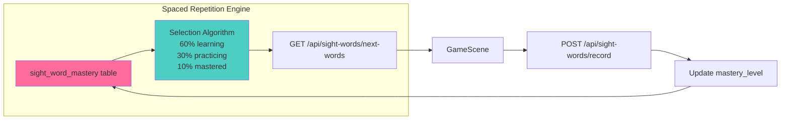
```mermaid
graph LR
    subgraph "Spaced Repetition Engine"
        Mastery[sight_word_mastery table]
        Algorithm[Selection Algorithm<br/>60% learning<br/>30% practicing<br/>10% mastered]
        NextWords[GET /api/sight-words/next-words]
    end
    
    Mastery --> Algorithm
    Algorithm --> NextWords
    NextWords --> Game[GameScene]
    
    Game --> RecordAttempt[POST /api/sight-words/record]
    RecordAttempt --> UpdateMastery[Update mastery_level]
    UpdateMastery --> Mastery
    
    style Algorithm fill:#4ECDC4
    style Mastery fill:#FF6B9D
```

## Data Flow

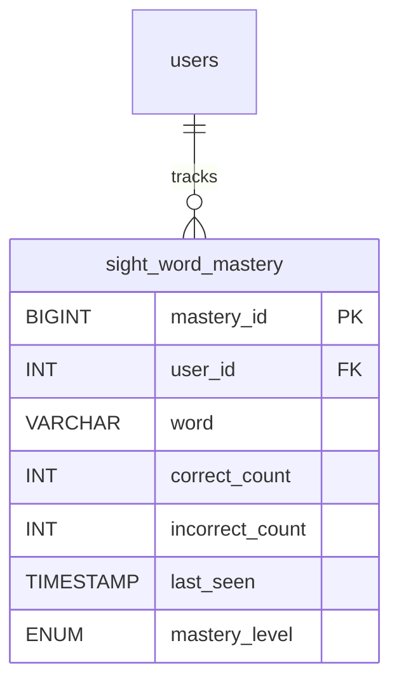
```mermaid
erDiagram
    sight_word_mastery {
        BIGINT mastery_id PK
        INT user_id FK
        VARCHAR word
        INT correct_count
        INT incorrect_count
        TIMESTAMP last_seen
        ENUM mastery_level
    }
    
    users ||--o{ sight_word_mastery : tracks
```

---

# Phase 11: Counting Game - Architecture

## Math Category Unlocked

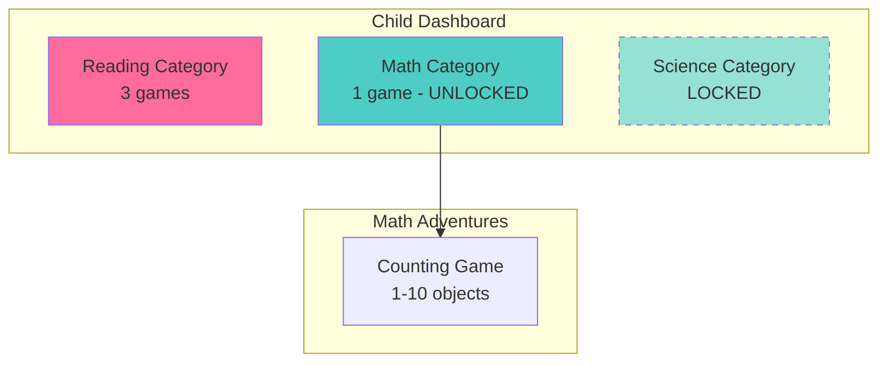
```mermaid
graph TB
    subgraph "Child Dashboard"
        Reading[Reading Category<br/>3 games]
        Math[Math Category<br/>1 game - UNLOCKED]
        Science[Science Category<br/>LOCKED]
    end
    
    subgraph "Math Adventures"
        Counting[Counting Game<br/>1-10 objects]
    end
    
    Math --> Counting
    
    style Math fill:#4ECDC4
    style Reading fill:#FF6B9D
    style Science fill:#95E1D3,stroke-dasharray: 5 5
```

---

# Phase 12-13: Additional Math Games

## Math Category Growth

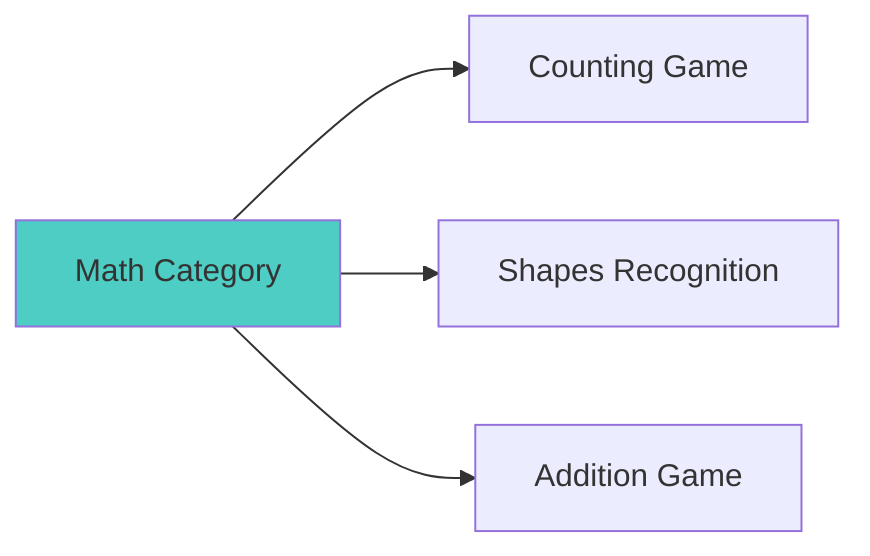
```mermaid
graph LR
    Math[Math Category] --> Counting[Counting Game]
    Math --> Shapes[Shapes Recognition]
    Math --> Addition[Addition Game]
    
    style Math fill:#4ECDC4
```

---

# Phase 14-16: Chore System - Complete Architecture

## Full Chore Flow

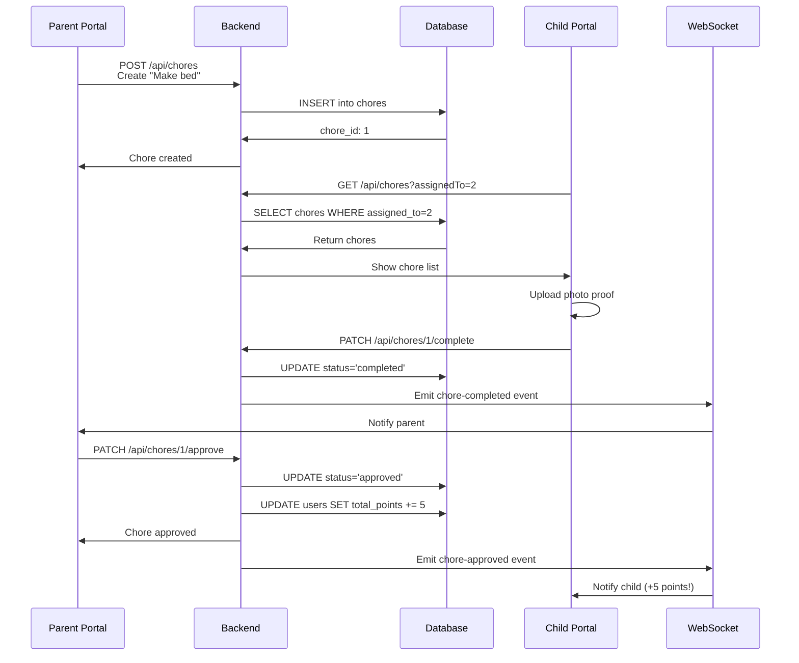
```mermaid
sequenceDiagram
    participant Parent as Parent Portal
    participant API as Backend
    participant DB as Database
    participant Child as Child Portal
    participant Socket as WebSocket
    
    Parent->>API: POST /api/chores<br/>Create "Make bed"
    API->>DB: INSERT into chores
    DB->>API: chore_id: 1
    API->>Parent: Chore created
    
    Child->>API: GET /api/chores?assignedTo=2
    API->>DB: SELECT chores WHERE assigned_to=2
    DB->>API: Return chores
    API->>Child: Show chore list
    
    Child->>Child: Upload photo proof
    Child->>API: PATCH /api/chores/1/complete
    API->>DB: UPDATE status='completed'
    API->>Socket: Emit chore-completed event
    Socket->>Parent: Notify parent
    
    Parent->>API: PATCH /api/chores/1/approve
    API->>DB: UPDATE status='approved'
    API->>DB: UPDATE users SET total_points += 5
    API->>Parent: Chore approved
    API->>Socket: Emit chore-approved event
    Socket->>Child: Notify child (+5 points!)
```

## Database Schema

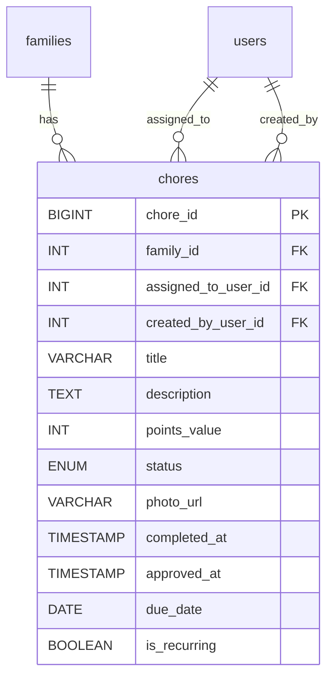
```mermaid
erDiagram
    families ||--o{ chores : has
    users ||--o{ chores : assigned_to
    users ||--o{ chores : created_by
    
    chores {
        BIGINT chore_id PK
        INT family_id FK
        INT assigned_to_user_id FK
        INT created_by_user_id FK
        VARCHAR title
        TEXT description
        INT points_value
        ENUM status
        VARCHAR photo_url
        TIMESTAMP completed_at
        TIMESTAMP approved_at
        DATE due_date
        BOOLEAN is_recurring
    }
```

---

# Phase 17: Progress Charts - Architecture

## Chart.js Integration

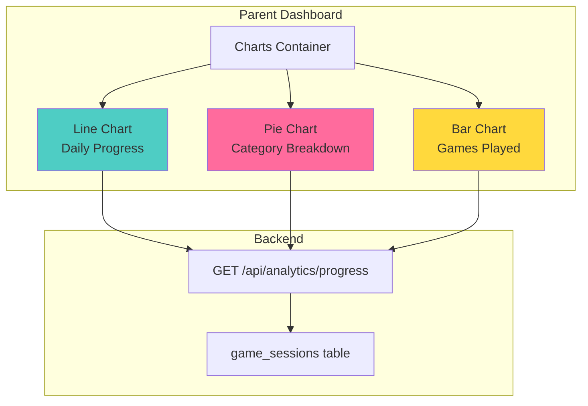
```mermaid
graph TB
    subgraph "Parent Dashboard"
        ChartContainer[Charts Container]
        LineChart[Line Chart<br/>Daily Progress]
        PieChart[Pie Chart<br/>Category Breakdown]
        BarChart[Bar Chart<br/>Games Played]
    end
    
    subgraph "Backend"
        AnalyticsAPI[GET /api/analytics/progress]
        GameSessions[game_sessions table]
    end
    
    ChartContainer --> LineChart
    ChartContainer --> PieChart
    ChartContainer --> BarChart
    
    LineChart --> AnalyticsAPI
    PieChart --> AnalyticsAPI
    BarChart --> AnalyticsAPI
    
    AnalyticsAPI --> GameSessions
    
    style LineChart fill:#4ECDC4
    style PieChart fill:#FF6B9D
    style BarChart fill:#FFD93D
```

---

# Phase 18: Confusion Matrix - Architecture

## Letter Confusion Tracking

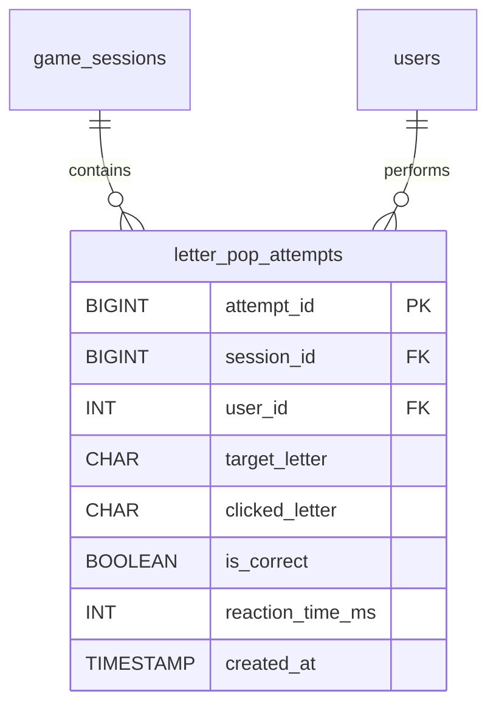
```mermaid
erDiagram
    game_sessions ||--o{ letter_pop_attempts : contains
    users ||--o{ letter_pop_attempts : performs
    
    letter_pop_attempts {
        BIGINT attempt_id PK
        BIGINT session_id FK
        INT user_id FK
        CHAR target_letter
        CHAR clicked_letter
        BOOLEAN is_correct
        INT reaction_time_ms
        TIMESTAMP created_at
    }
```

## Confusion Analysis Flow

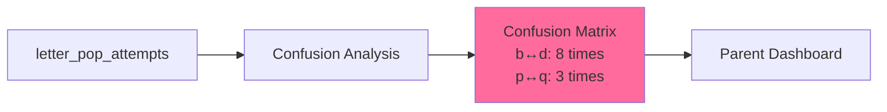
```mermaid
graph LR
    Attempts[letter_pop_attempts] --> Analyze[Confusion Analysis]
    Analyze --> Matrix[Confusion Matrix<br/>b↔d: 8 times<br/>p↔q: 3 times]
    Matrix --> Dashboard[Parent Dashboard]
    
    style Matrix fill:#FF6B9D
```

---

# Phase 19: Real-Time Updates - WebSocket Architecture

## Socket.IO Implementation

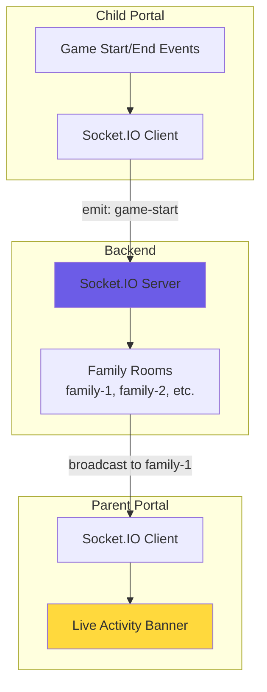
```mermaid
graph TB
    subgraph "Child Portal"
        ChildGame[Game Start/End Events]
        ChildSocket[Socket.IO Client]
    end
    
    subgraph "Backend"
        SocketServer[Socket.IO Server]
        FamilyRooms[Family Rooms<br/>family-1, family-2, etc.]
    end
    
    subgraph "Parent Portal"
        ParentSocket[Socket.IO Client]
        LiveBanner[Live Activity Banner]
    end
    
    ChildGame --> ChildSocket
    ChildSocket -->|emit: game-start| SocketServer
    SocketServer --> FamilyRooms
    FamilyRooms -->|broadcast to family-1| ParentSocket
    ParentSocket --> LiveBanner
    
    style SocketServer fill:#6C5CE7
    style LiveBanner fill:#FFD93D
```

## WebSocket Message Flow

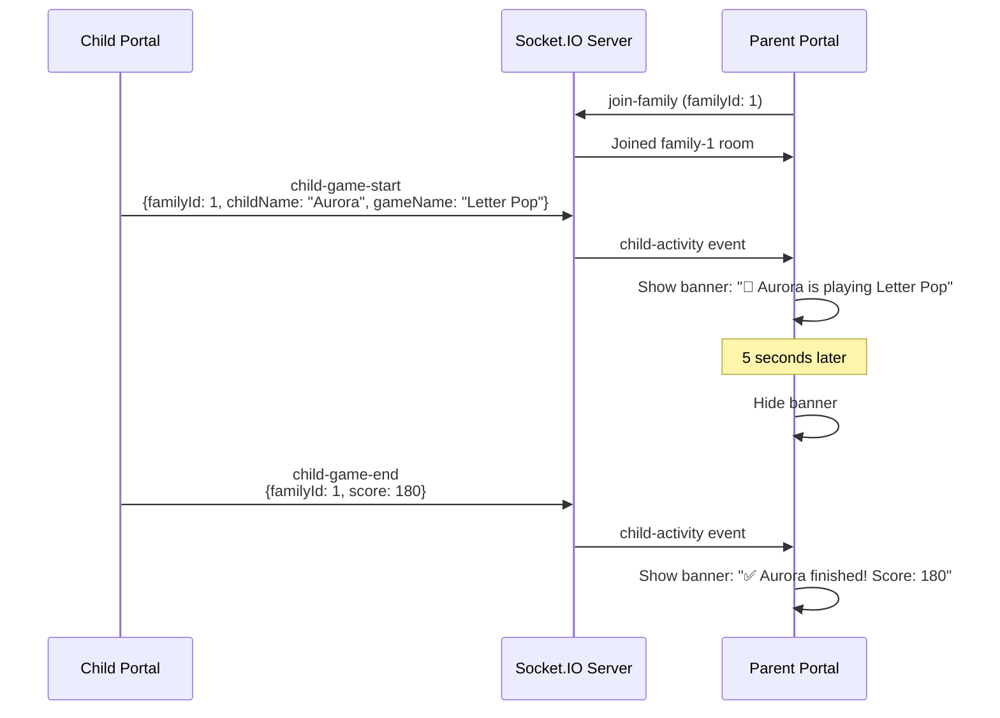
```mermaid
sequenceDiagram
    participant Child as Child Portal
    participant Server as Socket.IO Server
    participant Parent as Parent Portal
    
    Parent->>Server: join-family (familyId: 1)
    Server->>Parent: Joined family-1 room
    
    Child->>Server: child-game-start<br/>{familyId: 1, childName: "Aurora", gameName: "Letter Pop"}
    Server->>Parent: child-activity event
    Parent->>Parent: Show banner: "🔴 Aurora is playing Letter Pop"
    
    Note over Parent: 5 seconds later
    Parent->>Parent: Hide banner
    
    Child->>Server: child-game-end<br/>{familyId: 1, score: 180}
    Server->>Parent: child-activity event
    Parent->>Parent: Show banner: "✅ Aurora finished! Score: 180"
```

---

# Phase 20: Achievements & Badges - Architecture

## Achievement System

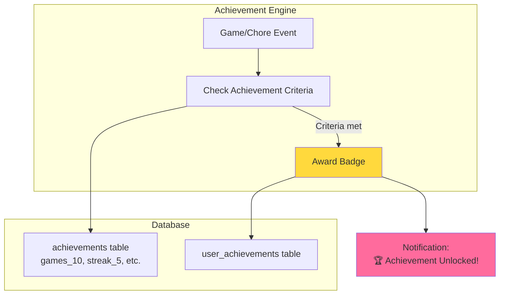
```mermaid
graph TB
    subgraph "Achievement Engine"
        Trigger[Game/Chore Event]
        Check[Check Achievement Criteria]
        Award[Award Badge]
    end
    
    subgraph "Database"
        Achievements[achievements table<br/>games_10, streak_5, etc.]
        UserAchievements[user_achievements table]
    end
    
    Trigger --> Check
    Check --> Achievements
    Check -->|Criteria met| Award
    Award --> UserAchievements
    Award --> Notify[Notification:<br/>🏆 Achievement Unlocked!]
    
    style Award fill:#FFD93D
    style Notify fill:#FF6B9D
```

## Achievement ERD

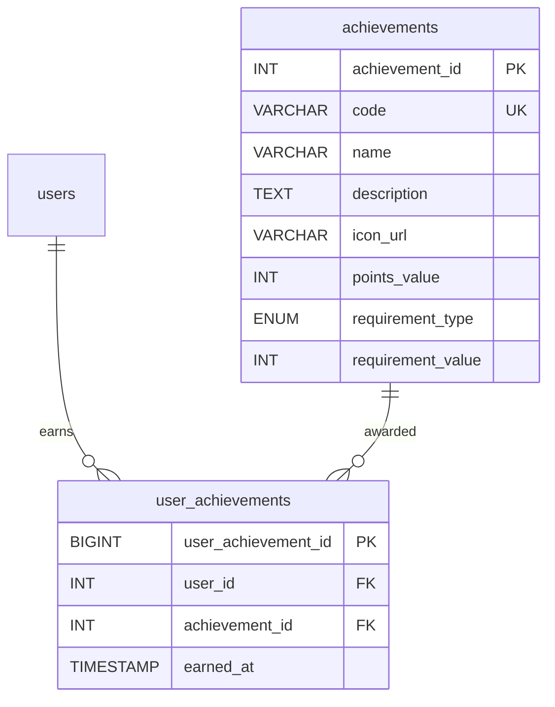
```mermaid
erDiagram
    users ||--o{ user_achievements : earns
    achievements ||--o{ user_achievements : awarded
    
    achievements {
        INT achievement_id PK
        VARCHAR code UK
        VARCHAR name
        TEXT description
        VARCHAR icon_url
        INT points_value
        ENUM requirement_type
        INT requirement_value
    }
    
    user_achievements {
        BIGINT user_achievement_id PK
        INT user_id FK
        INT achievement_id FK
        TIMESTAMP earned_at
    }
```

---

# Phase 21: Marketing Website - Architecture

## Site Structure

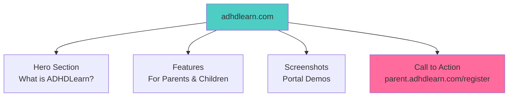
```mermaid
graph TB
    Root[adhdlearn.com] --> Hero[Hero Section<br/>What is ADHDLearn?]
    Root --> Features[Features<br/>For Parents & Children]
    Root --> Screenshots[Screenshots<br/>Portal Demos]
    Root --> CTA[Call to Action<br/>parent.adhdlearn.com/register]
    
    style Root fill:#4ECDC4
    style CTA fill:#FF6B9D
```

---

# Phase 22: Age Norms Comparison - Architecture

## Percentile Calculation

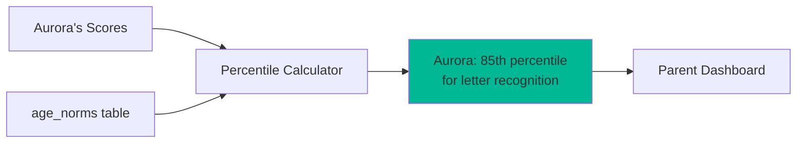
```mermaid
graph LR
    ChildData[Aurora's Scores] --> Calculate[Percentile Calculator]
    AgeNorms[age_norms table] --> Calculate
    Calculate --> Result[Aurora: 85th percentile<br/>for letter recognition]
    Result --> Dashboard[Parent Dashboard]
    
    style Result fill:#00B894
```

## Age Norms ERD

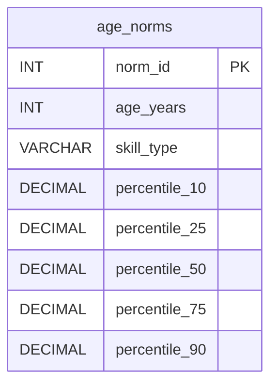
```mermaid
erDiagram
    age_norms {
        INT norm_id PK
        INT age_years
        VARCHAR skill_type
        DECIMAL percentile_10
        DECIMAL percentile_25
        DECIMAL percentile_50
        DECIMAL percentile_75
        DECIMAL percentile_90
    }
```

---

# Phase 23-26: Life Skills Categories - Architecture

## Category Expansion

```mermaid
graph TB
    Dashboard[Child Dashboard] --> Reading[Reading<br/>3 games]
    Dashboard --> Math[Math<br/>3 games]
    Dashboard --> Science[Science<br/>3 experiments]
    Dashboard --> LifeSkills[Life Skills]
    
    LifeSkills --> Cooking[Cooking Helper]
    LifeSkills --> Printing[3D Printing]
    LifeSkills --> Shopping[Shopping Helper]
    
    style Science fill:#95E1D3
    style LifeSkills fill:#FECA57
```

---

# Phase 27: Weekly Reports - Email Architecture

## Email Service Flow

```mermaid
sequenceDiagram
    participant Cron as Cron Job<br/>(Every Sunday 8AM)
    participant Backend as Report Generator
    participant DB as Database
    participant Email as SendGrid
    participant Parent as Parent Email
    
    Cron->>Backend: Trigger weekly report
    Backend->>DB: Fetch family data
    Backend->>DB: Fetch game sessions (last 7 days)
    Backend->>DB: Fetch achievements earned
    Backend->>Backend: Generate HTML email
    Backend->>Email: Send email
    Email->>Parent: Weekly Progress Report
```

---

# Phase 28: ML Pattern Detection - Architecture

## Machine Learning Pipeline

```mermaid
graph TB
    subgraph "Data Collection"
        LetterAttempts[letter_pop_attempts]
        GameSessions[game_sessions]
    end
    
    subgraph "ML Service (Python)"
        DataLoader[Load Data]
        FeatureExtraction[Extract Features<br/>- Time of day<br/>- Letter pairs<br/>- Accuracy trends]
        Model[Scikit-learn Model]
        Insights[Generate Insights]
    end
    
    subgraph "Parent Dashboard"
        Alerts[ML Insights:<br/>"Aurora struggles with b/d<br/>in afternoons"]
    end
    
    LetterAttempts --> DataLoader
    GameSessions --> DataLoader
    DataLoader --> FeatureExtraction
    FeatureExtraction --> Model
    Model --> Insights
    Insights --> Alerts
    
    style Model fill:#6C5CE7
    style Alerts fill:#FF6B9D
```

---

# Phase 29: PDF Reports - Architecture

## PDF Generation Flow

```mermaid
graph LR
    Dashboard[Parent Dashboard] -->|Click "Download PDF"| Generate[PDF Generator<br/>Puppeteer]
    Generate --> Render[Render HTML with Charts]
    Render --> Convert[Convert to PDF]
    Convert --> Download[Download report.pdf]
    
    style Generate fill:#4ECDC4
    style Download fill:#00B894
```

---

# Phase 30: Android APK - Architecture

## Capacitor Wrapper

```mermaid
graph TB
    subgraph "Child Portal (Web)"
        React[React App]
        Phaser[Phaser Games]
    end
    
    subgraph "Capacitor"
        CapacitorCore[Capacitor Core]
        AndroidPlatform[Android Platform]
    end
    
    subgraph "Android APK"
        WebView[Android WebView]
        NativeFeatures[Native Features<br/>- Offline storage<br/>- Camera<br/>- Push notifications]
    end
    
    React --> CapacitorCore
    Phaser --> CapacitorCore
    CapacitorCore --> AndroidPlatform
    AndroidPlatform --> WebView
    AndroidPlatform --> NativeFeatures
    
    style AndroidPlatform fill:#3DDC84
```

---

# Phase 31-32: Multi-User Support - Architecture

## Family Structure

```mermaid
erDiagram
    families ||--o{ users : contains
    users ||--o{ children : parent_of
    users ||--o{ game_sessions : plays
    users ||--o{ chores : completes
    
    families {
        INT family_id PK
        VARCHAR family_name
        ENUM subscription_tier
    }
    
    users {
        INT user_id PK
        INT family_id FK
        ENUM role
        VARCHAR email
        VARCHAR first_name
    }
```

## Multi-Parent Flow

```mermaid
sequenceDiagram
    participant Parent1 as Corey (Parent)
    participant API as Backend
    participant Email as Email Service
    participant Parent2 as Partner
    
    Parent1->>API: POST /api/family/invite<br/>{email: "partner@example.com"}
    API->>Email: Send invitation email
    Email->>Parent2: Invitation link
    Parent2->>API: GET /api/family/accept/:token
    API->>API: Add parent to family
    API->>Parent2: Redirect to dashboard
    Parent2->>API: View Aurora's data
```

---

# Phase 33: Parental Controls - Architecture

## Screen Time Enforcement

```mermaid
graph TB
    ChildLogin[Child Logs In] --> CheckControls[Check parental_controls]
    CheckControls --> TimeLimit[Daily time limit?]
    TimeLimit -->|30 min limit| StartTimer[Start session timer]
    
    StartTimer --> PlayGame[Aurora plays games]
    PlayGame --> CheckTimer{Time remaining?}
    CheckTimer -->|Time left| PlayGame
    CheckTimer -->|Time expired| Lockout[Lock portal:<br/>"Time's up for today!"]
    
    style Lockout fill:#FF6B9D
```

---

# Phase 34: Testing Infrastructure - Architecture

## CI/CD Pipeline

```mermaid
graph LR
    Commit[Git Commit] --> CI[GitHub Actions]
    CI --> UnitTests[Unit Tests<br/>Jest]
    CI --> E2ETests[E2E Tests<br/>Playwright]
    CI --> Lint[ESLint]
    
    UnitTests -->|Pass| Deploy[Deploy]
    E2ETests -->|Pass| Deploy
    Lint -->|Pass| Deploy
    
    UnitTests -->|Fail| Block[Block Deployment]
    E2ETests -->|Fail| Block
    Lint -->|Fail| Block
    
    style Deploy fill:#00B894
    style Block fill:#FF6B9D
```

---

# Phase 35: Performance Optimization - Architecture

## Optimization Layers

```mermaid
graph TB
    subgraph "Frontend Optimizations"
        CodeSplit[Code Splitting<br/>React.lazy()]
        ImageOpt[Image Optimization<br/>WebP format]
        LazyLoad[Lazy Loading<br/>Non-critical resources]
    end
    
    subgraph "Backend Optimizations"
        QueryOpt[Database Query Optimization<br/>Indexes, joins]
        Cache[Redis Caching<br/>Session data, high scores]
    end
    
    subgraph "Infrastructure"
        CDN[CloudFlare CDN<br/>Static assets]
    end
    
    Browser[Browser] --> CDN
    CDN --> CodeSplit
    CodeSplit --> ImageOpt
    ImageOpt --> LazyLoad
    
    LazyLoad --> Cache
    Cache --> QueryOpt
    
    style CDN fill:#4ECDC4
    style Cache fill:#FF6B9D
```

---

# Phase 36: Accessibility - Architecture

## Accessibility Features

```mermaid
graph TB
    Settings[Accessibility Settings] --> HighContrast[High Contrast Mode<br/>Black bg, white text]
    Settings --> FontSize[Adjustable Font Size<br/>Small, Medium, Large]
    Settings --> ScreenReader[Screen Reader Support<br/>ARIA labels]
    Settings --> Keyboard[Keyboard Navigation<br/>Tab index, focus indicators]
    
    style HighContrast fill:#000000,color:#FFFFFF
    style FontSize fill:#4ECDC4
    style ScreenReader fill:#6C5CE7
    style Keyboard fill:#FFD93D
```

---

**UML.md Complete:** All 36 phases (0-36) with comprehensive architecture diagrams, ERDs, sequence diagrams, and technical visualizations

