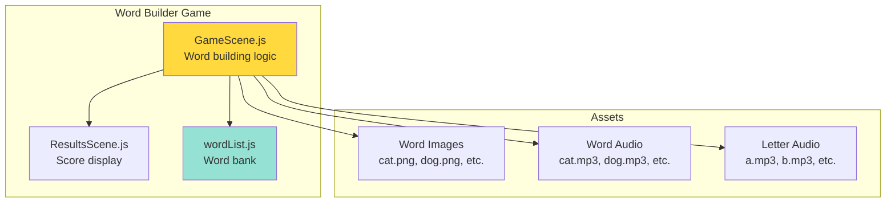
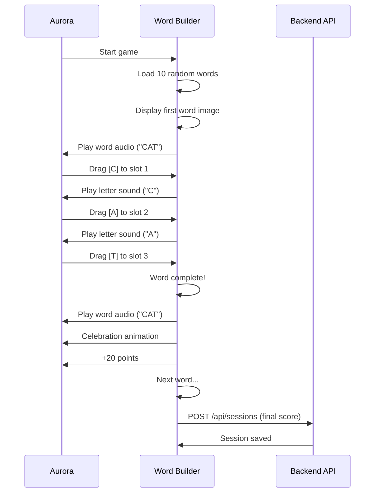

# Phase 9: Architecture Diagrams

**Project:** ADHDLearn.com
**Phase:** 9 of 36
**Last Updated:** October 22, 2025

---

## Overview
**Delivers:** Word Builder drag-and-drop spelling game

## Component Architecture

## Gameplay Flow

---

