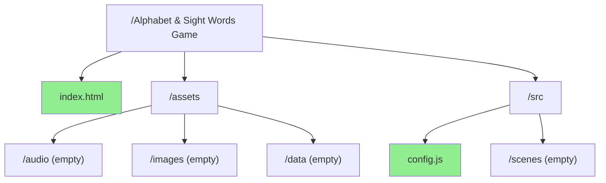
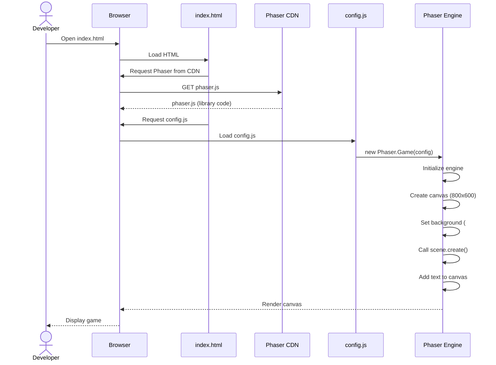
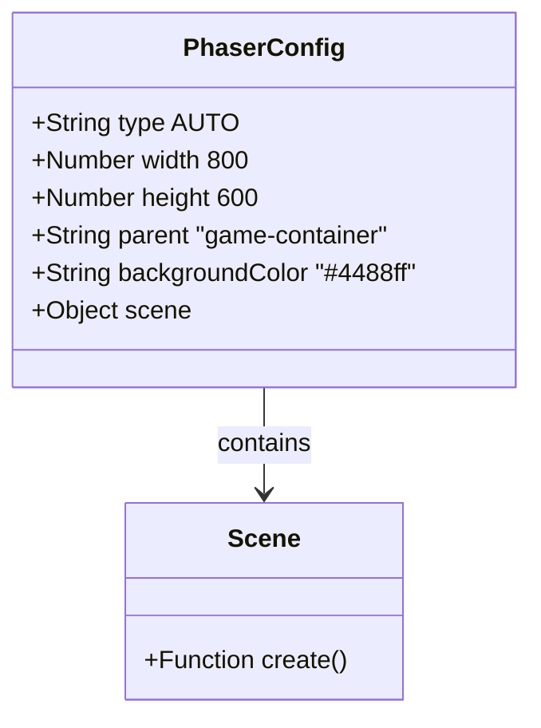
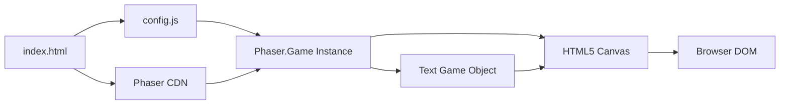
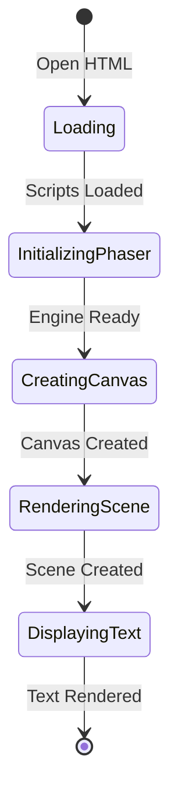

# Phase 1: Project Bootstrap - UML

## File Structure Diagram

## Sequence Diagram

## Configuration Object Structure

## Component Diagram

## State Diagram (Simple)

## Notes

### Why This Architecture?

**Single Config File Approach**
- Phase 1 doesn't need separate scenes yet
- Inline scene definition proves Phaser works
- Will refactor to proper scene classes in Phase 2

**CDN vs Local**
- CDN is faster for development
- No build step required
- Can switch to local copy later if needed

**Minimal Dependencies**
- Just HTML + Phaser + 1 JS file
- Easy to debug
- Fast to test

### What This Phase Proves

1. **Browser Compatibility**: Phaser runs in target browser
2. **CDN Access**: Can load external libraries
3. **Canvas Rendering**: Graphics system works
4. **JavaScript Execution**: No syntax/runtime errors
5. **Development Environment**: File structure is correct

This is intentionally simple. Complexity comes later, incrementally.
