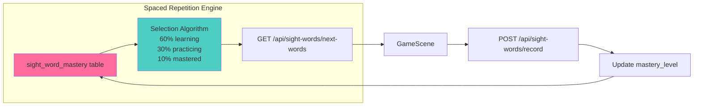
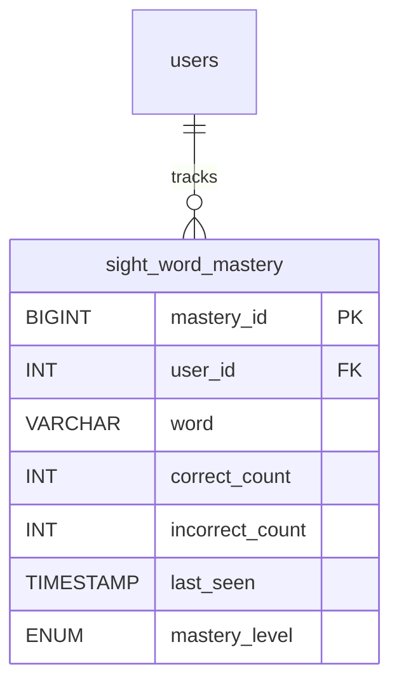

# Phase 10: Architecture Diagrams

**Project:** ADHDLearn.com
**Phase:** 10 of 36
**Last Updated:** October 22, 2025

---

## Adaptive Difficulty System

```mermaid
graph LR
    subgraph "Spaced Repetition Engine"
        Mastery[sight_word_mastery table]
        Algorithm[Selection Algorithm<br/>60% learning<br/>30% practicing<br/>10% mastered]
        NextWords[GET /api/sight-words/next-words]
    end
    
    Mastery --> Algorithm
    Algorithm --> NextWords
    NextWords --> Game[GameScene]
    
    Game --> RecordAttempt[POST /api/sight-words/record]
    RecordAttempt --> UpdateMastery[Update mastery_level]
    UpdateMastery --> Mastery
    
    style Algorithm fill:#4ECDC4
    style Mastery fill:#FF6B9D
```

## Data Flow

```mermaid
erDiagram
    sight_word_mastery {
        BIGINT mastery_id PK
        INT user_id FK
        VARCHAR word
        INT correct_count
        INT incorrect_count
        TIMESTAMP last_seen
        ENUM mastery_level
    }
    
    users ||--o{ sight_word_mastery : tracks
```

---

