# Phase 10: Letter Pop - Target Letter Game Logic - UML

## Class Diagram

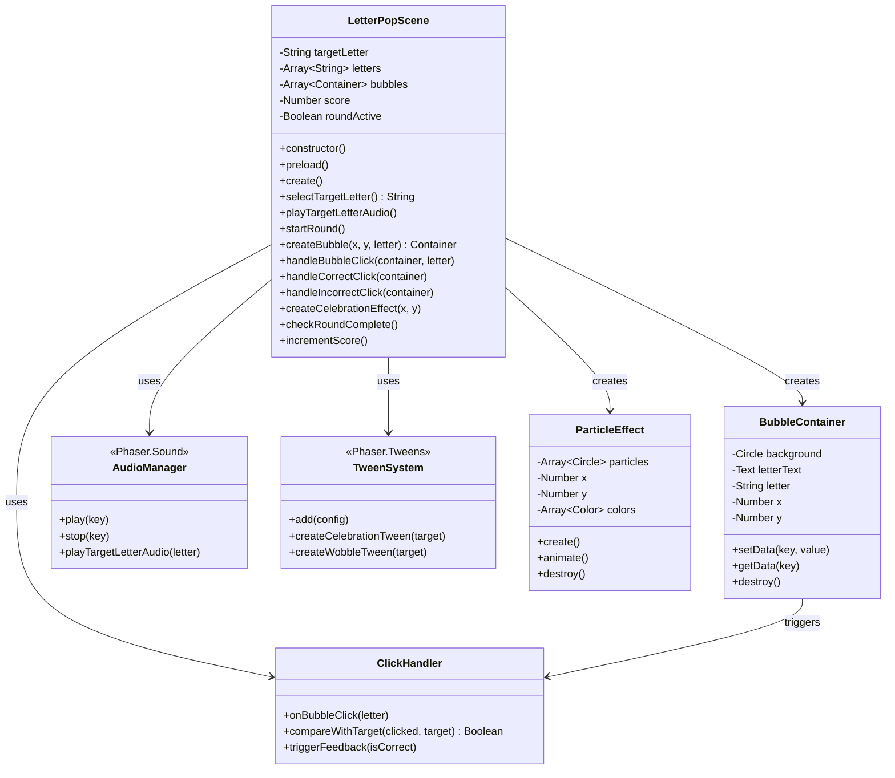

## Sequence Diagram: Round Start Flow

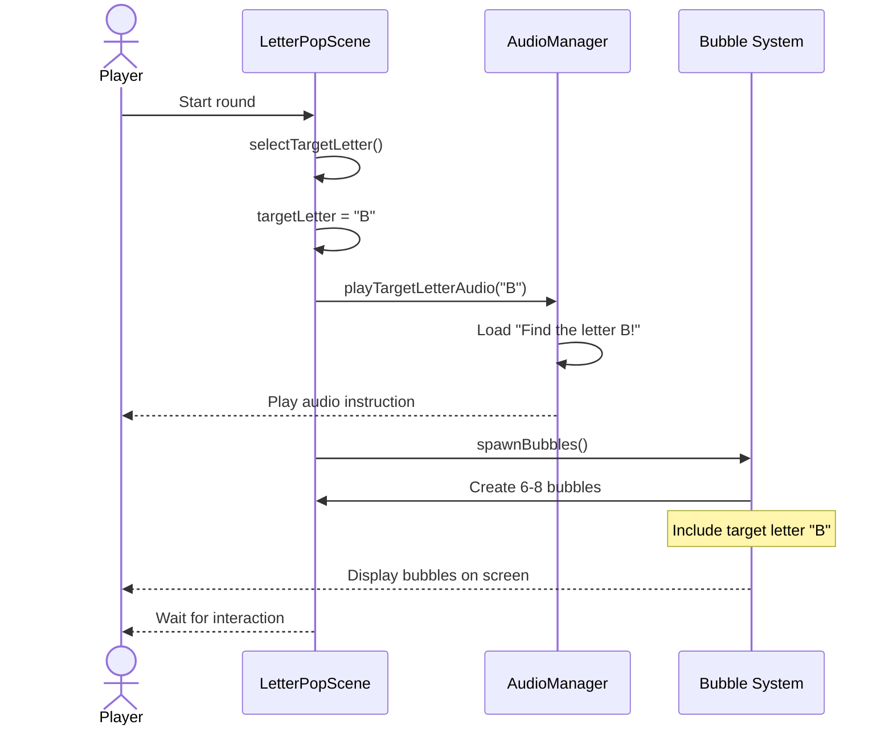

## Sequence Diagram: Correct Click Flow

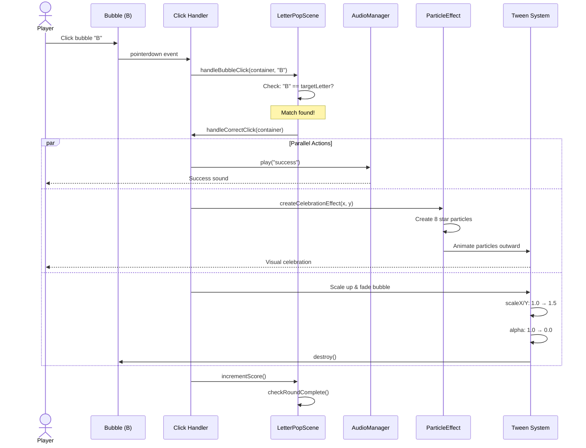

## Sequence Diagram: Incorrect Click Flow

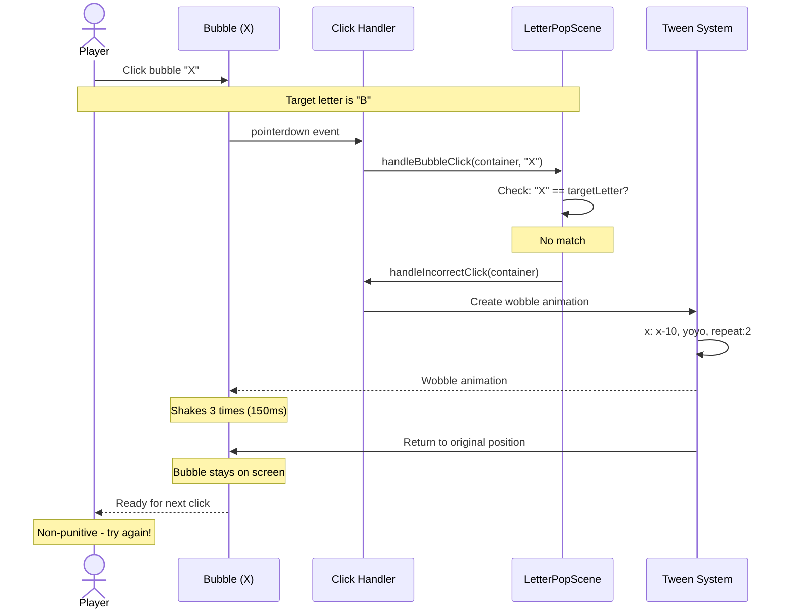

## State Diagram: Bubble States

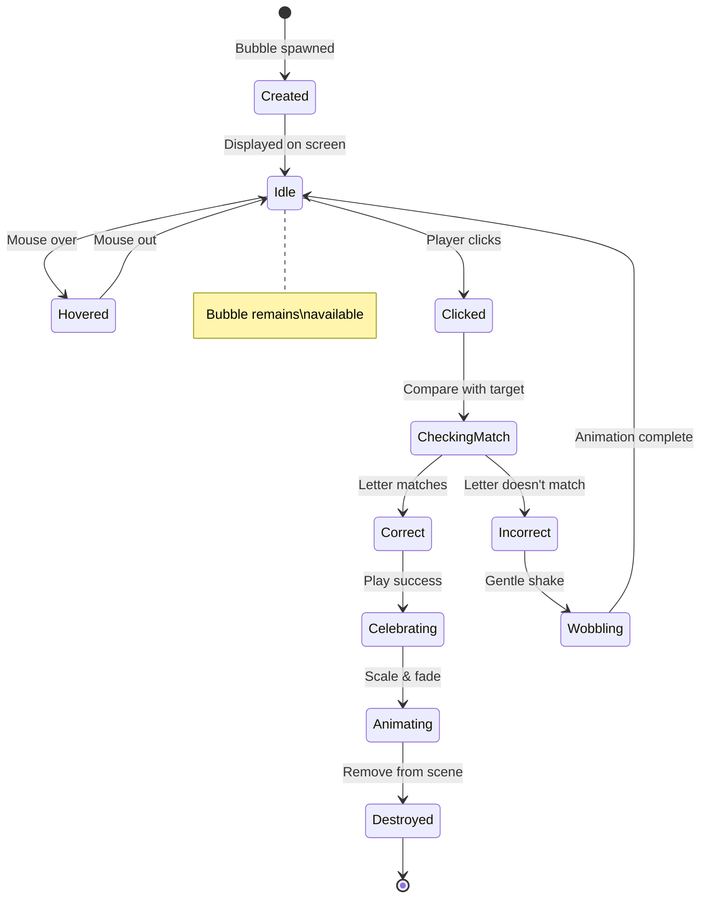

## Activity Diagram: Click Handler Logic

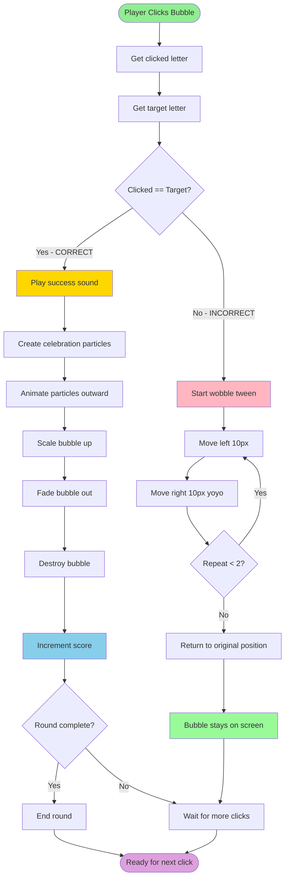

## Component Interaction Diagram

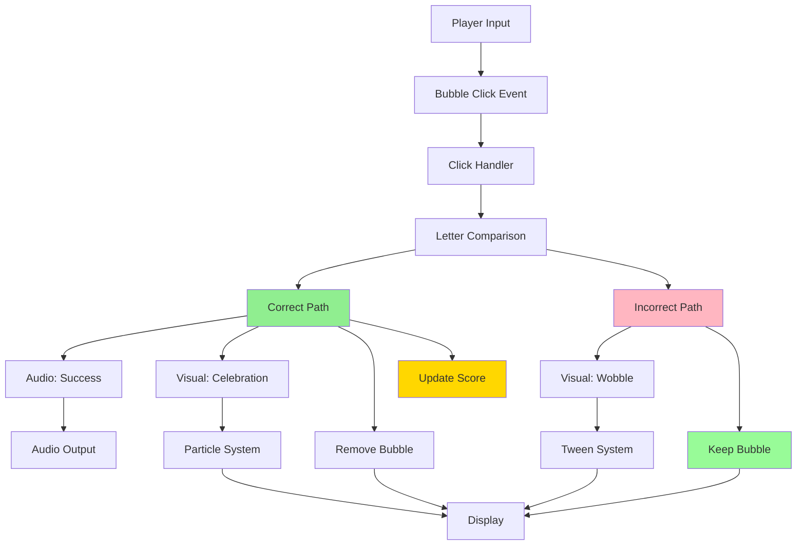

## Data Flow: Target Letter System

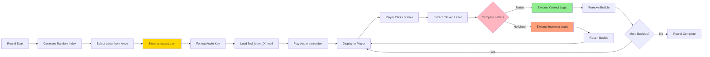

## Celebration Effect Diagram

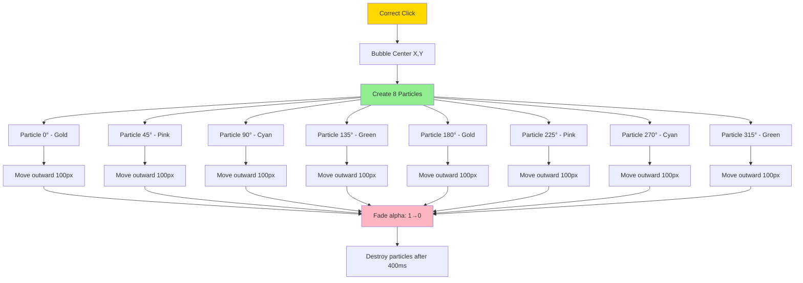

## Wobble Animation Timing

```mermaid
gantt
    title Wobble Animation Timeline (150ms total)
    dateFormat X
    axisFormat %L ms

    section Wobble
    Move Left (-10px)    :0, 50
    Return Right (yoyo)  :50, 50
    Move Left (-10px)    :50, 50
    Return Right (yoyo)  :100, 50
    Move Left (-10px)    :100, 50
    Final Return         :150, 50
```

## Audio System Architecture

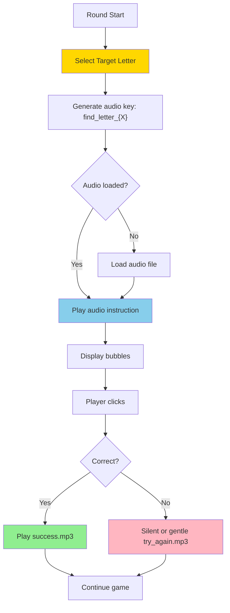

## Notes

### Architecture Decisions

**Target Letter System**
- Randomly selected from full alphabet (A-Z)
- Stored as scene property (accessible to all methods)
- Selected at round start, before bubbles spawn
- Audio instruction plays immediately after selection

**Click Feedback Separation**
- Correct and incorrect paths are completely separate
- Correct: Celebration → Removal → Score update
- Incorrect: Wobble → Retain → Allow retry
- No shared feedback logic (clear separation of concerns)

**Animation Strategy**
- Correct: Multiple simultaneous animations (particles + bubble)
- Incorrect: Single wobble animation (simple, quick)
- All animations use Phaser tweens (consistent, performant)
- Total feedback time: Correct ~300ms, Incorrect ~150ms

**Non-Punitive Design**
- Incorrect bubbles stay on screen (no removal)
- No negative audio (silence or gentle "hmm")
- No visual "wrong" indicators (just wobble)
- Player can retry immediately (no cooldown)
- No limit on incorrect attempts

### Why This Design?

**ADHD-Friendly Justification**
1. **Immediate feedback**: Both paths respond in <50ms
2. **Clear distinction**: Success is celebratory, failure is gentle
3. **No punishment**: Wrong clicks don't remove options
4. **Visual clarity**: Particles clearly indicate success
5. **Audio support**: Explicit instruction at round start
6. **No time pressure**: Player can take as long as needed

**Performance Considerations**
- Particle count limited to 8 (lightweight)
- Particles destroyed after animation (no memory leak)
- Wobble uses simple x-axis translation (GPU-friendly)
- Audio preloaded (no loading delays during gameplay)

**Extensibility**
- Easy to add more letters or custom letter sets
- Celebration effect can be enhanced later
- Wobble parameters easily adjustable
- Score system integrated but modular (Phase 11)

### Component Relationships

1. **LetterPopScene is the coordinator**
   - Selects target letter
   - Creates bubbles with letters
   - Handles all click events
   - Manages feedback systems

2. **BubbleContainer is data + visual**
   - Stores letter as data property
   - Provides click target
   - Responds to tween animations
   - Self-destructs on correct click

3. **Audio system is fire-and-forget**
   - Scene triggers audio.play()
   - Audio manager handles playback
   - No callbacks needed (visual feedback is primary)

4. **Particle effects are transient**
   - Created on correct click
   - Animate outward radially
   - Self-destruct after animation
   - No persistent state

5. **Tweens manage all animations**
   - Celebration: scale + fade
   - Wobble: translate x
   - Particles: translate + fade
   - All coordinated by Phaser tween manager

This design prioritizes encouraging, non-frustrating gameplay while maintaining clear feedback and smooth performance.
