# Phase 11: Letter Pop - Score System - UML

## Class Diagram

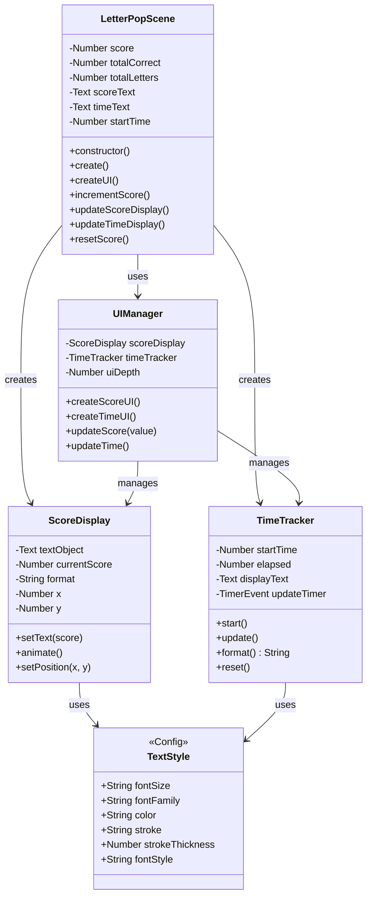

## Sequence Diagram: Score Increment Flow

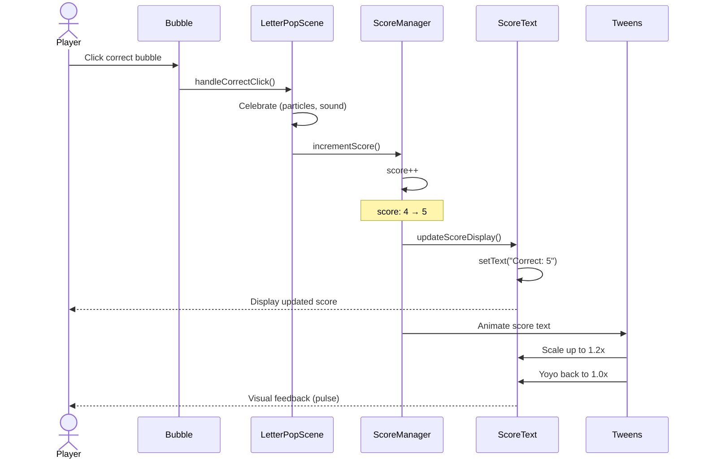

## Sequence Diagram: Scene Initialization with UI

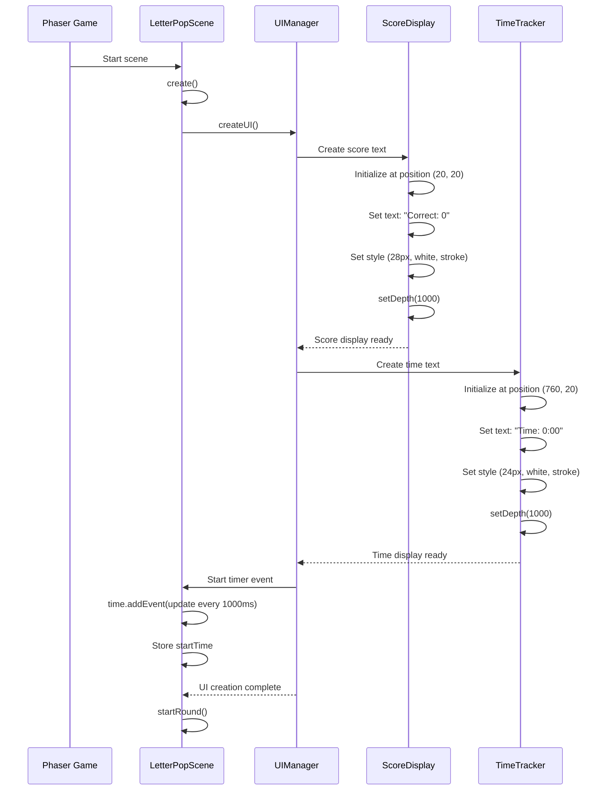

## State Diagram: Score System States

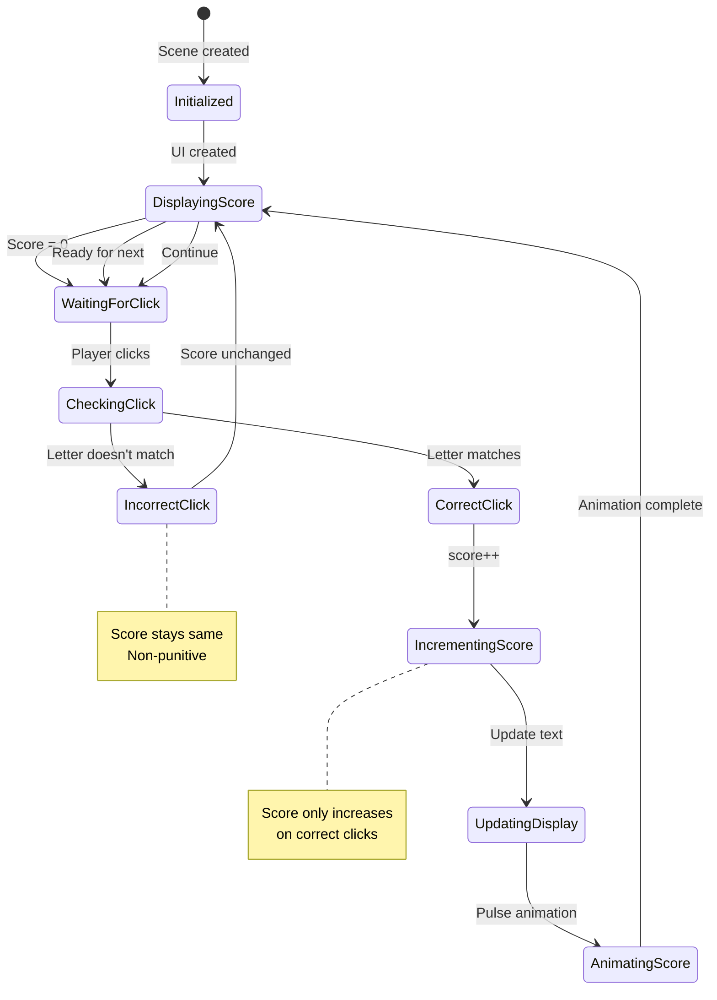

## Activity Diagram: Score Update Logic

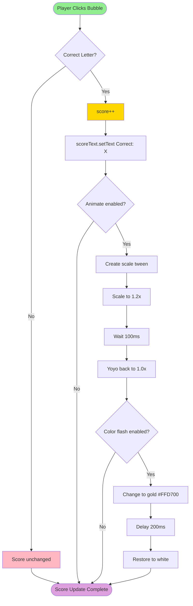

## Activity Diagram: Time Tracking

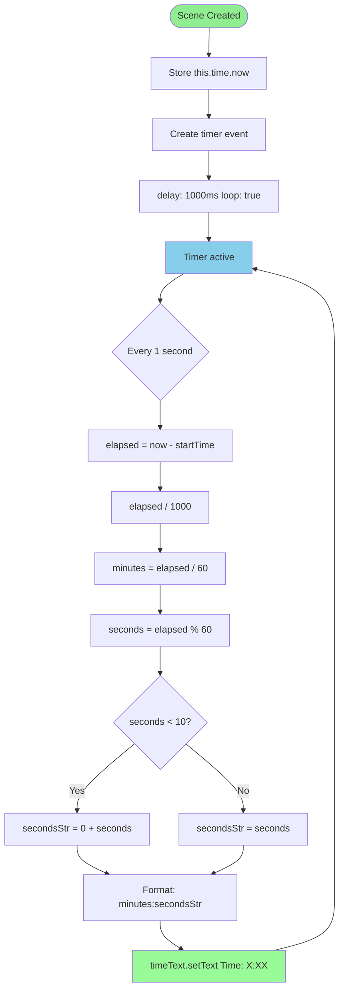

## Component Hierarchy Diagram

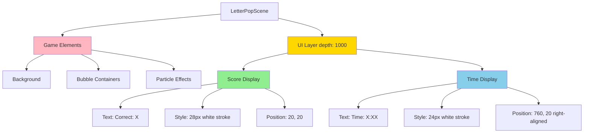

## Data Flow: Score Tracking

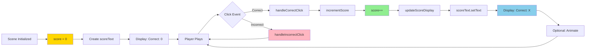

## UI Layout Diagram

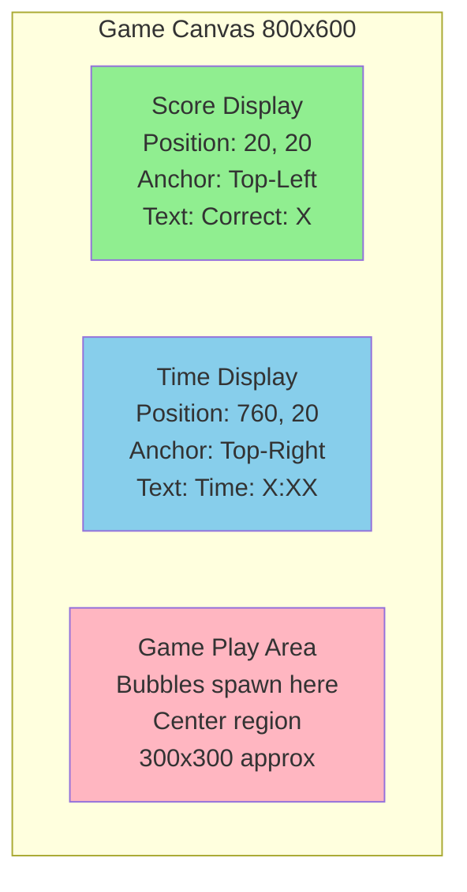

## Score Text Animation Sequence

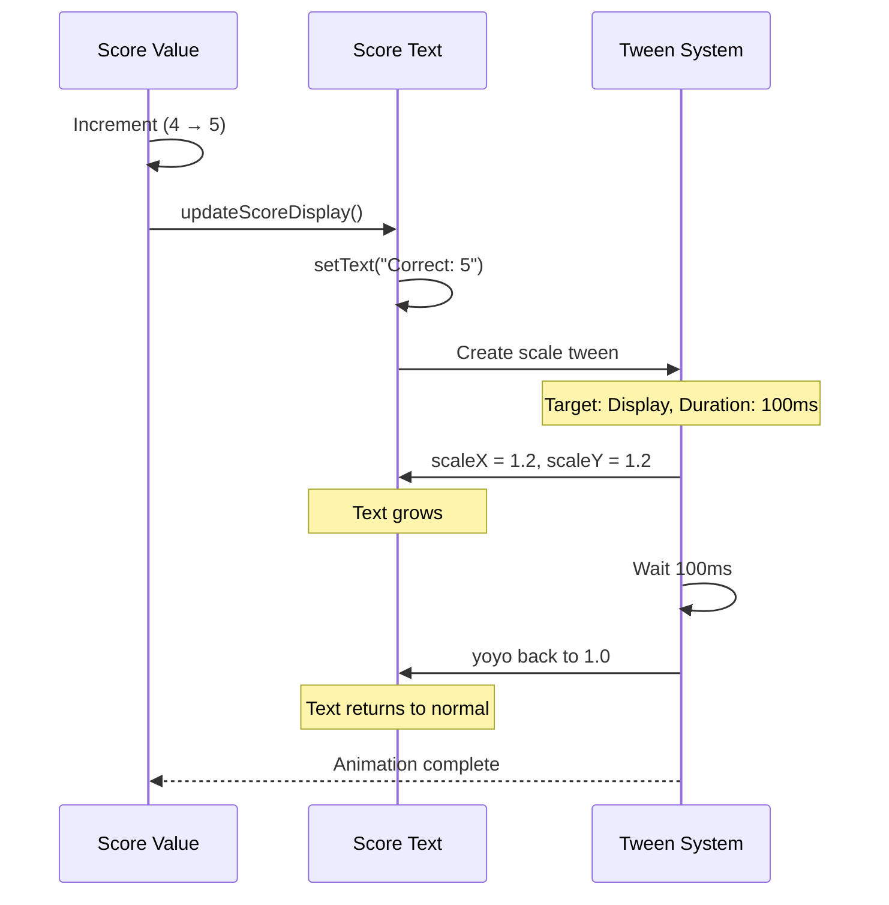

## Time Display Update Flow

```mermaid
graph LR
    Timer[Timer Event 1000ms] --> Callback[updateTimeDisplay]
    Callback --> GetNow[this.time.now]
    GetNow --> Subtract[now - startTime]
    Subtract --> ToSeconds[/ 1000]
    ToSeconds --> Minutes[Math.floor elapsed / 60]
    ToSeconds --> Seconds[elapsed % 60]
    Minutes --> Format[minutes:seconds]
    Seconds --> Format
    Format --> SetText[timeText.setText]
    SetText --> Display[Display: Time: X:XX]
    Display --> Timer

    style Timer fill:#87CEEB
    style Format fill:#90EE90
    style Display fill:#98FB98
```

## Score vs Time Comparison

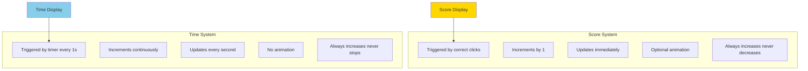

## Text Style Configuration

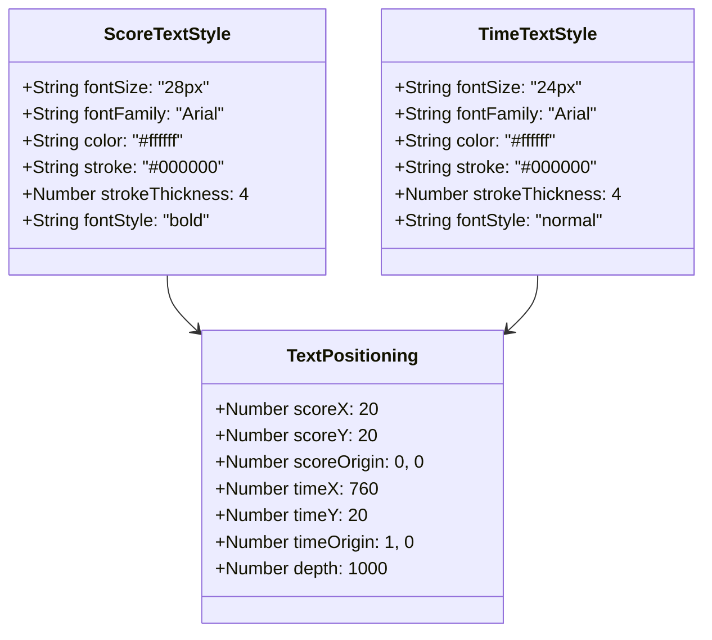

## Score Animation State Machine

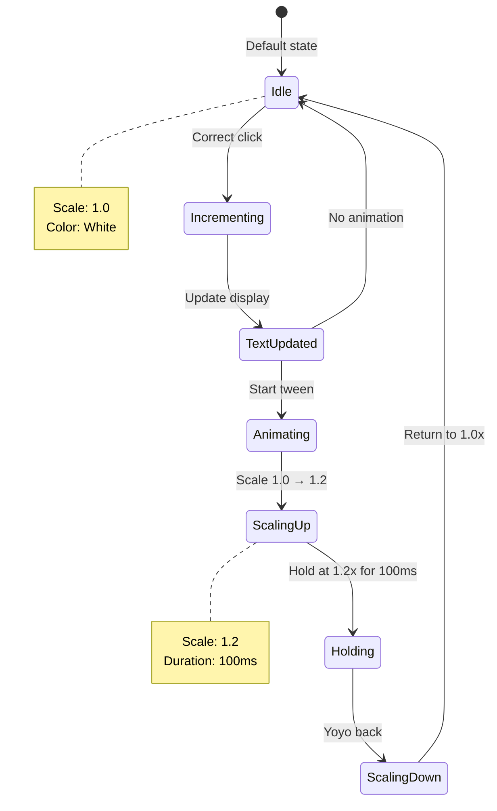

## Notes

### Architecture Decisions

**Score Tracking**
- Single `score` variable tracks correct clicks
- Stored as scene property (persistent during scene)
- Initialized to 0 in constructor
- Only increments, never decrements (encouraging)

**UI Positioning**
- Score: Top-left (20, 20) - standard game UI position
- Time: Top-right (760, 20) - secondary information
- Both use high depth (1000) to stay above game elements
- Fixed positions (don't move with camera if added later)

**Text Styling**
- White text with black stroke (readable on any background)
- Large font size (28px score, 24px time)
- Bold for score (primary), normal for time (secondary)
- High stroke thickness (4px) ensures readability

**Time Tracking**
- Optional feature (can be excluded if adds pressure)
- Updates every 1000ms (1 second)
- Format: "M:SS" (minutes:seconds with leading zero)
- Uses Phaser timer event (efficient, no manual update loop)

**Animation**
- Score text pulses on increment (optional polish)
- Quick animation (100ms up, 100ms down = 200ms total)
- Non-blocking (doesn't interfere with gameplay)
- Can be disabled if distracting

### Why This Design?

**Simplicity**
- Minimal UI (just score and time)
- Clear labels ("Correct:", "Time:")
- Easy to read at a glance
- No clutter or complexity

**Performance**
- Text objects are lightweight
- Updates only when needed (score) or every second (time)
- No constant redraws
- High depth prevents z-fighting

**ADHD-Friendly**
- Score is visible but not distracting
- Positive framing (shows success, not failures)
- Time is informational, not pressured (no countdown)
- Immediate feedback (score updates instantly)
- Clear visual hierarchy (score more prominent than time)

**Extensibility**
- Easy to add: high score, session stats, progress bar
- Can add backgrounds or panels if needed
- Can animate score text differently
- Can change format (e.g., "5 / 10" to show total)

### Component Relationships

1. **LetterPopScene owns UI elements**
   - Creates score and time text objects
   - Manages score variable
   - Updates displays

2. **Score system is reactive**
   - Triggered by correct clicks
   - No polling or continuous checks
   - Updates only when needed

3. **Time system is active**
   - Timer event runs continuously
   - Updates every second
   - Independent of gameplay

4. **UI layer is separate**
   - High depth (1000) above game objects
   - Fixed positions (not relative to game elements)
   - Always visible

5. **Text styling is consistent**
   - Both use white + black stroke
   - Both use Arial font
   - Both use similar sizing
   - Visual consistency across UI

### Future Enhancements

**Possible additions (later phases):**
- High score tracking (save to localStorage)
- Session statistics (accuracy percentage)
- Progress bar (visual score representation)
- Combo counter (consecutive correct clicks)
- Achievement notifications
- Animated score particle effects
- Background panels for UI elements
- Responsive positioning for different screen sizes

This phase keeps the UI minimal and focused on essential feedback: how many correct, and how long playing. Everything else is secondary and can be added later without disrupting this foundation.
