# Phase 12.5: Responsive Design, Visual Overhaul & PWA - UML

## System Architecture

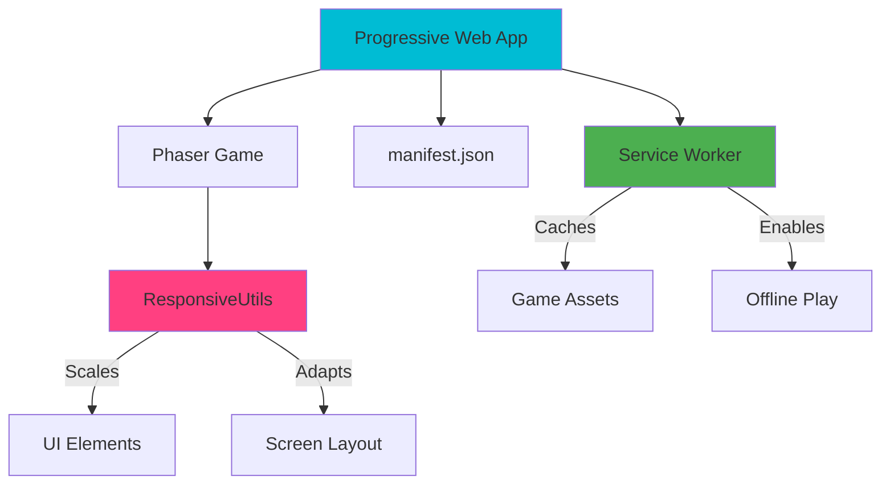

## Responsive Utilities Class Diagram

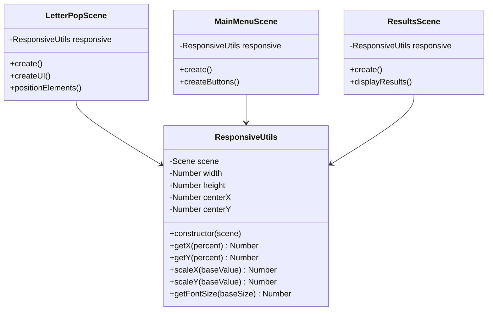

## Screen Layout Architecture

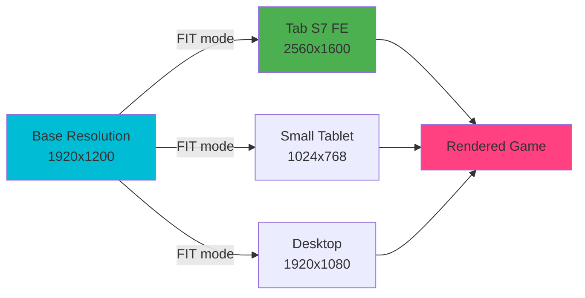

## PWA Installation Flow

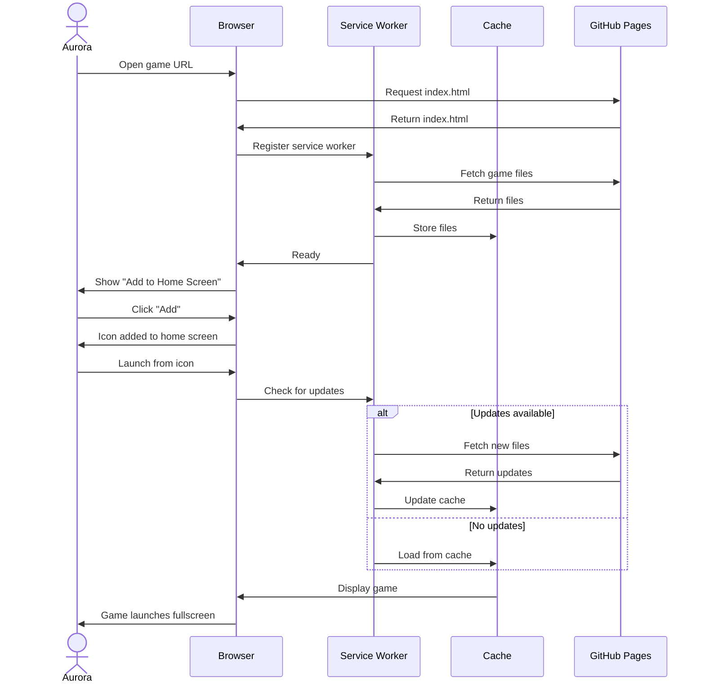

## Color Palette Architecture

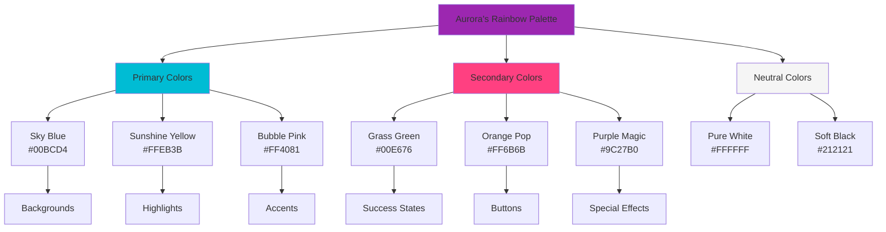

## UI Layer Structure

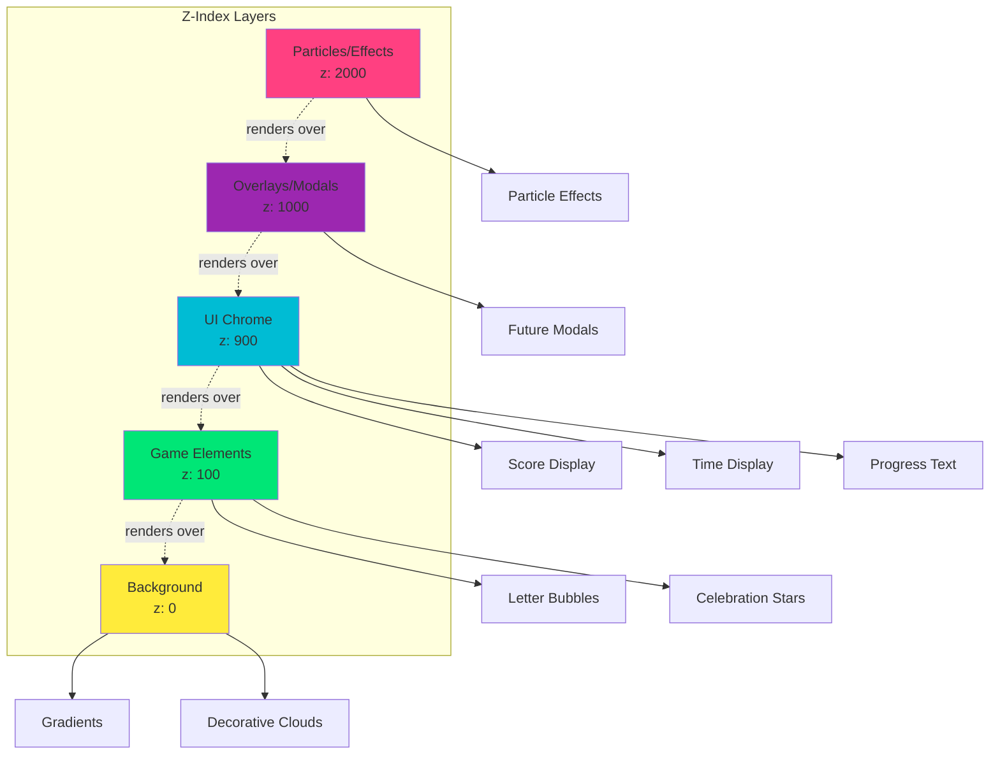

## LetterPopScene Layout Diagram

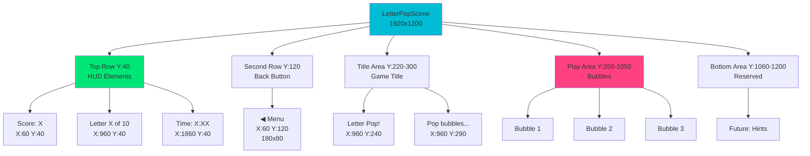

## Bubble Rendering Pipeline

```mermaid
flowchart LR
    Create[Create Bubble] --> ChooseColor[Choose Random<br/>Bright Color]
    ChooseColor --> Shadow[Draw Shadow<br/>Z: 0]
    Shadow --> Main[Draw Main Circle<br/>Z: 1]
    Main --> Highlight[Draw Glossy<br/>Highlight Z: 2]
    Highlight --> Border[Draw White<br/>Border Z: 3]
    Border --> Letter[Add Letter Text<br/>Z: 4]
    Letter --> Interactive[Make Interactive]
    Interactive --> Animation[Add Hover<br/>Animation]
    Animation --> Ready[Bubble Ready]

    style ChooseColor fill:#FF4081
    style Main fill:#00BCD4
    style Highlight fill:#FFEB3B
    style Border fill:#FFFFFF
    style Ready fill:#00E676
```

## Font Loading Sequence

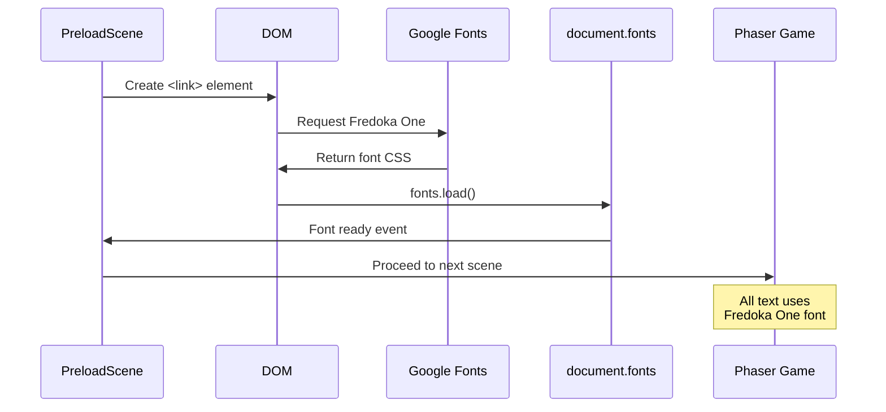

## PWA Manifest Structure

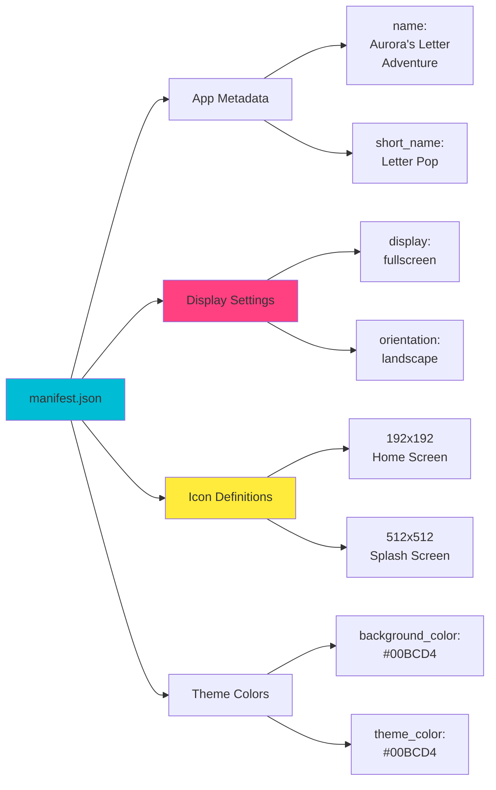

## Service Worker Cache Strategy

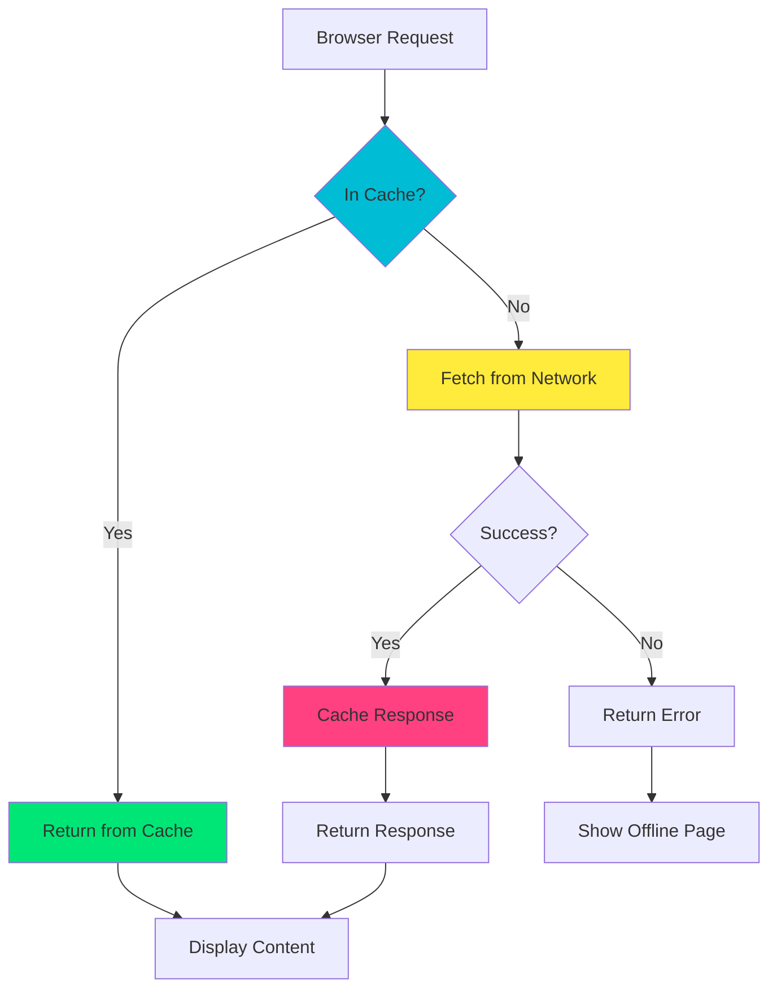

## Responsive Scaling Flow

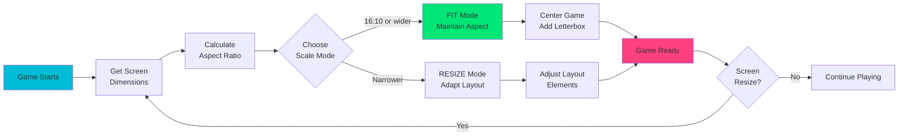

## Button Creation Architecture

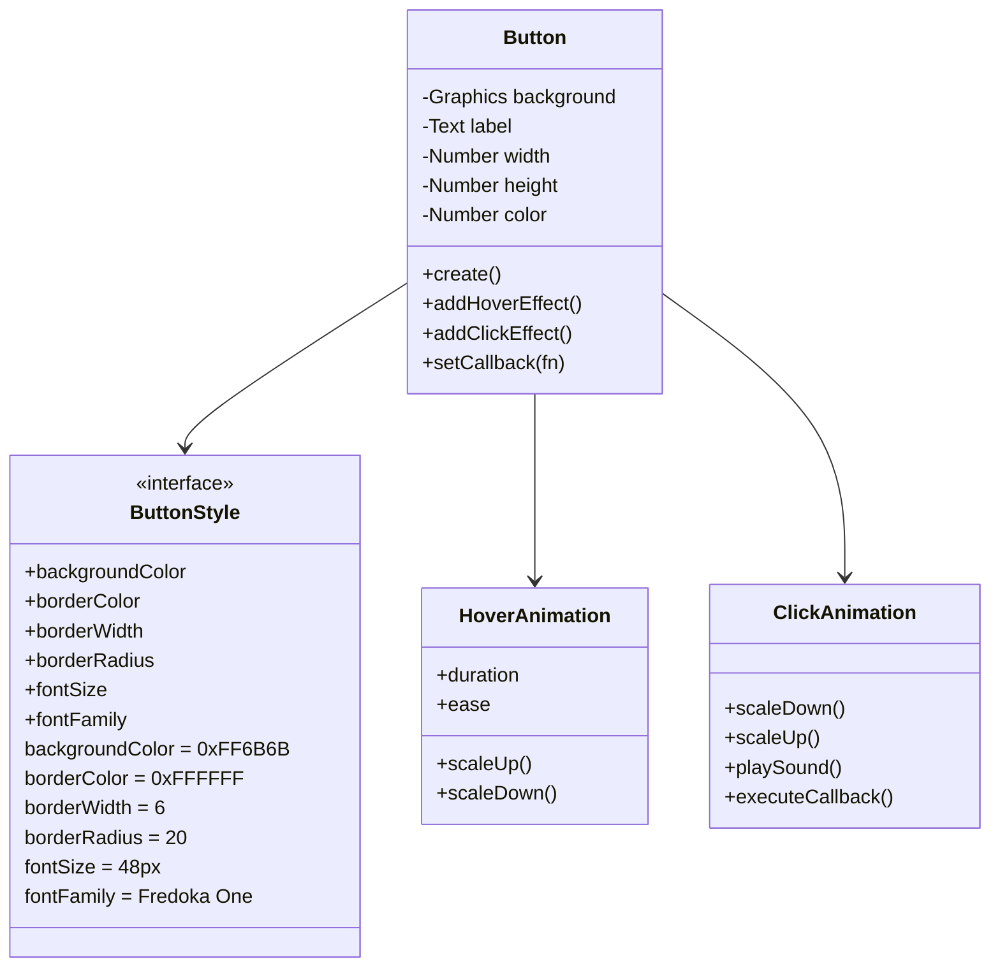

## Color Application Matrix

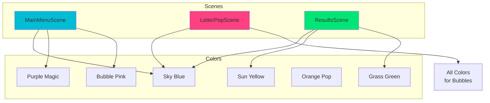

## Deployment Architecture

```mermaid
graph LR
    Developer[Developer<br/>Local Machine]
    Git[Git Repository]
    GitHub[GitHub]
    Pages[GitHub Pages]
    CDN[GitHub CDN]
    User[Aurora's Tablet]

    Developer -->|git push| Git
    Git -->|sync| GitHub
    GitHub -->|auto-deploy| Pages
    Pages -->|serve via| CDN
    CDN -->|HTTPS| User

    User -->|PWA Install| HomeScreen[Home Screen Icon]
    HomeScreen -->|Launch| FullScreen[Fullscreen Game]

    style Developer fill:#00BCD4
    style Pages fill:#4CAF50
    style User fill:#FF4081
    style FullScreen fill:#FFEB3B
```

## Notes

### Why This Architecture?

**ResponsiveUtils Singleton Pattern:**
- Instantiated once per scene
- Provides consistent scaling across all elements
- Prevents hardcoded pixel values
- Easy to maintain and update

**Z-Index Layering:**
- Clear visual hierarchy
- Prevents rendering conflicts
- Particles always on top
- UI always visible

**Color Palette Encapsulation:**
- Defined once, used everywhere
- Easy to adjust entire theme
- Consistent brand identity
- ADHD-friendly high contrast

**PWA Service Worker:**
- Offline-first strategy
- Auto-updates on app launch
- Caches critical assets
- Fast subsequent loads

**Phaser FIT Scale Mode:**
- Maintains aspect ratio
- Works on all screen sizes
- Prevents distortion
- Centers game automatically

### Performance Considerations

**Gradient Rendering:**
- Pre-rendered at scene creation
- Not re-drawn every frame
- Static graphics objects
- Minimal CPU impact

**Font Loading:**
- Loaded once at startup
- Cached by browser
- Fallback chain for reliability
- Document.fonts API for tracking

**Service Worker Caching:**
- Reduces network requests
- Faster load times
- Offline capability
- Automatic updates

**Touch Event Optimization:**
- Large hit areas reduce missed taps
- Immediate visual feedback
- No hover delays on touch
- Optimized for tablets
