# Phase 12: Letter Pop - Complete Round Flow - UML

## System Architecture Diagram

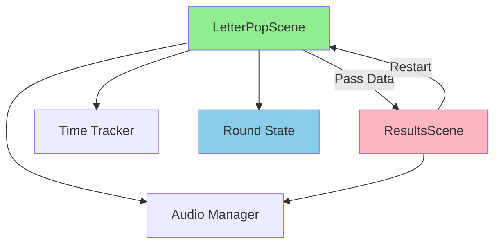

## Complete Game Loop Sequence Diagram

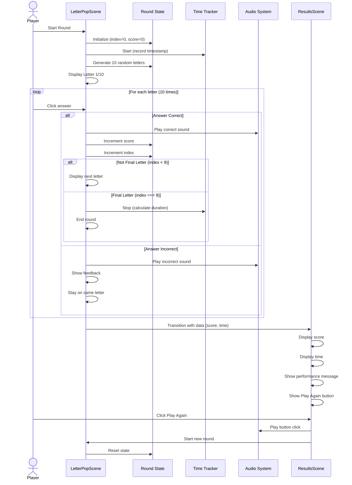

## Round State Management Class Diagram

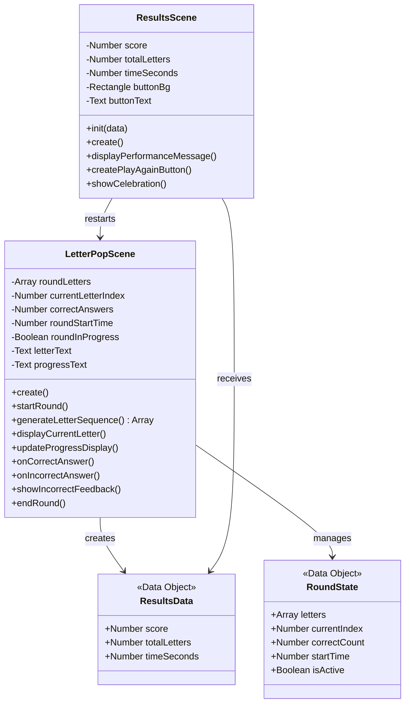

## Game Loop State Diagram

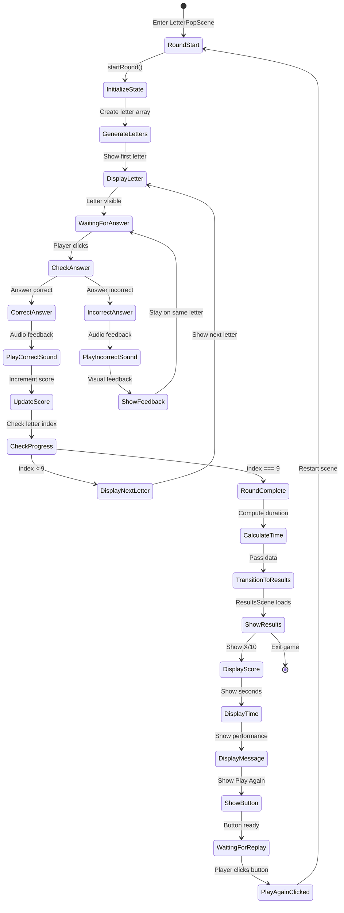

## Letter Sequence Flow Diagram

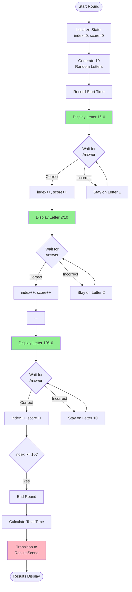

## Data Flow Between Scenes

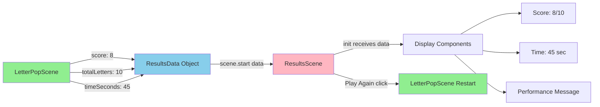

## Results Scene Component Diagram

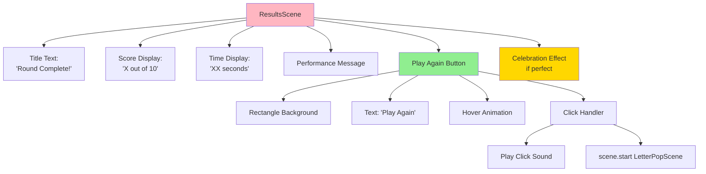

## Round Progress Component Diagram

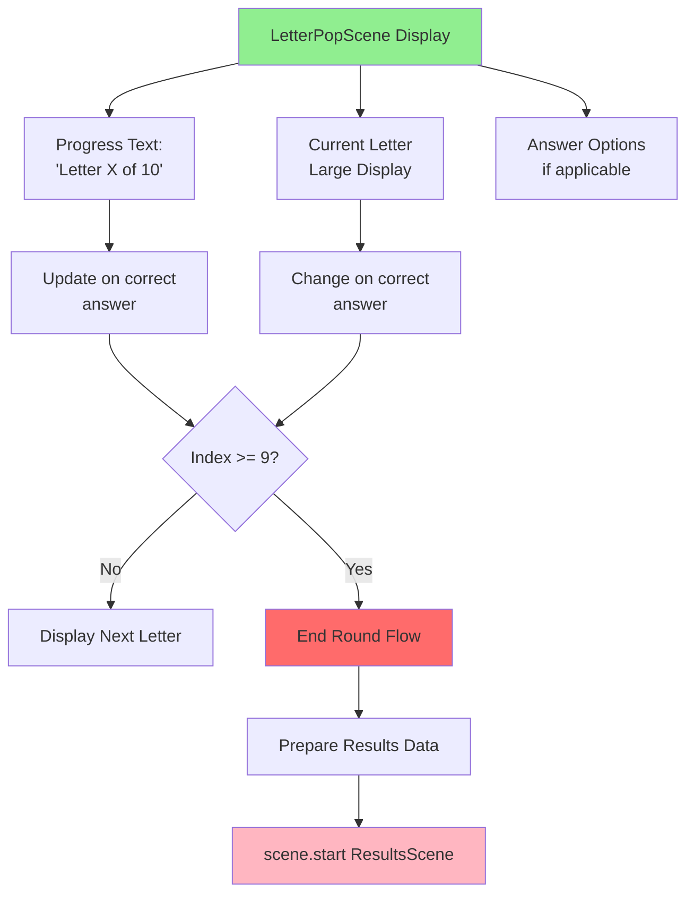

## Time Tracking Sequence

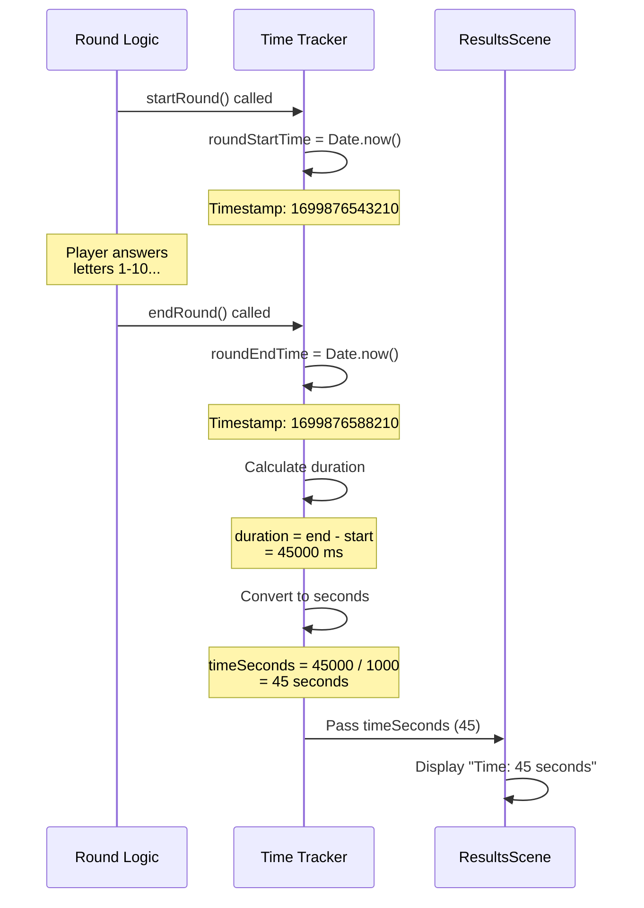

## Performance Message Logic

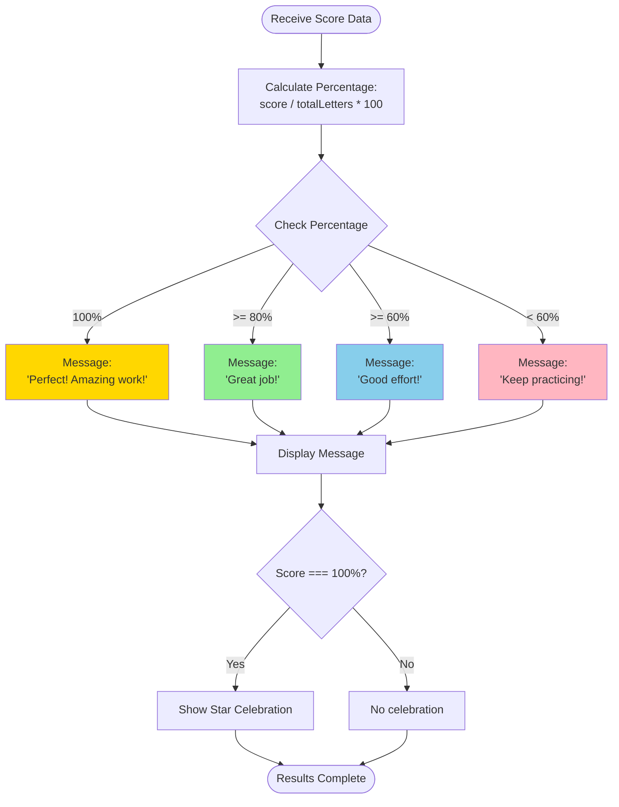

## Memory Management Diagram

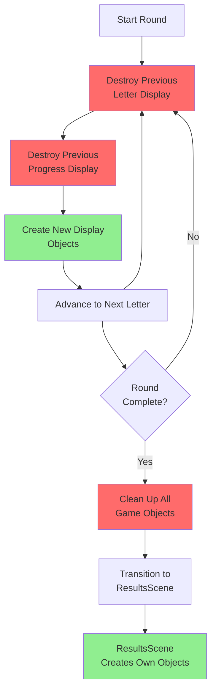

## Button Interaction State Machine

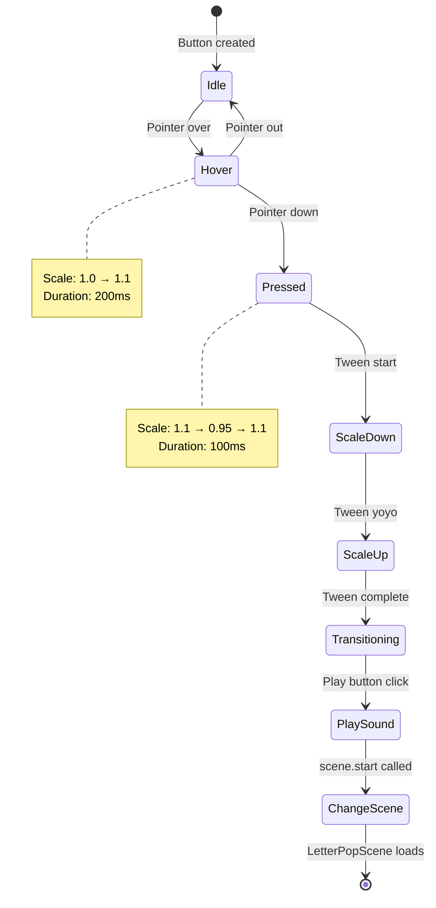

## Scene Configuration Diagram

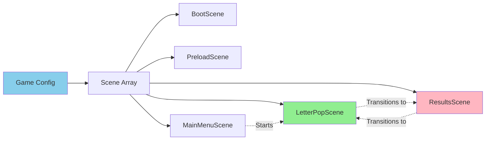

## Notes

### Why This Architecture?

**Round State Isolation**
- All round state contained in LetterPopScene
- Easy to reset for new rounds
- No global state pollution
- Clear state lifecycle

**Data Passing via Phaser Scene System**
- Use built-in scene.start(key, data) mechanism
- ResultsScene receives via init(data)
- Type-safe and predictable
- No external state management needed

**Time Tracking with Date.now()**
- Simple and reliable
- No complex game time calculations
- Sufficient accuracy for this use case
- Easy to understand and debug

**Progress Indicator Benefits**
- Shows player exactly where they are
- Reduces uncertainty and anxiety
- Creates clear goals (finish 10 letters)
- ADHD-friendly with concrete progress

### Performance Considerations

**Object Destruction**
- Destroy previous letter/progress text before creating new
- Prevents memory leaks
- Keeps object count manageable
- Important for multiple rounds

**Delayed Transitions**
- Brief delays between letter changes (500ms)
- Allows player to process feedback
- Prevents overwhelming speed
- Creates rhythm in gameplay

**Tween Animations**
- Use tweens for smooth animations
- Duration 100-200ms for responsiveness
- Hardware accelerated by Phaser
- No performance impact

### Design Decisions

**Fixed Round Length (10 letters)**
- Not too short (feels incomplete)
- Not too long (maintains engagement)
- Easy to track progress
- Good for ADHD attention span

**No Wrong Answer Penalty**
- Incorrect answers don't end round
- Player can retry same letter
- Reduces frustration
- Encourages learning over perfection

**Immediate Replay**
- One click to play again
- No menu navigation required
- Maintains momentum and engagement
- Perfect for "just one more round" feeling

**Performance Messages**
- Always encouraging, never negative
- Even lowest tier says "Keep practicing!"
- Celebrates effort, not just perfection
- Builds confidence

### What This Phase Achieves

1. **Complete Game Loop**: Full start-to-finish experience
2. **Score Tracking**: Quantifiable performance metrics
3. **Time Tracking**: Additional replay motivation
4. **Results Feedback**: Clear performance summary
5. **Replay System**: Immediate re-engagement
6. **Progress Visibility**: "Letter X of 10" reduces uncertainty
7. **Celebration**: Special recognition for perfect rounds
8. **Foundation for Expansion**: Easy to add difficulty levels later

This phase transforms Letter Pop from a prototype into a complete, replayable game.
