# Phase 13: Content System - Letter Data - UML

## Class Diagram

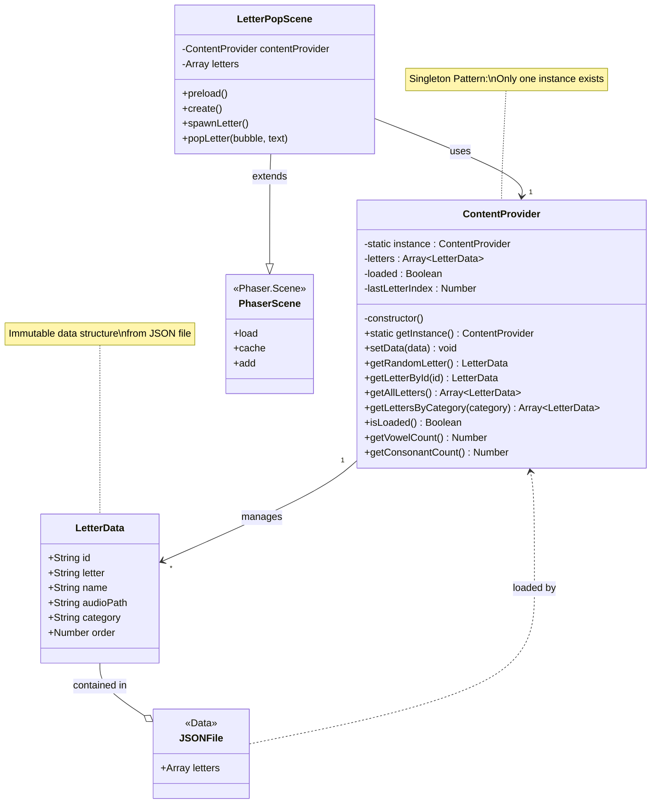

## Sequence Diagram: Content Loading Flow

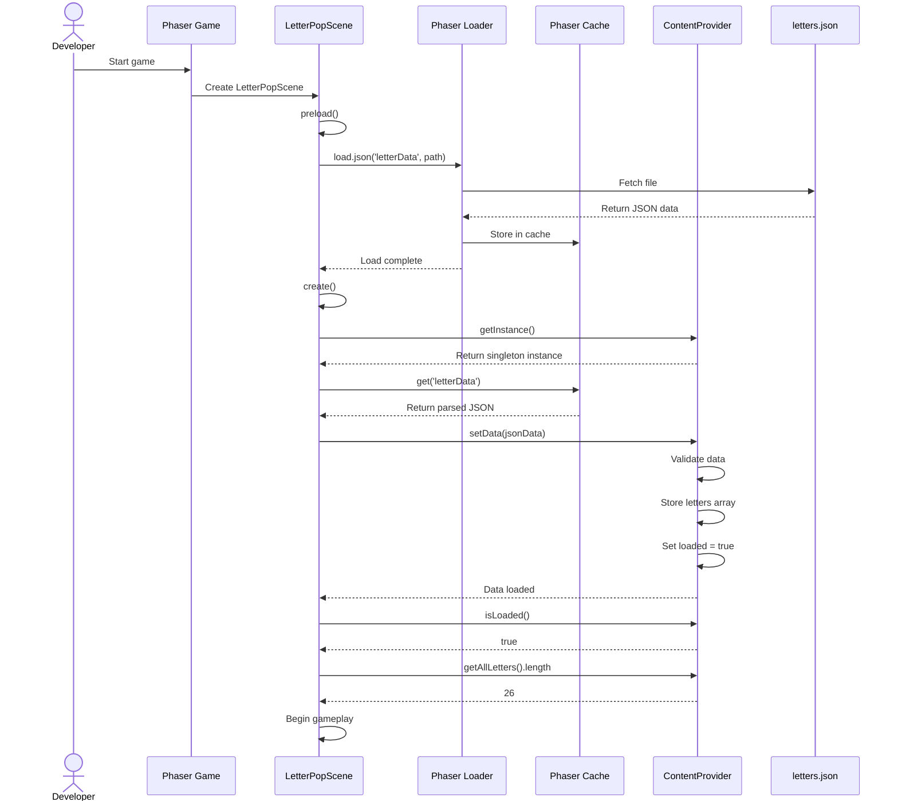

## Sequence Diagram: Random Letter Selection

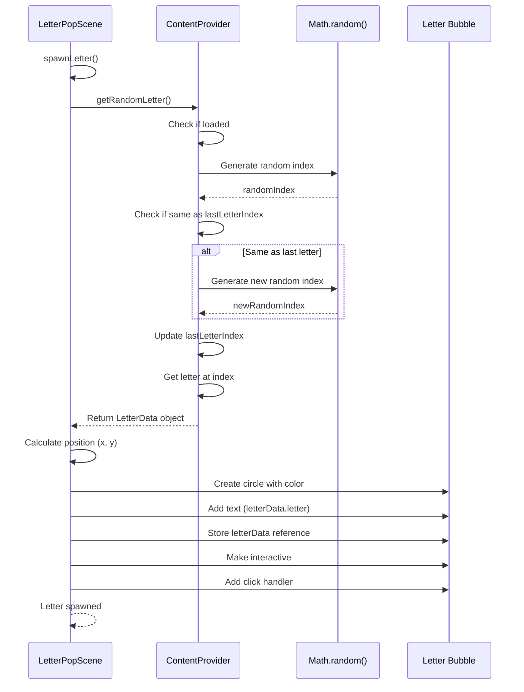

## State Diagram: ContentProvider States

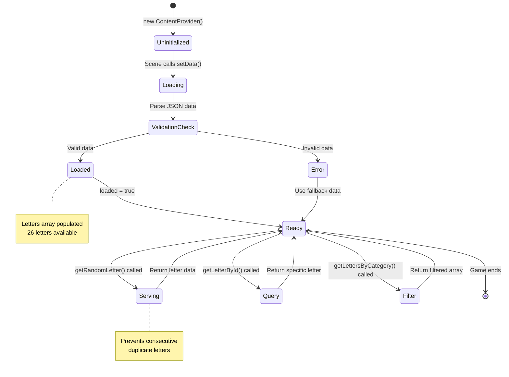

## Component Interaction Diagram

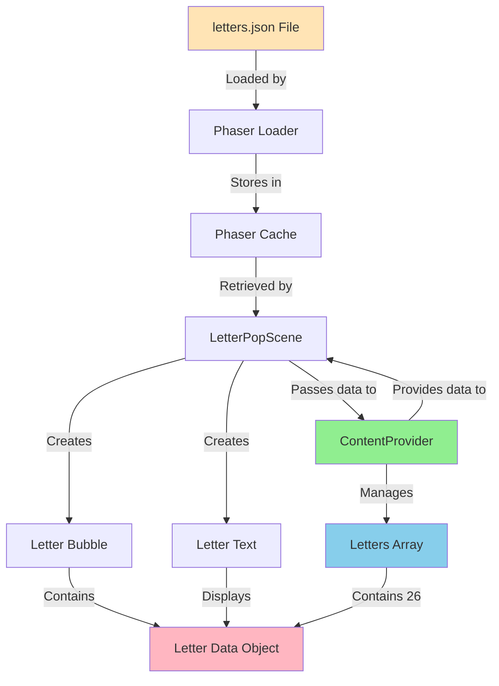

## Data Structure Diagram

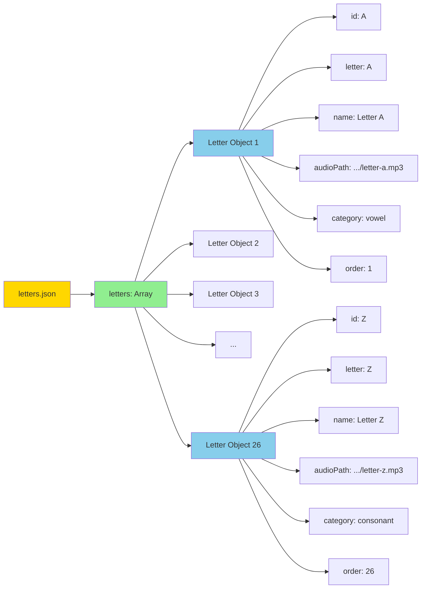

## Activity Diagram: Letter Data Loading

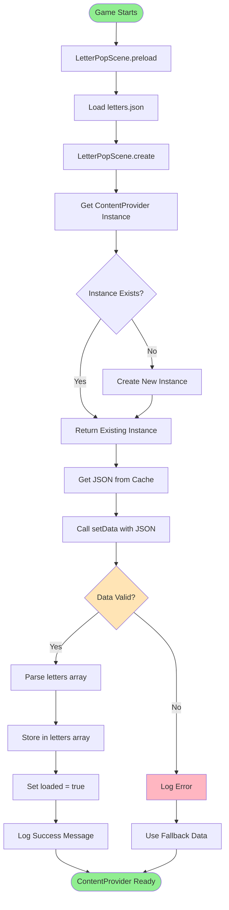

## Activity Diagram: Get Random Letter Logic

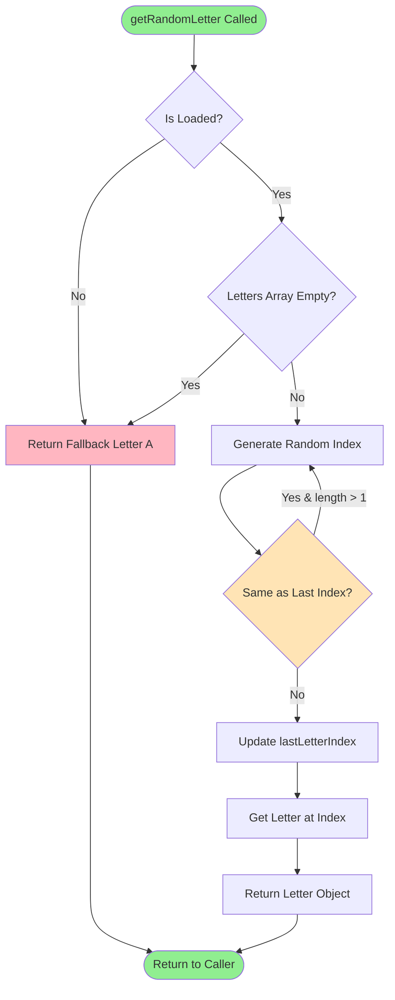

## Deployment Diagram

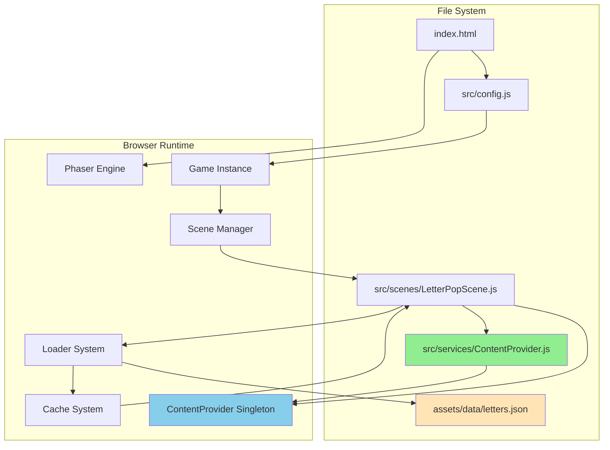

## Object Relationship Diagram

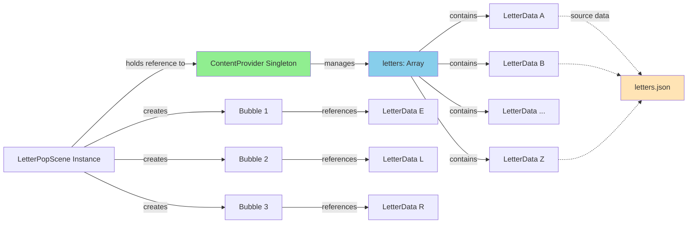

## Memory Structure Diagram

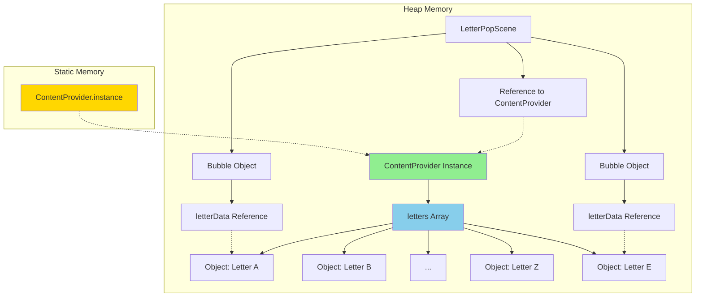

## Singleton Pattern Implementation

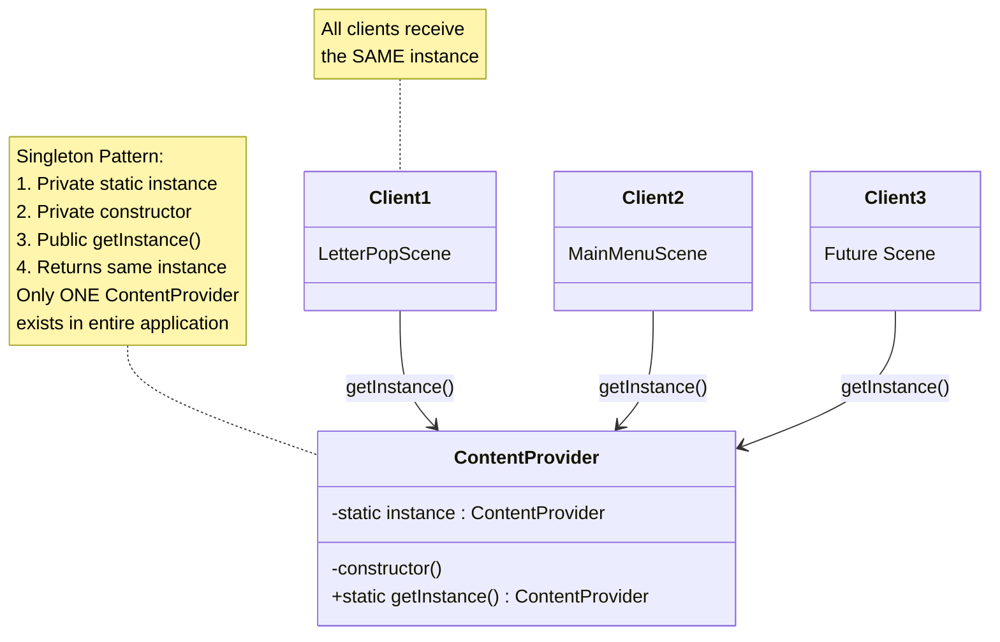

## Data Flow Diagram: Complete Flow

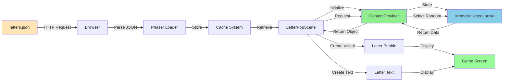

## Notes

### Architecture Decisions

**Singleton Pattern for ContentProvider**
- Only one instance needed across entire game
- Ensures all scenes use same letter data
- Prevents duplicate loading of JSON
- Centralized data management
- Easy to access from any scene

**JSON for Data Storage**
- Human-readable and editable
- Standard format, widely supported
- Easy to validate (JSON Schema)
- Version control friendly
- Can be edited without code changes

**Separation of Concerns**
- ContentProvider handles data management only
- Scenes handle game logic and display
- JSON file contains pure data, no logic
- Clear responsibility boundaries

**Immutable Data Pattern**
- Letter data doesn't change after loading
- Return copies to prevent external modification
- Safe to share references across objects
- Predictable behavior

### Performance Considerations

**One-Time Loading**
- JSON loaded once in preload()
- Cached by Phaser for fast retrieval
- ContentProvider stores parsed data
- No repeated file I/O

**Memory Efficiency**
- 26 letter objects = minimal memory
- Bubble objects only reference letter data (no duplication)
- Singleton prevents multiple ContentProvider instances
- Garbage collection friendly

**Random Selection Algorithm**
- O(1) random access to array
- Simple duplicate prevention (lastLetterIndex)
- No complex shuffling algorithms needed
- Fair distribution over time

### Extensibility

**Easy to Extend**
- Add new properties to letter objects (e.g., difficulty, color)
- Add new methods to ContentProvider (e.g., getLettersByDifficulty)
- Support multiple JSON files (letters-lowercase.json)
- Add caching/persistence layer

**Future Enhancements**
- Weighted random selection (vowels appear more often)
- Sequential learning mode (A, B, C order)
- Adaptive difficulty (track which letters player knows)
- Multiple languages (letters-es.json, letters-fr.json)

### Why This Design?

**Simplicity**
- Single source of truth (letters.json)
- Clear data flow: JSON → Cache → ContentProvider → Scene
- Minimal dependencies
- Easy to understand and maintain

**Testability**
- ContentProvider can be tested independently
- Mock JSON data easily
- Test methods in isolation
- Verify singleton behavior

**Maintainability**
- Content changes don't require code changes
- Clear separation of data and logic
- Well-documented methods
- Consistent API

**ADHD-Friendly Development**
- One place to look for letter data
- Predictable behavior
- Clear method names
- No hidden complexity

This architecture provides a solid foundation for content management that will scale as the game grows in complexity.
