# Phase 14: Audio Content - Letter Recordings - UML

## Class Diagram

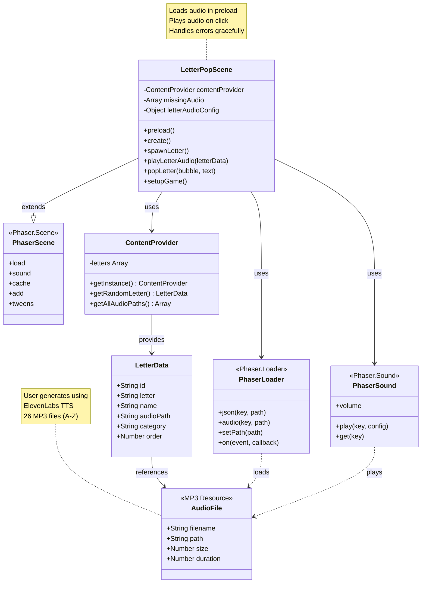

## Sequence Diagram: Audio Loading Flow

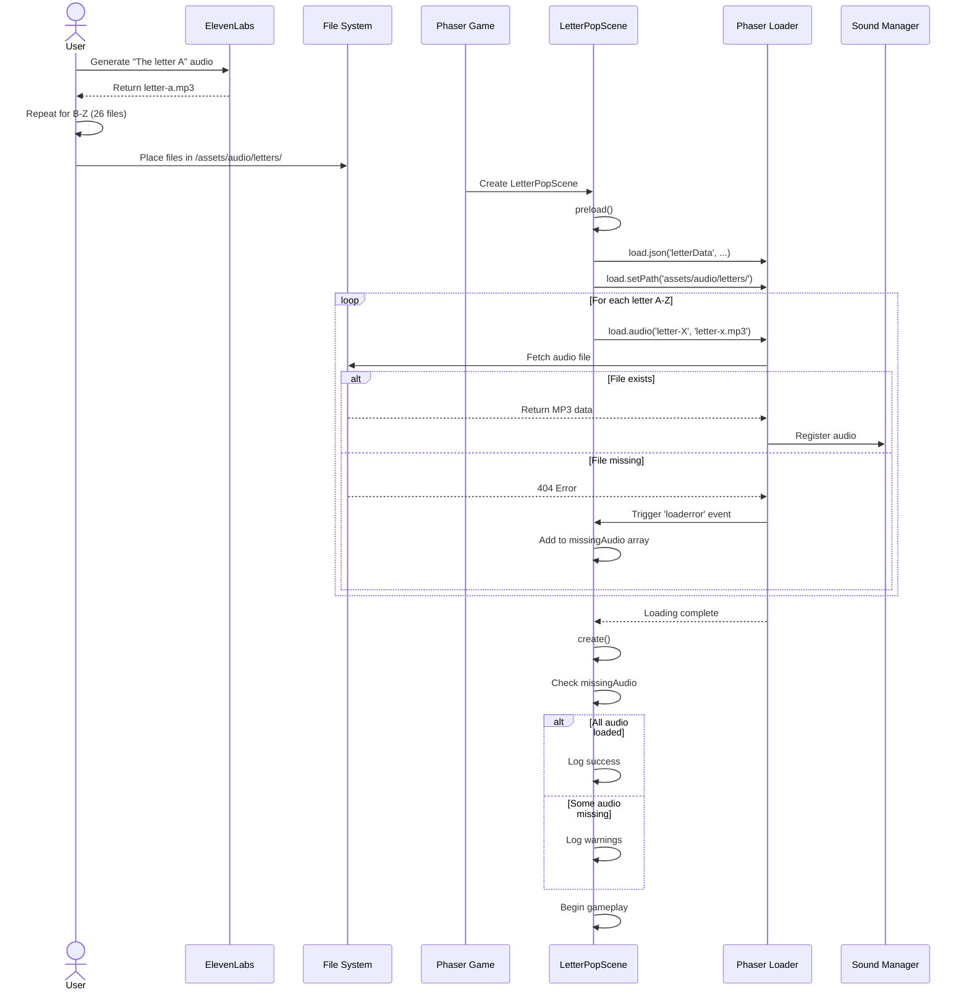

## Sequence Diagram: Audio Playback Flow

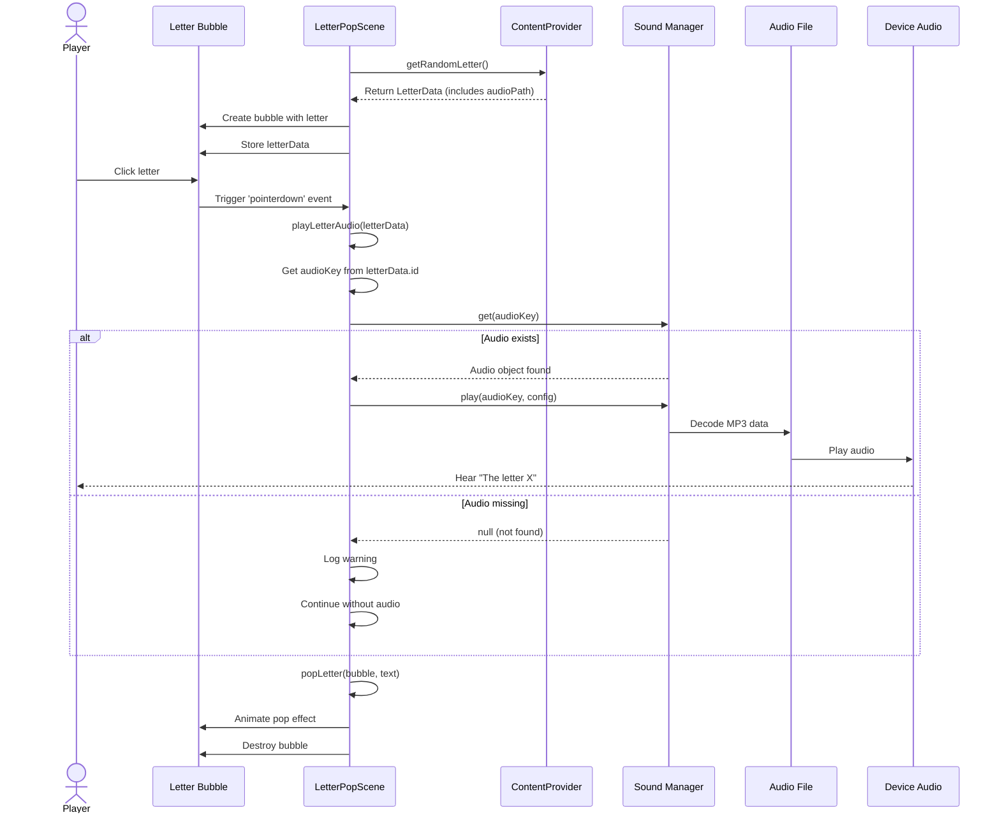

## State Diagram: Audio System States

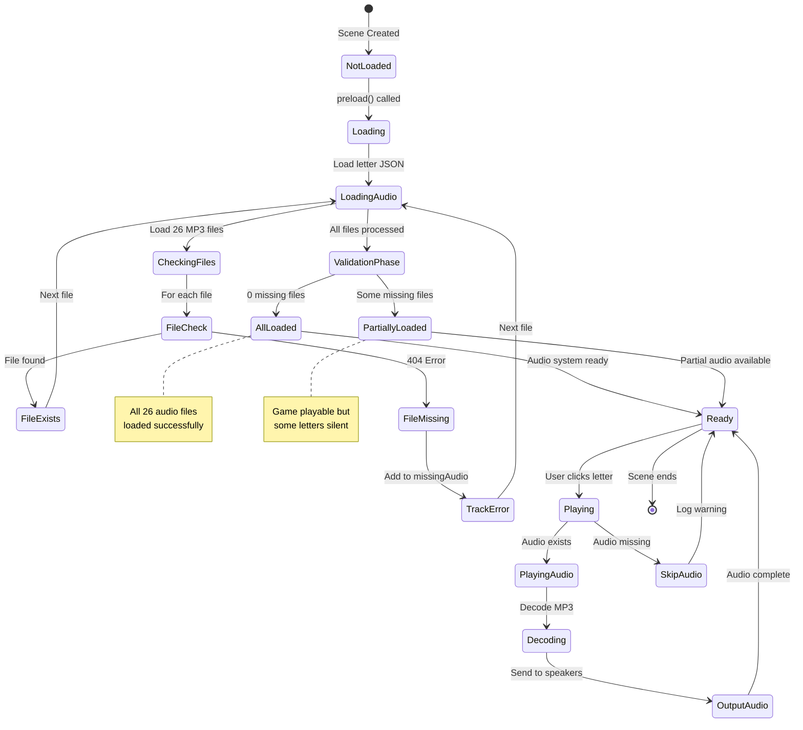

## Activity Diagram: Audio File Generation (User Task)

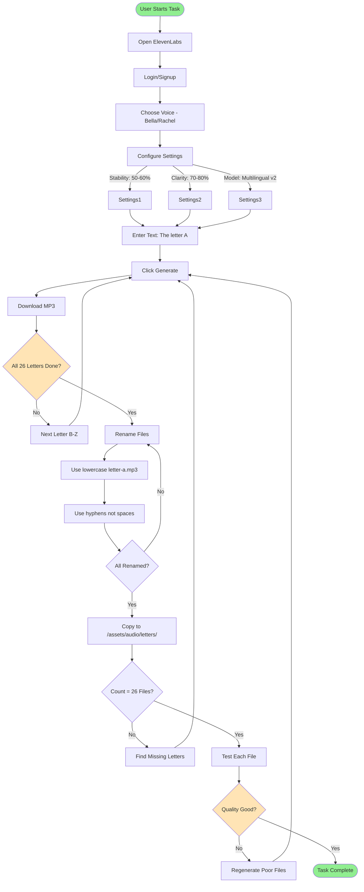

## Activity Diagram: Audio Loading Process

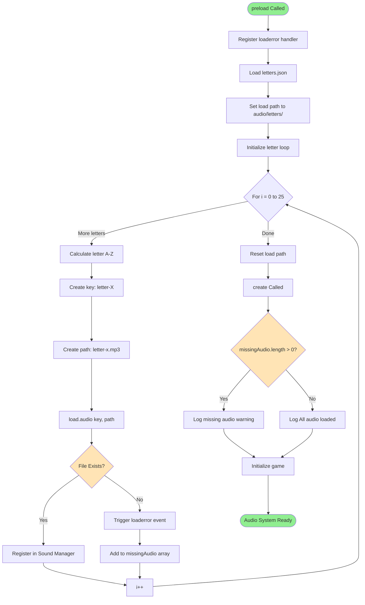

## Component Interaction Diagram

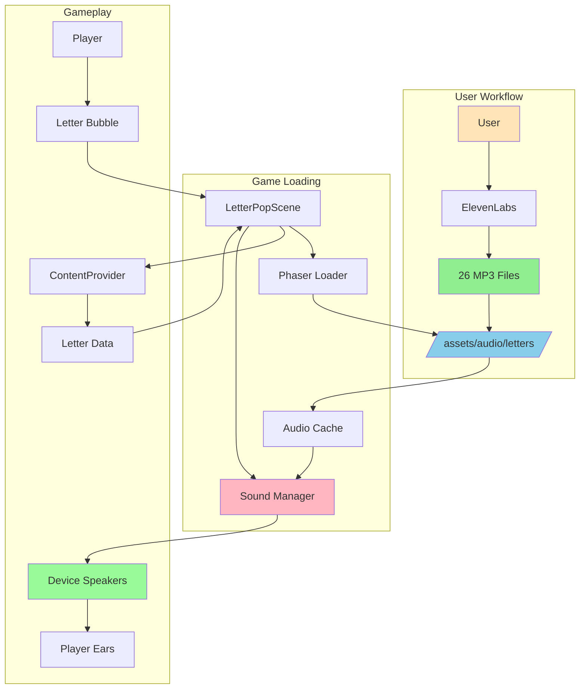

## Data Flow Diagram: Complete Audio Pipeline

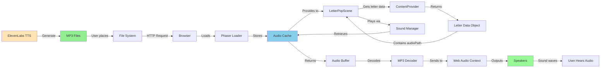

## File Structure Diagram

```mermaid
graph TB
    Root[Project Root] --> Assets[/assets]
    Assets --> Audio[/audio]
    Audio --> Letters[/letters]

    Letters --> A[letter-a.mp3]
    Letters --> B[letter-b.mp3]
    Letters --> C[letter-c.mp3]
    Letters --> Dots[...]
    Letters --> Z[letter-z.mp3]

    Root --> Src[/src]
    Src --> Services[/services]
    Services --> CP[ContentProvider.js]

    Src --> Scenes[/scenes]
    Scenes --> LPS[LetterPopScene.js]

    LPS -.loads.-> A
    LPS -.loads.-> B
    LPS -.loads.-> C
    LPS -.loads.-> Z

    LPS -.uses.-> CP

    Assets --> Data[/data]
    Data --> JSON[letters.json]
    CP -.reads.-> JSON

    JSON -.references.-> A
    JSON -.references.-> B
    JSON -.references.-> Z

    style Letters fill:#87CEEB
    style A fill:#90EE90
    style B fill:#90EE90
    style Z fill:#90EE90
    style LPS fill:#FFB6C1
    style CP fill:#FFE4B5
```

## Audio Loading Timeline Diagram

```mermaid
gantt
    title Audio Loading Timeline
    dateFormat X
    axisFormat %Ls

    section Preload Phase
    Load JSON :a1, 0, 100ms
    Setup Audio Loader :a2, after a1, 50ms
    Load letter-a.mp3 :a3, after a2, 80ms
    Load letter-b.mp3 :a4, after a2, 85ms
    Load letter-c.mp3 :a5, after a2, 78ms
    Load remaining 23 letters :a6, after a2, 90ms

    section Create Phase
    Initialize ContentProvider :b1, after a6, 10ms
    Verify Audio Loading :b2, after b1, 5ms
    Setup Game :b3, after b2, 50ms

    section Ready State
    Game Ready :c1, after b3, 0ms
```

## Error Handling Flow Diagram

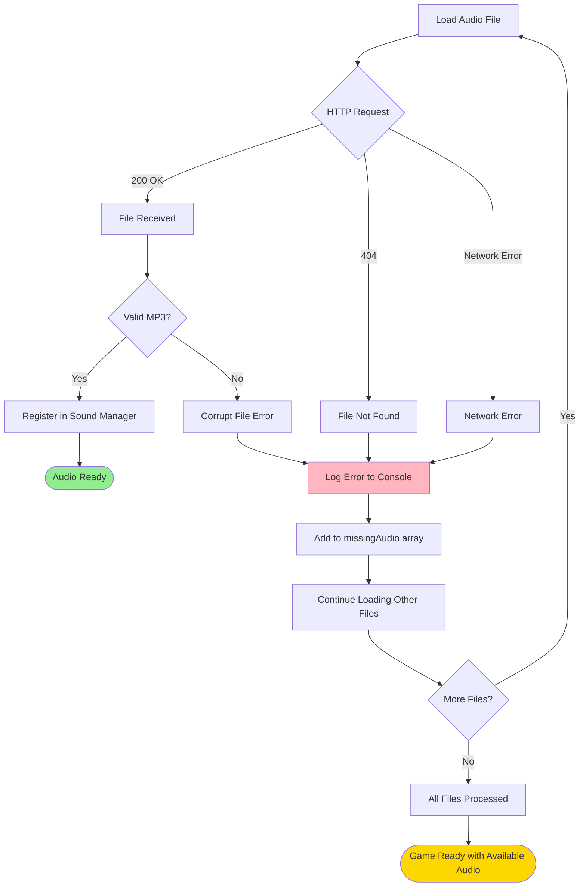

## Memory Structure Diagram

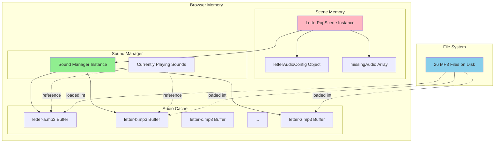

## Audio Playback State Machine

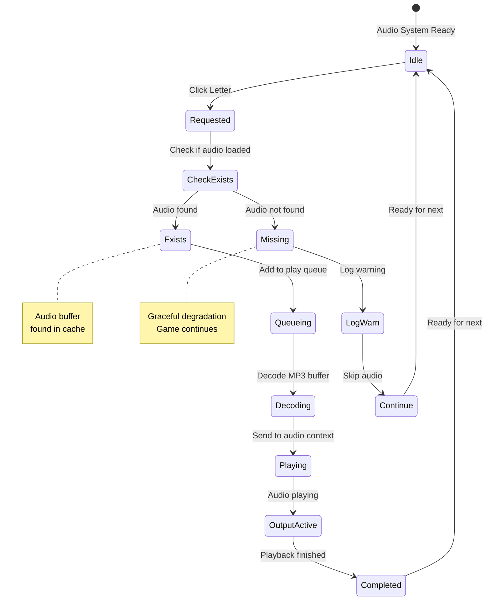

## Notes

### Architecture Decisions

**MP3 Format Choice**
- Universal browser support
- Good compression (small file sizes)
- ElevenLabs native output format
- Easy for users to generate and test

**Lazy Loading vs Preload All**
- We preload all 26 files
- Total size ~500KB-1MB (reasonable)
- Prevents delays during gameplay
- Better user experience (instant audio)

**Error Handling Strategy**
- Track missing files but don't block game
- Log warnings for debugging
- Game playable without audio
- Visual feedback always works

**Singleton ContentProvider**
- Centralized letter data including audio paths
- Easy to extend with audio methods
- Consistent data access across scenes

### Performance Considerations

**Memory Usage**
- 26 MP3 files × ~30KB average = ~780KB
- Decoded in memory when played
- Browser handles audio buffer management
- Minimal impact on game performance

**Loading Time**
- Preload during scene load (~1-2 seconds)
- Acceptable for game startup
- Could show loading screen if needed
- Cache helps on scene reloads

**Playback Performance**
- Phaser sound system is optimized
- Minimal CPU usage during playback
- Web Audio API handles decoding
- No impact on frame rate

### Browser Compatibility

**Audio Support**
- MP3 supported in all modern browsers
- Chrome: Excellent
- Firefox: Excellent
- Safari: Excellent
- Edge: Excellent

**Mobile Considerations**
- iOS requires user interaction before audio
- Click event satisfies this requirement
- Android has no restrictions
- Test on actual devices

### User Experience Design

**Why This Approach Works**
- User generates audio = full control over voice/quality
- Clear naming convention prevents errors
- Graceful degradation ensures game always playable
- Audio enhances but doesn't block learning

**ADHD-Friendly Audio Design**
- Immediate audio feedback on click
- Clear, distinct letter sounds
- Consistent volume across letters
- No overwhelming background music
- Audio can be muted if overstimulating

### Extensibility

**Future Enhancements**
- Add letter sounds (phonics: /a/, /b/, /c/)
- Add sound effects (pop, success, failure)
- Add background music toggle
- Add volume slider control
- Support multiple languages
- Add audio progress bar
- Cache audio locally for offline play

### Why ElevenLabs?

**Benefits:**
- High-quality TTS
- Natural-sounding voices
- Consistent audio quality
- Easy to use
- Free tier available
- Fast generation
- Child-friendly voices

**Alternatives Considered:**
- Browser TTS API (inconsistent quality)
- Pre-recorded voice actor (expensive)
- Google TTS (less natural)
- Amazon Polly (more complex setup)

This architecture provides high-quality audio integration while maintaining simplicity and graceful error handling.
