# Phase 15: Particle Effects - Celebration - UML

## System Architecture Diagram

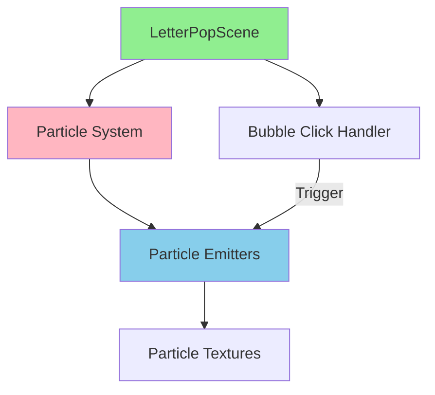

## Particle Celebration Sequence Diagram

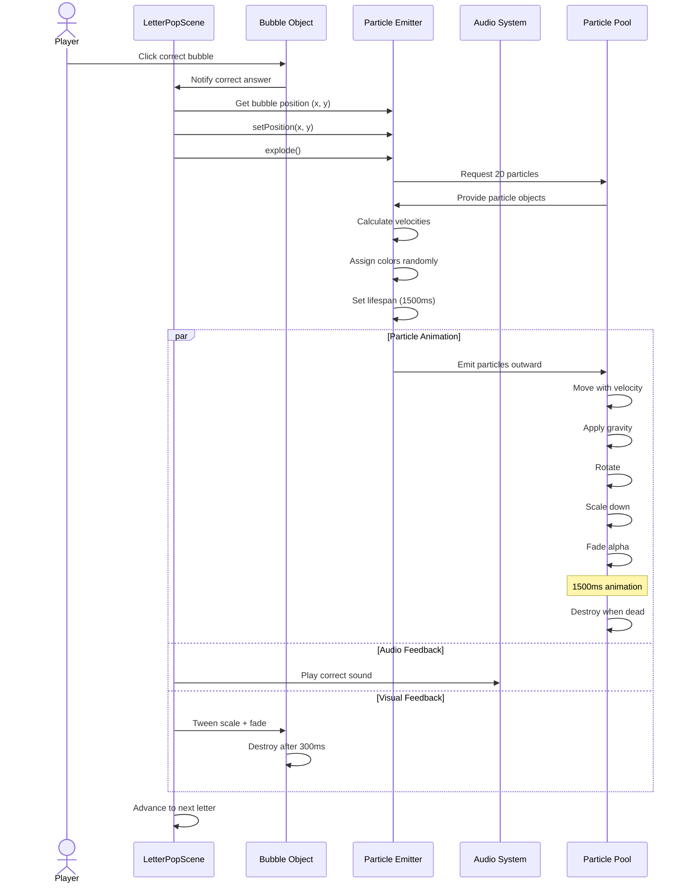

## Particle Emitter Class Diagram

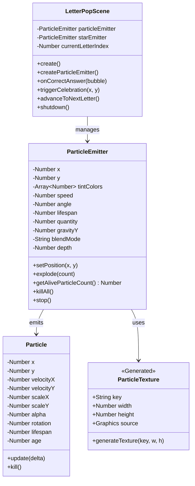

## Particle Burst Flow Diagram

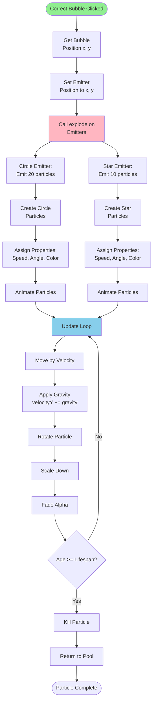

## Particle Texture Generation Diagram

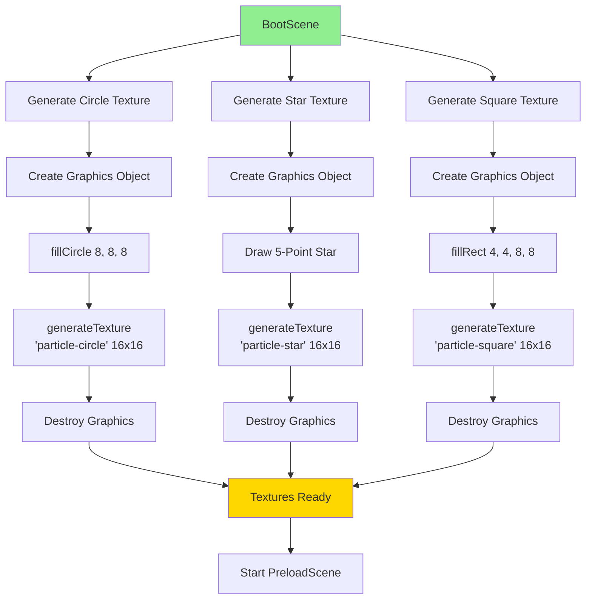

## Particle Configuration State Diagram

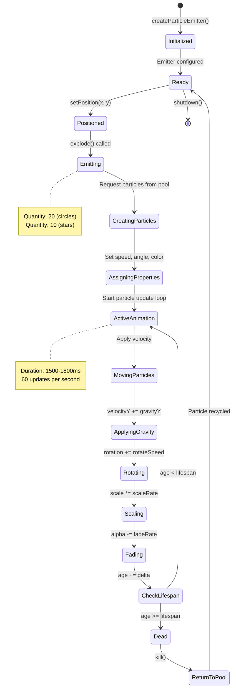

## Particle Property Timeline

```mermaid
gantt
    title Particle Life Cycle (1500ms)
    dateFormat X
    axisFormat %L ms

    section Emission
    Particle Created           :0, 0ms
    Velocity Assigned         :0, 0ms
    Color Assigned           :0, 0ms

    section Movement
    Outward Movement         :0, 1500ms
    Gravity Applied          :0, 1500ms
    Rotation Active          :0, 1500ms

    section Visual
    Scale 1.0 → 0.2         :0, 1500ms
    Alpha 1.0 → 0.0         :0, 1500ms

    section Cleanup
    Particle Killed          :1500, 1500ms
    Return to Pool          :1500, 1500ms
```

## Layering Depth Diagram

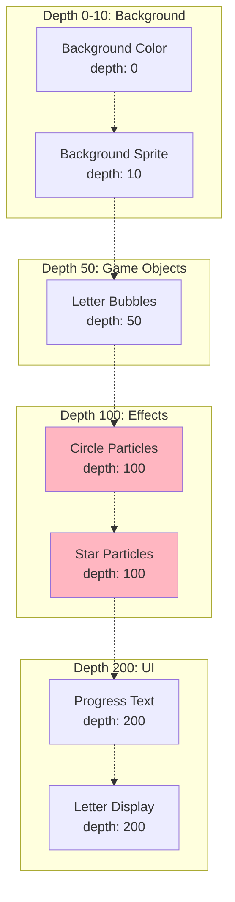

## Particle Color Distribution

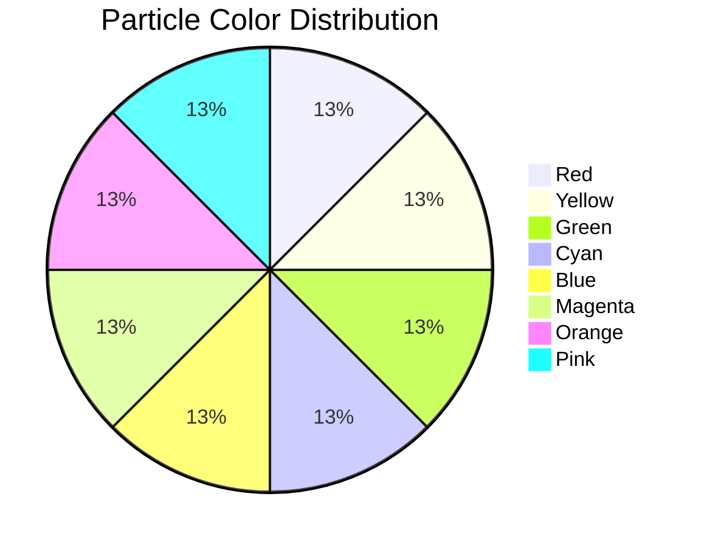

## Performance Optimization Flow

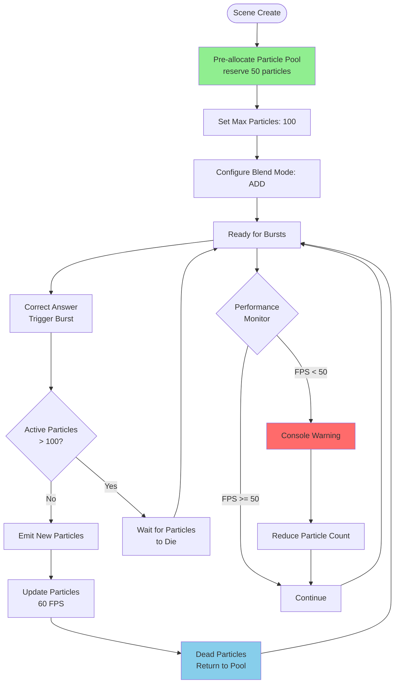

## Particle Emitter Configuration Object

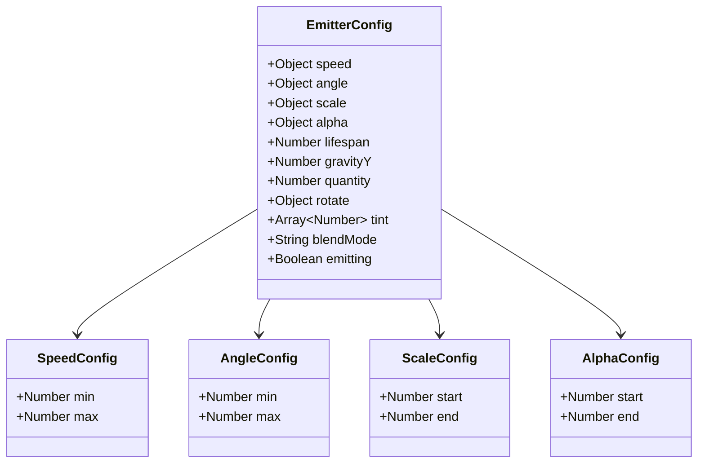

## Particle Burst Timing Coordination

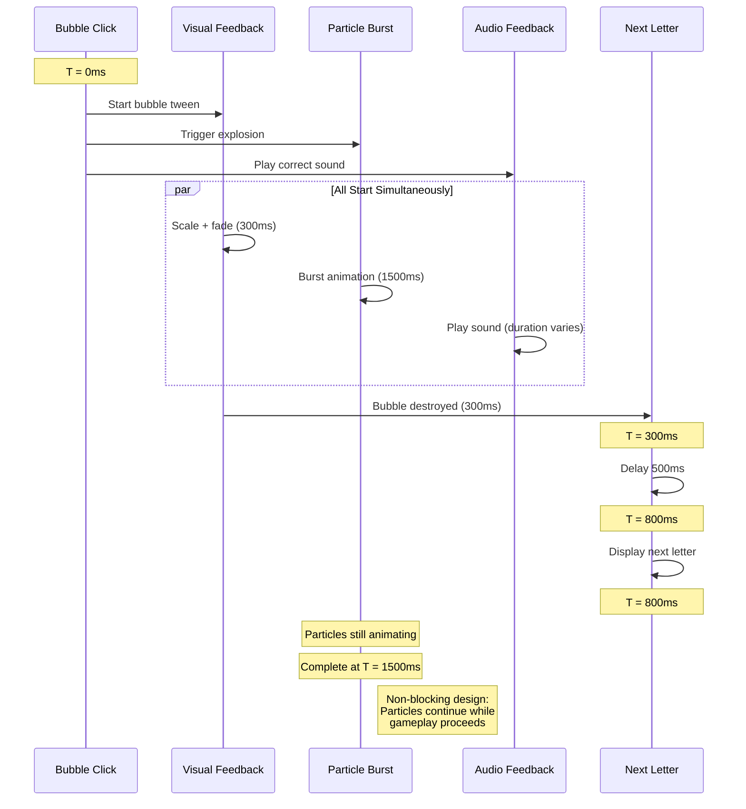

## Memory Management Diagram

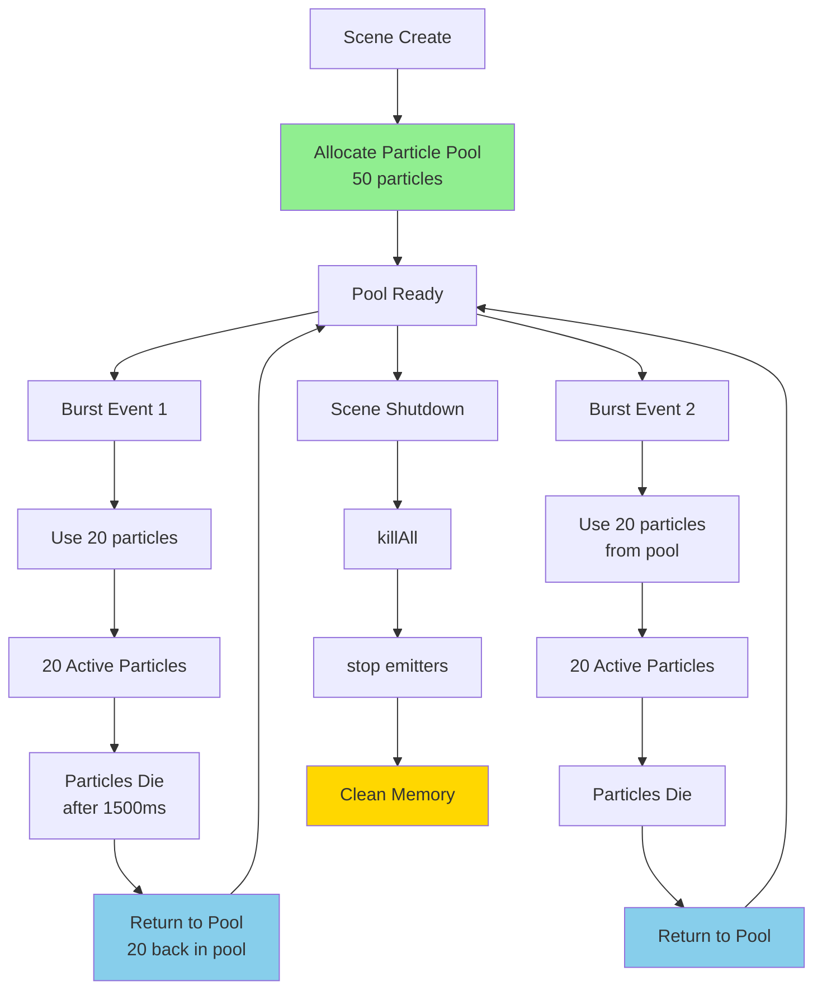

## Particle Physics Calculation

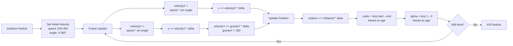

## Notes

### Why This Architecture?

**Object Pooling**
- Pre-allocate particles for performance
- Reuse particle objects instead of creating/destroying
- Reduces garbage collection overhead
- Critical for smooth 60fps animation

**Explode Mode**
- Perfect for burst effects on click
- All particles emitted simultaneously
- Creates satisfying "pop" feeling
- Non-continuous emission saves performance

**Multiple Emitters**
- Circle + star emitters add variety
- Different shapes prevent visual monotony
- Can be triggered simultaneously
- Each configured independently

**Blend Mode ADD**
- Creates glowing particle effect
- Particles brighten when overlapping
- More visually appealing than normal blend
- Slightly more performant than other special blends

### Performance Considerations

**Particle Limits**
- Max 50-100 active particles prevents lag
- Reserve pool pre-allocated (no runtime allocation)
- Each burst: 20 circles + 10 stars = 30 particles
- Can handle 3-4 simultaneous bursts safely

**Texture Size**
- 16x16 pixels is optimal
- Small enough for performance
- Large enough for visibility
- Generated at runtime (no file loading)

**Update Frequency**
- Particles update at game framerate (60fps)
- Physics calculated each frame
- Lifespan 1500ms = ~90 updates per particle
- Efficient calculations (no complex physics)

### Design Decisions

**Gravity Effect**
- Makes particles fall naturally
- More satisfying than linear outward movement
- Adds organic feel to animation
- GravityY: 300 is balanced (not too fast)

**Fade Out**
- Alpha 1.0 → 0.0 over lifespan
- Smooth disappearance (not abrupt)
- Particles shrink and fade simultaneously
- Creates polished, professional look

**Color Variety**
- 8 different colors
- Randomly assigned to each particle
- Creates rainbow confetti effect
- Visually exciting for children

**Non-Blocking Animation**
- Particles continue after bubble destroyed
- Game progresses to next letter while particles animate
- Doesn't delay gameplay
- Perfect for maintaining flow

### What This Phase Achieves

1. **Visual Reward**: Immediate, exciting feedback for correct answers
2. **Celebration Feeling**: Confetti-like burst creates joy
3. **Maintained Flow**: Non-blocking design keeps game moving
4. **Performance**: Optimized particle system runs smoothly
5. **Variety**: Multiple shapes and colors prevent repetition
6. **Polish**: Professional particle effects elevate game quality
7. **ADHD-Friendly**: Short, exciting, non-distracting celebration
8. **Foundation**: Particle system can be reused for other effects

This phase transforms correct answers from simple audio feedback into a multi-sensory celebration that reinforces learning through visual excitement.
