# Phase 16: Encouragement Audio System - UML

## System Architecture Diagram

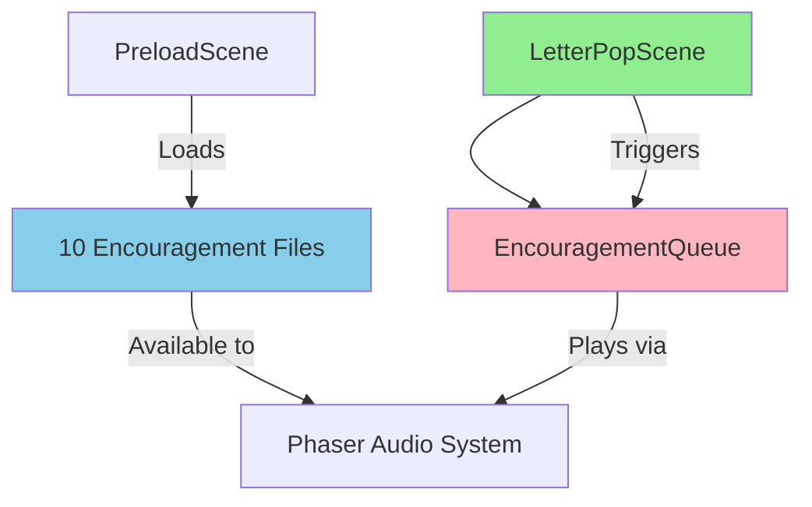

## Encouragement Audio Sequence Diagram

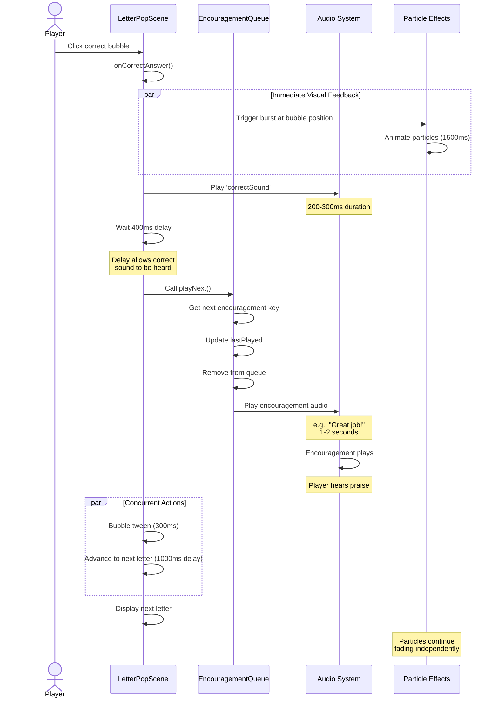

## EncouragementQueue Class Diagram

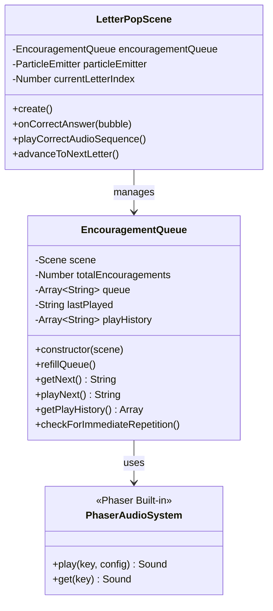

## Queue Refill Algorithm Flow

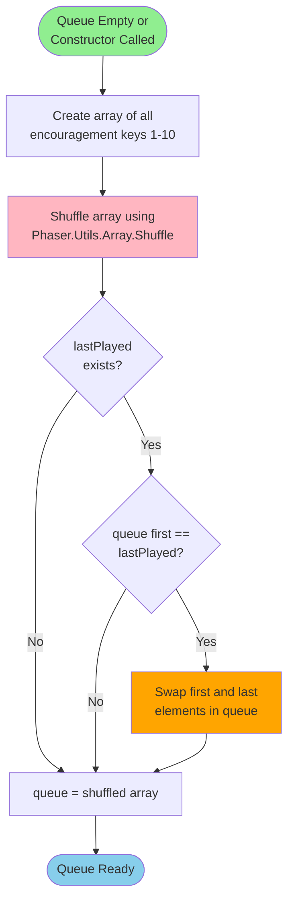

## Get Next Encouragement Flow

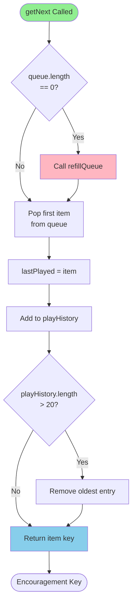

## Audio Timing Coordination Diagram

```mermaid
gantt
    title Audio Playback Timeline
    dateFormat X
    axisFormat %L ms

    section Immediate
    Correct Sound Plays       :0, 300ms

    section Delayed
    Delay Period              :300, 400ms
    Encouragement Plays       :400, 1800ms

    section Visual
    Particle Burst            :0, 1500ms
    Bubble Tween              :0, 300ms
    Next Letter Delay         :800, 1800ms
    Next Letter Displays      :1800, 1800ms
```

## Audio Loading Sequence Diagram

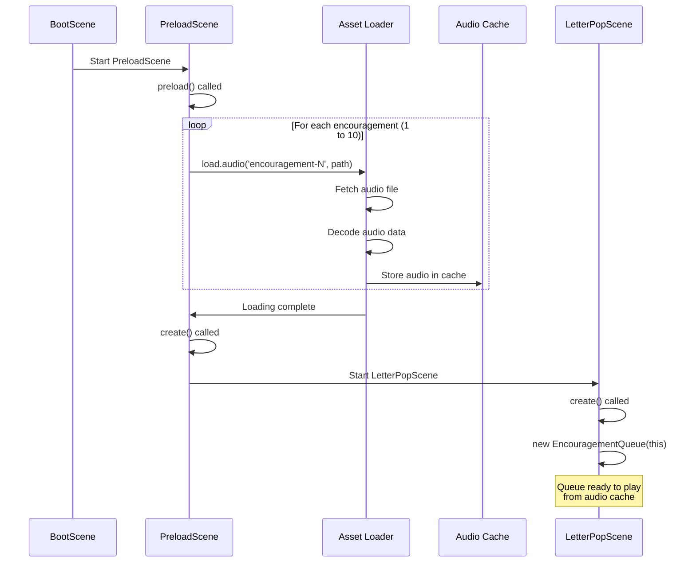

## Queue State Machine

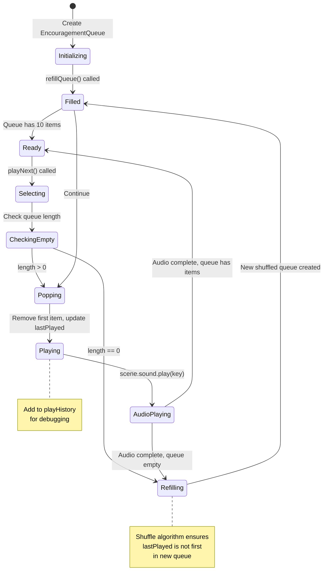

## Audio Event Timing Flow (Advanced)

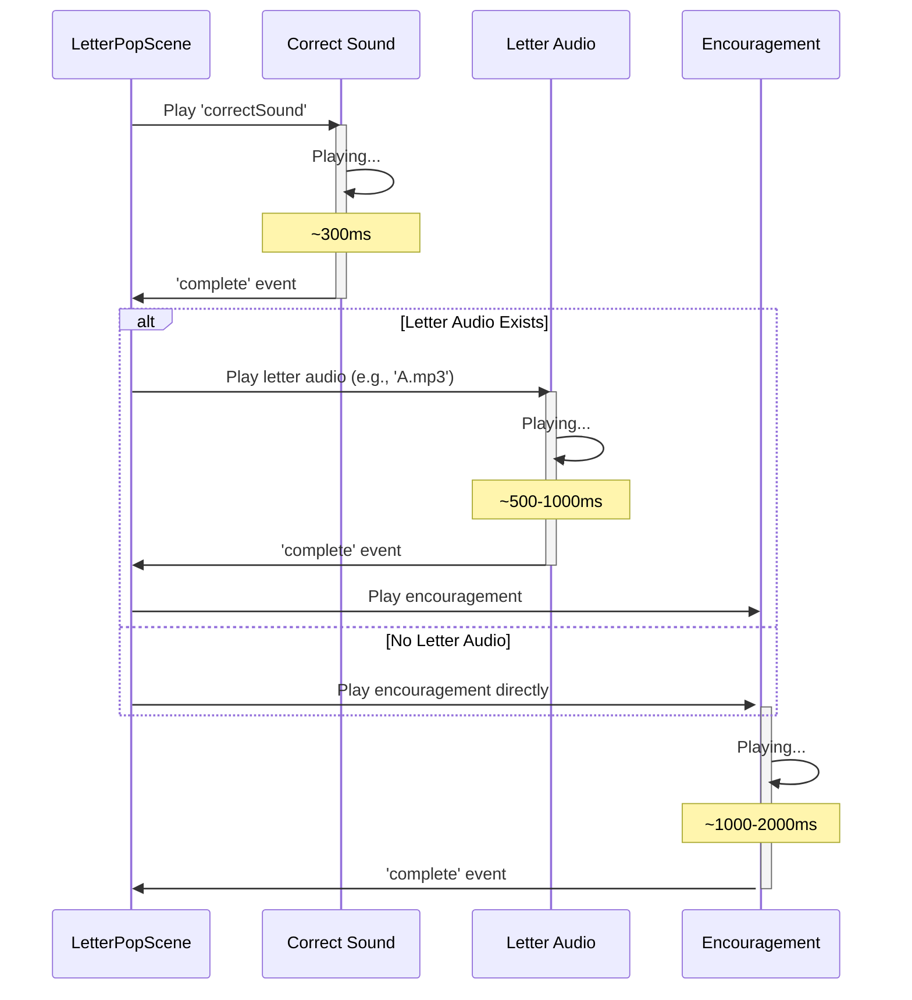

## Simple Timing Flow (Delay-Based)

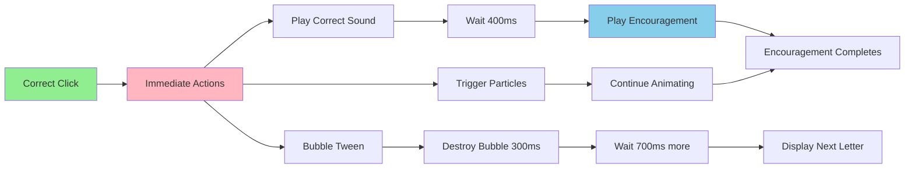

## Variety Distribution Diagram

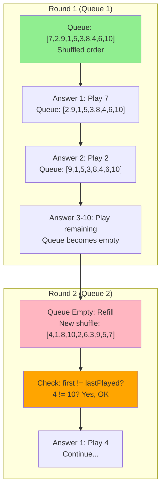

## Anti-Repetition Logic

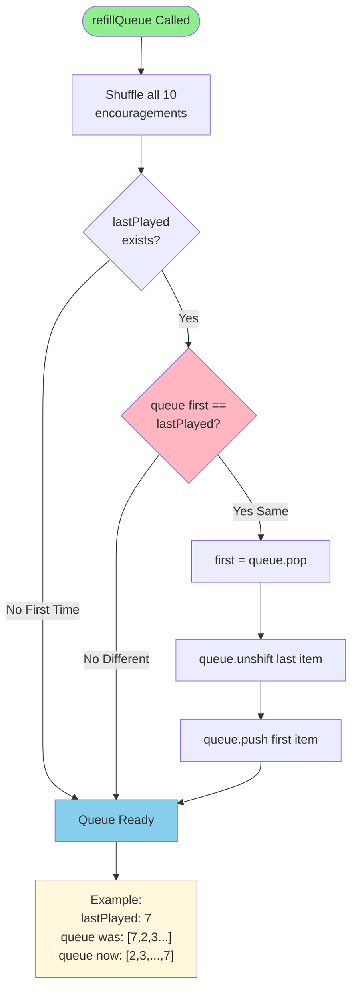

## Play History Tracking

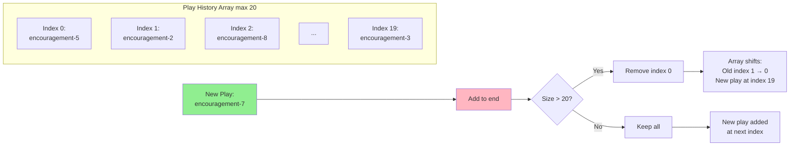

## Integration with Particle Effects

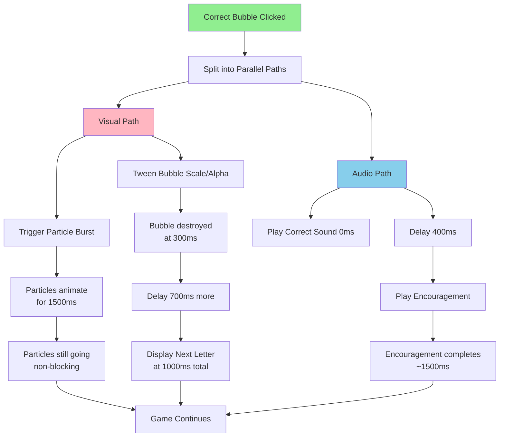

## Volume and Audio Mixing

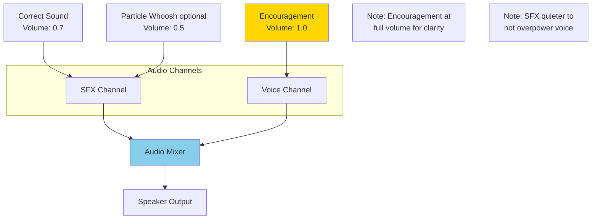

## Testing Flow Diagram

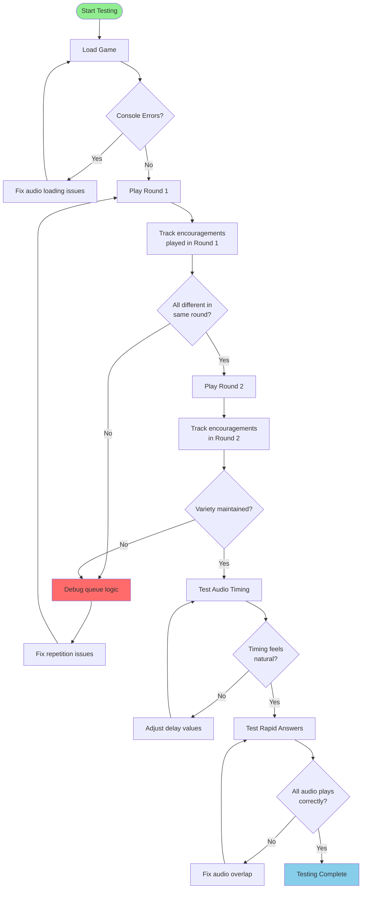

## Data Structure Visualization

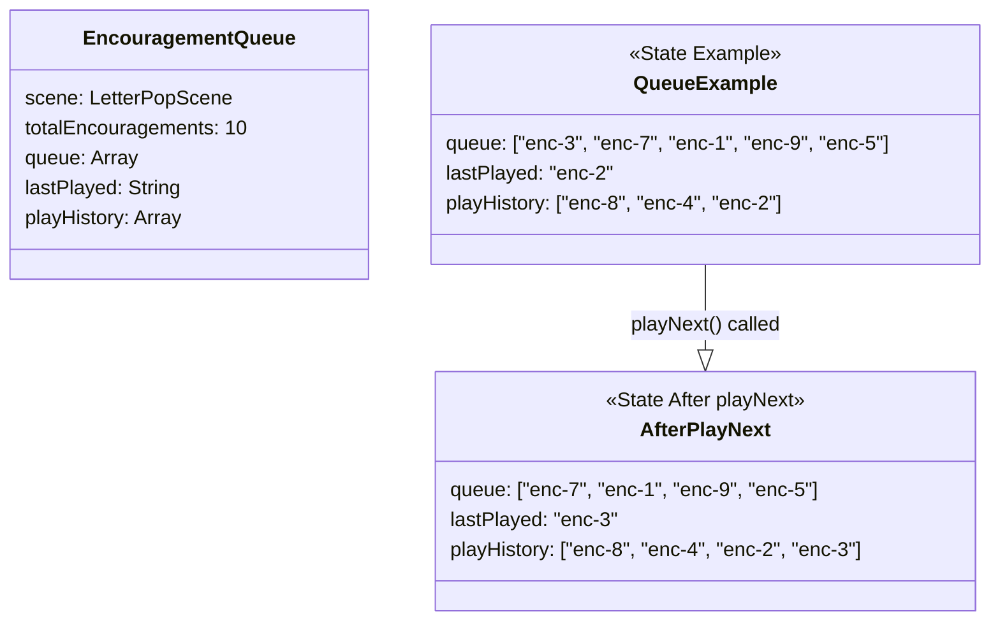

## Notes

### Why This Architecture?

**Queue System Benefits**
- Ensures all 10 encouragements are used before repeating
- Shuffle provides randomness within fairness
- Anti-repetition logic prevents back-to-back same encouragement
- Simple and predictable behavior

**Delayed Encouragement**
- 400ms delay allows correct sound to be heard first
- Prevents audio soup (too many sounds at once)
- Creates natural, non-rushed feeling
- Player can process each audio element

**Play History Tracking**
- Useful for debugging and testing
- Can verify variety over many plays
- Helps detect repetition bugs
- Limited to 20 entries to prevent memory bloat

**Parallel Visual/Audio**
- Particles trigger immediately (visual priority)
- Audio follows natural sequence
- Particle animation doesn't wait for audio
- Creates rich, multi-sensory experience

### Performance Considerations

**Memory Management**
- All 10 audio files loaded once at startup
- Cached in Phaser audio system
- Queue only stores keys (strings), not audio data
- Minimal memory overhead for queue system

**Audio Decoding**
- Audio pre-decoded during loading screen
- No runtime decoding lag
- Playback is instant when triggered
- Important for responsive feedback

### Design Decisions

**Fixed Delay vs Event Listeners**
- Simple 400ms delay is reliable and predictable
- Event listeners more complex but more accurate
- For this use case, delay is sufficient
- Can switch to events if letter audio added later

**Queue Size = Total Encouragements**
- Each round could use all 10 encouragements
- Ensures maximum variety within round
- Refills automatically for next round
- Fair distribution of all phrases

**No Negative Encouragement**
- Incorrect answers get no verbal feedback
- Positive reinforcement only
- Builds confidence, doesn't punish
- ADHD-friendly approach

### What This Phase Achieves

1. **Verbal Positive Reinforcement**: Aurora hears praise on every correct answer
2. **Variety**: 10 different phrases prevent habituation
3. **Natural Timing**: Audio flows smoothly without overlap
4. **Emotional Support**: Creates encouraging, safe environment
5. **Engagement**: Varied audio maintains interest over time
6. **Confidence Building**: Consistent praise builds self-esteem
7. **ADHD Optimization**: Frequent, varied rewards maintain dopamine
8. **Personalization Ready**: System supports custom user audio

This phase transforms the game from purely visual feedback into a warm, emotionally supportive experience that makes Aurora feel celebrated and encouraged throughout her learning journey.
