# Phase 17: ProgressManager Service - UML

## Class Diagram

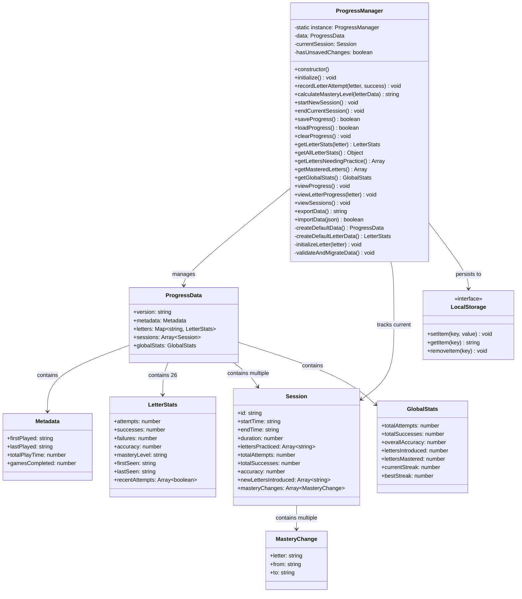

## Data Structure Diagram

```mermaid
graph TB
    PD[ProgressData]

    PD --> Version["version: '1.0.0'"]
    PD --> Meta[Metadata]
    PD --> Letters[Letters Map]
    PD --> Sessions[Sessions Array]
    PD --> Global[GlobalStats]

    Meta --> FirstPlayed["firstPlayed: ISO timestamp"]
    Meta --> LastPlayed["lastPlayed: ISO timestamp"]
    Meta --> TotalTime["totalPlayTime: milliseconds"]
    Meta --> GamesComp["gamesCompleted: number"]

    Letters --> LetterA["'a': LetterStats"]
    Letters --> LetterB["'b': LetterStats"]
    Letters --> LetterZ["'z': LetterStats"]

    LetterA --> Attempts["attempts: 15"]
    LetterA --> Successes["successes: 12"]
    LetterA --> Failures["failures: 3"]
    LetterA --> Accuracy["accuracy: 80.00"]
    LetterA --> Mastery["masteryLevel: 'proficient'"]
    LetterA --> FirstSeen["firstSeen: ISO timestamp"]
    LetterA --> LastSeen["lastSeen: ISO timestamp"]
    LetterA --> Recent["recentAttempts: [T,T,F,T,T,T,T,F,T,T]"]

    Sessions --> Sess1[Session 1]
    Sessions --> Sess2[Session 2]
    Sessions --> SessN[Session N]

    Sess1 --> SessID["id: 'session_1697123456789'"]
    Sess1 --> Start["startTime: ISO timestamp"]
    Sess1 --> End["endTime: ISO timestamp"]
    Sess1 --> Duration["duration: 900000ms"]
    Sess1 --> Practiced["lettersPracticed: ['a','b','c']"]
    Sess1 --> SessAttempts["totalAttempts: 20"]
    Sess1 --> SessSuccess["totalSuccesses: 16"]
    Sess1 --> SessAcc["accuracy: 80"]
    Sess1 --> NewLetters["newLettersIntroduced: ['c']"]
    Sess1 --> Changes["masteryChanges: [...]"]

    Global --> TotalAtt["totalAttempts: 150"]
    Global --> TotalSucc["totalSuccesses: 120"]
    Global --> OverallAcc["overallAccuracy: 80.00"]
    Global --> LettersIntro["lettersIntroduced: 12"]
    Global --> LettersMast["lettersMastered: 3"]
    Global --> CurrStreak["currentStreak: 5"]
    Global --> BestStreak["bestStreak: 15"]

    style PD fill:#4A90E2
    style Letters fill:#7ED321
    style Global fill:#F5A623
    style Sessions fill:#BD10E0
    style Meta fill:#50E3C2
```

## Sequence Diagram: Recording Letter Attempt

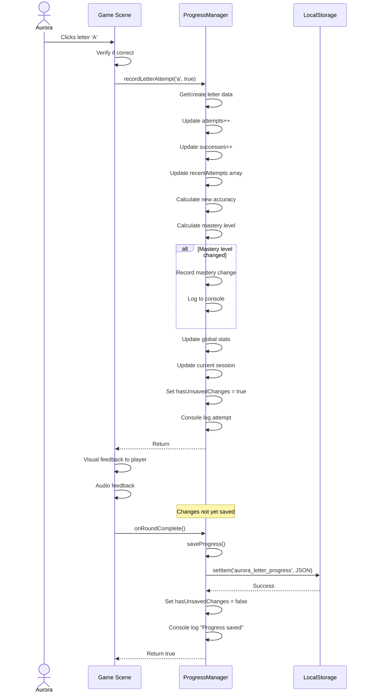

## Sequence Diagram: Game Initialization

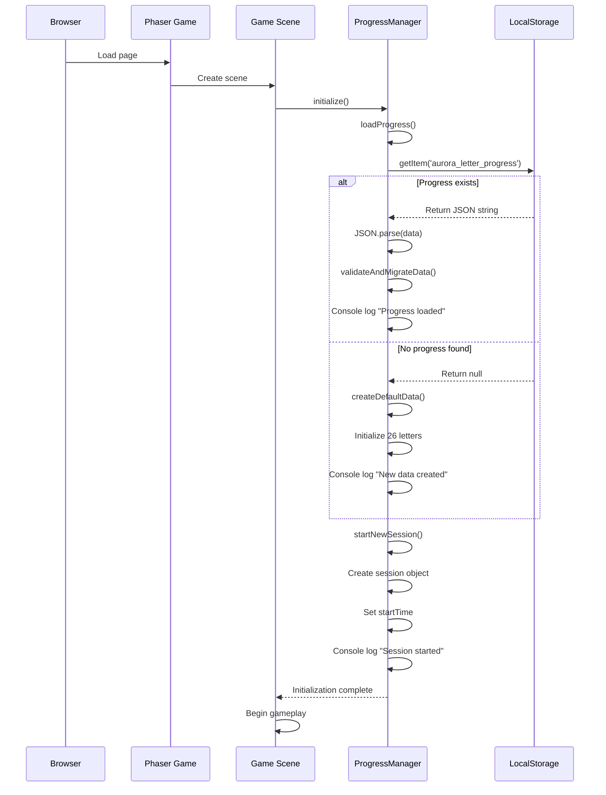

## Sequence Diagram: Session Lifecycle

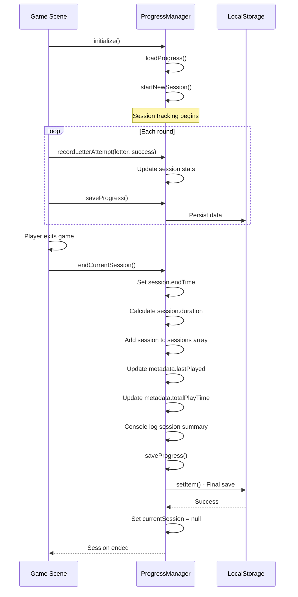

## State Diagram: Mastery Level Progression

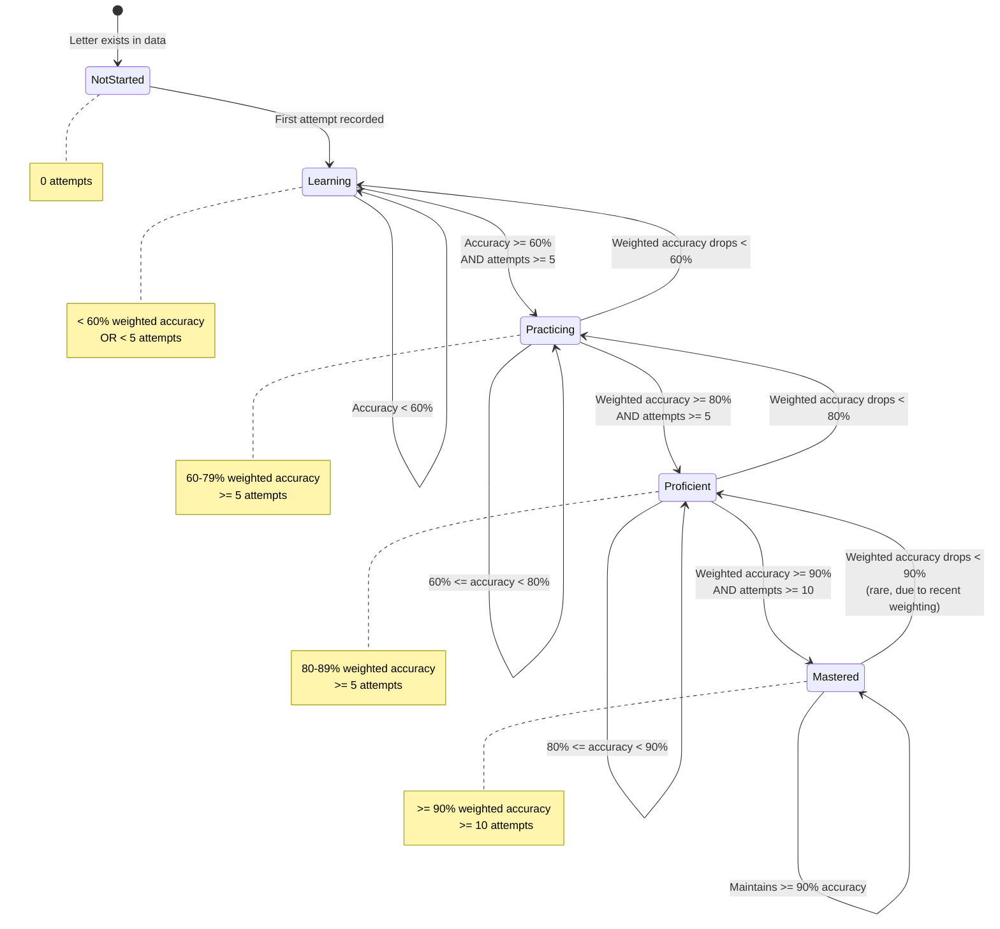

## Activity Diagram: saveProgress() Flow

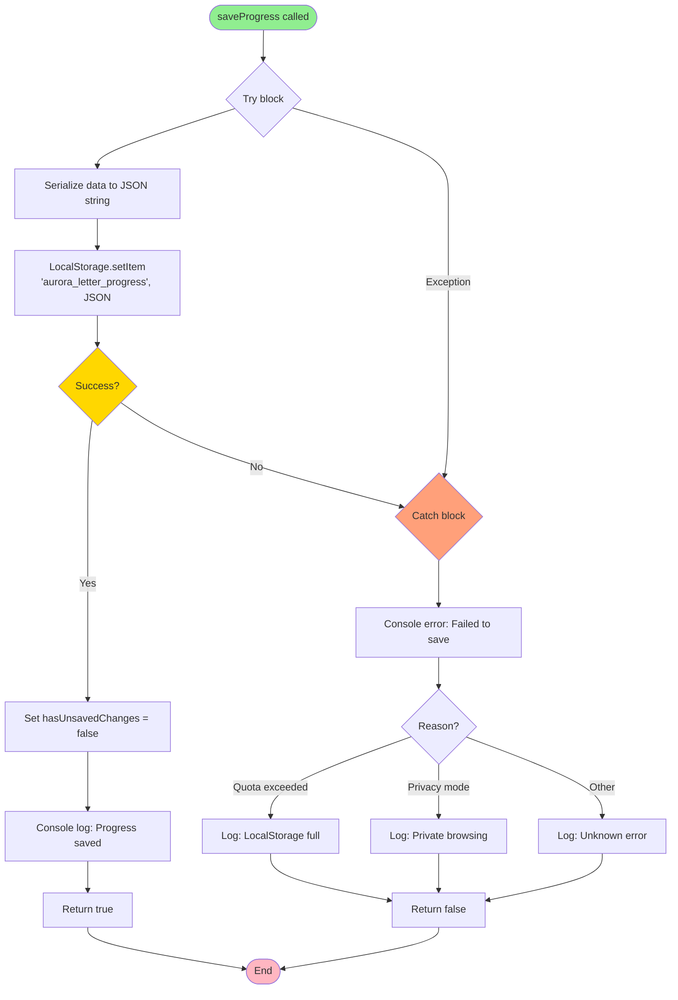

## Activity Diagram: calculateMasteryLevel() Algorithm

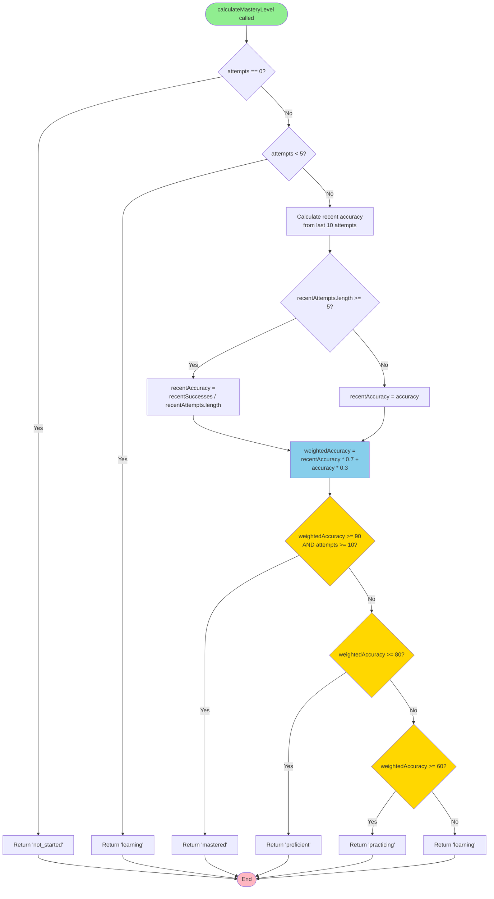

## Component Diagram

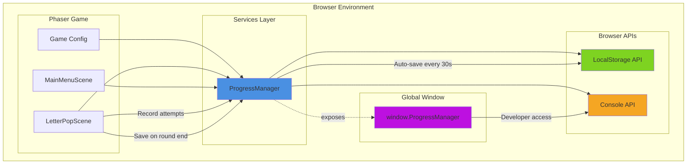

## Deployment Diagram

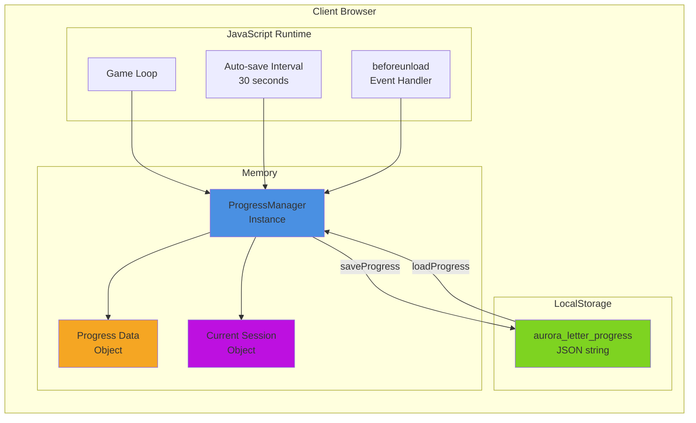

## Entity Relationship Diagram

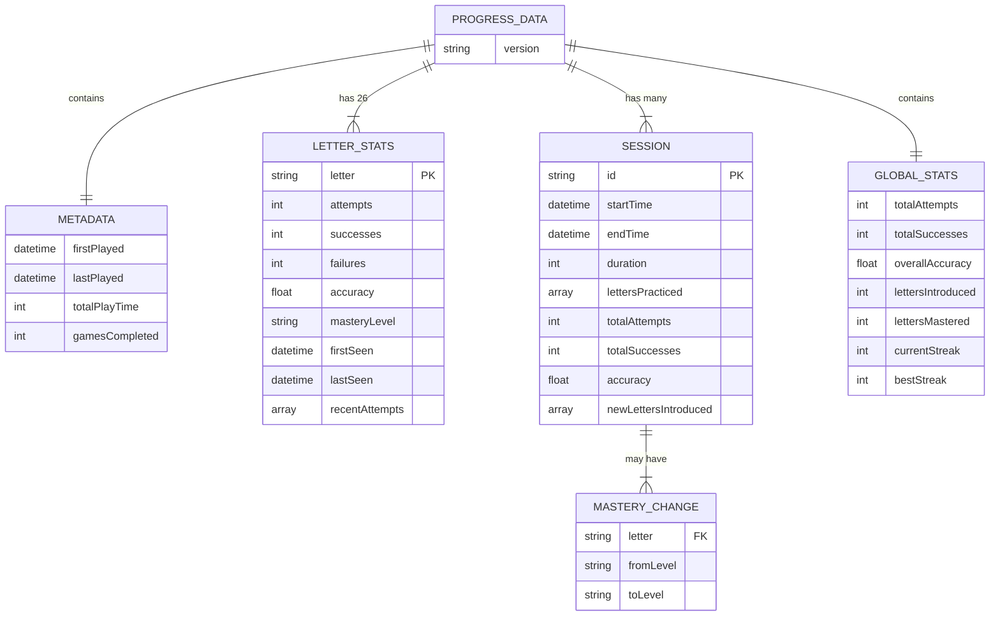

## Notes

### Architectural Decisions

**Singleton Pattern**
- Ensures only one ProgressManager exists globally
- Prevents data inconsistency from multiple instances
- Provides easy access via `window.ProgressManager`
- Thread-safe in single-threaded JavaScript environment

**Data Structure Design**
- Flat letter map for O(1) lookup by letter
- Session array for chronological history
- Recent attempts array capped at 10 for memory efficiency
- ISO timestamps for timezone-independent date handling

**Mastery Calculation Weighting**
- 70% recent performance, 30% overall performance
- Prevents "stuck" mastery levels from early struggles
- Encourages continued practice
- Recent attempts (last 10) given priority

**LocalStorage Strategy**
- Auto-save every 30 seconds to prevent data loss
- Manual save after each round for immediate persistence
- Save on page unload to capture session end
- Graceful degradation if LocalStorage unavailable

**Performance Considerations**
- Session history limited to prevent unbounded growth
- JSON serialization only on save (not on every mutation)
- Lazy loading - only load when game starts
- Console methods separate from core logic

### Scalability Notes

**Current Limitations:**
- 26 letters (English alphabet only)
- Session array grows indefinitely (consider cleanup)
- LocalStorage ~5-10MB limit (thousands of sessions)

**Future Enhancements:**
- Add session cleanup (keep last 100 sessions)
- Support multiple users/profiles
- Add data compression for large histories
- Implement cloud sync option
- Add analytics/insights methods
- Support multilingual alphabets

### Why This Architecture?

1. **Separation of Concerns**: Progress tracking isolated from game logic
2. **Testability**: Singleton can be mocked/reset for tests
3. **Developer Experience**: Console interface for debugging
4. **Data Integrity**: Validation and migration support
5. **Performance**: Efficient lookups, minimal serialization
6. **Reliability**: Auto-save, error handling, data recovery
7. **Extensibility**: Easy to add new metrics or features

This design balances simplicity for Phase 17 while laying groundwork for future educational analytics and adaptive learning features.
