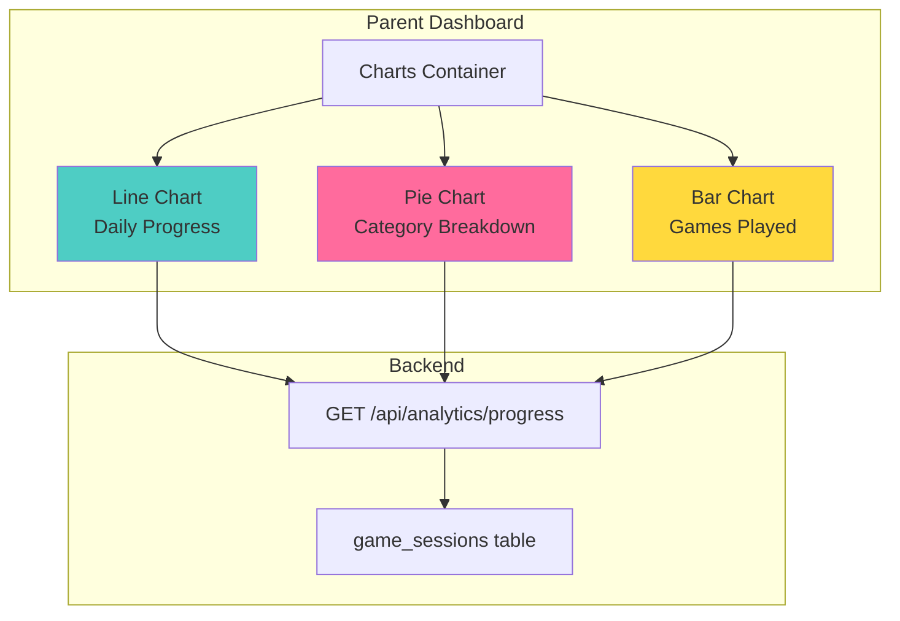

# Phase 17: Architecture Diagrams

**Project:** ADHDLearn.com
**Phase:** 17 of 36
**Last Updated:** October 22, 2025

---

## Chart.js Integration

```mermaid
graph TB
    subgraph "Parent Dashboard"
        ChartContainer[Charts Container]
        LineChart[Line Chart<br/>Daily Progress]
        PieChart[Pie Chart<br/>Category Breakdown]
        BarChart[Bar Chart<br/>Games Played]
    end
    
    subgraph "Backend"
        AnalyticsAPI[GET /api/analytics/progress]
        GameSessions[game_sessions table]
    end
    
    ChartContainer --> LineChart
    ChartContainer --> PieChart
    ChartContainer --> BarChart
    
    LineChart --> AnalyticsAPI
    PieChart --> AnalyticsAPI
    BarChart --> AnalyticsAPI
    
    AnalyticsAPI --> GameSessions
    
    style LineChart fill:#4ECDC4
    style PieChart fill:#FF6B9D
    style BarChart fill:#FFD93D
```

---

