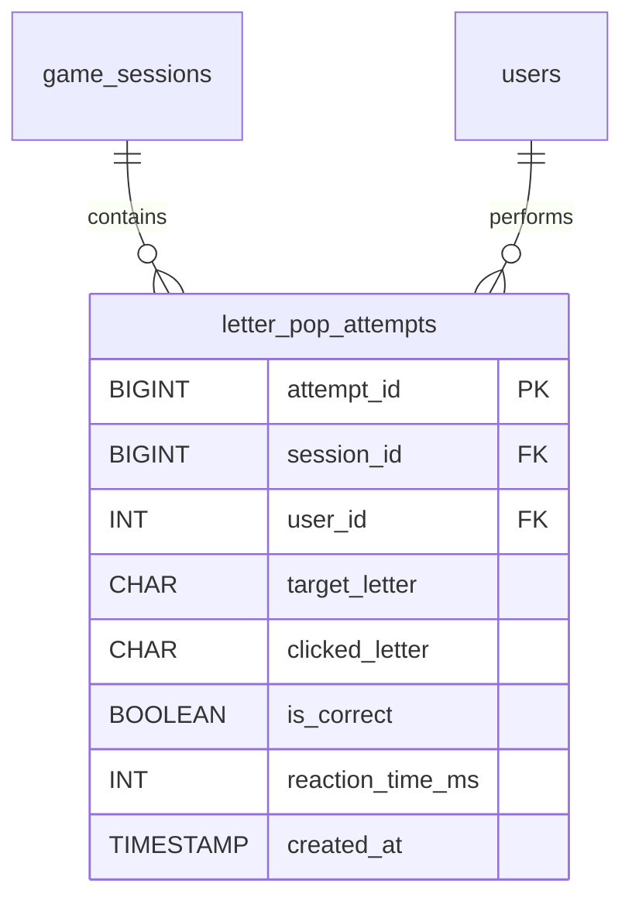
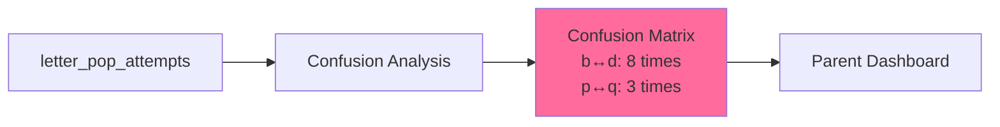

# Phase 18: Architecture Diagrams

**Project:** ADHDLearn.com
**Phase:** 18 of 36
**Last Updated:** October 22, 2025

---

## Letter Confusion Tracking

```mermaid
erDiagram
    game_sessions ||--o{ letter_pop_attempts : contains
    users ||--o{ letter_pop_attempts : performs
    
    letter_pop_attempts {
        BIGINT attempt_id PK
        BIGINT session_id FK
        INT user_id FK
        CHAR target_letter
        CHAR clicked_letter
        BOOLEAN is_correct
        INT reaction_time_ms
        TIMESTAMP created_at
    }
```

## Confusion Analysis Flow

```mermaid
graph LR
    Attempts[letter_pop_attempts] --> Analyze[Confusion Analysis]
    Analyze --> Matrix[Confusion Matrix<br/>b↔d: 8 times<br/>p↔q: 3 times]
    Matrix --> Dashboard[Parent Dashboard]
    
    style Matrix fill:#FF6B9D
```

---

