# Phase 18: Results Screen Enhancement - UML

## ResultsScene Class Diagram

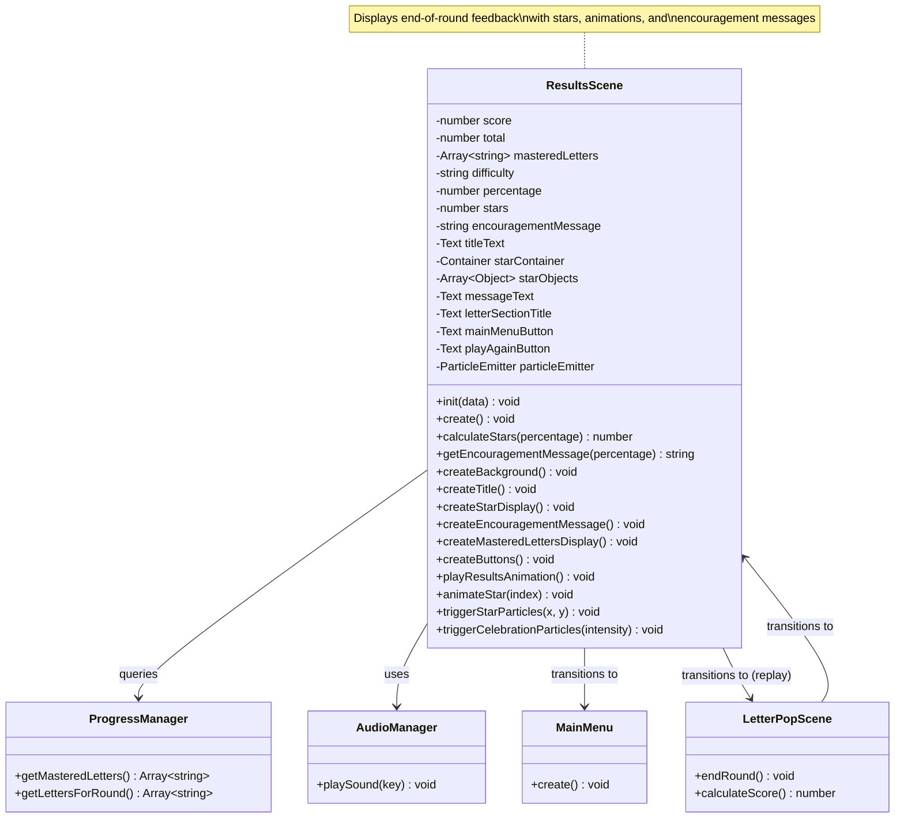

## Star Rating System Flow

```mermaid
flowchart TD
    Start([Round Ends]) --> CalcScore[Calculate Score<br/>correct / total]
    CalcScore --> CalcPercent[Calculate Percentage<br/>score * 100]
    CalcPercent --> CheckScore{Check<br/>Percentage}

    CheckScore -->|>= 90%| ThreeStars[Award 3 Stars<br/>Excellent]
    CheckScore -->|70-89%| TwoStars[Award 2 Stars<br/>Great Job]
    CheckScore -->|50-69%| OneStar[Award 1 Star<br/>Good Try]
    CheckScore -->|< 50%| OneStarEncourage[Award 1 Star<br/>Keep Practicing]

    ThreeStars --> SelectMsg3[Select Message:<br/>"Amazing! You're a<br/>letter master!"]
    TwoStars --> SelectMsg2[Select Message:<br/>"Great job! You're<br/>learning so much!"]
    OneStar --> SelectMsg1[Select Message:<br/>"Good work!<br/>Keep practicing!"]
    OneStarEncourage --> SelectMsg0[Select Message:<br/>"You're doing great!<br/>Try again!"]

    SelectMsg3 --> Display[Display Results]
    SelectMsg2 --> Display
    SelectMsg1 --> Display
    SelectMsg0 --> Display

    Display --> End([ResultsScene Created])

    style ThreeStars fill:#FFD700
    style TwoStars fill:#C0C0C0
    style OneStar fill:#CD7F32
    style OneStarEncourage fill:#CD7F32
```

## Scene Initialization Sequence

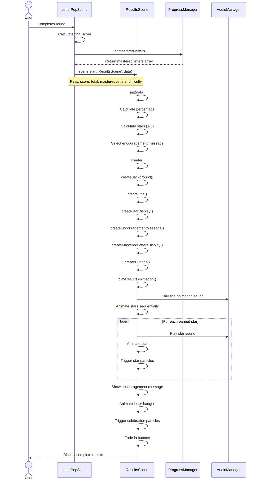

## Animation Timeline

```mermaid
gantt
    title Results Scene Animation Timeline
    dateFormat X
    axisFormat %Ls

    section Title
    Title fade in : 0, 500ms

    section Stars
    Star 1 animation : 800, 300ms
    Delay : 1100, 200ms
    Star 2 animation : 1300, 300ms
    Delay : 1600, 200ms
    Star 3 animation : 1800, 300ms

    section Celebration
    Confetti burst (3 stars) : 1800, 500ms

    section Message
    Encouragement message : 1900, 500ms
    Letter section title : 1900, 300ms

    section Letters
    Letter badges stagger : 2000, 800ms

    section Buttons
    Buttons fade in : 2500, 500ms
```

## Star Animation Sequence

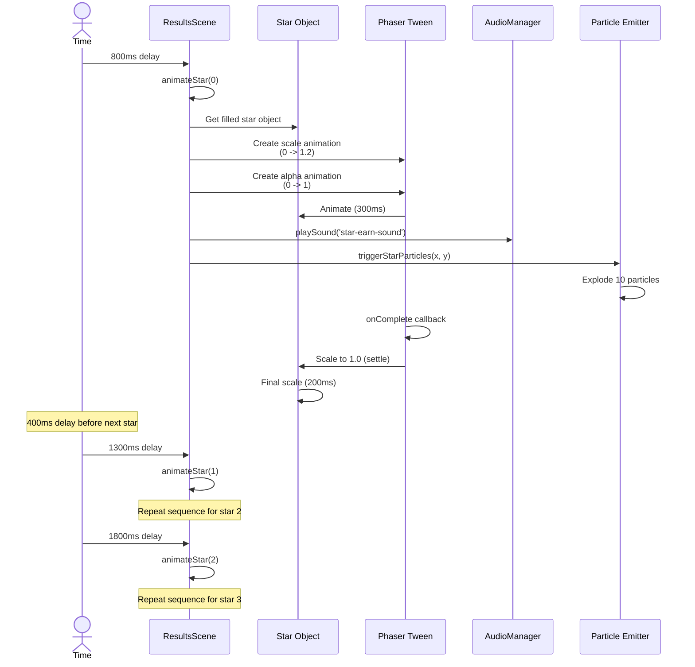

## Button Interaction Flow

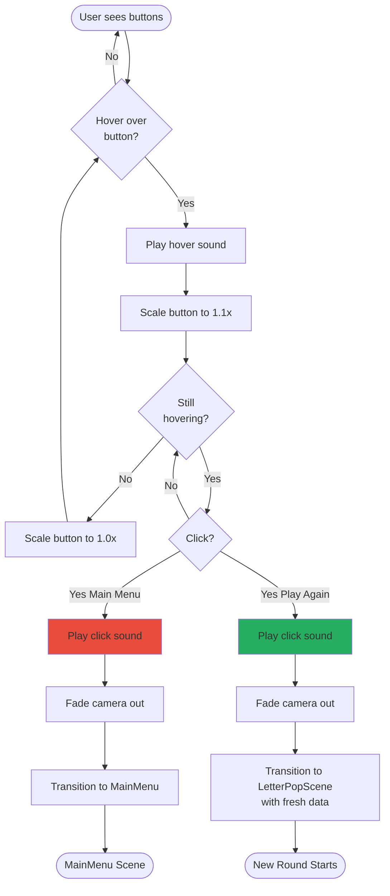

## Component Layering Diagram

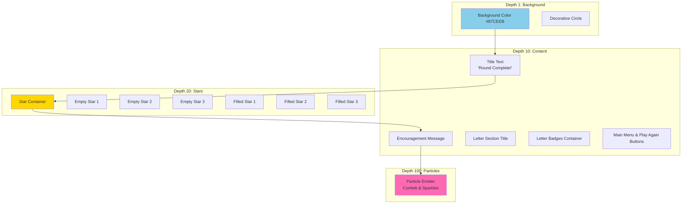

## Mastered Letters Display Flow

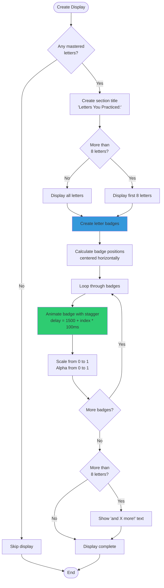

## State Diagram

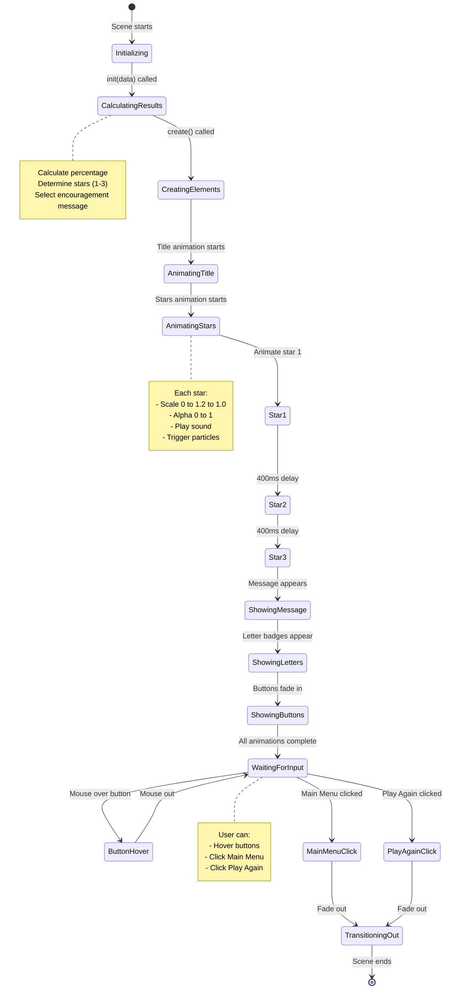

## Particle Effect Configuration

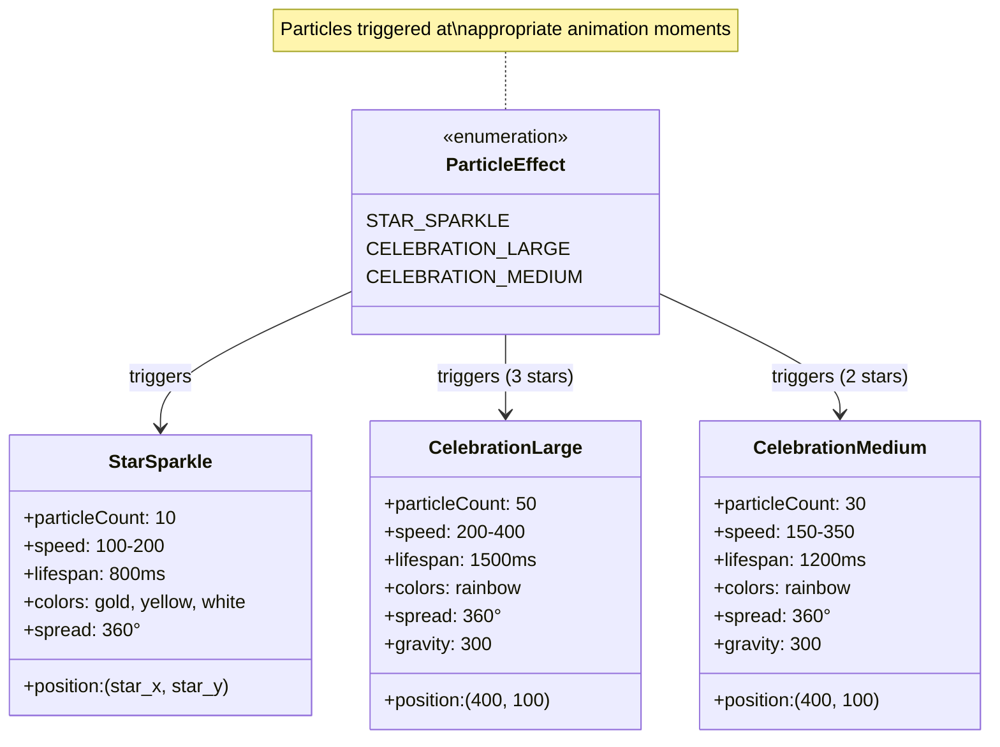

## Data Flow Diagram

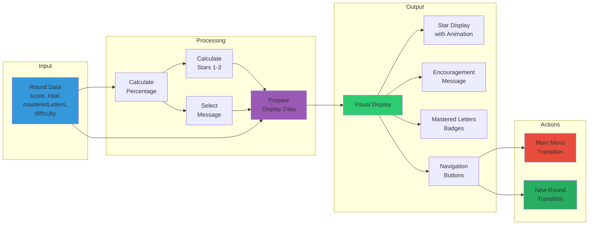

## Star Calculation Algorithm

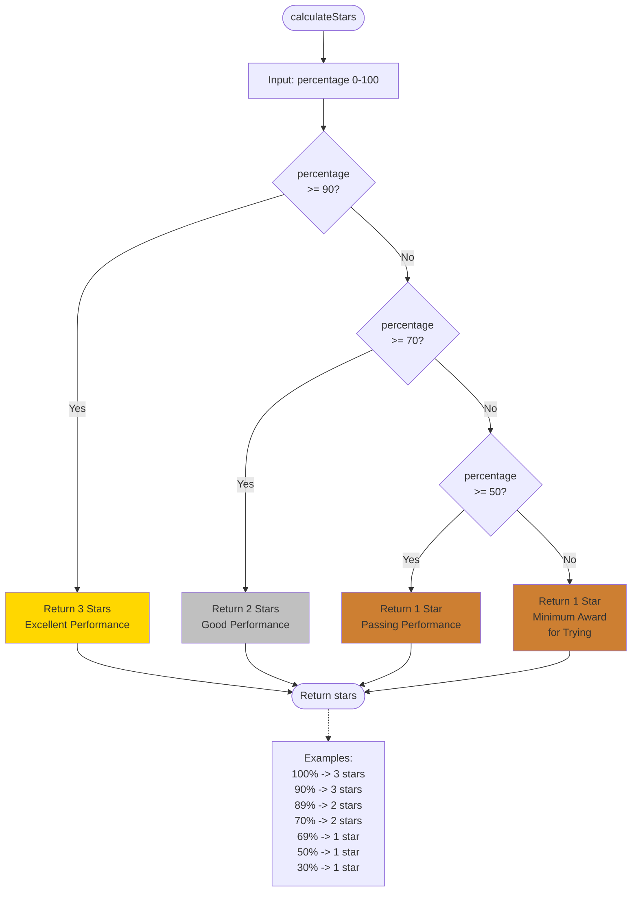

## Encouragement Message Selection

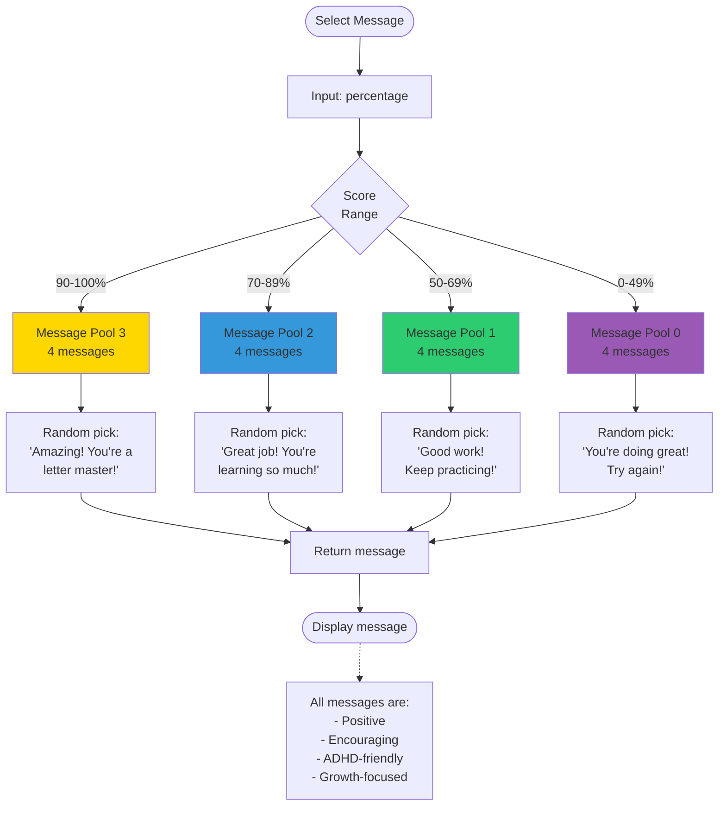

## Notes

### Design Decisions

**Star Rating System**
- Three clear thresholds (90%, 70%, 50%)
- Always at least 1 star to encourage children
- Gold color for stars (universally recognized as reward)
- Sequential animation builds anticipation and excitement

**Animation Timing**
- Total duration: ~2.5-3 seconds
- Not too fast (players can't appreciate)
- Not too slow (players get impatient)
- Sequential reveals maintain interest
- Stagger effects prevent visual overwhelm

**ADHD-Friendly Considerations**
- All messages positive (no shame or failure)
- Clear visual hierarchy (easy to scan)
- Immediate feedback (appears right after round)
- Celebration particles (dopamine reward)
- Prominent "Play Again" (encourages continued engagement)
- No punishment for low scores (always encouraged)

**Button Design**
- Large, clearly labeled buttons
- Visual feedback on hover
- Audio feedback on click
- "Play Again" uses green (positive, encouraging)
- "Main Menu" uses red (stop, return)
- Equal prominence (player choice respected)

**Performance Optimization**
- Particle count limited (30-50 max)
- Tweens used efficiently (built-in pooling)
- Text objects reused when possible
- Cleanup in shutdown method
- Depth layers minimize overdraw

### What This Phase Enables

1. **Clear Feedback**: Players understand their performance
2. **Positive Reinforcement**: Stars and messages reward effort
3. **Progress Visualization**: Mastered letters show learning
4. **Replayability**: Easy to start another round
5. **Emotional Design**: Celebrations feel good and encourage continuation
6. **ADHD Support**: Clear, positive, immediate feedback loop

This results screen transforms the end of a round from a simple "you're done" into a celebration of learning and encouragement to keep playing.
