# Phase 19: Difficulty Levels - UML

## Difficulty System Class Diagram

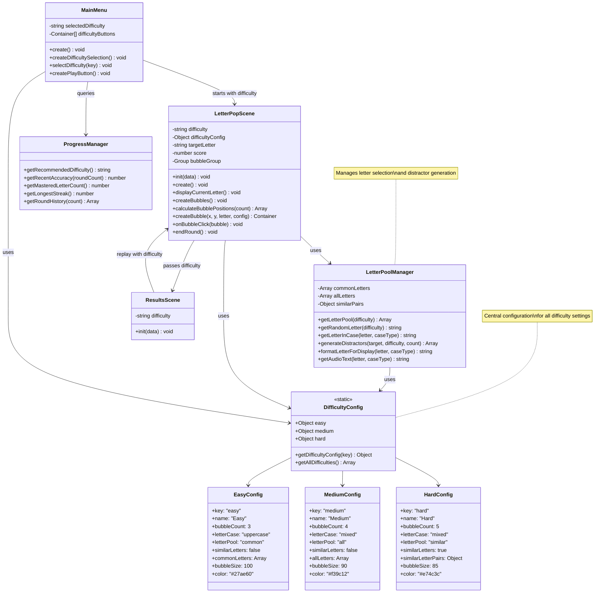

## Difficulty Recommendation Flow

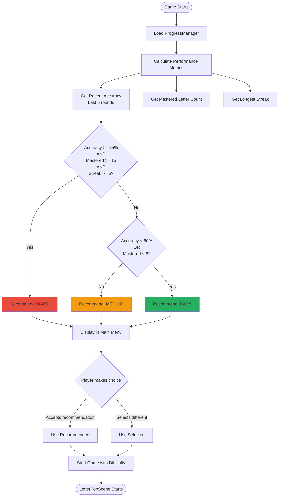

## Letter Pool Selection Flow

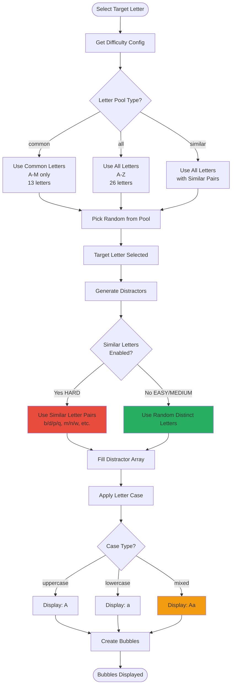

## Distractor Generation Algorithm

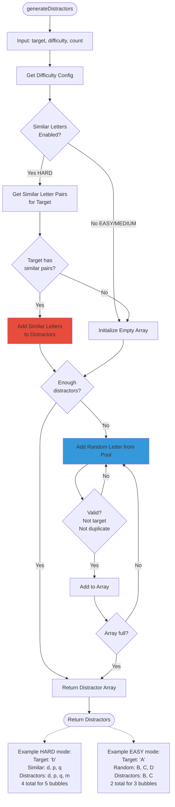

## Bubble Positioning Algorithm

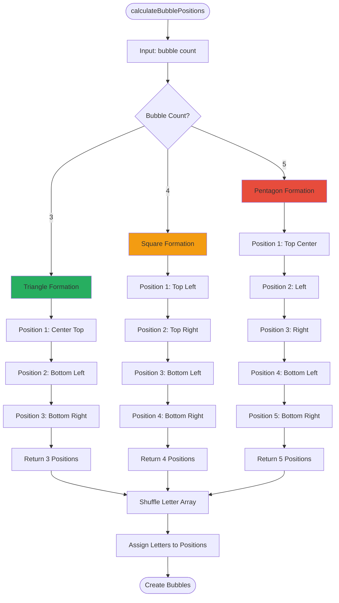

## Difficulty Selection Sequence

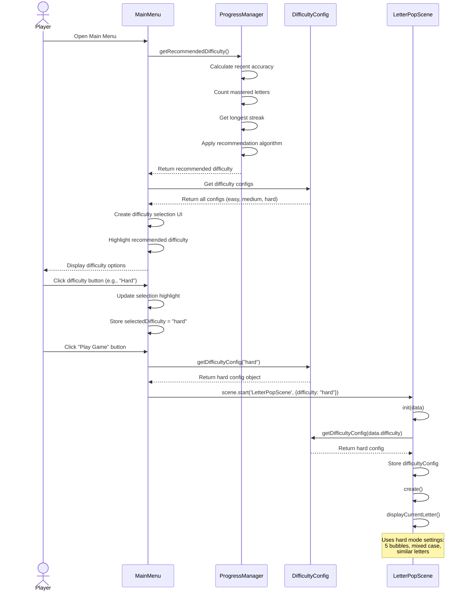

## Game Flow with Difficulty

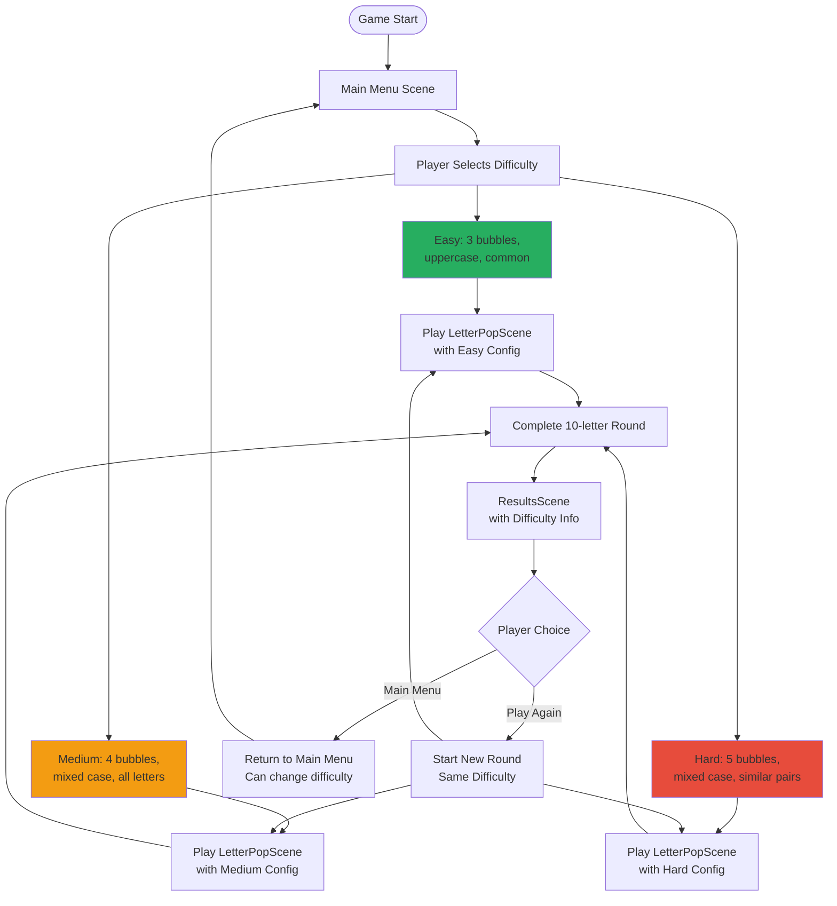

## Similar Letter Pairs Mapping

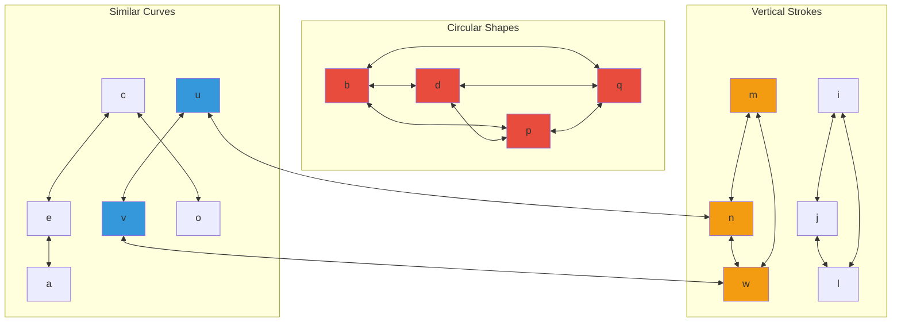

## Difficulty Configuration State

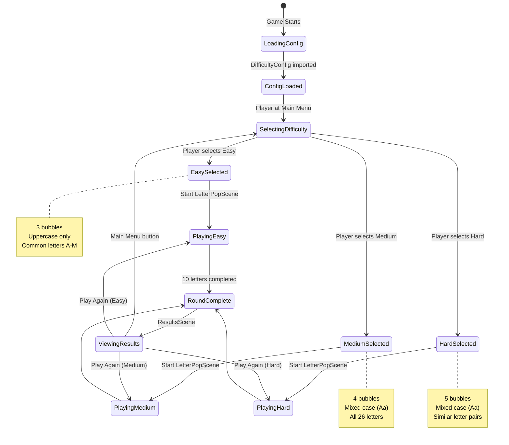

## Letter Case Display Diagram

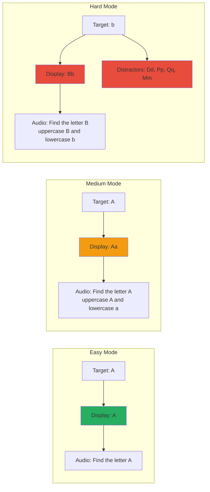

## Bubble Layout Visualizations

```mermaid
graph TD
    subgraph "Easy: 3 Bubbles (Triangle)"
        E_Center[Bubble 1<br/>Top Center]
        E_Left[Bubble 2<br/>Bottom Left]
        E_Right[Bubble 3<br/>Bottom Right]

        E_Center -.spacing: 150px.-> E_Left
        E_Center -.spacing: 150px.-> E_Right
    end

    subgraph "Medium: 4 Bubbles (Square)"
        M_TL[Bubble 1<br/>Top Left]
        M_TR[Bubble 2<br/>Top Right]
        M_BL[Bubble 3<br/>Bottom Left]
        M_BR[Bubble 4<br/>Bottom Right]

        M_TL -.spacing: 130px.-> M_TR
        M_TL -.spacing: 130px.-> M_BL
        M_TR -.spacing: 130px.-> M_BR
        M_BL -.spacing: 130px.-> M_BR
    end

    subgraph "Hard: 5 Bubbles (Pentagon)"
        H_Top[Bubble 1<br/>Top Center]
        H_Left[Bubble 2<br/>Middle Left]
        H_Right[Bubble 3<br/>Middle Right]
        H_BL[Bubble 4<br/>Bottom Left]
        H_BR[Bubble 5<br/>Bottom Right]

        H_Top -.spacing: 110px.-> H_Left
        H_Top -.spacing: 110px.-> H_Right
        H_Left -.spacing: 110px.-> H_BL
        H_Right -.spacing: 110px.-> H_BR
    end

    style E_Center fill:#27ae60
    style E_Left fill:#27ae60
    style E_Right fill:#27ae60

    style M_TL fill:#f39c12
    style M_TR fill:#f39c12
    style M_BL fill:#f39c12
    style M_BR fill:#f39c12

    style H_Top fill:#e74c3c
    style H_Left fill:#e74c3c
    style H_Right fill:#e74c3c
    style H_BL fill:#e74c3c
    style H_BR fill:#e74c3c
```

## Performance Metrics Flow

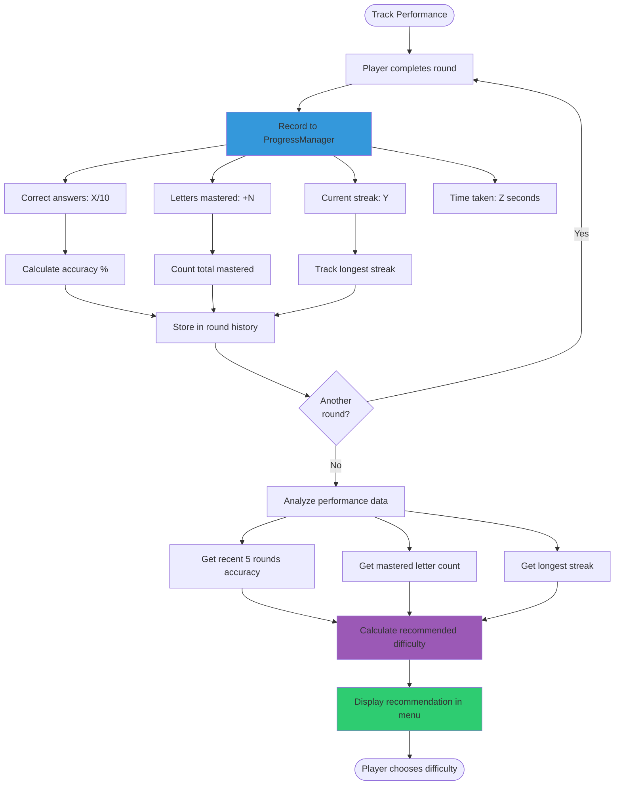

## Data Flow Diagram

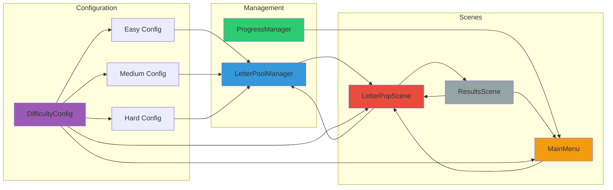

## Notes

### Design Decisions

**Three Difficulty Levels**
- Easy: Builds confidence with simple challenges
- Medium: Standard gameplay for most players
- Hard: Advanced challenge for mastery

**Progressive Challenge**
- Bubble count increases (3 → 4 → 5)
- Letter pool expands (common → all → similar)
- Case complexity increases (uppercase → mixed → mixed)
- Visual difficulty increases (distinct → varied → similar)

**Recommendation Algorithm**
- Multiple factors: accuracy, mastery, streaks
- Conservative thresholds (won't recommend too hard too soon)
- Player choice always respected (can override)
- Updates based on ongoing performance

**Similar Letter Pairs (Hard Mode)**
- b/d/p/q: Classic confusion for young readers
- m/n/w: Similar stroke patterns
- u/v: Similar curve shapes
- Developmentally appropriate challenge
- Helps develop visual discrimination skills

**Mixed Case Display**
- Shows both uppercase and lowercase together
- Essential for reading readiness
- Format: "Aa" (side-by-side)
- Audio clarifies both forms
- Teaches letter recognition in both cases

**Bubble Positioning**
- Spacing adjusts with count (more bubbles = tighter)
- Geometric patterns (triangle, square, pentagon)
- All bubbles visible and accessible
- No overlap or off-screen placement
- Maintains visual clarity

### ADHD-Friendly Considerations

**Appropriate Challenge**
- Not too easy (prevents boredom)
- Not too hard (prevents frustration)
- Player can adjust to their comfort level
- Success always achievable

**Clear Progression**
- Visual difference between difficulties (color, icons)
- Can see growth as they advance
- Moving up feels like an achievement
- Moving down is presented positively

**Player Agency**
- Recommendation is optional
- Can choose any difficulty
- Can change at any time
- No judgment for choosing easier

**Immediate Feedback**
- Difficulty change takes effect right away
- No waiting or unlocking required
- Can experiment freely

### What This Phase Enables

1. **Personalized Challenge**: Each player finds their optimal difficulty
2. **Natural Progression**: Can advance as skills improve
3. **Sustained Engagement**: Appropriate challenge prevents boredom
4. **Skill Development**: Hard mode builds advanced visual discrimination
5. **Reading Readiness**: Mixed case prepares for actual reading
6. **Confidence Building**: Success at appropriate level builds self-efficacy

This difficulty system ensures every child can enjoy the game at their own pace while being gently challenged to grow.
