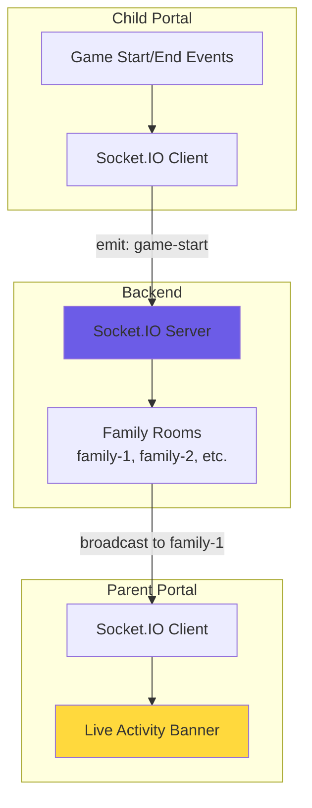
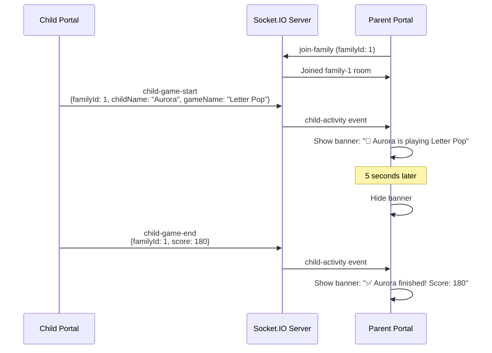

# Phase 19: Architecture Diagrams

**Project:** ADHDLearn.com
**Phase:** 19 of 36
**Last Updated:** October 22, 2025

---

## Socket.IO Implementation

```mermaid
graph TB
    subgraph "Child Portal"
        ChildGame[Game Start/End Events]
        ChildSocket[Socket.IO Client]
    end
    
    subgraph "Backend"
        SocketServer[Socket.IO Server]
        FamilyRooms[Family Rooms<br/>family-1, family-2, etc.]
    end
    
    subgraph "Parent Portal"
        ParentSocket[Socket.IO Client]
        LiveBanner[Live Activity Banner]
    end
    
    ChildGame --> ChildSocket
    ChildSocket -->|emit: game-start| SocketServer
    SocketServer --> FamilyRooms
    FamilyRooms -->|broadcast to family-1| ParentSocket
    ParentSocket --> LiveBanner
    
    style SocketServer fill:#6C5CE7
    style LiveBanner fill:#FFD93D
```

## WebSocket Message Flow

```mermaid
sequenceDiagram
    participant Child as Child Portal
    participant Server as Socket.IO Server
    participant Parent as Parent Portal
    
    Parent->>Server: join-family (familyId: 1)
    Server->>Parent: Joined family-1 room
    
    Child->>Server: child-game-start<br/>{familyId: 1, childName: "Aurora", gameName: "Letter Pop"}
    Server->>Parent: child-activity event
    Parent->>Parent: Show banner: "🔴 Aurora is playing Letter Pop"
    
    Note over Parent: 5 seconds later
    Parent->>Parent: Hide banner
    
    Child->>Server: child-game-end<br/>{familyId: 1, score: 180}
    Server->>Parent: child-activity event
    Parent->>Parent: Show banner: "✅ Aurora finished! Score: 180"
```

---

