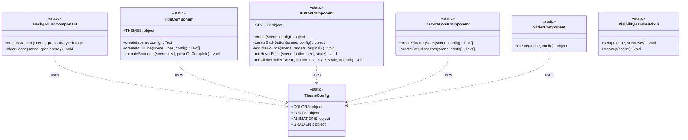
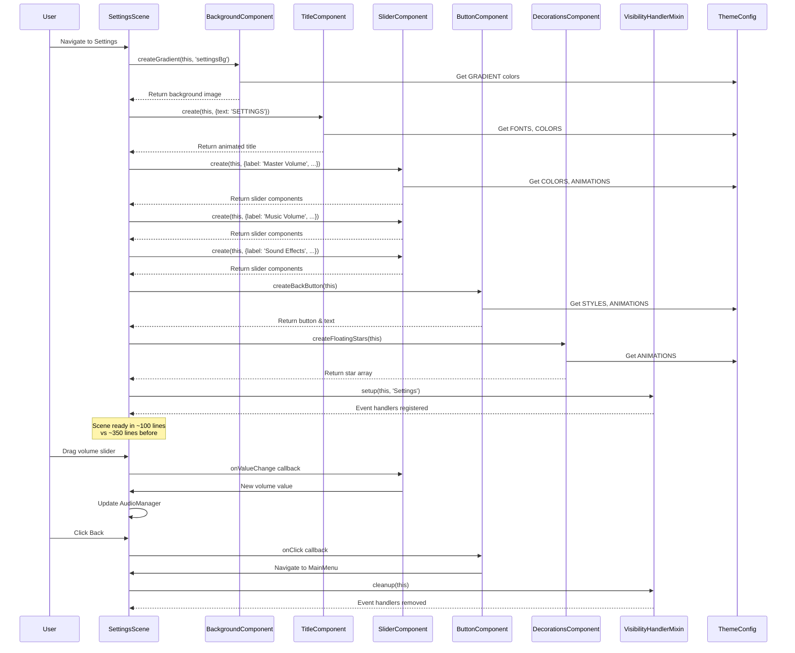
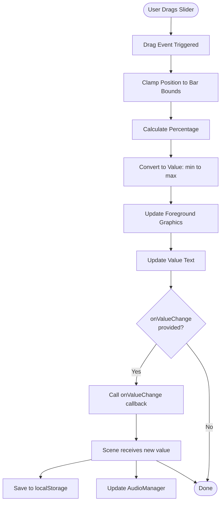
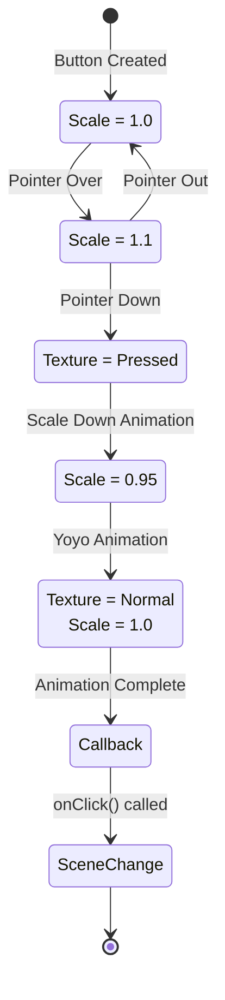
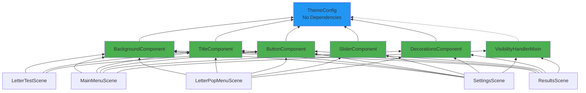
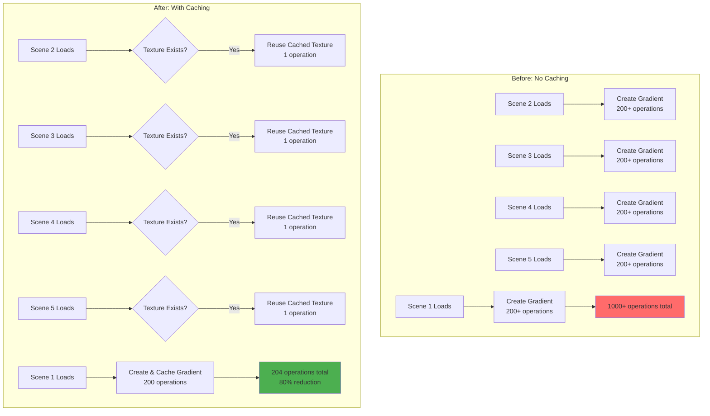

# Phase 2.6: UML Diagrams

## Component Architecture Overview

This document provides visual representations of the refactored component architecture using Mermaid diagrams.

---

## 1. Component Class Diagram

Shows the structure of all new components and their relationships.

---

## 2. Scene Architecture - Before vs After

### Before Refactoring

```mermaid
graph TD
    MainMenuScene[MainMenuScene<br/>~650 lines]
    SettingsScene[SettingsScene<br/>~350 lines]
    LetterPopMenuScene[LetterPopMenuScene<br/>~565 lines]
    ResultsScene[ResultsScene<br/>~400 lines]
    LetterTestScene[LetterTestScene<br/>~235 lines]

    MainMenuScene --> |"Duplicates 200+ lines"|Background1[Background Code]
    MainMenuScene --> |"Duplicates 100+ lines"|Title1[Title Code]
    MainMenuScene --> |"Duplicates 80+ lines"|Button1[Button Code]
    MainMenuScene --> |"Duplicates 40+ lines"|Stars1[Stars Code]

    SettingsScene --> |"Duplicates 200+ lines"|Background2[Background Code]
    SettingsScene --> |"Duplicates 100+ lines"|Title2[Title Code]
    SettingsScene --> |"Duplicates 140+ lines"|Slider1[Slider Code]
    SettingsScene --> |"Duplicates 40+ lines"|Stars2[Stars Code]

    LetterPopMenuScene --> |"Duplicates 200+ lines"|Background3[Background Code]
    LetterPopMenuScene --> |"Duplicates 100+ lines"|Title3[Title Code]
    LetterPopMenuScene --> |"Duplicates 140+ lines"|Slider2[Slider Code]

    ResultsScene --> |"Duplicates 200+ lines"|Background4[Background Code]
    ResultsScene --> |"Duplicates 40+ lines"|Stars3[Stars Code]

    LetterTestScene --> |"Duplicates 200+ lines"|Background5[Background Code]

    style Background1 fill:#ff6b6b
    style Background2 fill:#ff6b6b
    style Background3 fill:#ff6b6b
    style Background4 fill:#ff6b6b
    style Background5 fill:#ff6b6b
    style Title1 fill:#ff4081
    style Title2 fill:#ff4081
    style Title3 fill:#ff4081
    style Stars1 fill:#00e676
    style Stars2 fill:#00e676
    style Stars3 fill:#00e676
```

### After Refactoring

```mermaid
graph TD
    MainMenuScene[MainMenuScene<br/>~350 lines<br/>-46% reduction]
    SettingsScene[SettingsScene<br/>~100 lines<br/>-71% reduction]
    LetterPopMenuScene[LetterPopMenuScene<br/>~300 lines<br/>-47% reduction]
    ResultsScene[ResultsScene<br/>~250 lines<br/>-38% reduction]
    LetterTestScene[LetterTestScene<br/>~150 lines<br/>-36% reduction]

    %% All scenes use components
    MainMenuScene --> BackgroundComponent
    MainMenuScene --> TitleComponent
    MainMenuScene --> ButtonComponent
    MainMenuScene --> DecorationsComponent
    MainMenuScene --> VisibilityHandlerMixin

    SettingsScene --> BackgroundComponent
    SettingsScene --> TitleComponent
    SettingsScene --> ButtonComponent
    SettingsScene --> SliderComponent
    SettingsScene --> DecorationsComponent
    SettingsScene --> VisibilityHandlerMixin

    LetterPopMenuScene --> BackgroundComponent
    LetterPopMenuScene --> TitleComponent
    LetterPopMenuScene --> ButtonComponent
    LetterPopMenuScene --> SliderComponent
    LetterPopMenuScene --> DecorationsComponent

    ResultsScene --> BackgroundComponent
    ResultsScene --> TitleComponent
    ResultsScene --> ButtonComponent
    ResultsScene --> DecorationsComponent
    ResultsScene --> VisibilityHandlerMixin

    LetterTestScene --> BackgroundComponent
    LetterTestScene --> TitleComponent
    LetterTestScene --> ButtonComponent

    %% Components layer
    BackgroundComponent[BackgroundComponent<br/>Single Source]
    TitleComponent[TitleComponent<br/>Single Source]
    ButtonComponent[ButtonComponent<br/>Single Source]
    DecorationsComponent[DecorationsComponent<br/>Single Source]
    SliderComponent[SliderComponent<br/>Single Source]
    VisibilityHandlerMixin[VisibilityHandlerMixin<br/>Single Source]

    %% All components use theme
    BackgroundComponent --> ThemeConfig
    TitleComponent --> ThemeConfig
    ButtonComponent --> ThemeConfig
    DecorationsComponent --> ThemeConfig
    SliderComponent --> ThemeConfig

    style BackgroundComponent fill:#4caf50
    style TitleComponent fill:#4caf50
    style ButtonComponent fill:#4caf50
    style DecorationsComponent fill:#4caf50
    style SliderComponent fill:#4caf50
    style VisibilityHandlerMixin fill:#4caf50
    style ThemeConfig fill:#2196f3
```

---

## 3. Component Interaction - Settings Scene Example

Shows how SettingsScene interacts with components after refactoring.

---

## 4. Data Flow - Slider Component

Shows how the SliderComponent manages state and callbacks.

---

## 5. Button Component State Machine

Shows button interaction states.

---

## 6. File Structure Diagram

Shows the new component-based file organization.

```mermaid
graph TD
    Root[/Alphabet & Sight Words Game/]

    Root --> Src[/src/]
    Root --> AI[/.ai/]
    Root --> Index[index.html]

    Src --> Config[/config/]
    Src --> Mixins[/mixins/]
    Src --> Components[/components/]
    Src --> Scenes[/scenes/]
    Src --> Utils[/utils/]
    Src --> Services[/services/]

    Config --> ThemeConfigFile[ThemeConfig.js]

    Mixins --> VisibilityFile[VisibilityHandlerMixin.js]

    Components --> BackgroundFile[BackgroundComponent.js]
    Components --> TitleFile[TitleComponent.js]
    Components --> ButtonFile[ButtonComponent.js]
    Components --> DecorationsFile[DecorationsComponent.js]
    Components --> SliderFile[SliderComponent.js]

    Scenes --> MainMenuSceneFile[MainMenuScene.js]
    Scenes --> SettingsSceneFile[SettingsScene.js]
    Scenes --> LetterPopMenuFile[LetterPopMenuScene.js]
    Scenes --> ResultsSceneFile[ResultsScene.js]
    Scenes --> LetterTestSceneFile[LetterTestScene.js]
    Scenes --> OtherScenes[...]

    Utils --> ResponsiveFile[ResponsiveUtils.js]

    Services --> AudioFile[AudioManager.js]

    AI --> Phases[/phases/]
    Phases --> Phase26[/phase-2.6/]
    Phase26 --> PlanMD[PLAN.md]
    Phase26 --> UMLMD[UML.md]
    Phase26 --> GherkinMD[GHERKIN.md]

    style Config fill:#2196f3
    style Mixins fill:#2196f3
    style Components fill:#4caf50
    style Scenes fill:#ff9800
```

---

## 7. Migration Path Diagram

Shows the step-by-step migration process.

```mermaid
flowchart LR
    Start([Start Phase 2.6]) --> Infrastructure[Create Infrastructure<br/>Directories & Files]
    Infrastructure --> ThemeConf[Implement ThemeConfig]
    ThemeConf --> Components[Implement Components<br/>One at a time]

    Components --> Background[BackgroundComponent]
    Background --> Title[TitleComponent]
    Title --> Button[ButtonComponent]
    Button --> Decorations[DecorationsComponent]
    Decorations --> Visibility[VisibilityHandlerMixin]
    Visibility --> Slider[SliderComponent]

    Slider --> UpdateHTML[Update index.html<br/>Add script tags]

    UpdateHTML --> MigrateScenes[Migrate Scenes<br/>One at a time]

    MigrateScenes --> Settings[SettingsScene]
    Settings --> TestSettings{All tests pass?}
    TestSettings -->|No| FixSettings[Debug & Fix]
    FixSettings --> TestSettings
    TestSettings -->|Yes| CommitSettings[Git Commit]

    CommitSettings --> MainMenu[MainMenuScene]
    MainMenu --> TestMainMenu{All tests pass?}
    TestMainMenu -->|No| FixMainMenu[Debug & Fix]
    FixMainMenu --> TestMainMenu
    TestMainMenu -->|Yes| CommitMainMenu[Git Commit]

    CommitMainMenu --> LetterPopMenu[LetterPopMenuScene]
    LetterPopMenu --> TestLPMenu{All tests pass?}
    TestLPMenu -->|No| FixLPMenu[Debug & Fix]
    FixLPMenu --> TestLPMenu
    TestLPMenu -->|Yes| CommitLPMenu[Git Commit]

    CommitLPMenu --> LetterTest[LetterTestScene]
    LetterTest --> TestLT{All tests pass?}
    TestLT -->|No| FixLT[Debug & Fix]
    FixLT --> TestLT
    TestLT -->|Yes| CommitLT[Git Commit]

    CommitLT --> Results[ResultsScene]
    Results --> TestResults{All tests pass?}
    TestResults -->|No| FixResults[Debug & Fix]
    FixResults --> TestResults
    TestResults -->|Yes| CommitResults[Git Commit]

    CommitResults --> FinalTest[Comprehensive Testing]
    FinalTest --> AllPass{All scenes work?}
    AllPass -->|No| Debug[Debug Issues]
    Debug --> FinalTest
    AllPass -->|Yes| Complete([Phase 2.6 Complete])

    style Start fill:#4caf50
    style Complete fill:#4caf50
    style Components fill:#2196f3
    style MigrateScenes fill:#ff9800
```

---

## 8. Component Dependency Graph

Shows which components depend on others.

---

## 9. Performance Impact Diagram

Shows how texture caching improves performance.

---

## Summary

These diagrams illustrate:

1. **Component Structure** - Clean, static component classes
2. **Before/After** - Dramatic reduction in duplication
3. **Scene Interaction** - How components work together
4. **Data Flow** - State management in components
5. **State Machines** - Interaction patterns
6. **File Organization** - Clear component-based structure
7. **Migration Path** - Step-by-step process with safety checkpoints
8. **Dependencies** - Clear dependency hierarchy
9. **Performance** - Texture caching benefits

**Key Architectural Principles:**
- Single Responsibility (each component does one thing)
- Don't Repeat Yourself (zero duplication)
- Separation of Concerns (components vs scenes)
- Dependency Injection (ThemeConfig at bottom)
- Open/Closed Principle (extend without modifying)

This architecture enables rapid development of future games while maintaining Aurora's existing perfect experience.
