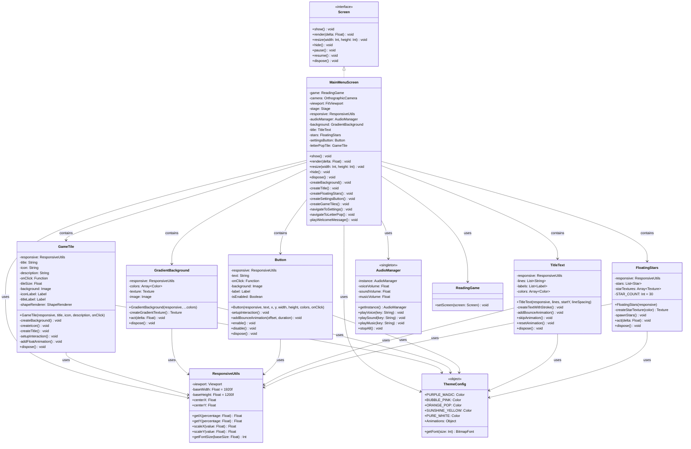
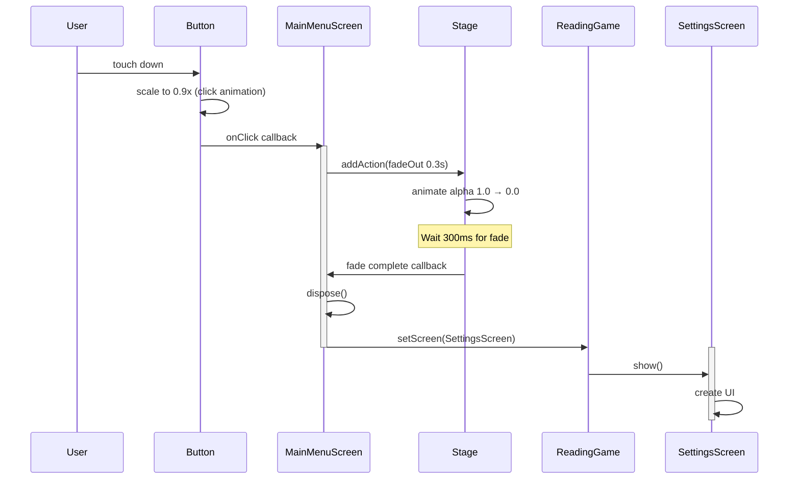
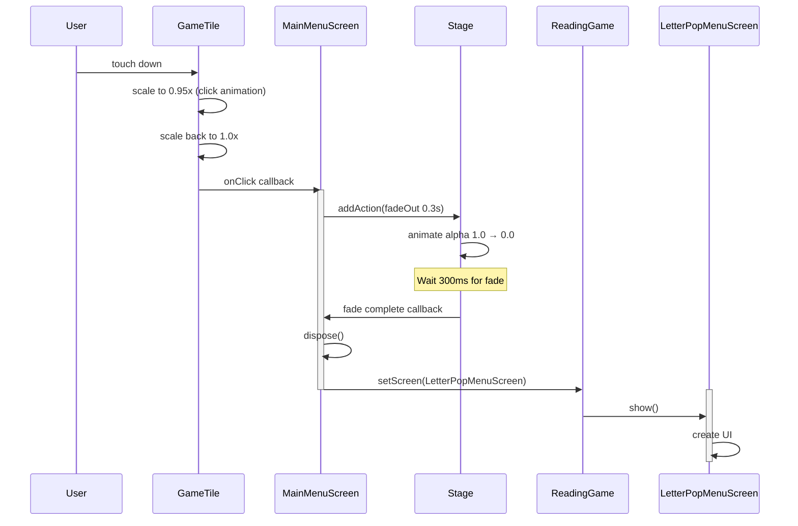
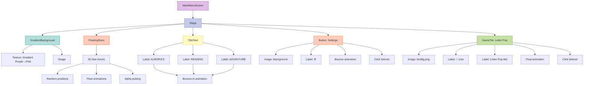
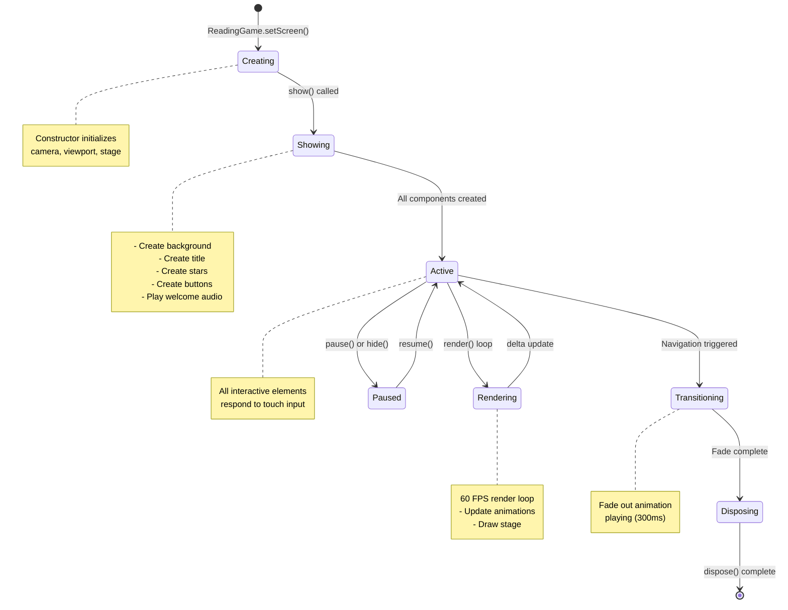
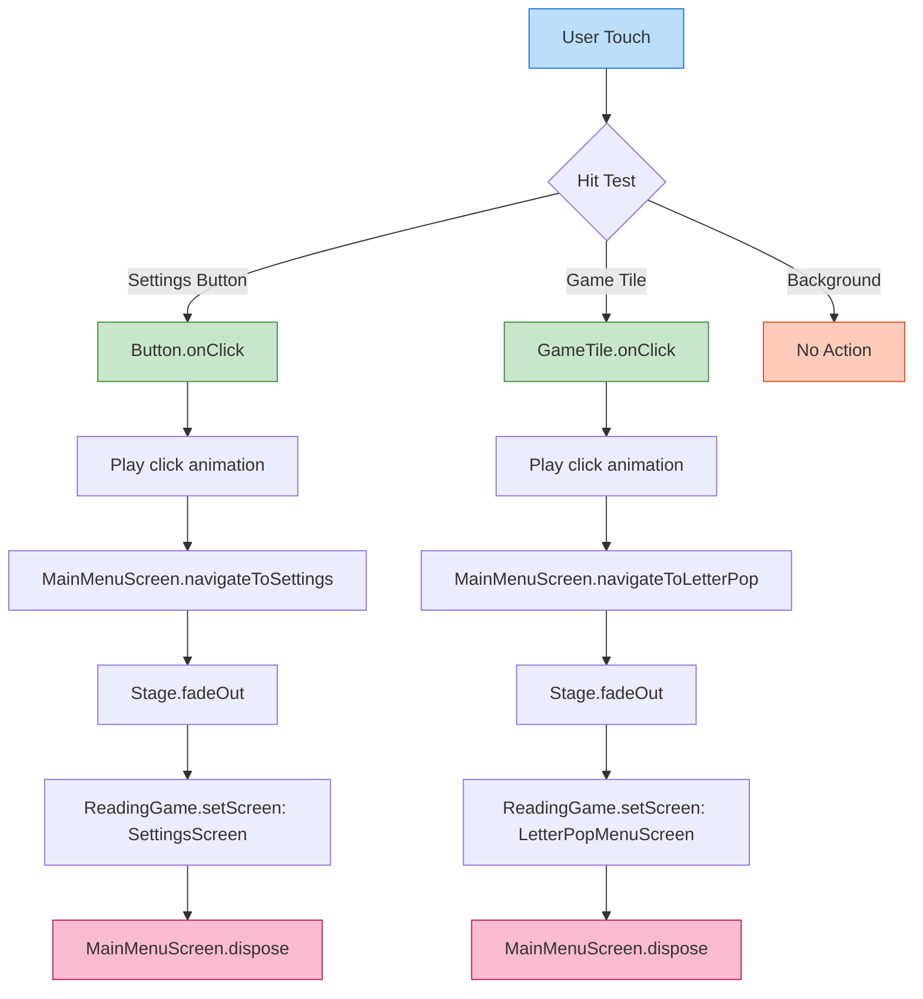
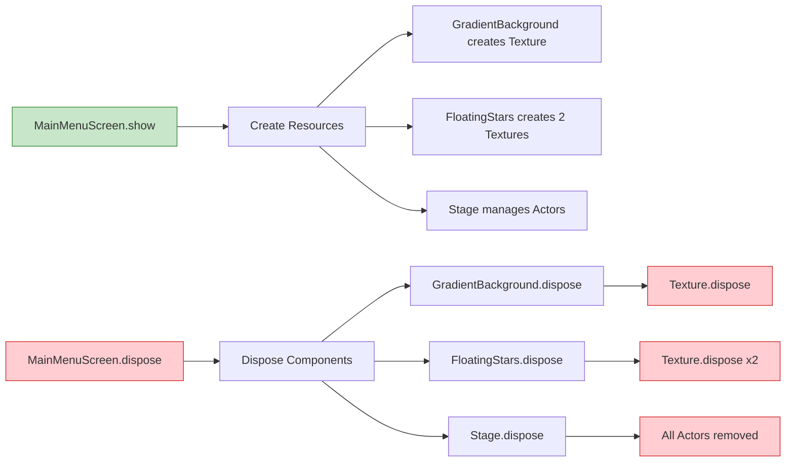
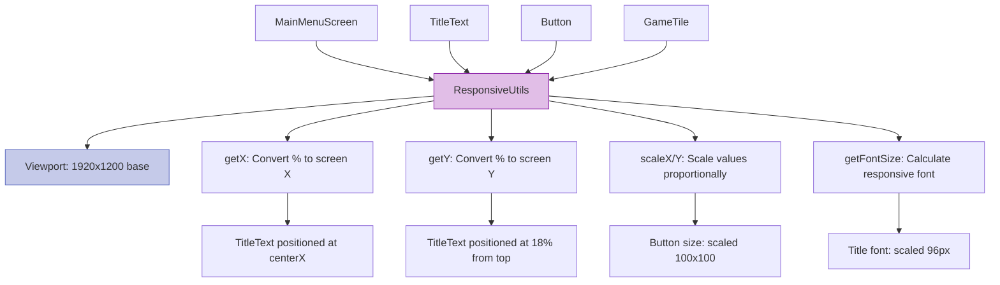

# Phase 2.7.5: Main Menu Screen - UML Architecture

## Overview

This document provides architectural diagrams for the Main Menu screen implementation using libGDX Screen architecture with reusable UI components from Phase 2.7.4.

---

## 1. Class Diagram

### Main Menu Screen and Components



---

## 2. Sequence Diagram: Screen Initialization

### Main Menu Show Flow

```mermaid
sequenceDiagram
    participant App as ReadingGame
    participant MM as MainMenuScreen
    participant BG as GradientBackground
    participant Title as TitleText
    participant Stars as FloatingStars
    participant Btn as Button
    participant Tile as GameTile
    participant Audio as AudioManager
    participant Stage as Stage

    App->>MM: setScreen(MainMenuScreen)
    activate MM

    MM->>MM: show()
    MM->>Stage: set as input processor

    MM->>BG: new GradientBackground(responsive, PURPLE, PINK)
    activate BG
    BG->>BG: createGradientTexture()
    BG-->>MM: background instance
    deactivate BG
    MM->>Stage: addActor(background)

    MM->>Title: new TitleText(responsive, ["AURORA'S", "READING", "ADVENTURE"])
    activate Title
    Title->>Title: createTextWithStroke()
    Title->>Title: addBounceAnimation()
    Title-->>MM: title instance
    deactivate Title
    MM->>Stage: addActor(title)

    MM->>Stars: new FloatingStars(responsive)
    activate Stars
    Stars->>Stars: spawnStars()
    Stars-->>MM: stars instance
    deactivate Stars
    MM->>Stage: addActor(stars)

    MM->>Btn: new Button(responsive, "⚙️", x, y, onClick)
    activate Btn
    Btn->>Btn: setupInteraction()
    Btn->>Btn: addBounceAnimation()
    Btn-->>MM: settingsButton instance
    deactivate Btn
    MM->>Stage: addActor(settingsButton)

    MM->>Tile: new GameTile(responsive, "Letter Pop", "🎈", onClick)
    activate Tile
    Tile->>Tile: createBackground()
    Tile->>Tile: createIcon()
    Tile->>Tile: createTitle()
    Tile->>Tile: setupInteraction()
    Tile->>Tile: addFloatAnimation()
    Tile-->>MM: letterPopTile instance
    deactivate Tile
    MM->>Stage: addActor(letterPopTile)

    MM->>Audio: getInstance()
    Audio-->>MM: audioManager instance
    MM->>Audio: playVoice("welcome")

    deactivate MM
```

---

## 3. Sequence Diagram: Navigation Flow

### Settings Button Click



### Game Tile Click



---

## 4. Component Hierarchy Diagram

### UI Layout Structure



---

## 5. State Diagram: MainMenuScreen Lifecycle



---

## 6. Data Flow Diagram: Touch Input Processing



---

## 7. Memory Management Diagram

### Resource Lifecycle



---

## 8. Component Interaction Diagram

### Responsive Positioning



---

## Key Architectural Patterns

### 1. **Screen Pattern** (libGDX)
- MainMenuScreen implements `Screen` interface
- Manages lifecycle: show → render loop → dispose
- Handles resize events for responsive layout

### 2. **Composition over Inheritance**
- MainMenuScreen composes components (background, title, stars)
- Each component is independent and reusable
- No deep inheritance hierarchies

### 3. **Dependency Injection**
- ResponsiveUtils injected into all components
- AudioManager singleton accessed explicitly
- ThemeConfig provides shared constants

### 4. **Observer Pattern** (libGDX Actions)
- Buttons use click listeners (callbacks)
- Animations use action sequences with completion callbacks
- Decouples UI events from business logic

### 5. **Singleton Pattern**
- AudioManager: One instance manages all audio
- ThemeConfig: Shared configuration object

### 6. **Object Pooling** (Future optimization)
- FloatingStars could pool star actors
- Particles could reuse textures
- Current implementation prioritizes clarity

---

## Performance Characteristics

| Component | Memory | GPU Calls | Complexity |
|-----------|--------|-----------|------------|
| GradientBackground | ~256KB texture | 1 draw call | O(1) |
| FloatingStars | ~512KB (2 textures) | 30 draw calls | O(n) |
| TitleText | Minimal (BitmapFont) | 3 draw calls | O(1) |
| Button | Minimal | 2 draw calls | O(1) |
| GameTile | Minimal | 3 draw calls | O(1) |
| **Total** | **~768KB** | **~40 draw calls** | **60 FPS target** |

**Expected FPS:** 60 (locked)
**Touch Latency:** <20ms
**Memory Footprint:** <1MB for screen

---

## Testing Considerations

### Unit Testing Targets
- Component positioning (ResponsiveUtils calculations)
- Animation timing (bounce, fade durations)
- Memory cleanup (dispose methods)

### Integration Testing Targets
- Touch input routing (buttons and tiles clickable)
- Screen transitions (fade animations complete)
- Audio playback (welcome message plays)

### Visual Testing Targets
- Layout at 2560x1600 (Tab S7 FE)
- Component scaling (responsive sizing)
- Animation smoothness (60 FPS)

---

**Status:** Ready for Implementation
**Dependencies:** Phase 2.7.4 components ✅
**Created:** October 16, 2025
