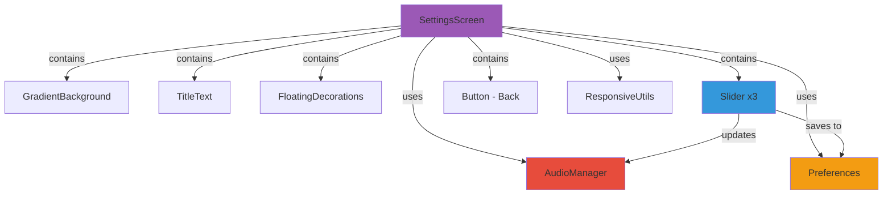
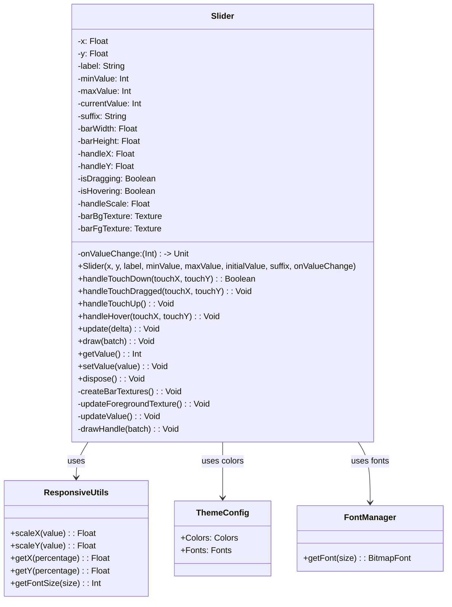
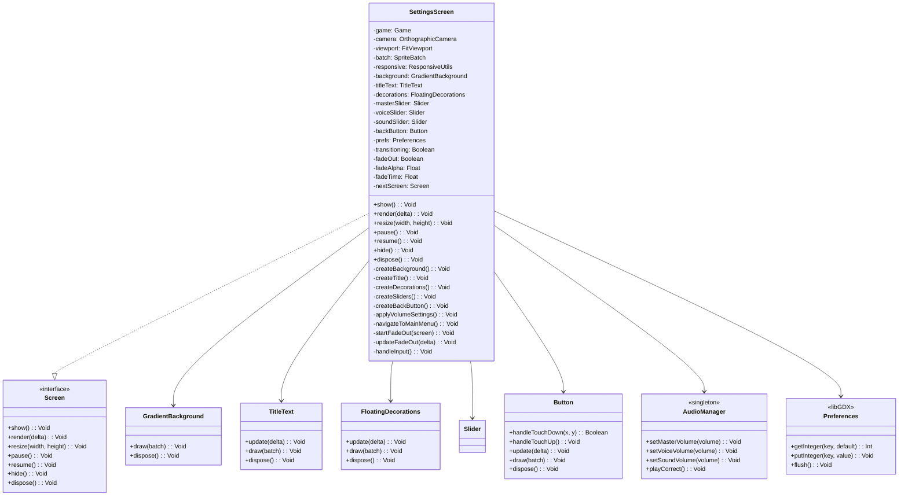
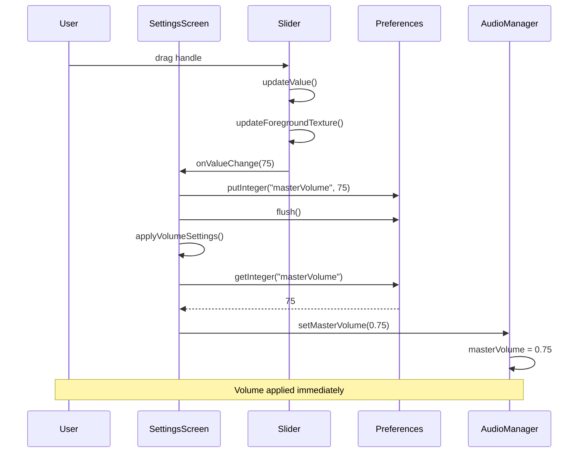
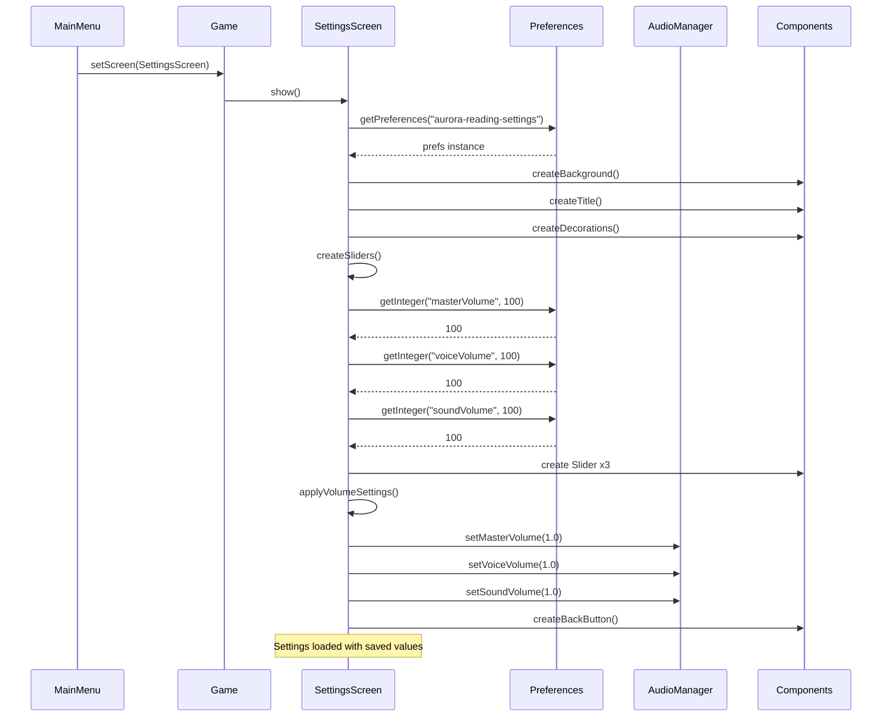
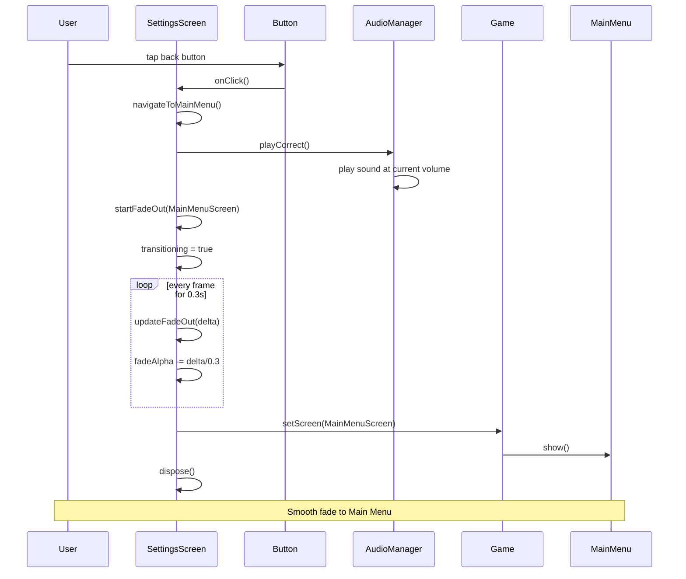
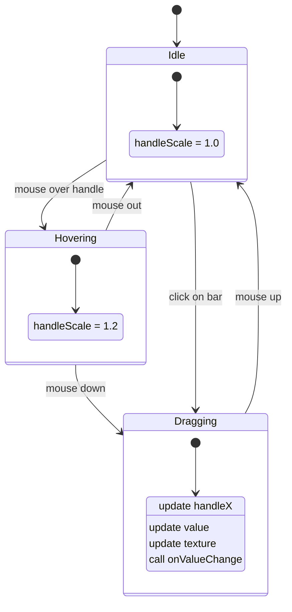
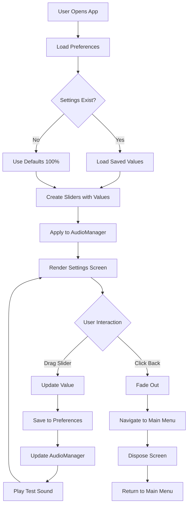
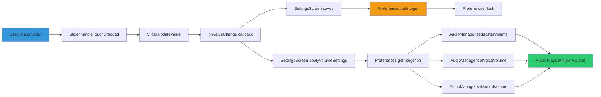
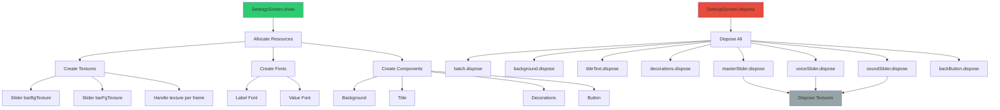

# Phase 2.7.6: Settings Screen - Architecture & UML

## Overview

This document defines the architecture for the Settings Screen implementation, including the new Slider component and its integration with existing systems.

---

## Component Hierarchy



---

## Class Diagram: Slider Component



---

## Class Diagram: SettingsScreen



---

## Sequence Diagram: Volume Slider Interaction



---

## Sequence Diagram: Settings Screen Load



---

## Sequence Diagram: Back Button Navigation



---

## State Diagram: Slider Interaction



---

## Component Integration Flow



---

## Data Flow: Volume Settings



---

## Memory Management



---

## Performance Considerations

### Slider Optimization

1. **Texture Caching**
   - Bar background texture created once
   - Foreground texture regenerated only on value change
   - Handle texture created per frame (TODO: optimize with cached texture atlas)

2. **Update Strategy**
   - Only update when value changes
   - Use delta time for smooth scale animations
   - Batch all drawing in single pass

3. **Input Handling**
   - Early return if not dragging/hovering
   - Coerce values to valid ranges
   - Use viewport unprojection once per frame

### Memory Profile

| Component | Texture Count | Est. Size | Disposable |
|-----------|---------------|-----------|------------|
| Slider (x3) | 6 static + 3 dynamic | ~50KB | ✅ Yes |
| Background | 1 | ~25KB | ✅ Yes |
| Title | 1 | ~15KB | ✅ Yes |
| Decorations | 8 | ~80KB | ✅ Yes |
| Button | 1 | ~10KB | ✅ Yes |
| **Total** | **~19 textures** | **~180KB** | **All** |

---

## Architecture Principles

1. **Component Reusability**
   - Slider component can be used in other screens
   - Settings persistence pattern can be reused
   - Fade transition system is screen-agnostic

2. **Separation of Concerns**
   - Slider handles UI rendering and interaction
   - SettingsScreen handles persistence and navigation
   - AudioManager handles audio playback
   - Preferences handles data storage

3. **Single Responsibility**
   - Each component has one clear purpose
   - Slider: interactive value selection
   - SettingsScreen: coordinate components and settings
   - AudioManager: audio playback control

4. **Dependency Injection**
   - Game instance passed to screen
   - Callbacks used for value changes
   - No static dependencies (except AudioManager singleton)

---

## File Structure

```
core/src/main/kotlin/com/aurora/reading/core/
├── components/
│   ├── Button.kt              # ✅ Reused from 2.7.4
│   ├── FloatingDecorations.kt # ✅ Reused from 2.7.5
│   ├── GradientBackground.kt  # ✅ Reused from 2.7.4
│   ├── Slider.kt              # 🆕 New in 2.7.6
│   └── TitleText.kt           # ✅ Reused from 2.7.4
├── screens/
│   ├── MainMenuScreen.kt      # ✅ From 2.7.5
│   └── SettingsScreen.kt      # 🔄 Replace stub
├── services/
│   ├── AudioManager.kt        # 🔄 Add volume methods
│   └── FontManager.kt         # ✅ Reused from 2.7.4
├── config/
│   └── ThemeConfig.kt         # ✅ Reused
└── utils/
    └── ResponsiveUtils.kt     # ✅ Reused
```

---

**Created:** October 18, 2025
**Status:** Architecture Defined
**Dependencies:** Phase 2.7.5 ✅
