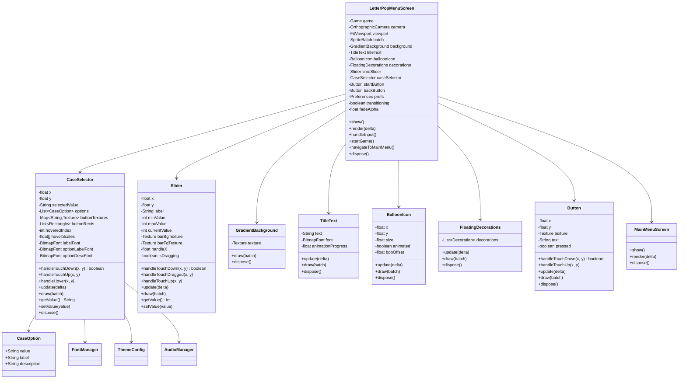
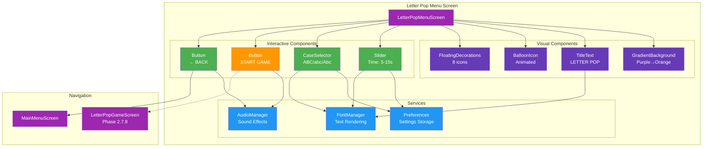
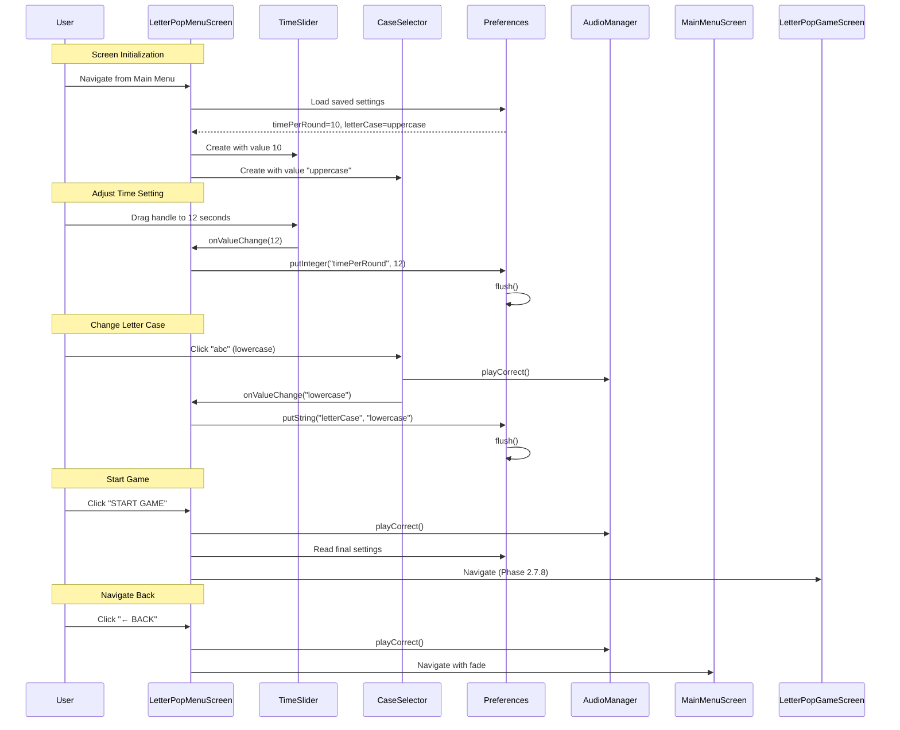
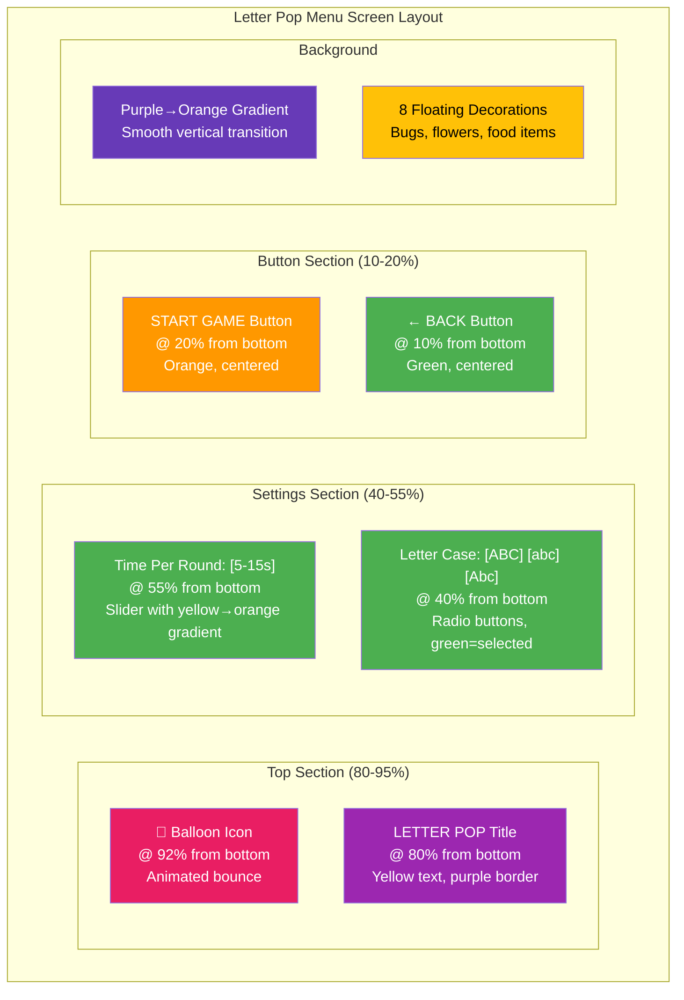
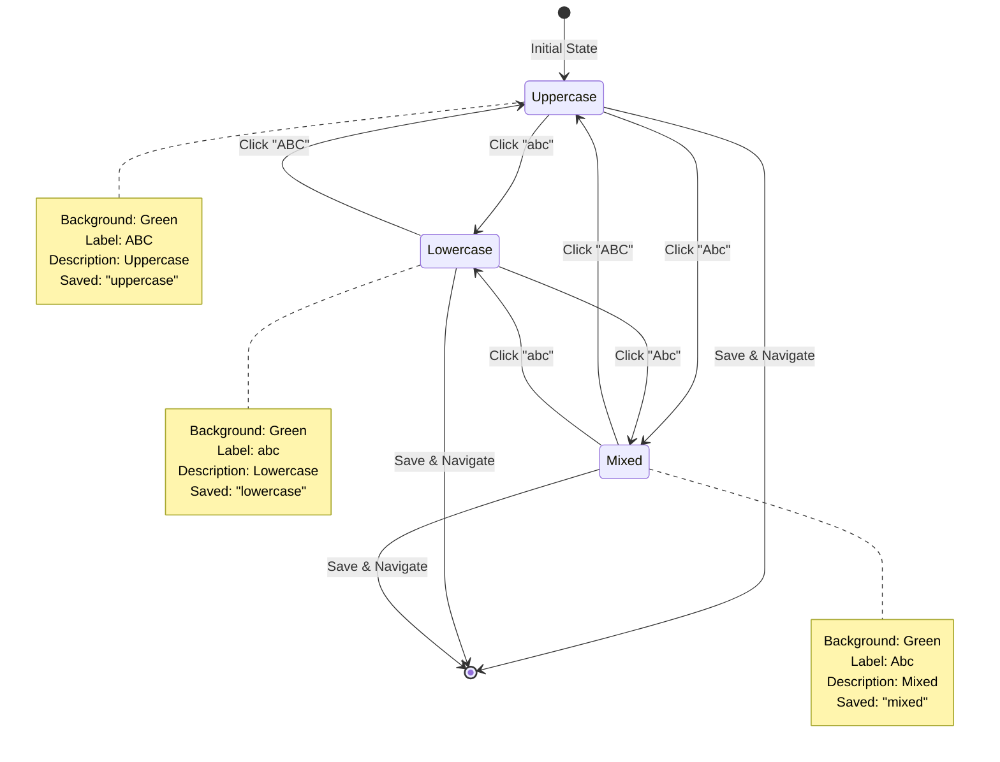
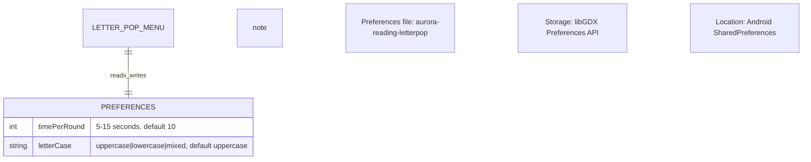
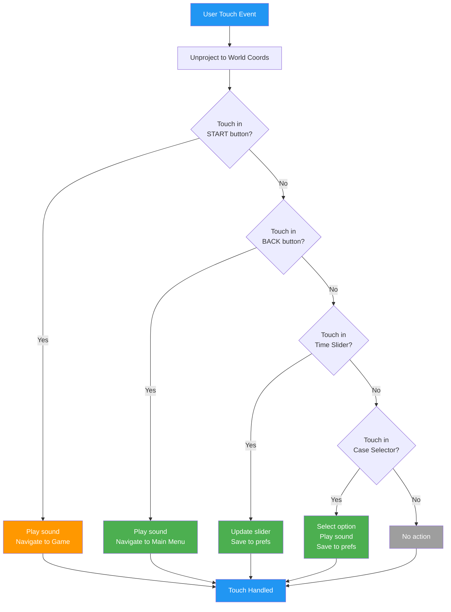
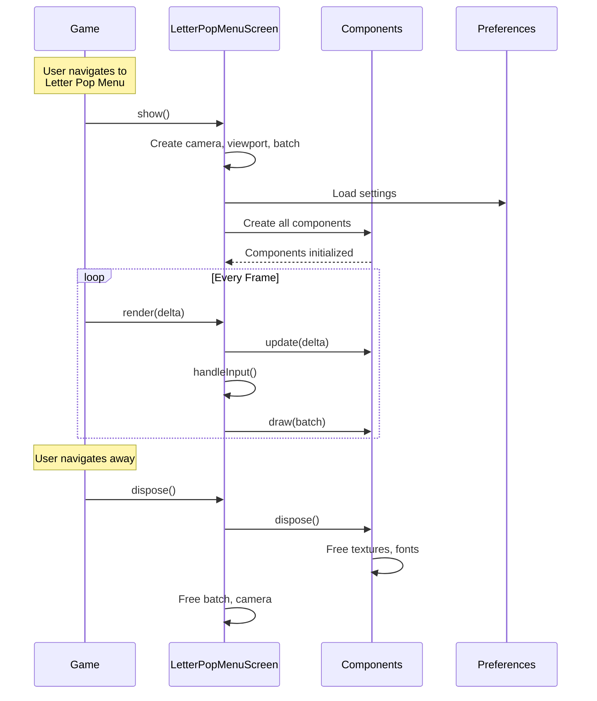
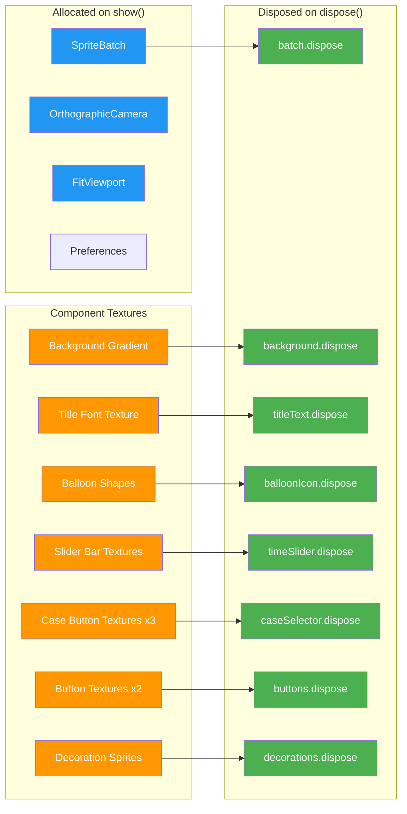

# Phase 2.7.7: Letter Pop Menu Screen - UML Architecture

## Overview

This document defines the architecture for the Letter Pop Menu Screen using Mermaid diagrams. It shows component relationships, data flow, and the overall system structure.

---

## Class Diagram

---

## Component Relationship Diagram

---

## Data Flow Diagram

---

## Screen Layout Diagram (2560x1600)

---

## CaseSelector State Machine

---

## Preferences Storage Schema

---

## Touch Input Flow

---

## Component Lifecycle

---

## Animation Timeline

```mermaid
gantt
    title Letter Pop Menu Screen Animations
    dateFormat X
    axisFormat %L ms

    section Screen Load
    Title Bounce In       :a1, 0, 600
    Balloon Pop In        :a2, 100, 500
    Decorations Fade In   :a3, 200, 400

    section Continuous
    Balloon Bob           :a4, 600, 3000
    Decorations Float     :a5, 600, 3000

    section Interactions
    Slider Drag           :a6, 1000, 500
    Case Hover            :a7, 1500, 150
    Button Press          :a8, 2000, 200

    section Navigation
    Fade Out              :a9, 2500, 300
```

---

## Memory Management

---

## Architecture Summary

### New Components
1. **CaseSelector** - Radio button-style selector for letter case
   - Three options: Uppercase, Lowercase, Mixed
   - Visual feedback (green = selected, purple = unselected)
   - Hover effects and animations
   - Persistence callback

### Reused Components
2. **Slider** - Time limit selector (from Phase 2.7.6)
3. **GradientBackground** - Purple→Orange (from Phase 2.7.4)
4. **TitleText** - Animated title (from Phase 2.7.4)
5. **BalloonIcon** - Animated balloon (from Phase 2.7.5)
6. **FloatingDecorations** - Visual polish (from Phase 2.7.6)
7. **Button** - Start and Back buttons (from Phase 2.7.4)

### Services
- **FontManager** - Font rendering
- **AudioManager** - Sound effects
- **Preferences** - Settings persistence
- **ResponsiveUtils** - Layout calculations
- **ThemeConfig** - Color palette

### Navigation
- **← BACK** → MainMenuScreen (Phase 2.7.5)
- **START GAME** → LetterPopGameScreen (Phase 2.7.8 - placeholder)

---

**Created:** 2025-10-19
**Status:** Ready for Implementation
