# Phase 2.7.8: Letter Pop Game - UML Architecture

## Overview

This document contains Mermaid diagrams showing the architecture, data flow, and interactions for the Letter Pop game implementation.

---

## 1. Class Diagram

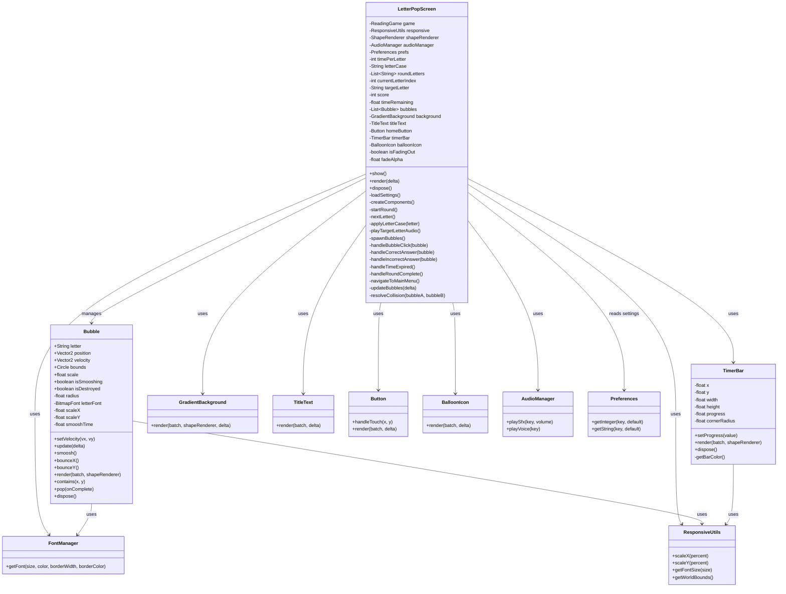

---

## 2. Game Initialization Sequence

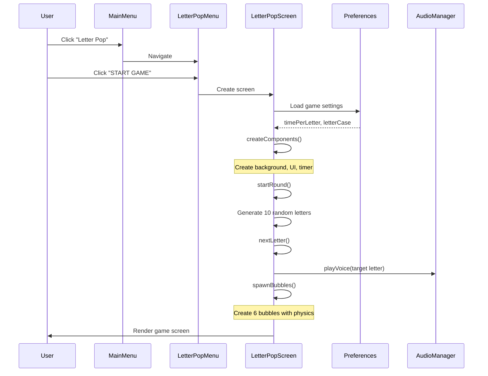

---

## 3. Bubble Click Handling - Correct Answer

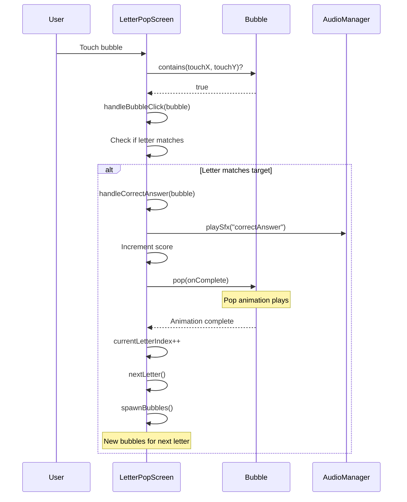

---

## 4. Bubble Click Handling - Incorrect Answer

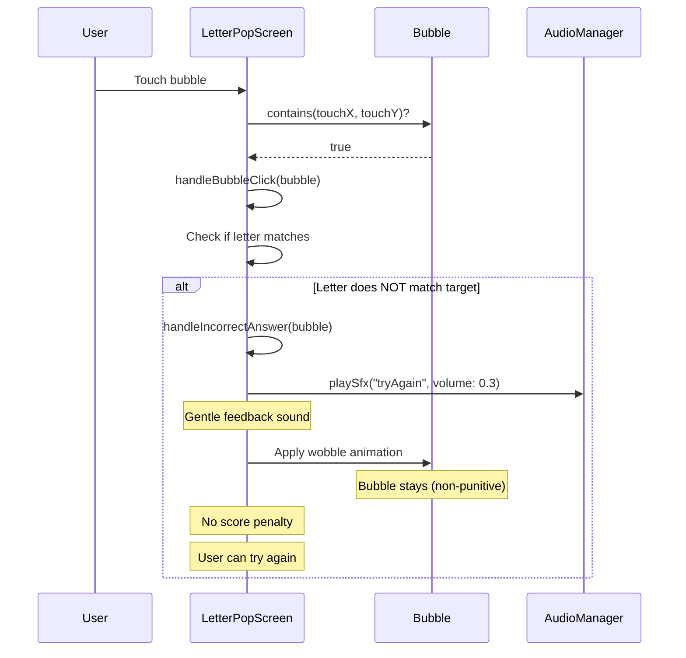

---

## 5. Timer Countdown and Expiration

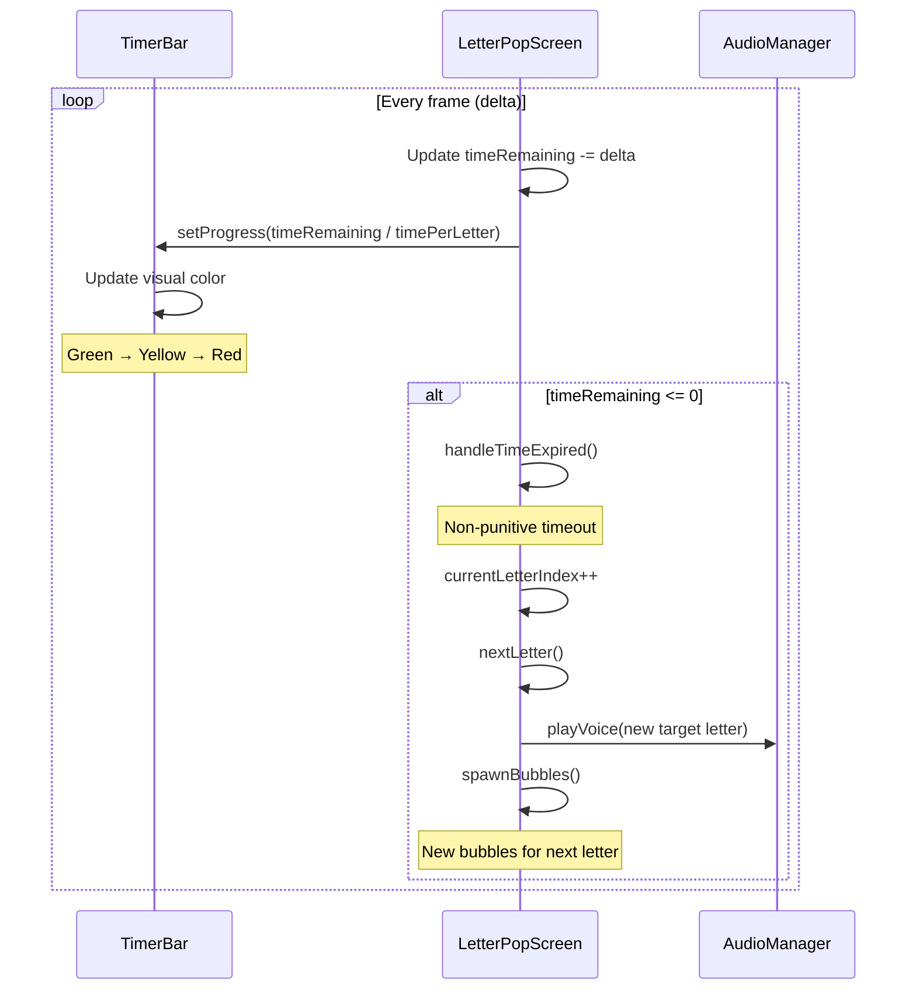

---

## 6. Bubble Physics Update

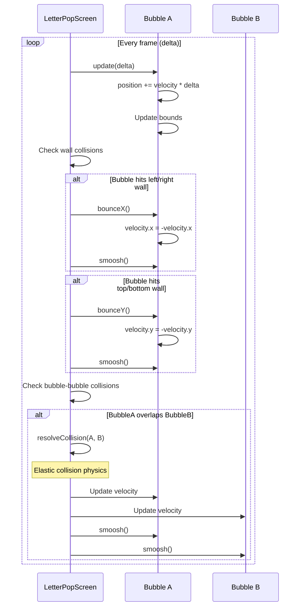

---

## 7. Round Completion

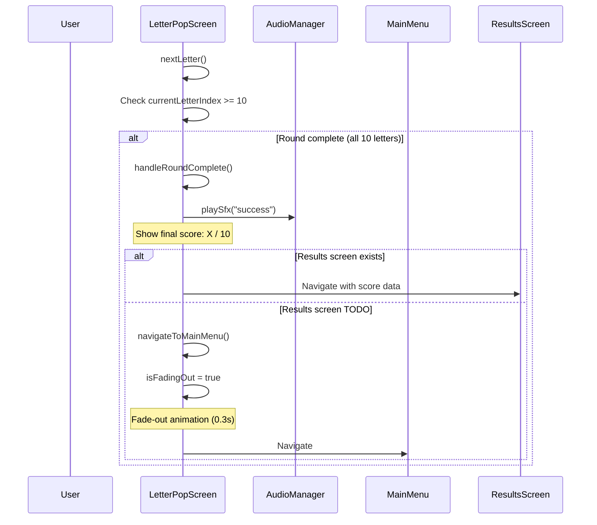

---

## 8. State Machine

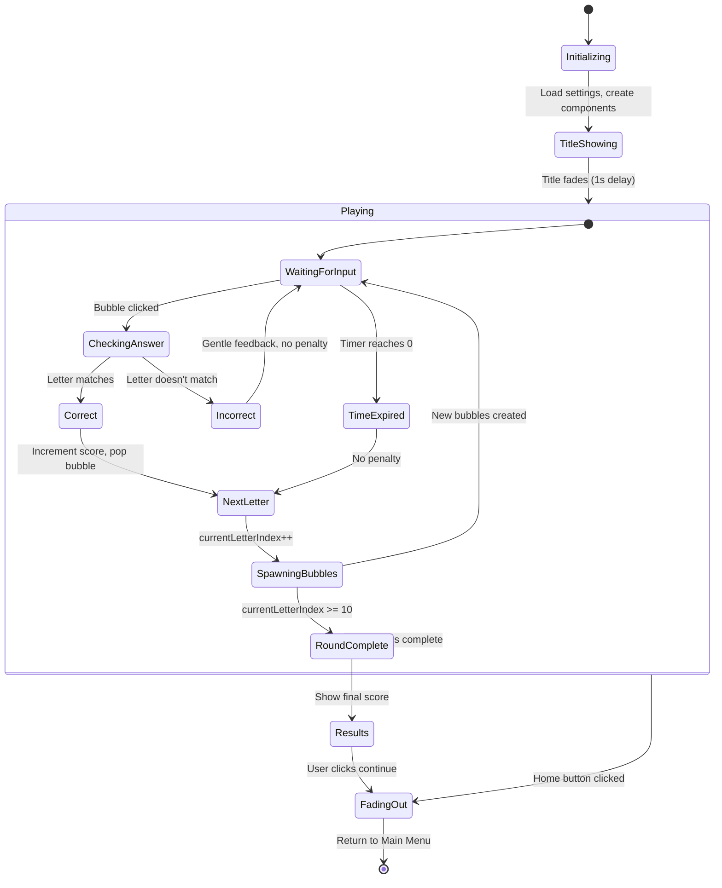

---

## 9. Component Interaction Diagram

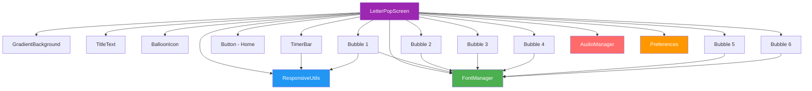

---

## 10. Data Flow - Settings Application

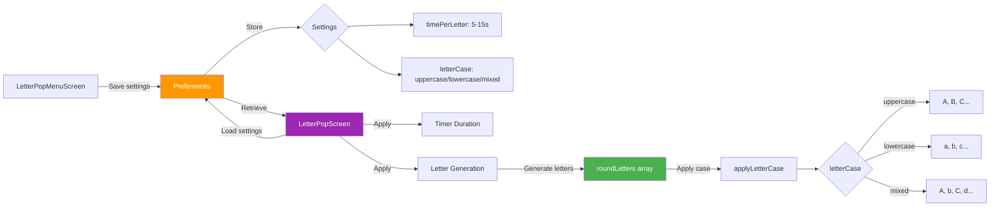

---

## 11. Physics Collision Resolution

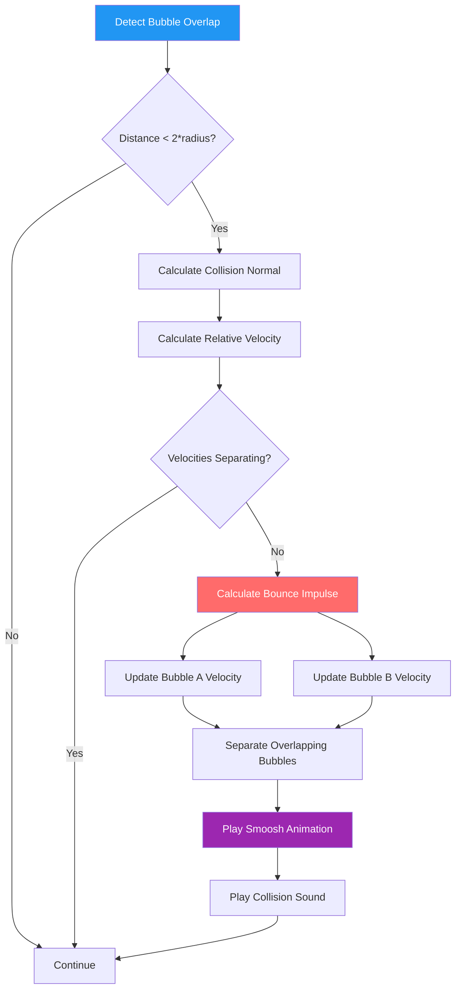

---

## 12. Memory Management

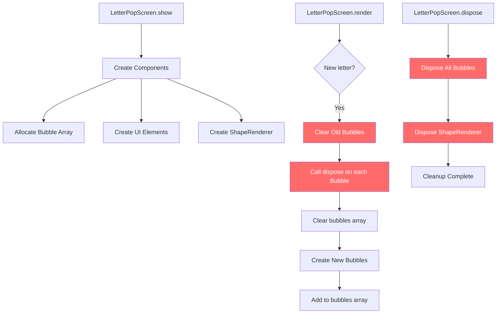

---

## 13. Touch Input Flow

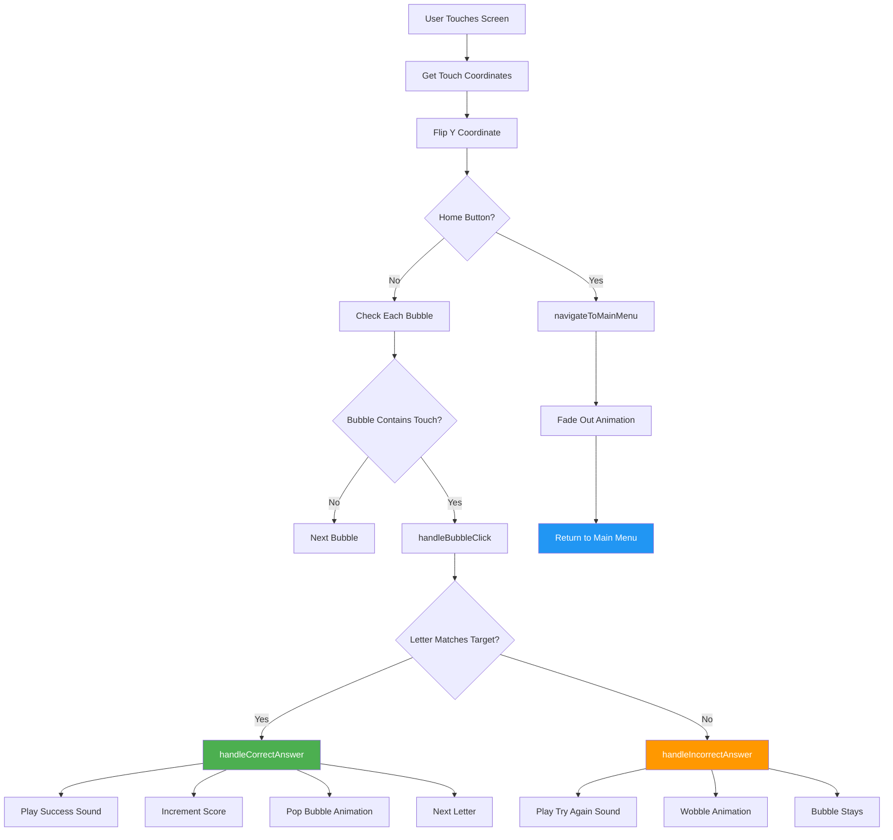

---

## 14. Animation Timeline

```mermaid
gantt
    title Letter Pop Game Animation Timeline
    dateFormat X
    axisFormat %s

    section Screen Entry
    Fade In                    :0, 300ms
    Title Bounce In           :0, 500ms
    Balloon Float             :0, 800ms

    section First Letter
    Title Visible             :1000, 800ms
    Title Fade Out            :1800, 800ms
    Voice Plays               :1000, 2000ms
    Bubbles Spawn             :1000, 300ms

    section Gameplay Loop
    Bubbles Float             :1000, 10000ms
    Timer Countdown           :1000, 10000ms
    Smoosh Animation          :3000, 120ms
    Bubble Pop (correct)      :5000, 300ms
    Next Letter Spawns        :5300, 300ms

    section Screen Exit
    Fade Out                  :done, 300ms
```

---

## 15. Architecture Layers

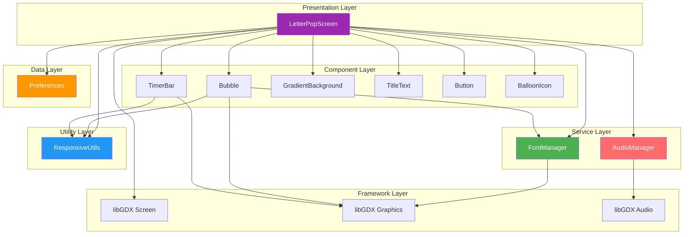

---

## Notes

### Design Decisions

1. **Physics-Based Movement**
   - Bubbles use velocity vectors for realistic floating
   - Elastic collisions for bouncing behavior
   - Smoosh animations add visual feedback

2. **Non-Punitive Feedback**
   - Incorrect answers play gentle sound
   - No score deduction
   - Bubble remains for retry
   - Timer expiration advances without penalty

3. **Settings Integration**
   - Preferences loaded on screen creation
   - Time limit applied to timer
   - Letter case applied to all generated letters

4. **Memory Management**
   - Bubbles disposed when letters change
   - ShapeRenderer reused across frames
   - Fonts cached by FontManager

5. **Touch Input**
   - Touch coordinates flipped for libGDX
   - Bubble contains() uses Circle collision
   - Home button checked before bubbles

### Performance Considerations

1. **Object Pooling**
   - Consider pooling Bubble objects for future optimization
   - ShapeRenderer shared across components

2. **Collision Detection**
   - O(n²) bubble collision check acceptable for 6 bubbles
   - Spatial partitioning not needed for small count

3. **Rendering**
   - Batch.begin/end minimized
   - ShapeRenderer used for circles (better than textures)

4. **Audio**
   - AudioManager handles volume and playback
   - Sounds preloaded in LoadingScreen

---

**Created:** Phase 2.7.8 Planning
**Technology:** Kotlin + libGDX
**Target:** Samsung Galaxy Tab S7 FE (2560x1600)
