# Phase 2.7.9: Results Screen - UML DIAGRAMS

**Phase:** 2.7.9
**Feature:** Results Screen Architecture
**Status:** Planning
**Diagrams:** 12 Mermaid diagrams

---

## Table of Contents

1. [Class Diagram](#1-class-diagram)
2. [Component Hierarchy](#2-component-hierarchy)
3. [GameResult Data Model](#3-gameresult-data-model)
4. [Star Rating Component](#4-star-rating-component)
5. [Results Screen Composition](#5-results-screen-composition)
6. [Sequence Diagram: Game Completion](#6-sequence-diagram-game-completion)
7. [Sequence Diagram: Play Again](#7-sequence-diagram-play-again)
8. [State Diagram: Screen Lifecycle](#8-state-diagram-screen-lifecycle)
9. [Data Flow Diagram](#9-data-flow-diagram)
10. [Star Calculation Logic](#10-star-calculation-logic)
11. [Layout Positioning](#11-layout-positioning)
12. [Navigation Flow](#12-navigation-flow)

---

## 1. Class Diagram

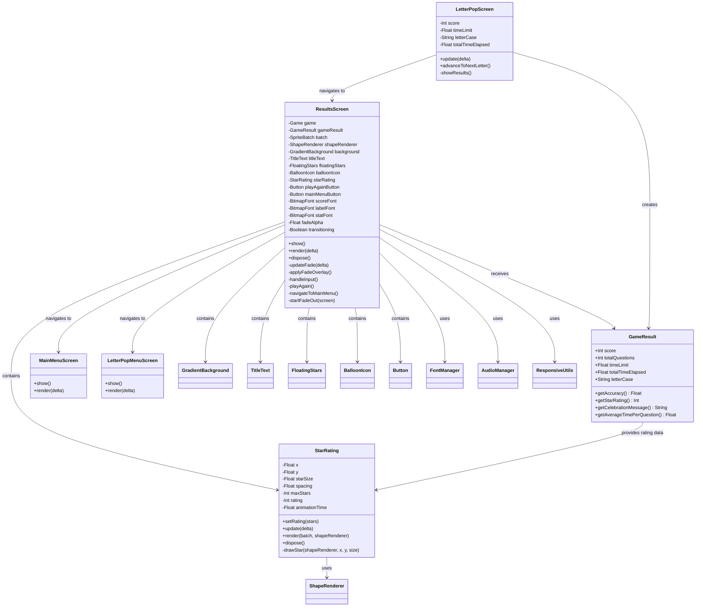

---

## 2. Component Hierarchy

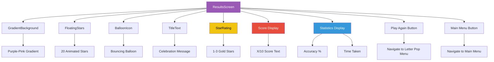

---

## 3. GameResult Data Model

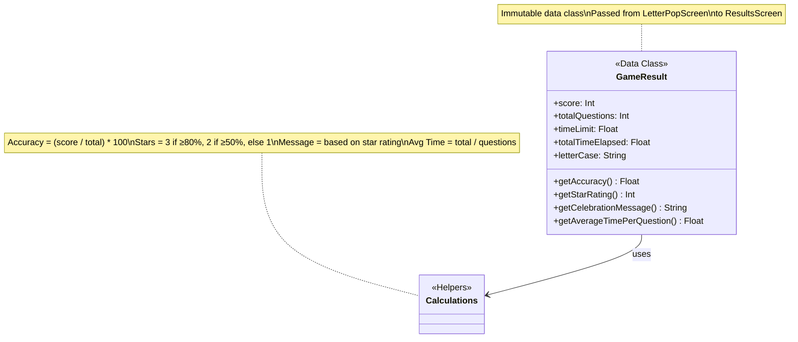

---

## 4. Star Rating Component

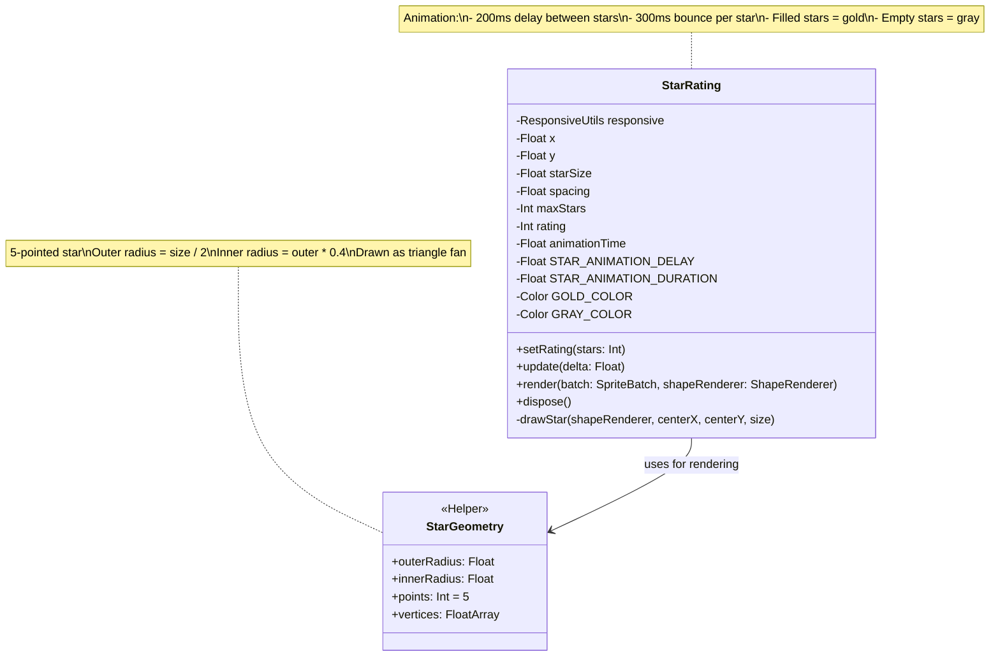

---

## 5. Results Screen Composition

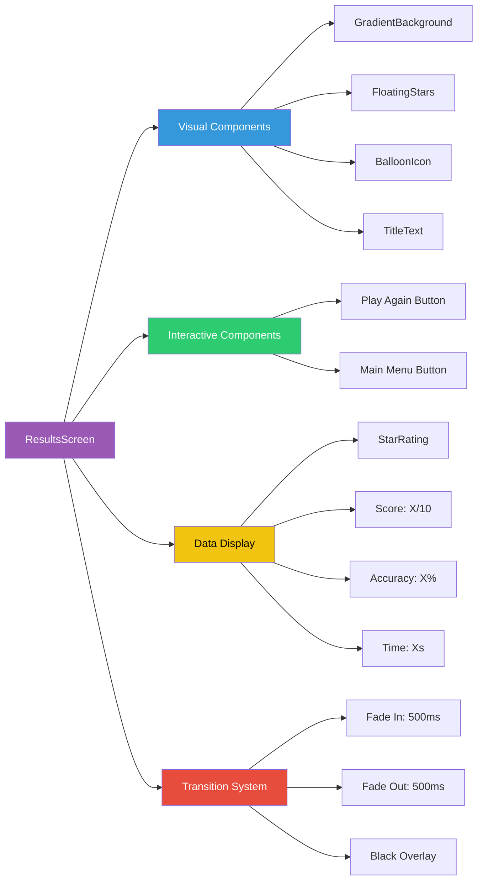

---

## 6. Sequence Diagram: Game Completion

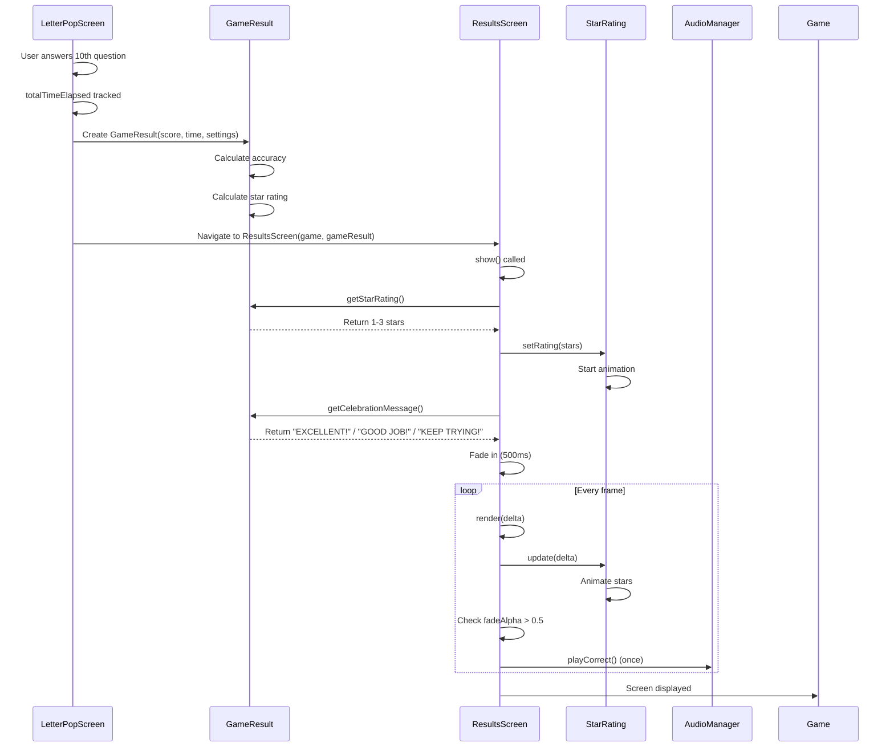

---

## 7. Sequence Diagram: Play Again

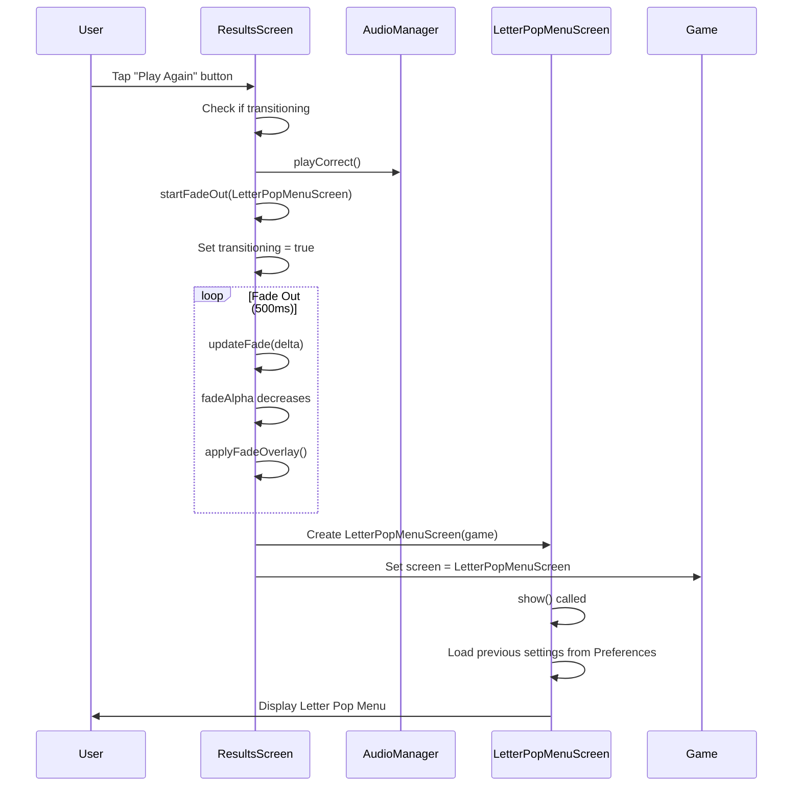

---

## 8. State Diagram: Screen Lifecycle

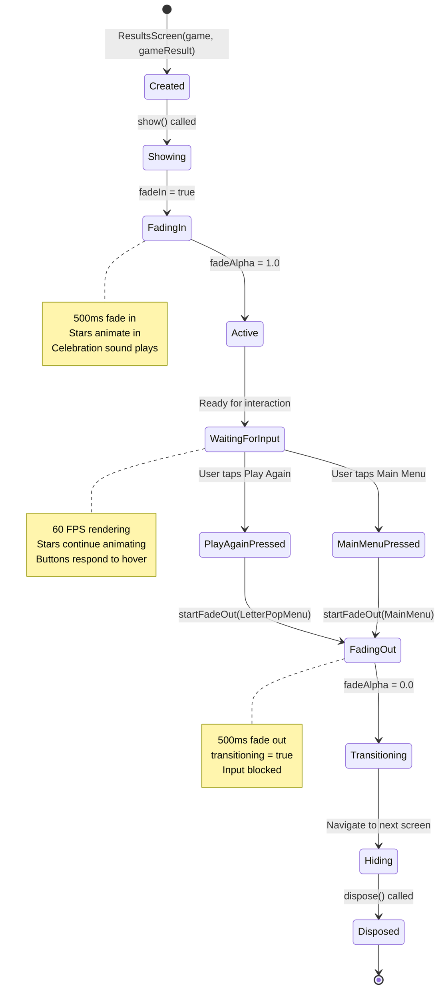

---

## 9. Data Flow Diagram

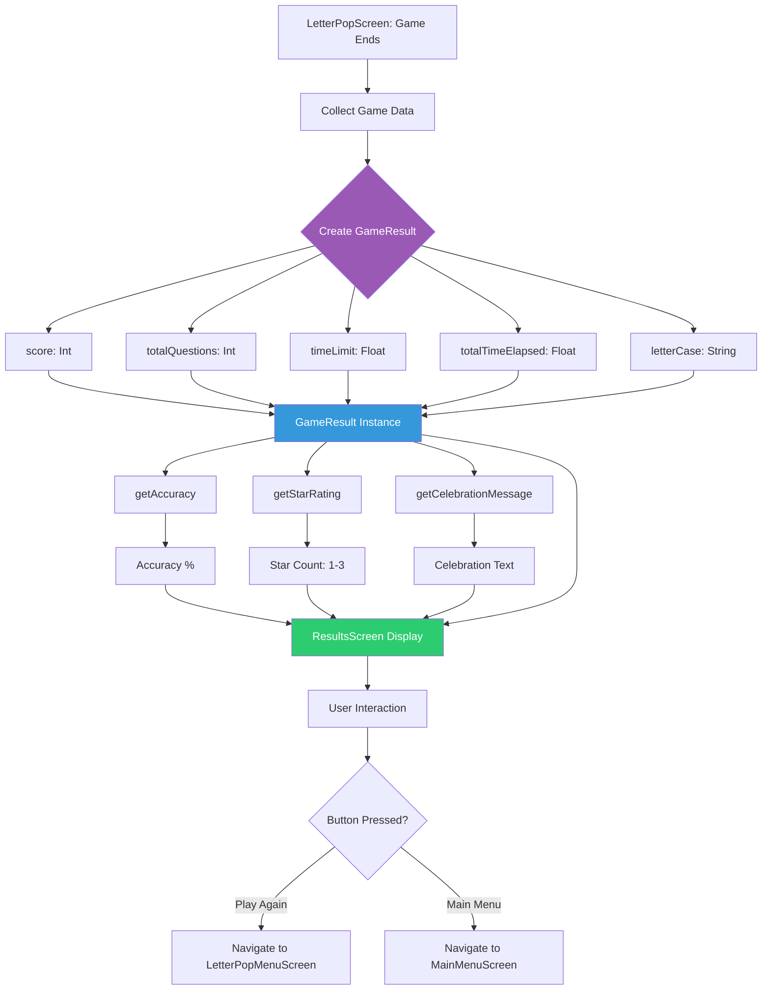

---

## 10. Star Calculation Logic

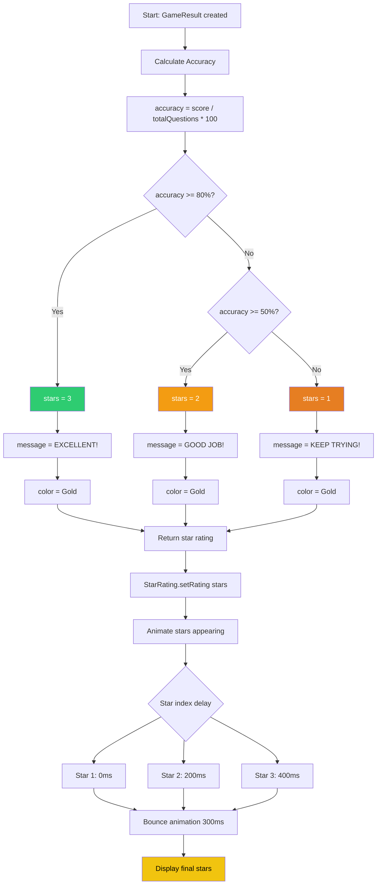

---

## 11. Layout Positioning

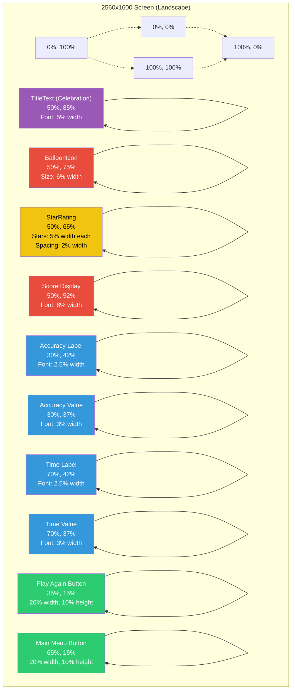

---

## 12. Navigation Flow

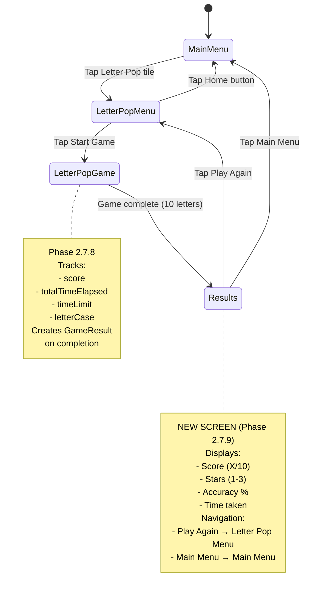

---

## Component Dependencies

### ResultsScreen Dependencies
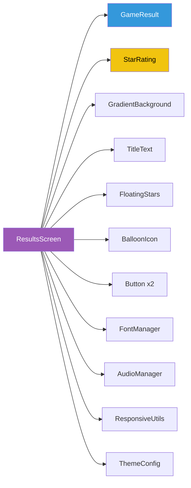

### StarRating Dependencies
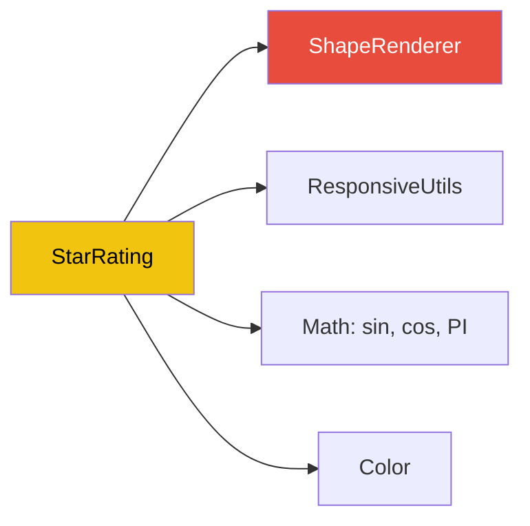

---

## Animation Timeline

```mermaid
gantt
    title Results Screen Animation Timeline
    dateFormat X
    axisFormat %Ls

    section Fade In
    Fade In (500ms)           :0, 500

    section Star Animations
    Star 1 appears (300ms)    :0, 300
    Star 2 appears (300ms)    :200, 500
    Star 3 appears (300ms)    :400, 700

    section Audio
    Celebration sound plays   :250, 300

    section User Input
    Buttons active            :500, 3000
    User taps button          :2000, 2050

    section Fade Out
    Fade Out (500ms)          :2050, 2550

    section Navigation
    Next screen loads         :2550, 2600
```

---

## Memory Management

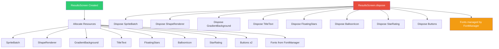

**Note:** Fonts are obtained from FontManager and should NOT be disposed individually. FontManager handles font lifecycle.

---

## Performance Considerations

### Target Performance Metrics
- **FPS:** Locked 60 FPS
- **Fade Duration:** 500ms (30 frames)
- **Star Animation:** 300ms per star (18 frames)
- **Memory:** < 5MB for screen
- **Touch Latency:** < 50ms response

### Optimization Strategies
1. **Object Pooling:** Not needed (static screen, no dynamic spawning)
2. **Batch Rendering:** All sprites drawn in single batch
3. **ShapeRenderer:** Used only for stars (minimal draw calls)
4. **Font Caching:** FontManager caches all fonts
5. **No Physics:** Static layout (no Box2D overhead)

---

**UML Created:** October 19, 2025
**Phase:** 2.7.9
**Diagrams:** 12 comprehensive architecture diagrams
**Next Step:** Create GHERKIN.md with BDD test scenarios
