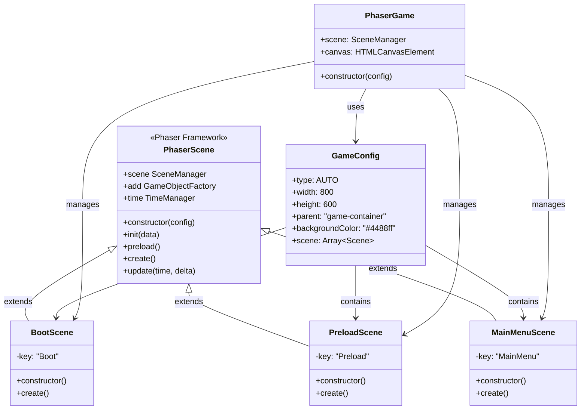
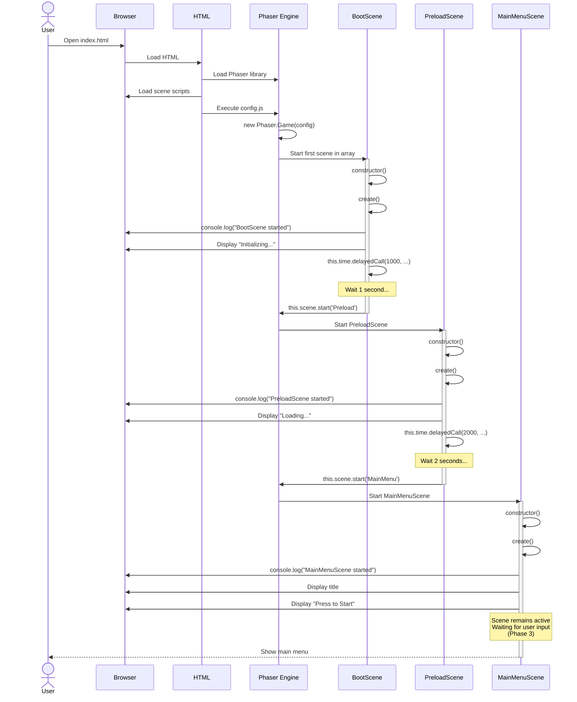
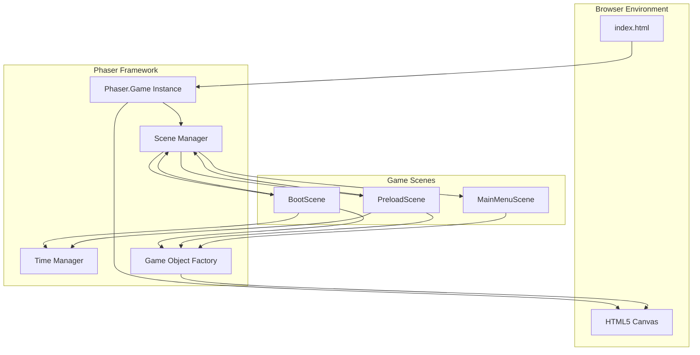
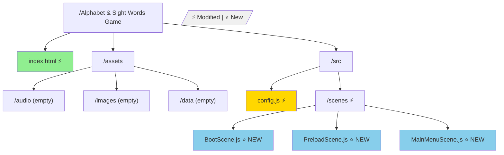
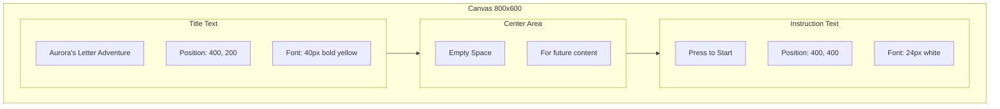
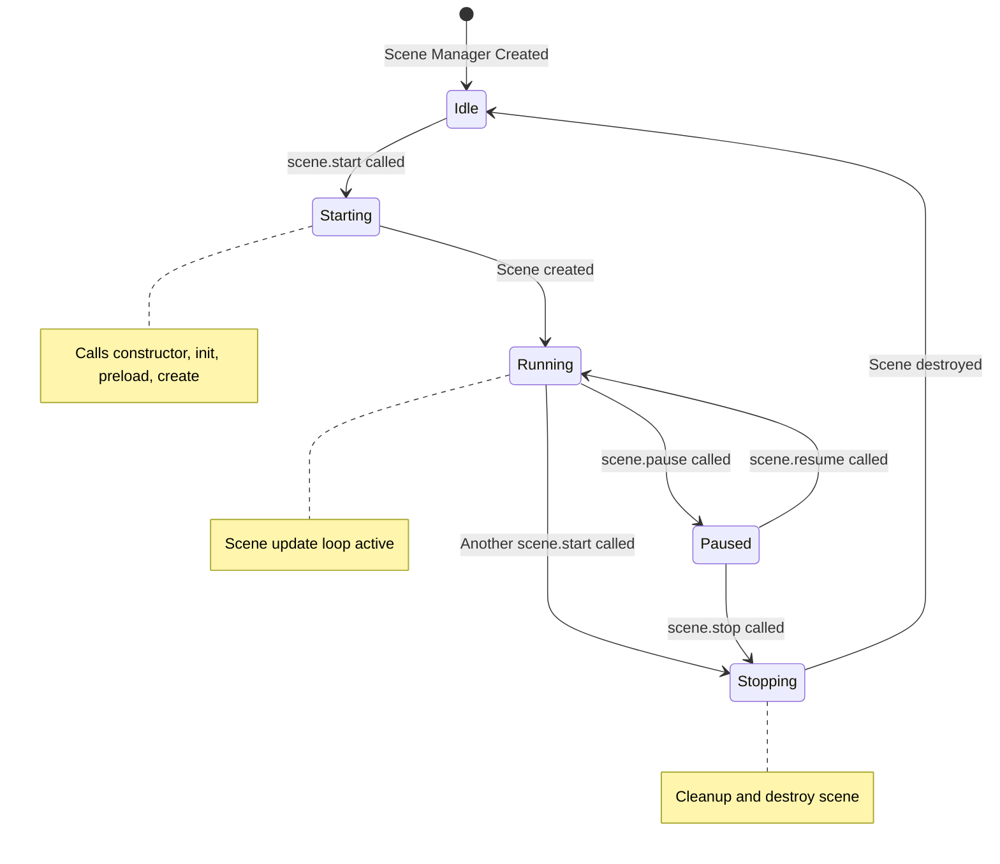

# Phase 2: Basic Scene System - UML

## Scene State Diagram

```mermaid
stateDiagram-v2
    [*] --> Boot: Game Starts
    Boot --> Preload: After 1 second
    Preload --> MainMenu: After 2 seconds
    MainMenu --> [*]: Game Ready

    state Boot {
        [*] --> DisplayInitializing
        DisplayInitializing --> LogConsole
        LogConsole --> WaitOneSecond
        WaitOneSecond --> [*]
    }

    state Preload {
        [*] --> DisplayLoading
        DisplayLoading --> LogConsole
        LogConsole --> WaitTwoSeconds
        WaitTwoSeconds --> [*]
        note right of WaitTwoSeconds: Future: Load assets here
    }

    state MainMenu {
        [*] --> DisplayTitle
        DisplayTitle --> DisplayInstruction
        DisplayInstruction --> LogConsole
        LogConsole --> WaitForInput
        note right of WaitForInput: Phase 3: Add click handler
    }
```

## Class Diagram



## Sequence Diagram: Scene Transitions



## Component Interaction Diagram



## File Structure Diagram



## Scene Lifecycle Flowchart

```mermaid
flowchart TD
    Start([Phaser.Game Created]) --> CheckScenes{Scenes in config?}
    CheckScenes -->|Yes| LoadFirst[Load First Scene]
    CheckScenes -->|No| Error[Error: No Scenes]

    LoadFirst --> ConstructorBoot[Call constructor]
    ConstructorBoot --> InitBoot[Call init]
    InitBoot --> PreloadBoot{Has preload method?}
    PreloadBoot -->|Yes| RunPreload[Run preload]
    PreloadBoot -->|No| SkipPreload[Skip preload]
    RunPreload --> CreateBoot[Call create]
    SkipPreload --> CreateBoot

    CreateBoot --> DisplayInit[Display 'Initializing...']
    DisplayInit --> LogBoot[Console: BootScene started]
    LogBoot --> Timer1[Set 1-second timer]
    Timer1 --> Wait1[Wait...]
    Wait1 --> TransitionPreload[this.scene.start 'Preload']

    TransitionPreload --> StopBoot[Stop BootScene]
    StopBoot --> StartPreload[Start PreloadScene]

    StartPreload --> CreatePreload[Call create]
    CreatePreload --> DisplayLoad[Display 'Loading...']
    DisplayLoad --> LogPreload[Console: PreloadScene started]
    LogPreload --> Timer2[Set 2-second timer]
    Timer2 --> Wait2[Wait...]
    Wait2 --> TransitionMenu[this.scene.start 'MainMenu']

    TransitionMenu --> StopPreload[Stop PreloadScene]
    StopPreload --> StartMenu[Start MainMenuScene]

    StartMenu --> CreateMenu[Call create]
    CreateMenu --> DisplayTitle[Display Title]
    DisplayTitle --> DisplayInst[Display Instructions]
    DisplayInst --> LogMenu[Console: MainMenuScene started]
    LogMenu --> ActiveMenu[Scene Active]
    ActiveMenu --> WaitInput[Wait for Input Phase 3]
```



## Text Display Layout (MainMenuScene)



## Scene Manager State Machine



## Notes

### Architecture Decisions

**Why Three Scenes?**
- **BootScene**: Initialize game state, systems, configuration
- **PreloadScene**: Load all assets (future phases)
- **MainMenuScene**: User entry point, game start

This is standard Phaser architecture for production games.

**Why Extend Phaser.Scene?**
- Access to all Phaser scene methods
- Automatic lifecycle management
- Clean, object-oriented structure
- Easy to test and maintain

**Why Scene Keys?**
- Unique identifiers for each scene
- Used in scene.start() transitions
- Must be consistent across all references

### Scene Transition Methods

**this.scene.start('key')**
- Stops current scene
- Starts target scene
- Current scene is destroyed

**this.scene.launch('key')** (not used yet)
- Starts scene alongside current scene
- Both scenes run simultaneously
- Useful for UI overlays (future phases)

**this.scene.switch('key')** (not used yet)
- Pauses current scene
- Starts target scene
- Can return to paused scene

For Phase 2, we only use `scene.start()`.

### Timer vs setTimeout

We use `this.time.delayedCall()` instead of JavaScript's `setTimeout()` because:
1. Managed by Phaser's time system
2. Automatically cleaned up when scene stops
3. Pauses when scene pauses
4. More reliable for game timing

### What This Phase Establishes

1. **Scene Architecture**: Pattern for all future scenes
2. **Scene Transitions**: How scenes communicate and transfer control
3. **Scene Lifecycle**: Understanding of create, update, destroy
4. **Text Display**: How to render text in scenes
5. **Console Logging**: Debugging approach for scene flow

This architecture will scale to all 44 phases of the project.

### Future Enhancements (Not Phase 2)

- Asset loading in PreloadScene
- Progress bar during loading
- Click/touch input in MainMenu
- Scene data passing
- Scene transitions with effects
- Multiple simultaneous scenes
- Scene sleep/wake management
