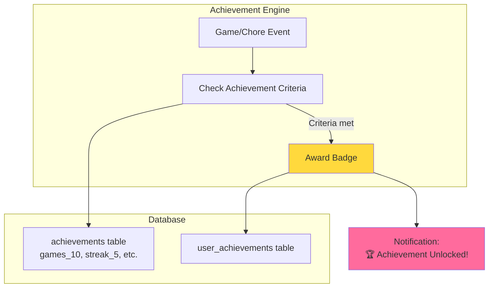
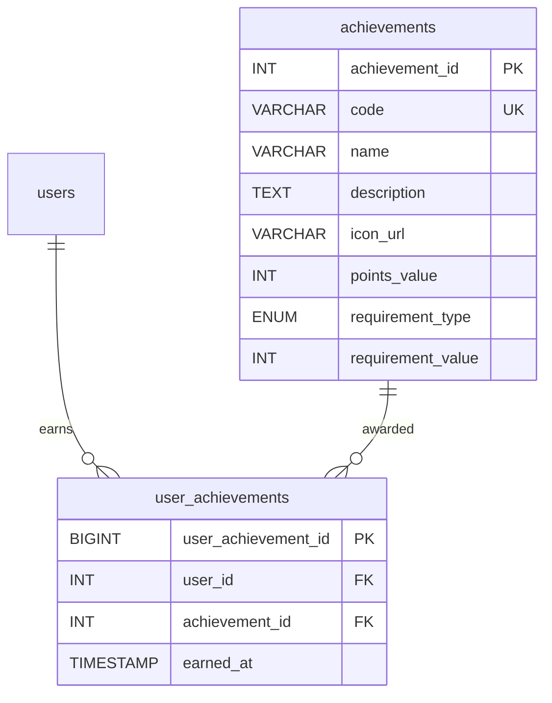

# Phase 20: Architecture Diagrams

**Project:** ADHDLearn.com
**Phase:** 20 of 36
**Last Updated:** October 22, 2025

---

## Achievement System

```mermaid
graph TB
    subgraph "Achievement Engine"
        Trigger[Game/Chore Event]
        Check[Check Achievement Criteria]
        Award[Award Badge]
    end
    
    subgraph "Database"
        Achievements[achievements table<br/>games_10, streak_5, etc.]
        UserAchievements[user_achievements table]
    end
    
    Trigger --> Check
    Check --> Achievements
    Check -->|Criteria met| Award
    Award --> UserAchievements
    Award --> Notify[Notification:<br/>🏆 Achievement Unlocked!]
    
    style Award fill:#FFD93D
    style Notify fill:#FF6B9D
```

## Achievement ERD

```mermaid
erDiagram
    users ||--o{ user_achievements : earns
    achievements ||--o{ user_achievements : awarded
    
    achievements {
        INT achievement_id PK
        VARCHAR code UK
        VARCHAR name
        TEXT description
        VARCHAR icon_url
        INT points_value
        ENUM requirement_type
        INT requirement_value
    }
    
    user_achievements {
        BIGINT user_achievement_id PK
        INT user_id FK
        INT achievement_id FK
        TIMESTAMP earned_at
    }
```

---

