# Phase 20: Settings Scene - UML

## Class Diagram

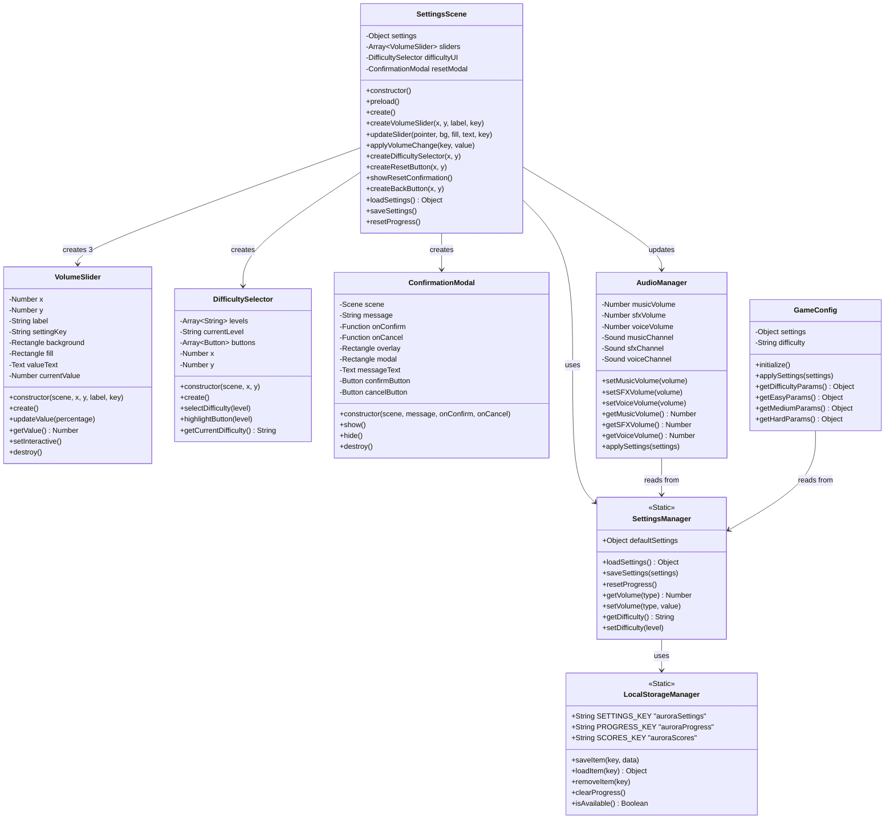

## Sequence Diagram: Settings Scene Load

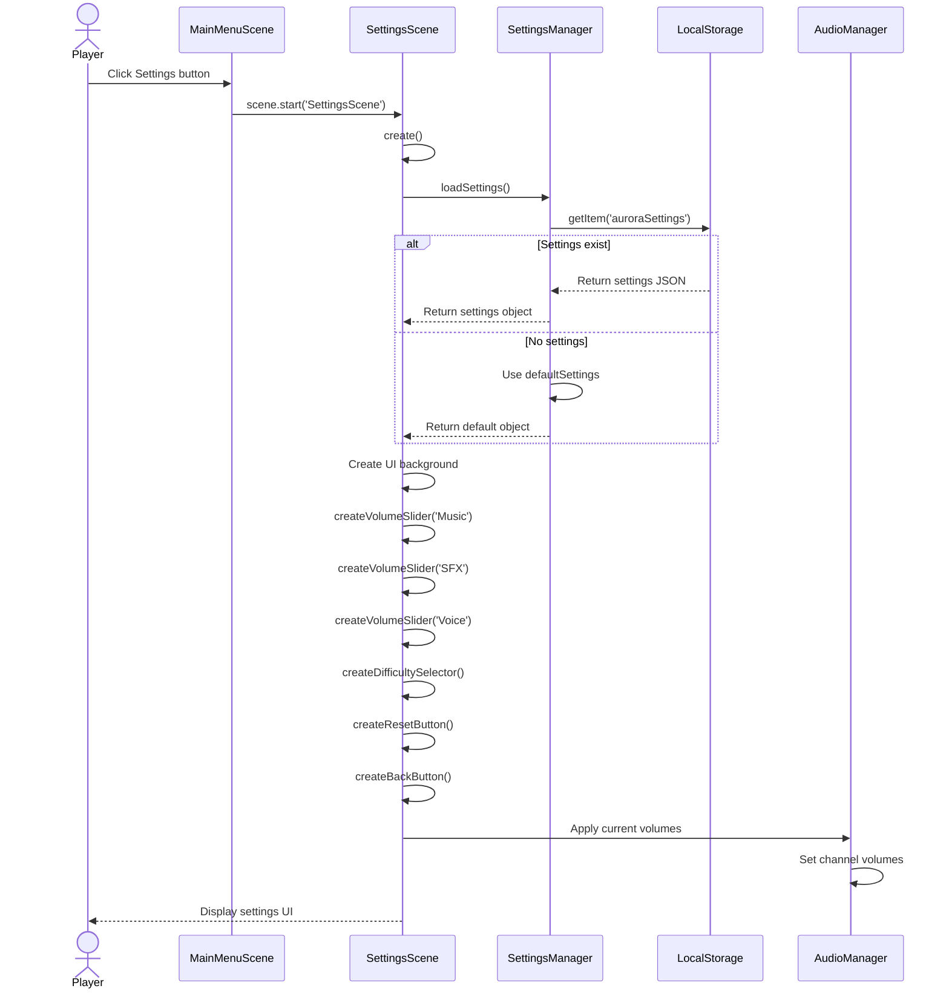

## Sequence Diagram: Adjust Volume Slider

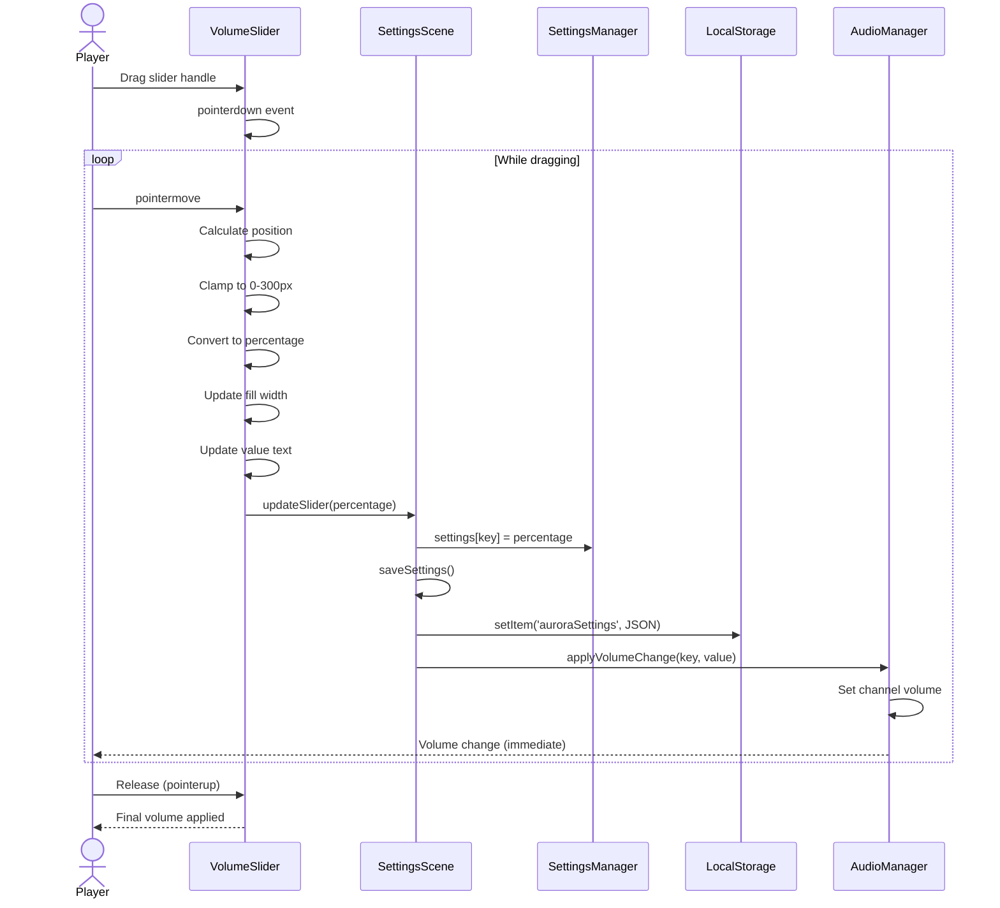

## Sequence Diagram: Reset Progress

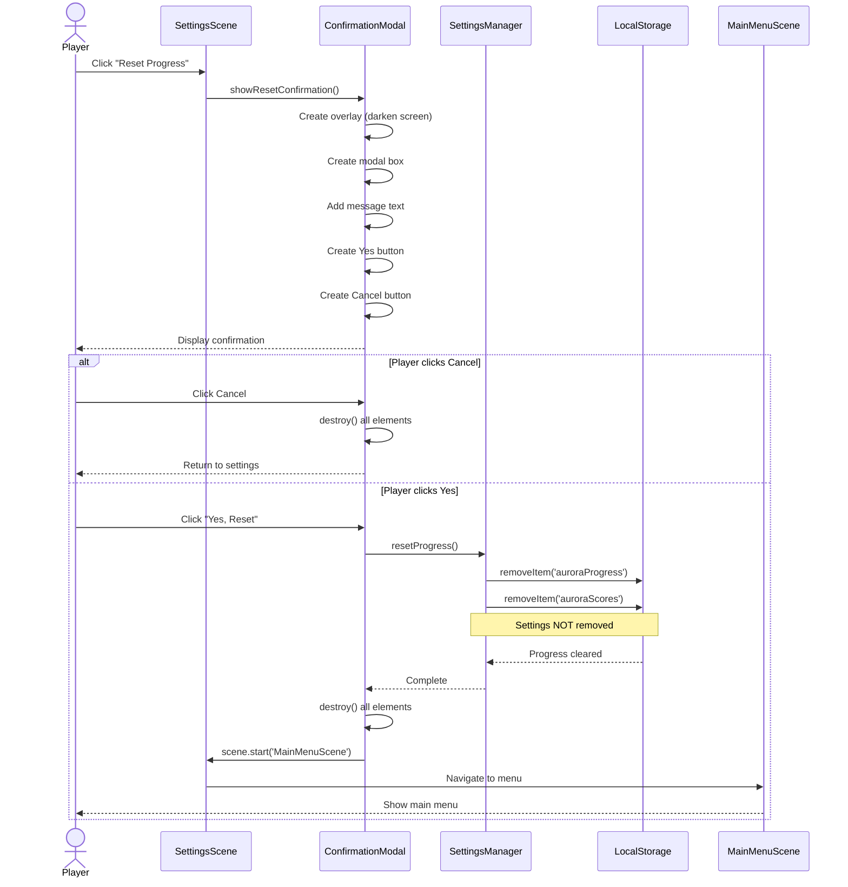

## Sequence Diagram: Change Difficulty

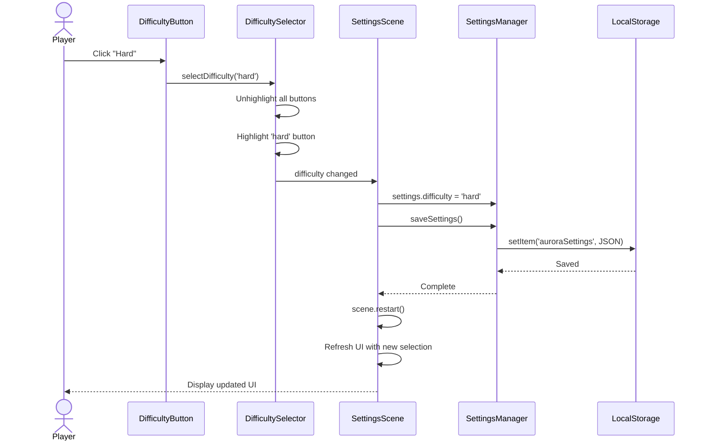

## State Diagram: Settings UI States

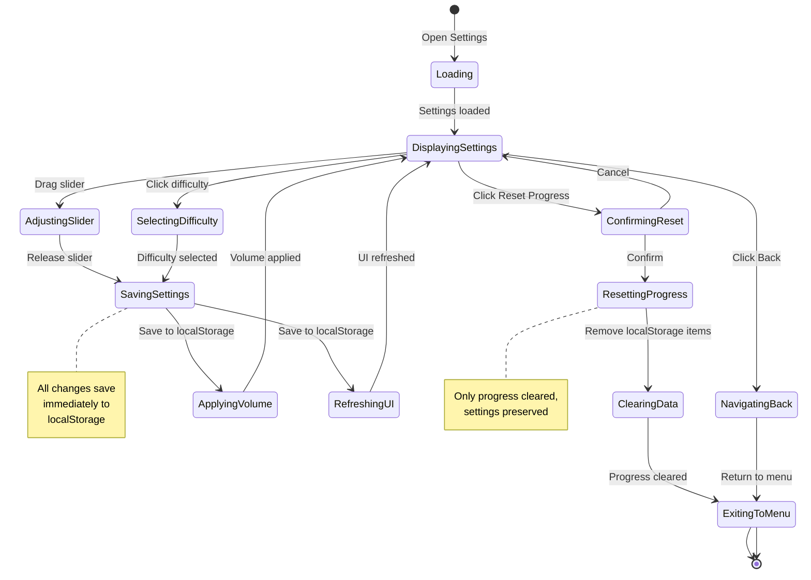

## Activity Diagram: Settings Flow

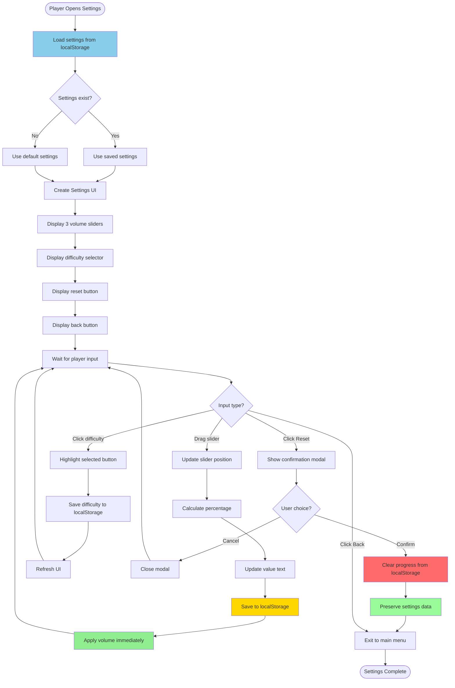

## Component Diagram: Settings System

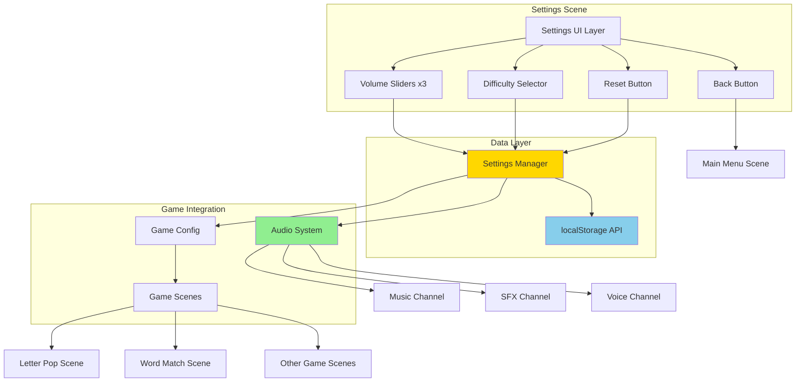

## Data Flow Diagram: Settings Persistence

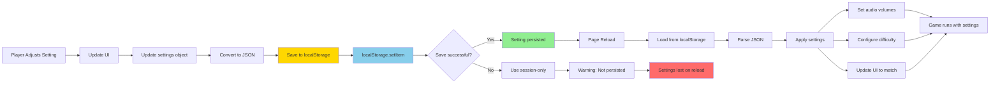

## localStorage Schema

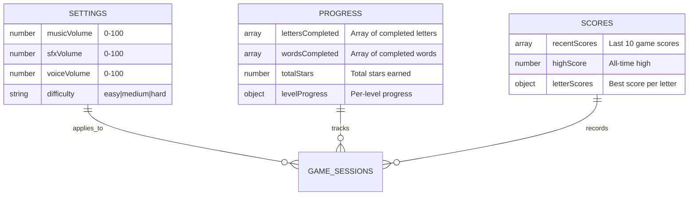

## Volume Slider Component Detail

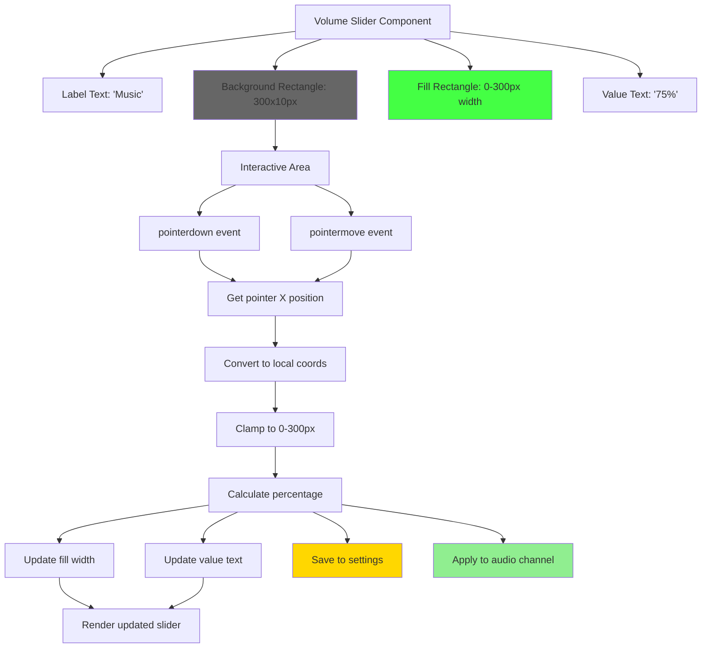

## Confirmation Modal Structure

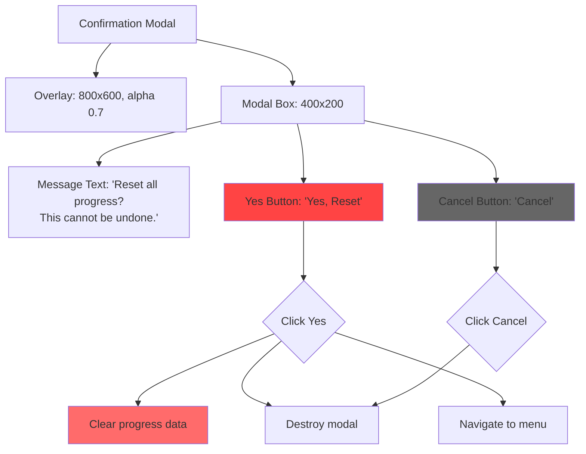

## Notes

### Architecture Decisions

**Settings Manager Pattern**
- Centralized settings management (single source of truth)
- Encapsulates localStorage interactions
- Provides clean API for scenes to get/set settings
- Handles defaults gracefully

**Immediate Application**
- Settings apply as soon as changed (no "Apply" button)
- Provides instant feedback (player hears volume change)
- Saves to localStorage on every change (prevents loss)
- No unsaved state confusion

**Separation of Concerns**
- Settings Scene handles UI only
- SettingsManager handles data/persistence
- AudioManager handles volume application
- GameConfig handles difficulty parameters

**localStorage Strategy**
- Settings key: 'auroraSettings' (preserved always)
- Progress key: 'auroraProgress' (can be reset)
- Scores key: 'auroraScores' (can be reset)
- Clear separation allows selective reset

### Why This Design?

**Slider Component**
- Custom implementation using Phaser rectangles (no plugin dependency)
- Drag interaction feels natural (like native sliders)
- Real-time visual feedback (fill width + percentage)
- Immediate audio feedback (player hears volume change)

**Confirmation Modal**
- Prevents accidental progress deletion
- Modal overlay darkens background (clear focus)
- Two-step process (click button → confirm) reduces errors
- Explicit "Yes, Reset" text (no ambiguous "OK")

**Difficulty Selector**
- Three clear levels (Easy/Medium/Hard) - no overwhelming options
- Visual highlighting shows current selection
- One-click to change (no complex dropdowns)
- Descriptions can be added later if needed

**Reset Progress Separation**
- Progress reset does NOT reset settings (preserves user preferences)
- Settings survive reset (volume, difficulty remain)
- Parent can reset child's progress without reconfiguring

### Component Relationships

1. **SettingsScene is the controller**
   - Creates all UI components
   - Handles user interactions
   - Coordinates with SettingsManager
   - Navigates to other scenes

2. **SettingsManager is the model**
   - Stores settings data
   - Handles localStorage operations
   - Provides default values
   - Validates settings on load

3. **VolumeSliders are independent**
   - Each slider manages its own state
   - Reports changes to parent scene
   - Self-contained UI logic
   - Three instances (music, SFX, voice)

4. **AudioManager is the consumer**
   - Reads settings on game start
   - Applies volume to appropriate channels
   - Updates immediately on setting change
   - No settings logic (just applies values)

5. **localStorage is the persistence layer**
   - Browser-native storage (no server needed)
   - Synchronous API (simple to use)
   - Survives page reload/close
   - Limited to ~5-10MB (more than enough)

### Performance Considerations

**Real-Time Slider Updates**
- Updates fire on pointermove (can be frequent)
- Throttling not needed (Phaser handles efficiently)
- localStorage writes are fast (<1ms)
- Audio volume changes are instant (no performance hit)

**UI Refresh Strategy**
- Scene restart for difficulty change (ensures consistent UI)
- Slider updates without restart (smoother interaction)
- Modal overlays use alpha blend (GPU-accelerated)

**Memory Management**
- Modals destroyed after use (no lingering references)
- Sliders reuse rectangles (no recreation on drag)
- Settings object is lightweight (4 properties)

This design prioritizes immediate feedback, data persistence, and user-friendly interactions while maintaining clean separation of concerns and efficient performance.
