# Phase 21: Responsive Design - UML

## Class Diagram

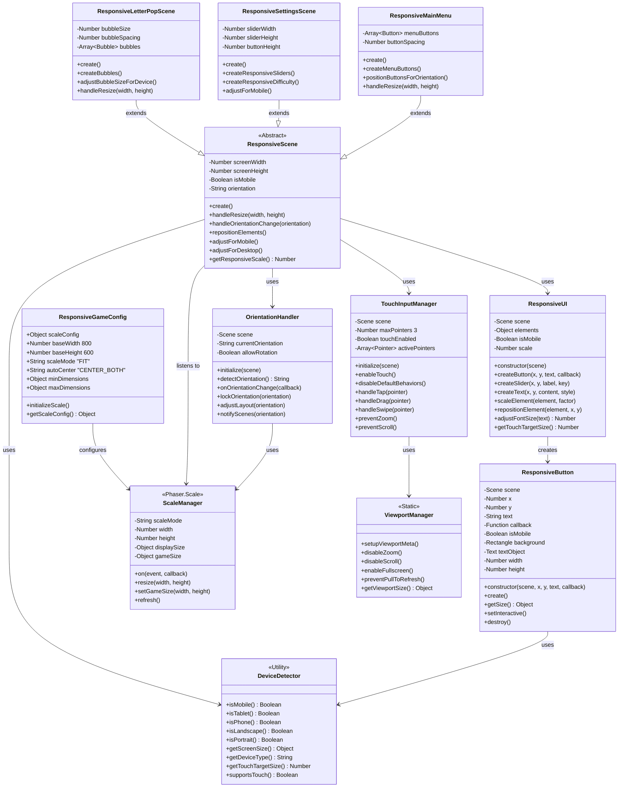

## Sequence Diagram: Game Load on Mobile

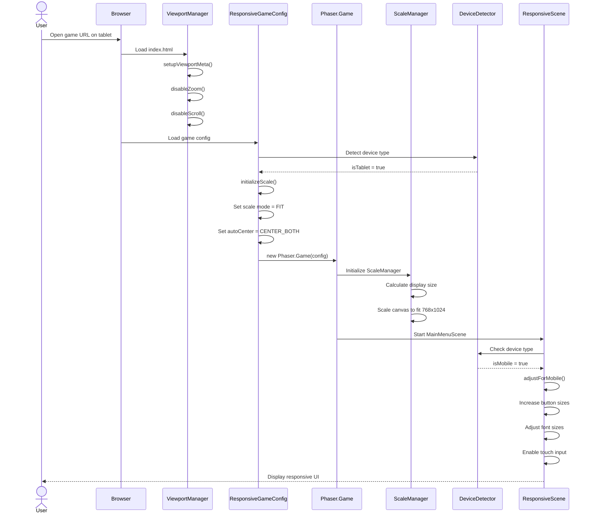

## Sequence Diagram: Orientation Change

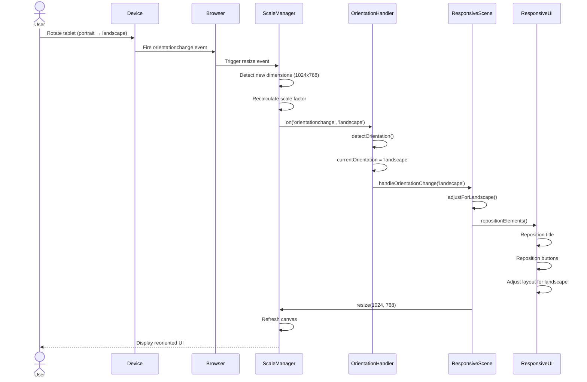

## Sequence Diagram: Touch Input on Bubble

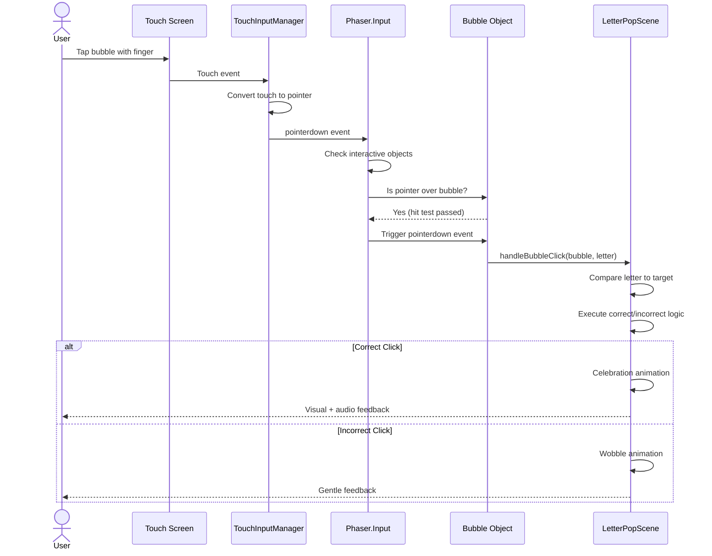

## State Diagram: Responsive Layout States

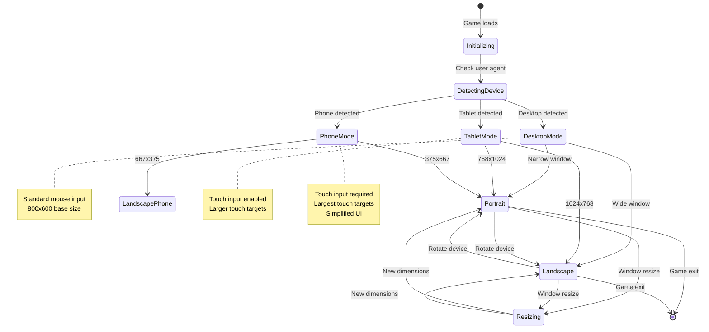

## Activity Diagram: Responsive Scene Creation

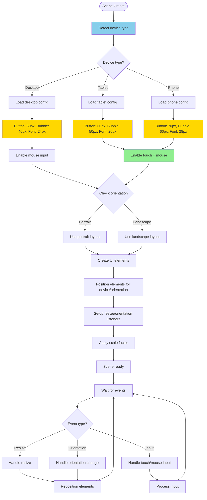

## Component Diagram: Responsive System Architecture

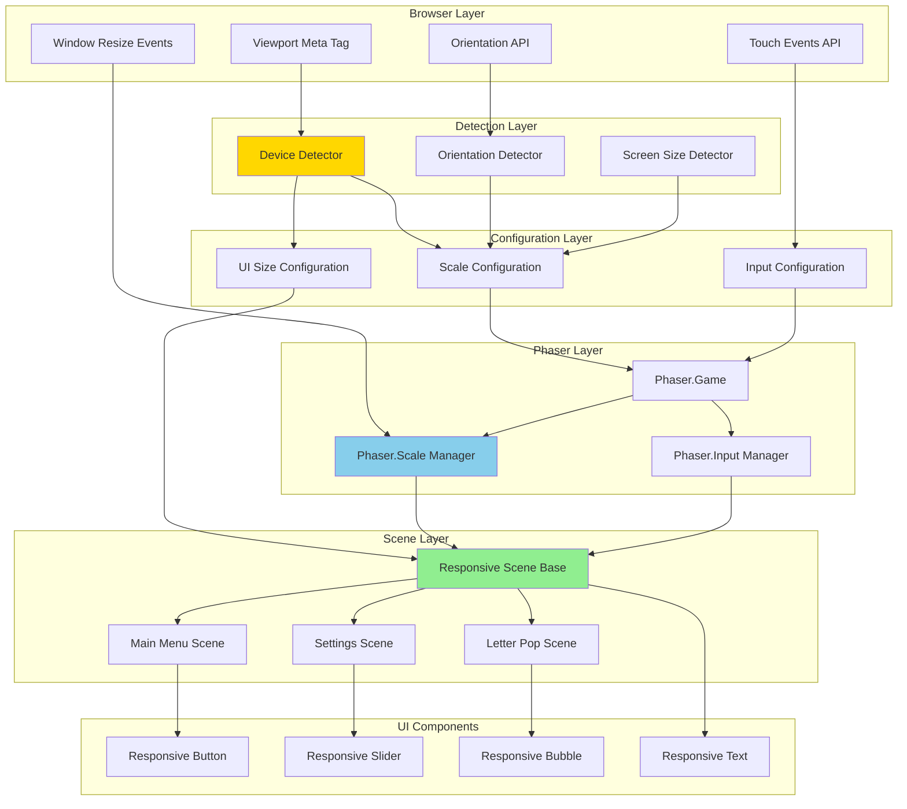

## Data Flow Diagram: Screen Size Adaptation

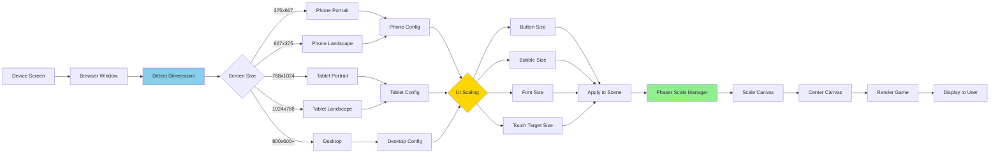

## Touch Target Size Matrix

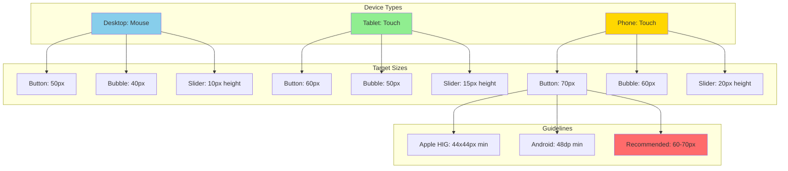

## Scale Manager Configuration Diagram

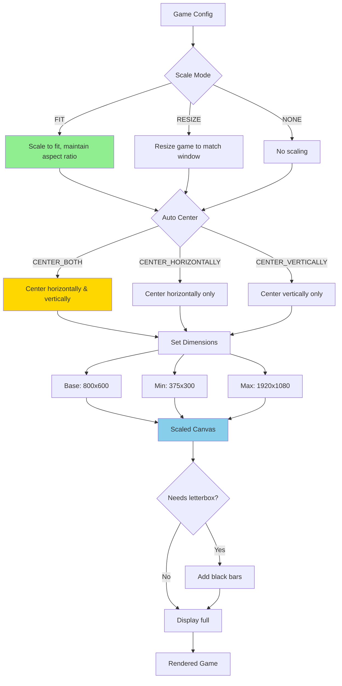

## Responsive Button Size Calculation

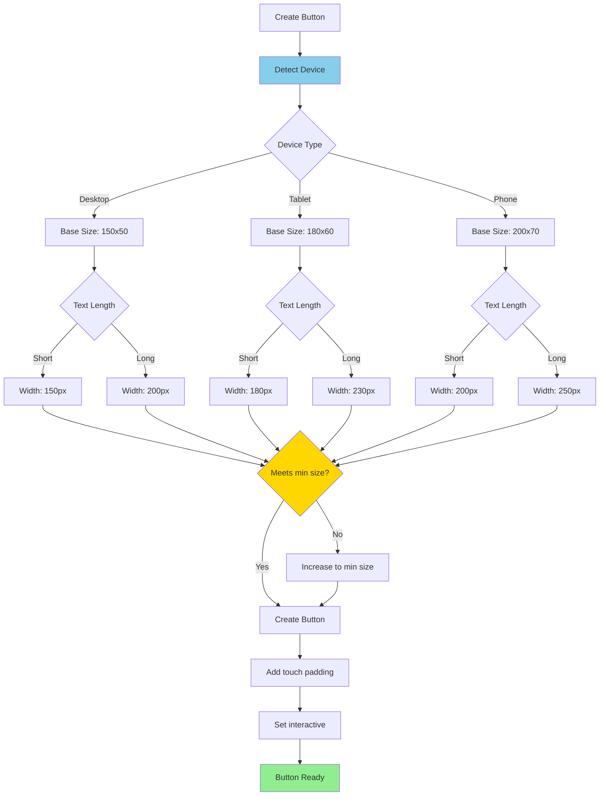

## Orientation Change Flow

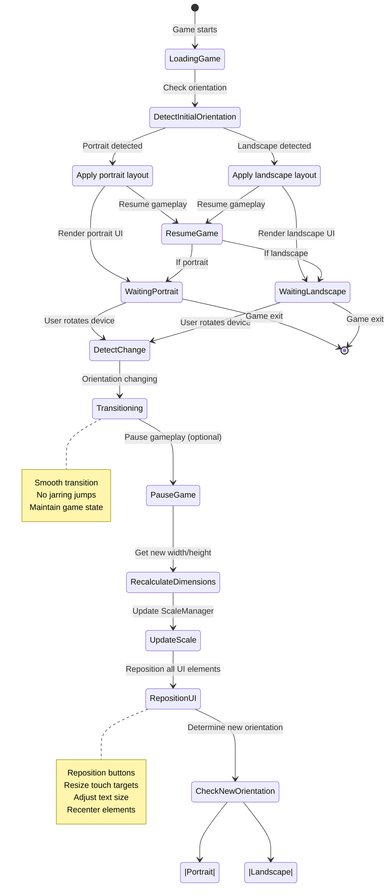

## Notes

### Architecture Decisions

**Scale Mode Choice: FIT**
- FIT mode scales canvas to fit viewport while maintaining aspect ratio
- Prevents stretching (keeps game looking correct)
- Adds letterboxing if needed (black bars top/bottom or sides)
- Alternative RESIZE mode changes game dimensions (requires more work)

**Touch Target Sizing**
- Desktop: 40-50px (mouse is precise)
- Tablet: 50-60px (finger is less precise)
- Phone: 60-70px (smallest screen, needs largest targets)
- Based on Apple HIG (44x44px) and Android guidelines (48dp)

**Device Detection Strategy**
- Use user agent string for initial detection
- Use screen dimensions as secondary check
- Assume touch support if mobile/tablet detected
- Phaser handles most touch/mouse unification

**Orientation Handling**
- Support both portrait and landscape on tablets (common use case)
- Consider portrait-only on phones (most natural for this game)
- Pause game during orientation change (optional, prevents confusion)
- Reposition UI elements smoothly after rotation

### Why This Design?

**Phaser Scale Manager**
- Built-in solution (no custom scaling code needed)
- Handles resize events automatically
- Provides orientation change detection
- Manages aspect ratio preservation

**Responsive Base Class**
- All scenes extend ResponsiveScene
- Shared device detection logic
- Consistent resize handling
- DRY principle (don't repeat yourself)

**Touch Input Unification**
- Phaser treats touch and mouse as "pointers"
- Use pointerdown/pointermove for both
- No separate touch vs mouse handlers needed
- Simplifies code significantly

**Viewport Meta Configuration**
- Disables zoom (prevents double-tap zoom conflicts)
- Disables scroll (prevents pull-to-refresh interference)
- Sets initial scale to 1.0 (no default zoom)
- Critical for smooth touch experience

### Component Relationships

1. **ResponsiveGameConfig configures ScaleManager**
   - Sets scale mode (FIT)
   - Sets auto-center (CENTER_BOTH)
   - Defines min/max dimensions
   - ScaleManager handles the rest

2. **DeviceDetector informs UI creation**
   - Scenes check device type at create()
   - UI components adjust size based on device
   - Touch targets increase for mobile
   - Font sizes adjust for readability

3. **OrientationHandler coordinates layout changes**
   - Listens to ScaleManager orientation events
   - Notifies scenes of orientation changes
   - Scenes adjust layouts accordingly
   - Smooth transitions between orientations

4. **TouchInputManager unifies input**
   - Prevents default browser behaviors (zoom, scroll)
   - Configures multi-touch support (3 pointers)
   - Handles tap, drag, swipe gestures
   - Works identically on desktop (mouse) and mobile (touch)

5. **ResponsiveUI creates adaptive components**
   - Buttons scale based on device type
   - Sliders adjust width/height for touch
   - Text sizes calculated for readability
   - All components are touch-friendly

### Performance Considerations

**Canvas Scaling**
- FIT mode scales canvas via CSS (GPU-accelerated)
- No performance penalty for scaling
- Maintains 60fps on modern devices
- May drop to 30fps on older devices (acceptable)

**Resize Event Handling**
- Resize events can fire frequently during rotation
- Debounce if needed (only process last event)
- Phaser's built-in handling is efficient
- No manual throttling needed in most cases

**Touch Input Processing**
- Touch events have similar cost to mouse events
- Phaser's pointer system is optimized
- Multi-touch adds minimal overhead
- No performance concern for this game

**Memory Management**
- Orientation changes don't recreate scenes (just reposition)
- UI elements reuse existing objects
- No memory leaks from resize handlers
- Proper cleanup when scenes destroy

This design provides a robust responsive system that adapts Aurora's Letter Adventure to any device size while maintaining consistent gameplay and performance. The use of Phaser's built-in Scale Manager minimizes custom code while providing professional-grade responsiveness.
