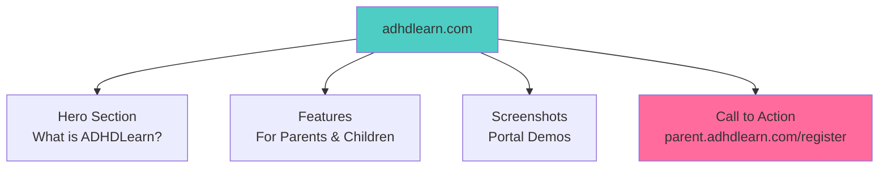

# Phase 21: Architecture Diagrams

**Project:** ADHDLearn.com
**Phase:** 21 of 36
**Last Updated:** October 22, 2025

---

## Site Structure

```mermaid
graph TB
    Root[adhdlearn.com] --> Hero[Hero Section<br/>What is ADHDLearn?]
    Root --> Features[Features<br/>For Parents & Children]
    Root --> Screenshots[Screenshots<br/>Portal Demos]
    Root --> CTA[Call to Action<br/>parent.adhdlearn.com/register]
    
    style Root fill:#4ECDC4
    style CTA fill:#FF6B9D
```

---

