# Phase 22: Letter Pop Polish - UML

## Polish Systems Architecture

```mermaid
graph TB
    LetterPopScene[LetterPopScene]

    LetterPopScene --> AnimationSystem[Animation System]
    LetterPopScene --> ParticleSystem[Particle System]
    LetterPopScene --> AudioSystem[Audio System]
    LetterPopScene --> PerformanceMonitor[Performance Monitor]

    AnimationSystem --> BubbleSpawn[Bubble Spawn Animation]
    AnimationSystem --> BubbleFloat[Bubble Float Animation]
    AnimationSystem --> BubblePop[Bubble Pop Animation]
    AnimationSystem --> UIAnimations[UI Animations]

    ParticleSystem --> PopParticles[Pop Particles]
    ParticleSystem --> CorrectParticles[Correct Answer Particles]
    ParticleSystem --> IncorrectParticles[Incorrect Answer Particles]
    ParticleSystem --> ParticlePool[Particle Pool Manager]

    AudioSystem --> BGMusic[Background Music Manager]
    AudioSystem --> SFXManager[Sound Effects Manager]
    AudioSystem --> AudioDucker[Audio Ducking]
    AudioSystem --> VolumeControl[Volume Control]

    PerformanceMonitor --> FPSTracker[FPS Tracker]
    PerformanceMonitor --> MemoryMonitor[Memory Monitor]
    PerformanceMonitor --> OptimizationTrigger[Optimization Trigger]

    style LetterPopScene fill:#90EE90
    style AnimationSystem fill:#FFD700
    style ParticleSystem fill:#FF69B4
    style AudioSystem fill:#87CEEB
    style PerformanceMonitor fill:#FFA500
```

## Animation System Class Diagram

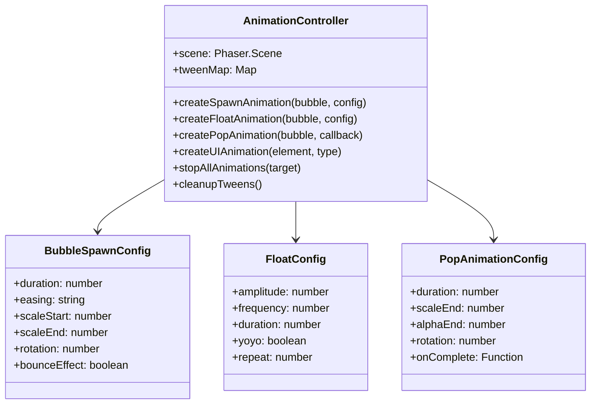

## Particle System Class Diagram

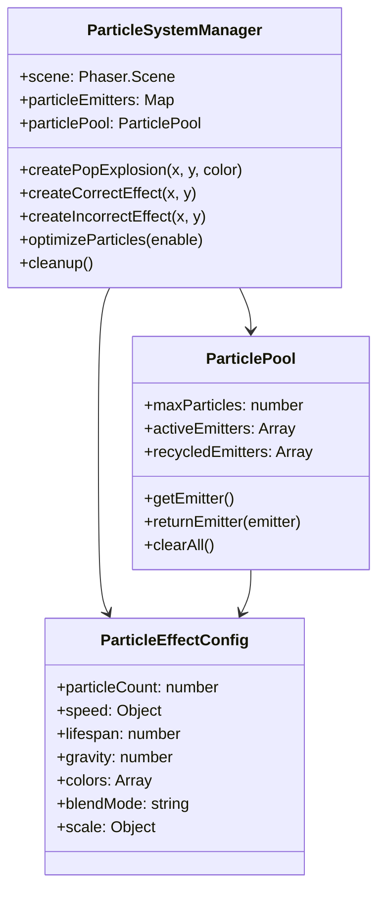

## Audio System Class Diagram

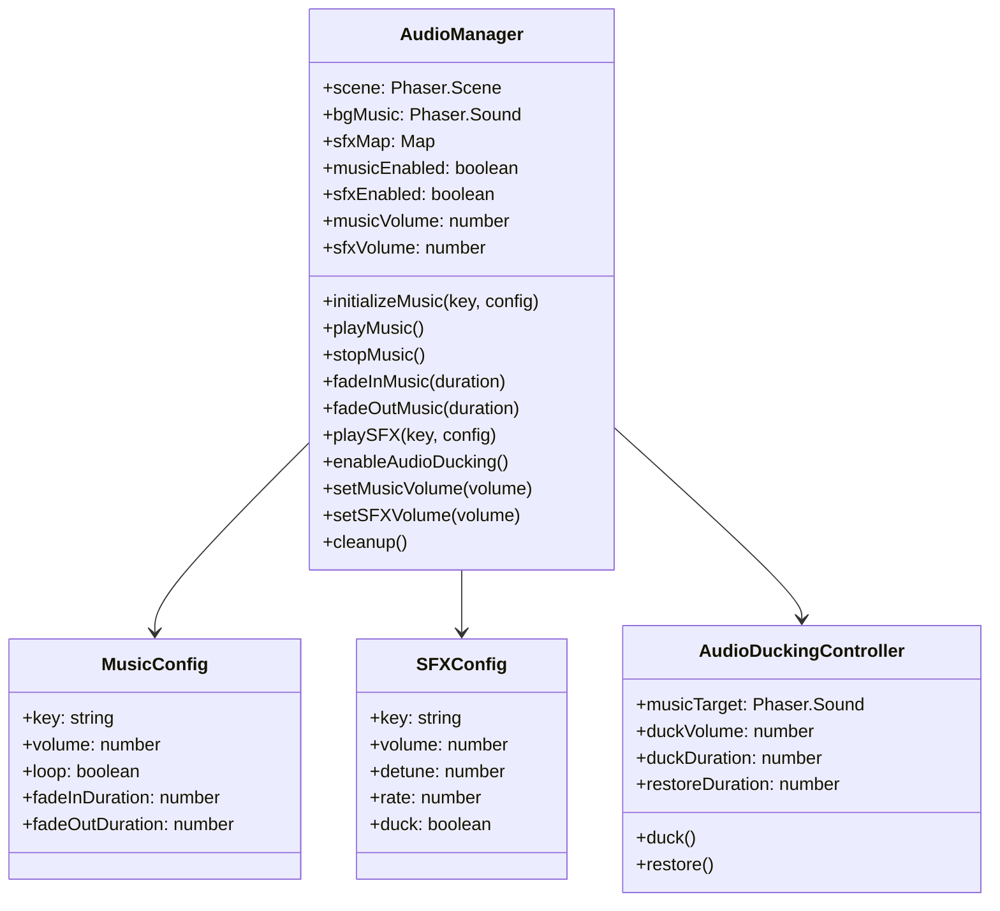

## Polish Workflow Sequence Diagram

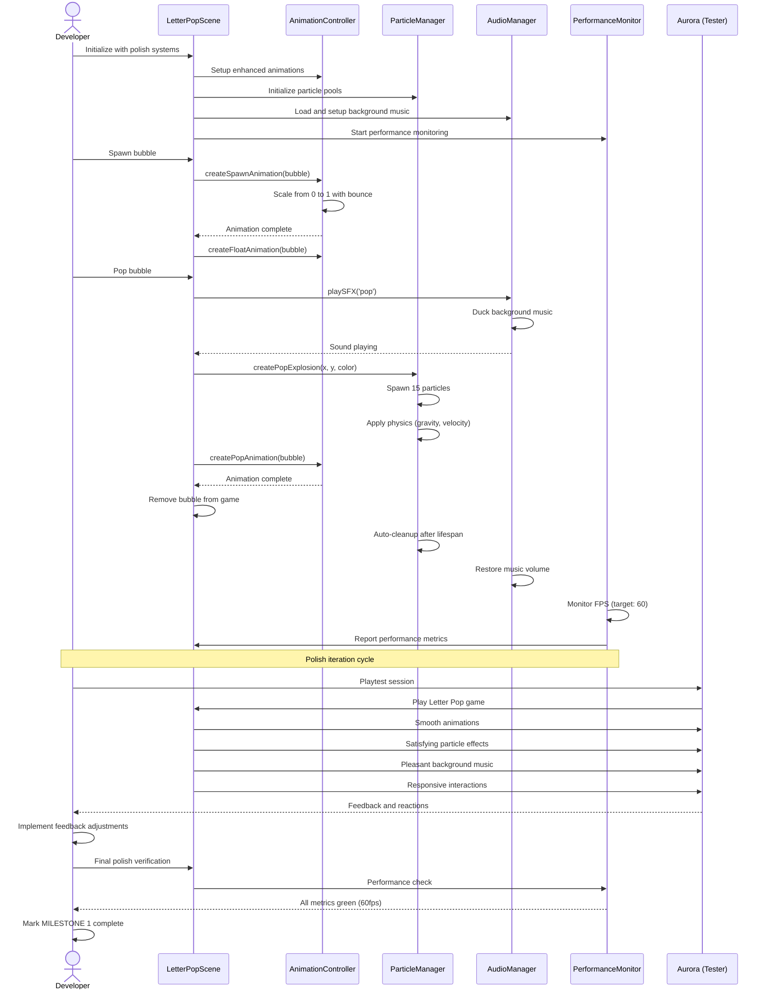

## Bubble Spawn Animation State Diagram

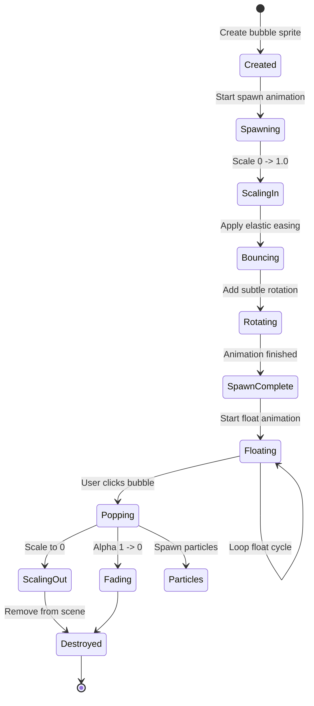

## Audio Ducking Sequence Diagram

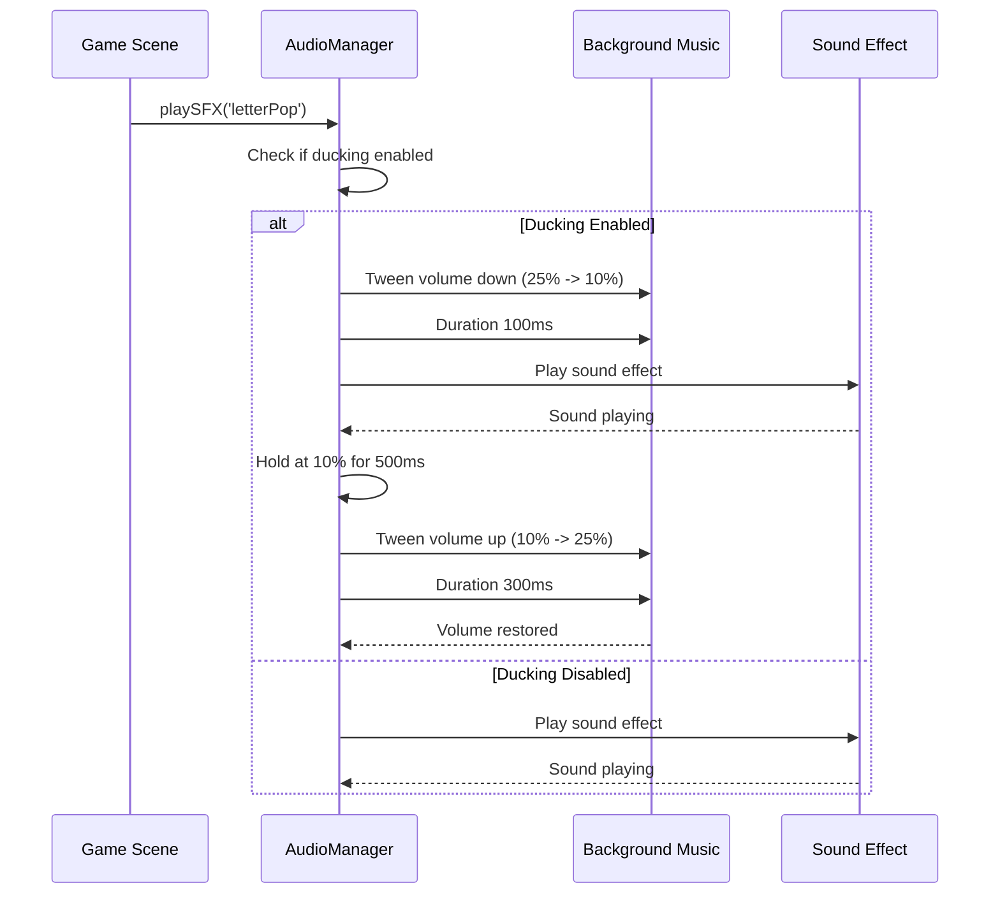

## Performance Optimization Flow

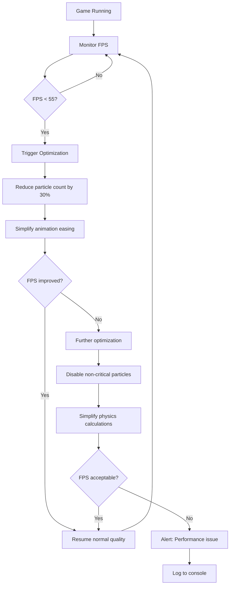

## Polish Checklist Component Diagram

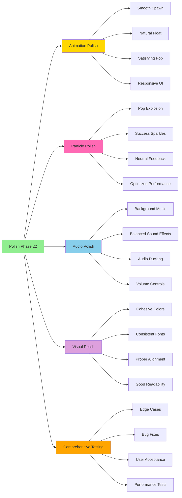

## User Acceptance Testing Flow

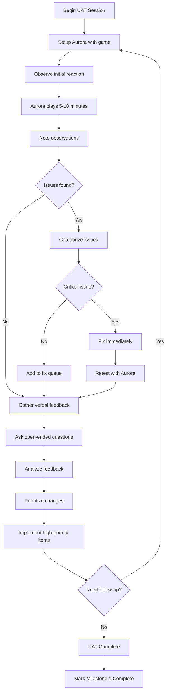

## Integration Points

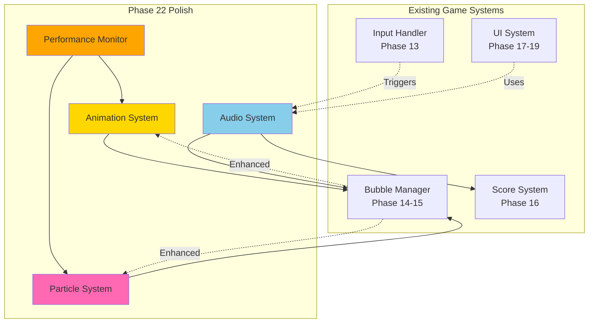

## Notes

### Why This Architecture?

**Separation of Concerns**
- Animation, particles, audio, and performance are separate systems
- Each system can be optimized independently
- Easier to debug and maintain
- Clear interfaces between systems

**Performance Monitoring**
- Real-time FPS tracking ensures smooth gameplay
- Automatic optimization triggers when performance drops
- Graceful degradation maintains playability
- Performance data helps identify bottlenecks

**Particle Pooling**
- Reuses particle emitters instead of creating new ones
- Reduces garbage collection pressure
- Maintains consistent performance
- Essential for 60fps target

**Audio Ducking**
- Prevents audio conflicts (music vs SFX)
- Improves audio clarity
- Professional audio experience
- ADHD-friendly (reduces audio chaos)

**User Acceptance Testing**
- Aurora is the primary user - her feedback is critical
- Structured testing ensures comprehensive feedback
- Iterative approach allows for refinement
- Validates all polish work

### What This Phase Proves

1. **Production Quality**: Game meets professional standards
2. **Performance**: Maintains 60fps under all conditions
3. **Polish**: Every detail has been refined
4. **User Satisfaction**: Target user enjoys the game
5. **Milestone Achievement**: Letter Pop MVP is complete

### Milestone 1 Significance

This architecture marks the completion of the first major milestone. All systems are:
- Fully functional
- Polished and refined
- Tested and bug-free
- Optimized for performance
- Validated by target user

This is the foundation for all future features. The architecture is solid, extensible, and maintainable.
