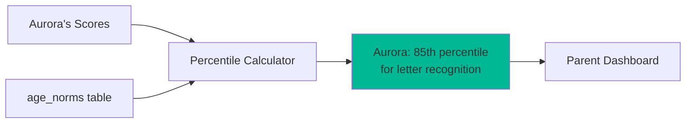
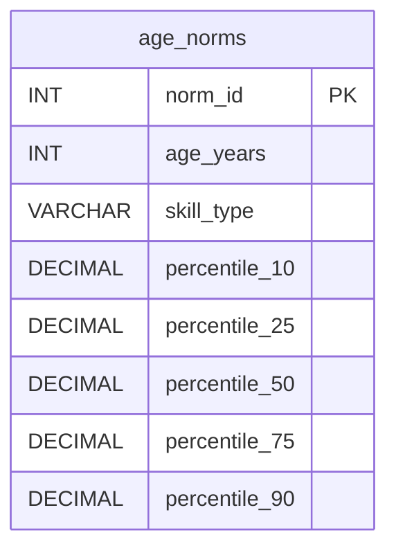
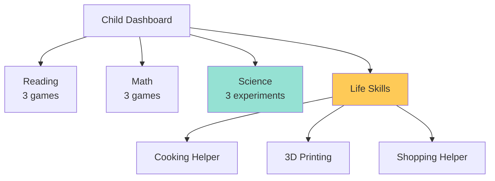
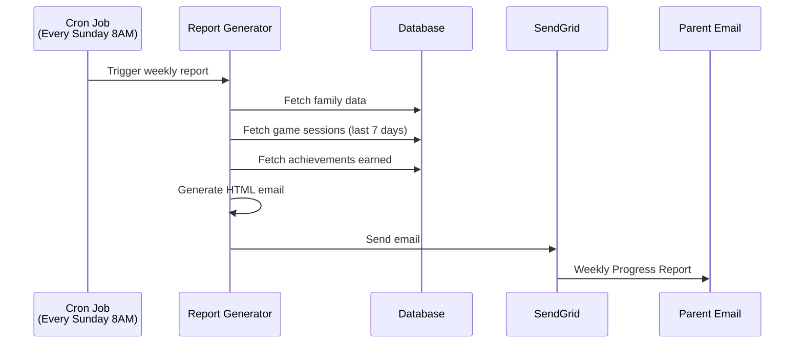
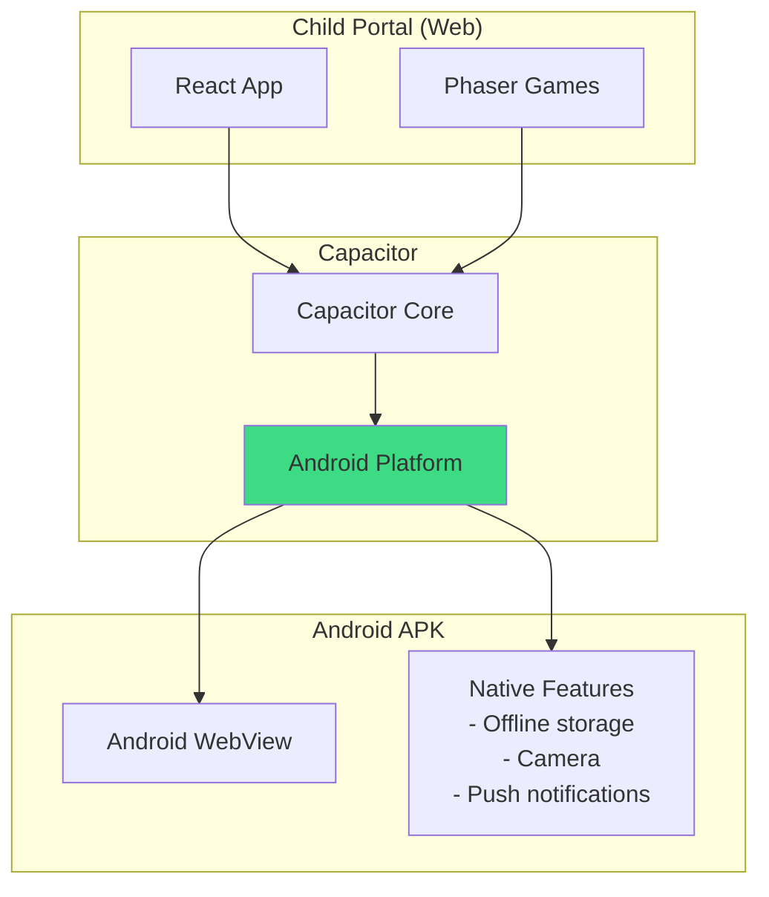
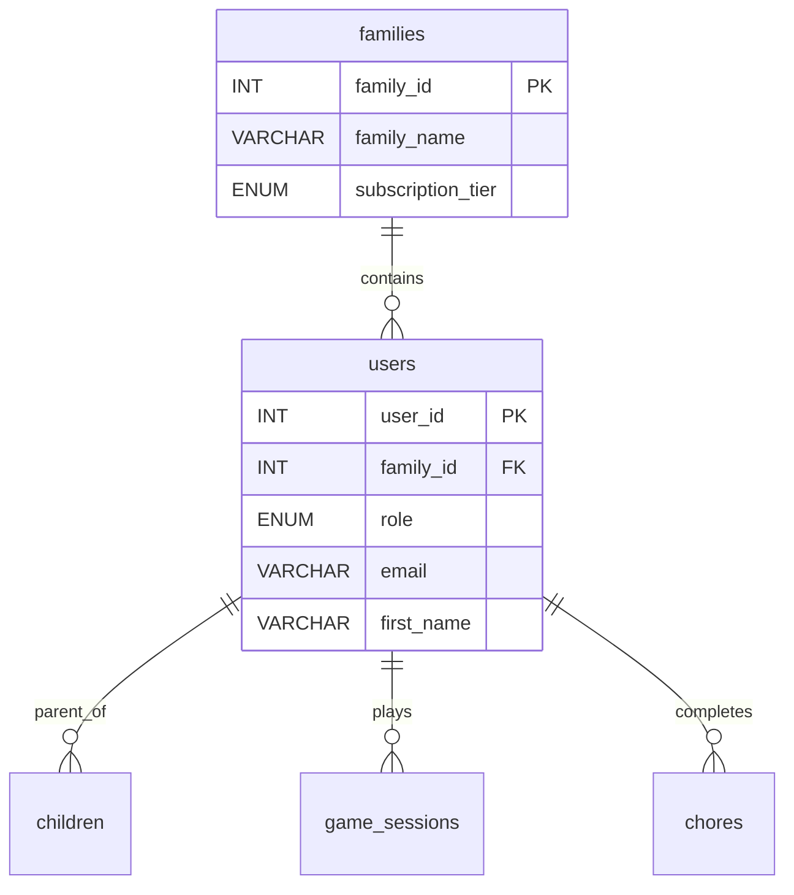
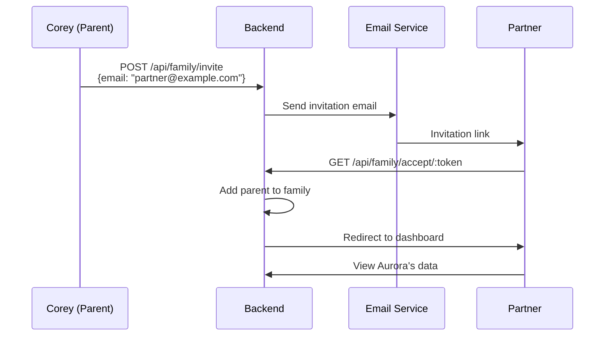
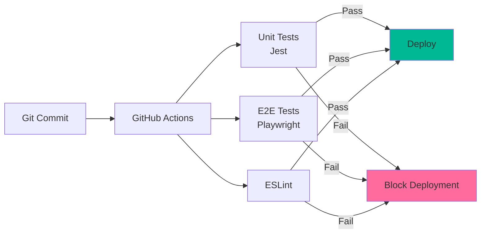
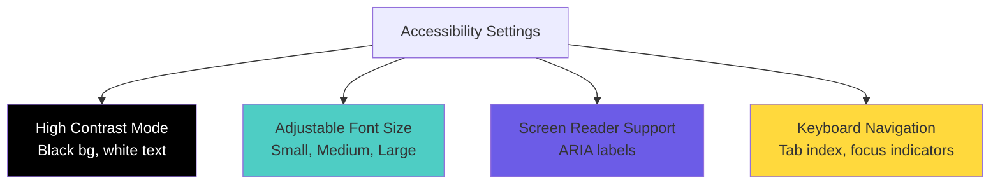

# Phase 22: Architecture Diagrams

**Project:** ADHDLearn.com
**Phase:** 22 of 36
**Last Updated:** October 22, 2025

---


## Percentile Calculation



## Age Norms ERD



---

# Phase 23-26: Life Skills Categories - Architecture

## Category Expansion



---

# Phase 27: Weekly Reports - Email Architecture

## Email Service Flow



---

# Phase 28: ML Pattern Detection - Architecture

## Machine Learning Pipeline

```mermaid
graph TB
    subgraph "Data Collection"
        LetterAttempts[letter_pop_attempts]
        GameSessions[game_sessions]
    end
    
    subgraph "ML Service (Python)"
        DataLoader[Load Data]
        FeatureExtraction[Extract Features<br/>- Time of day<br/>- Letter pairs<br/>- Accuracy trends]
        Model[Scikit-learn Model]
        Insights[Generate Insights]
    end
    
    subgraph "Parent Dashboard"
        Alerts[ML Insights:<br/>"Aurora struggles with b/d<br/>in afternoons"]
    end
    
    LetterAttempts --> DataLoader
    GameSessions --> DataLoader
    DataLoader --> FeatureExtraction
    FeatureExtraction --> Model
    Model --> Insights
    Insights --> Alerts
    
    style Model fill:#6C5CE7
    style Alerts fill:#FF6B9D
```

---

# Phase 29: PDF Reports - Architecture

## PDF Generation Flow

```mermaid
graph LR
    Dashboard[Parent Dashboard] -->|Click "Download PDF"| Generate[PDF Generator<br/>Puppeteer]
    Generate --> Render[Render HTML with Charts]
    Render --> Convert[Convert to PDF]
    Convert --> Download[Download report.pdf]
    
    style Generate fill:#4ECDC4
    style Download fill:#00B894
```

---

# Phase 30: Android APK - Architecture

## Capacitor Wrapper



---

# Phase 31-32: Multi-User Support - Architecture

## Family Structure



## Multi-Parent Flow



---

# Phase 33: Parental Controls - Architecture

## Screen Time Enforcement

```mermaid
graph TB
    ChildLogin[Child Logs In] --> CheckControls[Check parental_controls]
    CheckControls --> TimeLimit[Daily time limit?]
    TimeLimit -->|30 min limit| StartTimer[Start session timer]
    
    StartTimer --> PlayGame[Aurora plays games]
    PlayGame --> CheckTimer{Time remaining?}
    CheckTimer -->|Time left| PlayGame
    CheckTimer -->|Time expired| Lockout[Lock portal:<br/>"Time's up for today!"]
    
    style Lockout fill:#FF6B9D
```

---

# Phase 34: Testing Infrastructure - Architecture

## CI/CD Pipeline



---

# Phase 35: Performance Optimization - Architecture

## Optimization Layers

```mermaid
graph TB
    subgraph "Frontend Optimizations"
        CodeSplit[Code Splitting<br/>React.lazy()]
        ImageOpt[Image Optimization<br/>WebP format]
        LazyLoad[Lazy Loading<br/>Non-critical resources]
    end
    
    subgraph "Backend Optimizations"
        QueryOpt[Database Query Optimization<br/>Indexes, joins]
        Cache[Redis Caching<br/>Session data, high scores]
    end
    
    subgraph "Infrastructure"
        CDN[CloudFlare CDN<br/>Static assets]
    end
    
    Browser[Browser] --> CDN
    CDN --> CodeSplit
    CodeSplit --> ImageOpt
    ImageOpt --> LazyLoad
    
    LazyLoad --> Cache
    Cache --> QueryOpt
    
    style CDN fill:#4ECDC4
    style Cache fill:#FF6B9D
```

---

# Phase 36: Accessibility - Architecture

## Accessibility Features



---

**UML.md Complete:** All 36 phases (0-36) with comprehensive architecture diagrams, ERDs, sequence diagrams, and technical visualizations

