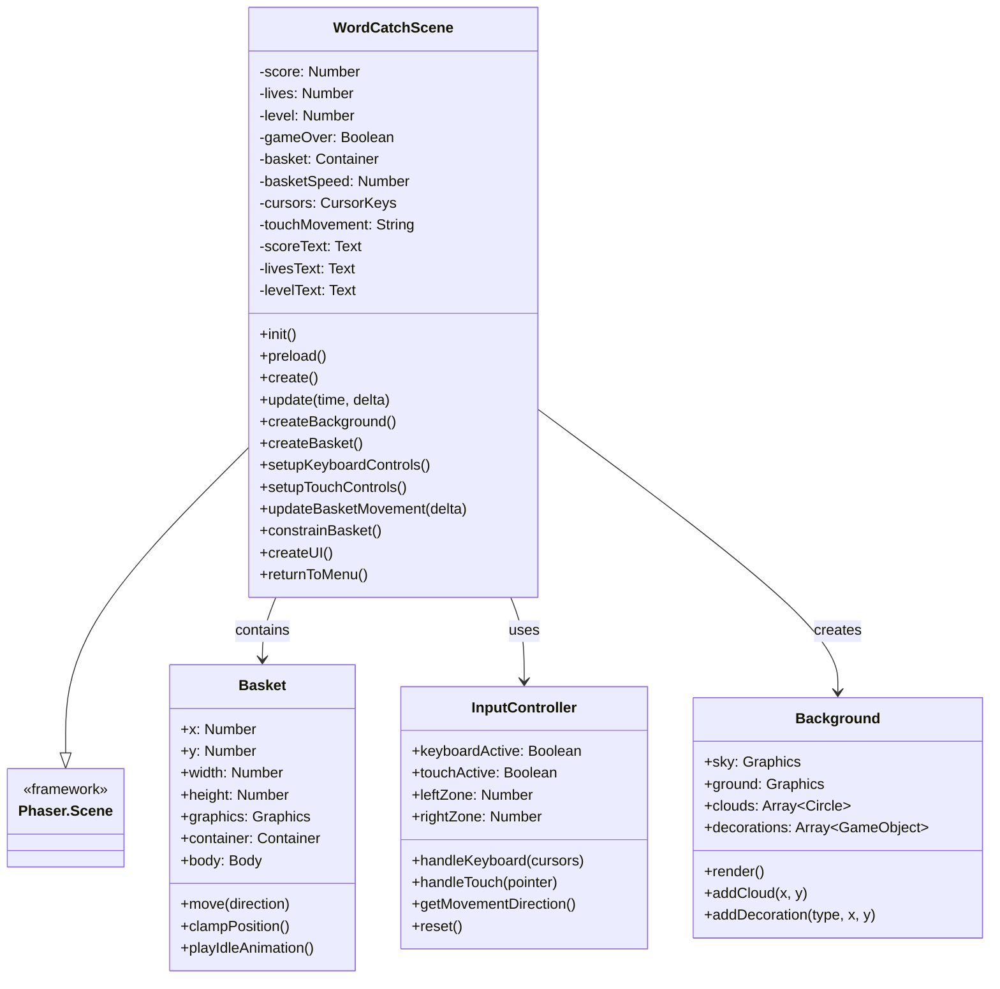
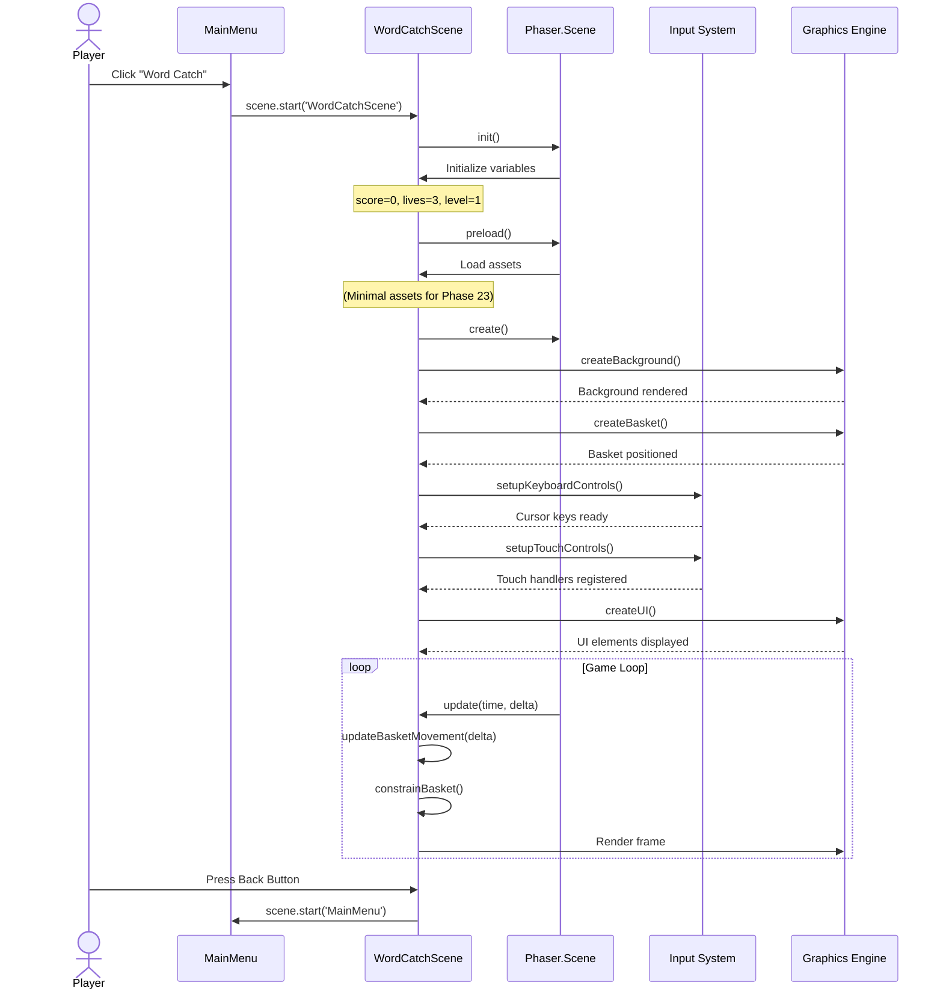
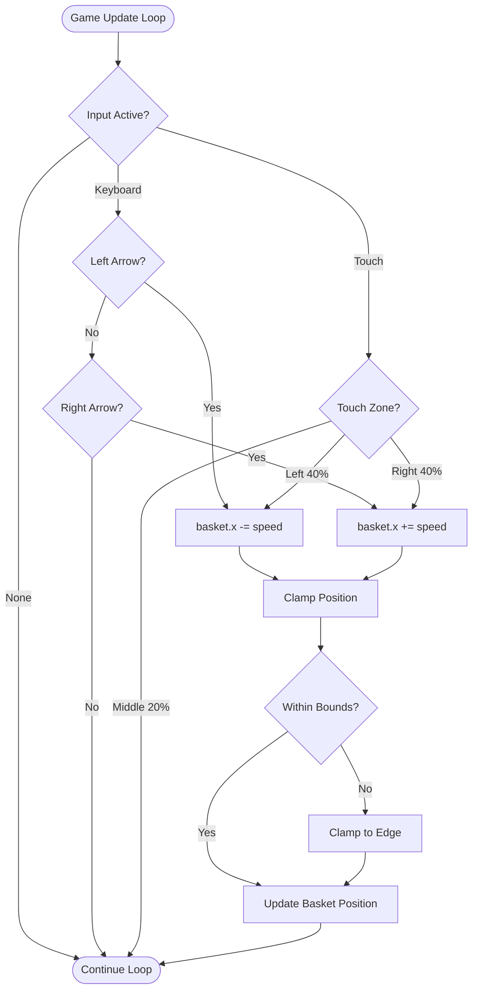
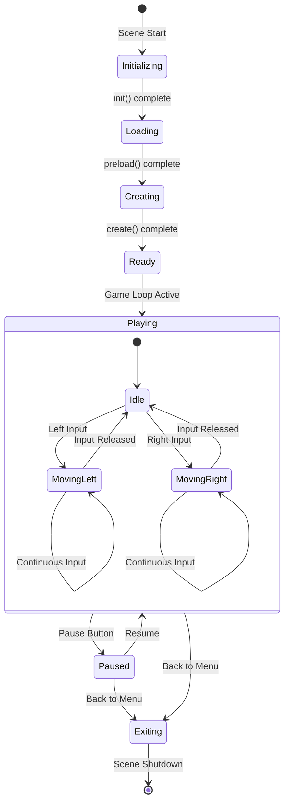
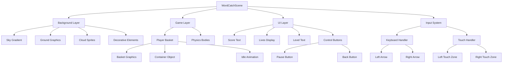
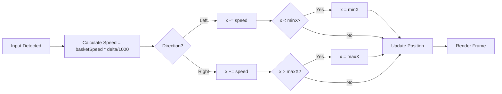
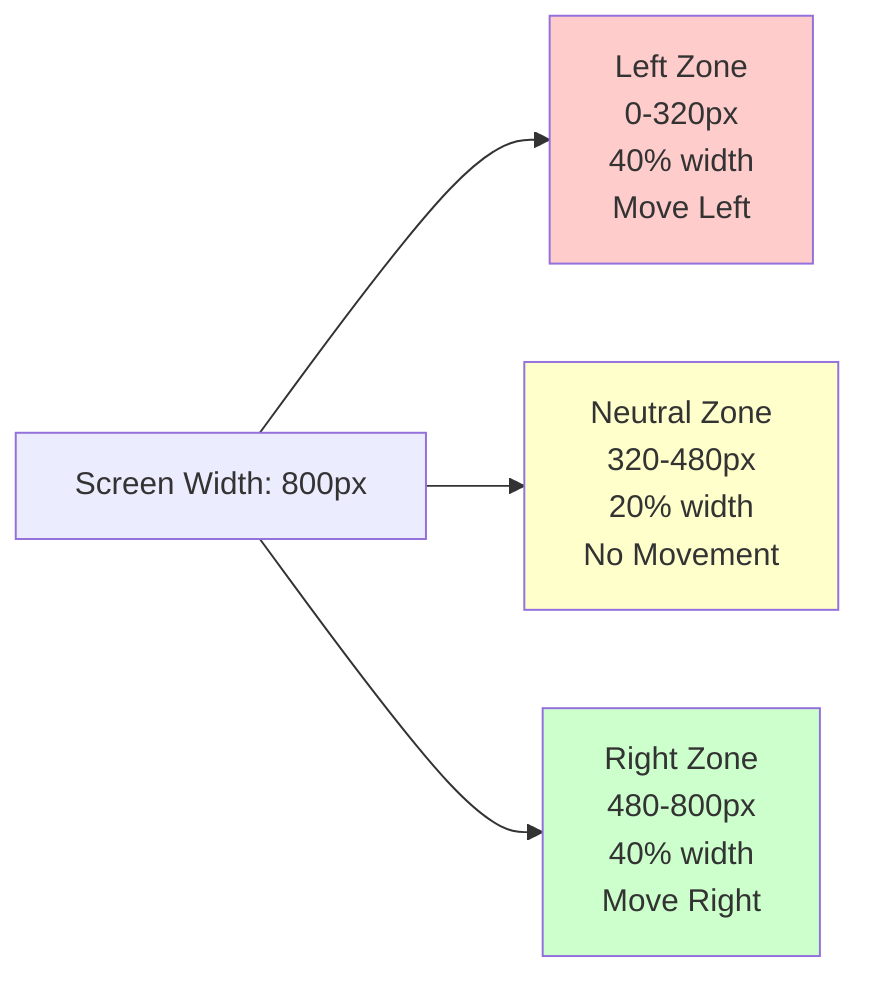
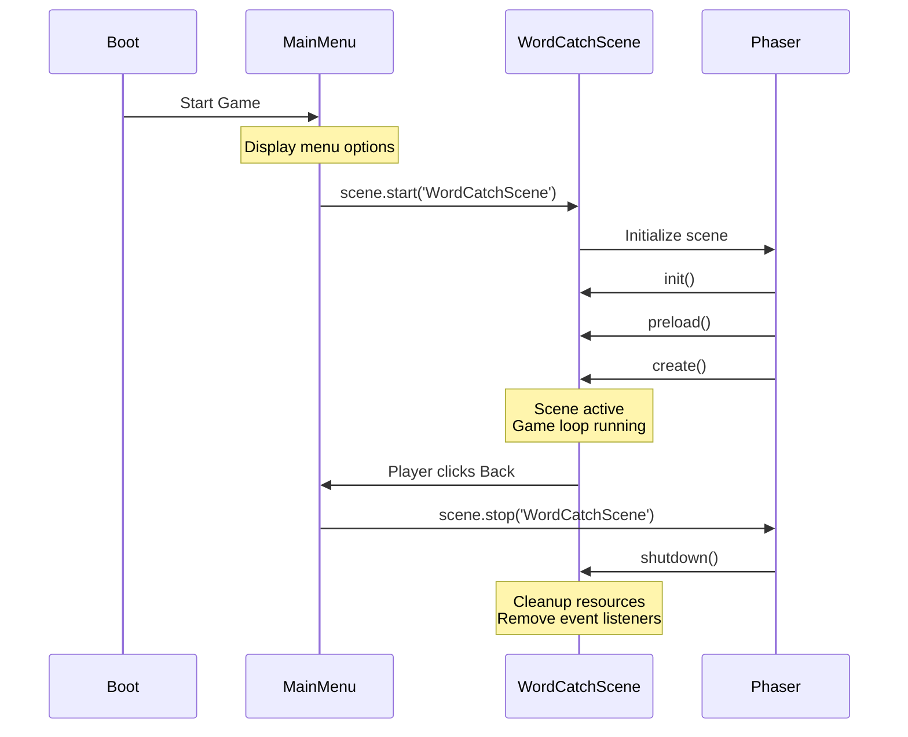
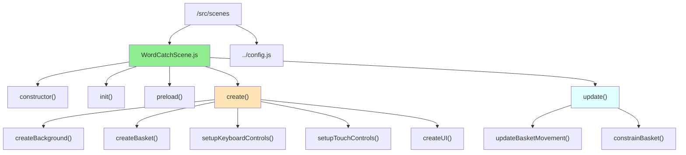
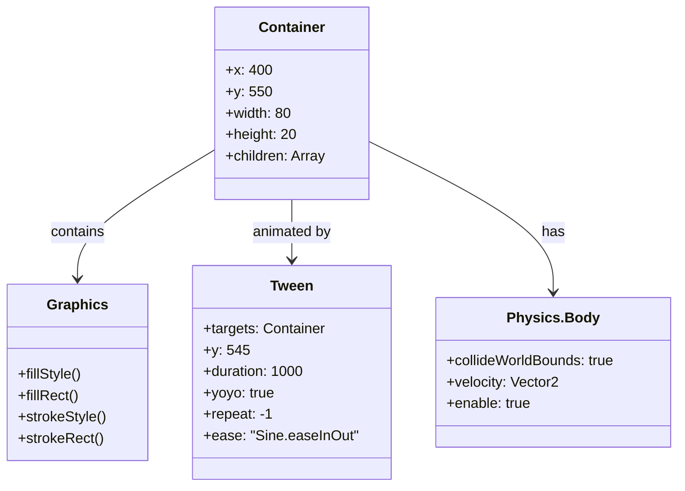

# Phase 23: Word Catch - Scene Setup - UML

## Class Diagram

## Scene Lifecycle Sequence

## Input Flow Diagram

## State Diagram

## Component Structure

## Basket Movement Physics

## Touch Zone Layout

## Scene Management Flow

## File Structure

## Basket Graphics Structure

## Notes

### Architecture Decisions

**Container vs Sprite for Basket**
- Using Container allows flexibility for complex basket graphics
- Can easily add multiple Graphics objects for basket detail
- Can swap to Sprite later if artist provides basket image
- Container makes positioning and animation simpler

**Input Handling Approach**
- Separate keyboard and touch handlers for clarity
- Both update same basket position
- No conflict because only one input type active at a time
- Touch zones (40%-20%-40%) provide clear input regions

**Scene Structure**
- Follows Phaser lifecycle: init → preload → create → update
- Clear separation of concerns (background, basket, input, UI)
- Easy to extend in Phase 24 with falling word mechanics
- Modular methods make testing and debugging easier

**Movement Physics**
- Delta-based movement ensures consistent speed across frame rates
- Clamping keeps basket on screen (padding: 50px)
- No acceleration in Phase 23 (can add polish later)
- Speed value (250px/s) is easily tunable

### Why This Structure?

**Preparation for Phase 24**
- Scene structure designed to easily add FallingWord objects
- Physics system ready for collision detection
- Update loop ready for word spawning logic
- Basket positioned and ready to "catch" words

**Child-Friendly Design**
- Large touch zones (40% of screen) easy for small fingers
- Responsive movement (no lag)
- Clear visual feedback (basket moves smoothly)
- Simple controls (just left and right)

**Performance Considerations**
- Minimal graphics in Phase 23 (just background and basket)
- No particle systems yet
- No complex physics yet
- Ensures 60fps baseline before adding words

This architecture provides a solid foundation for Word Catch gameplay while keeping Phase 23 scope focused on movement and controls.
