# Phase 24: Word Catch - Falling Words - UML

## Class Diagram

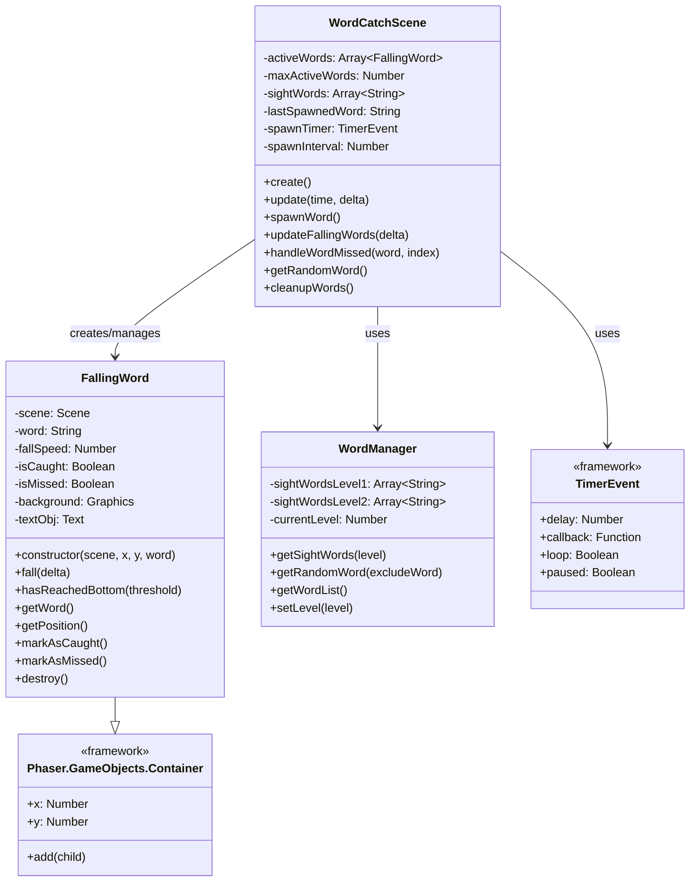

## Falling Word Lifecycle Sequence

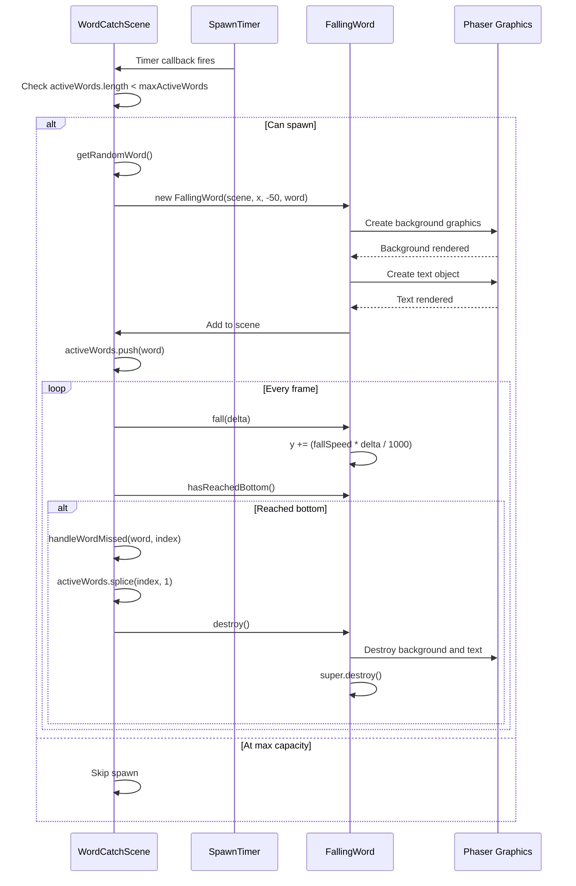

## Word Spawning Flow

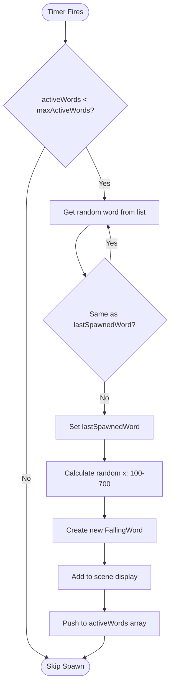

## Update Loop Diagram

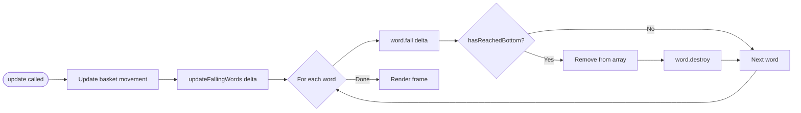

## FallingWord Internal Structure

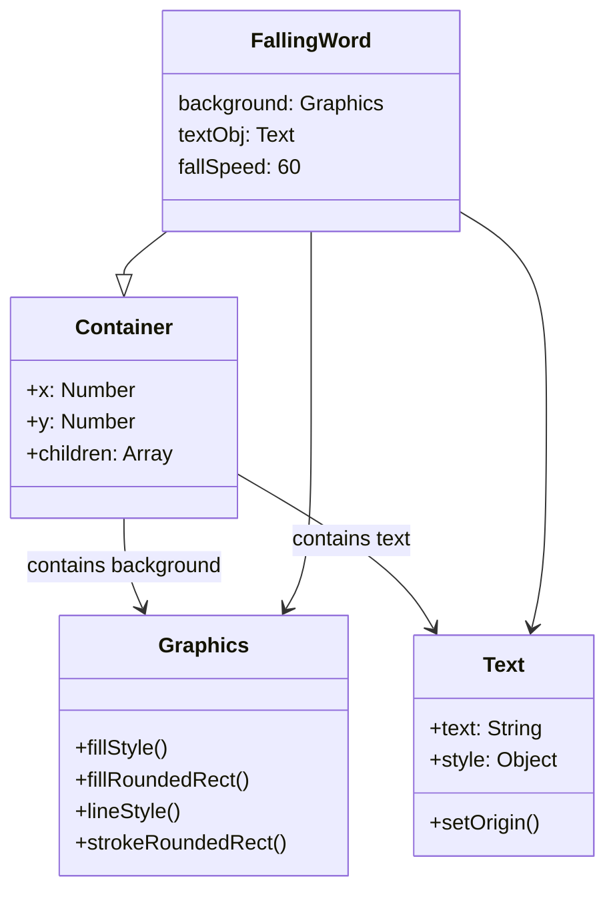

## State Diagram: FallingWord States

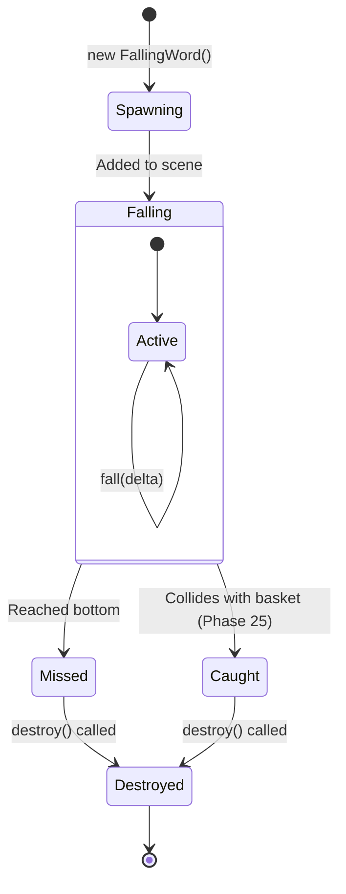

## Word Spawn Timing Diagram

```mermaid
gantt
    title Word Spawning Timeline
    dateFormat X
    axisFormat %S

    section Spawn Events
    First word spawns immediately    :milestone, 0, 0
    Second word spawns              :milestone, 2500, 2500
    Third word spawns               :milestone, 5000, 5000
    Max capacity reached (3 words)  :crit, 5000, 7500
    First word reaches bottom       :milestone, 7500, 7500
    Fourth word can now spawn       :milestone, 7500, 7500
    Fifth word spawns               :milestone, 10000, 10000
```

## Word Despawn and Cleanup Flow

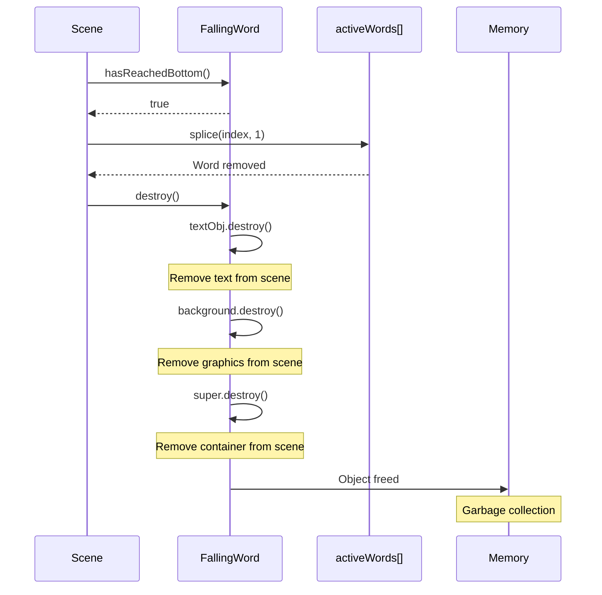

## Component Structure

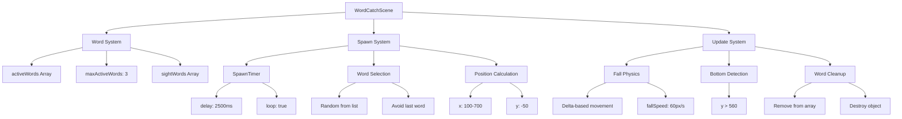

## Physics Calculation Diagram

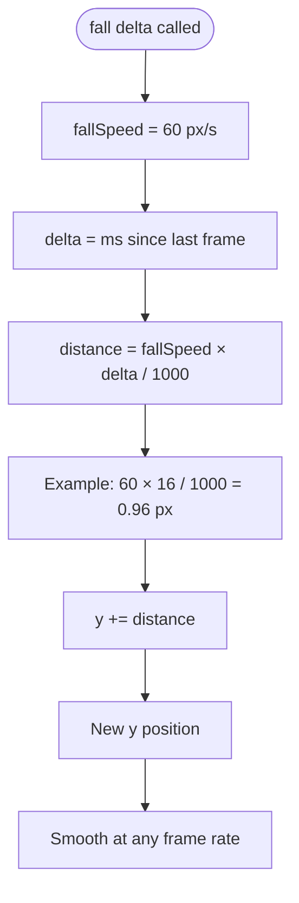

## Sight Word Data Structure

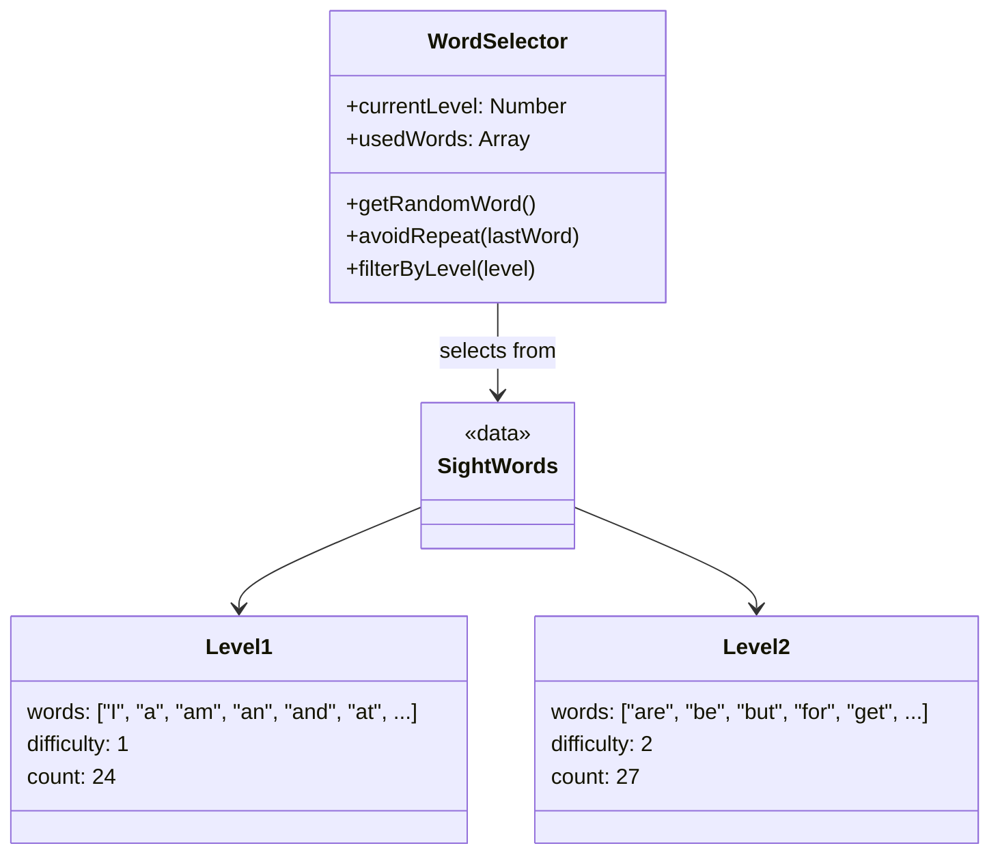

## Memory Management Flow

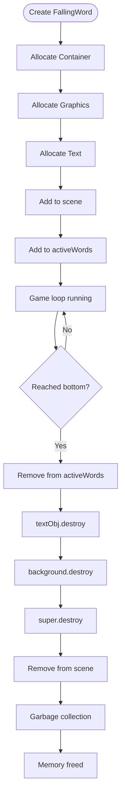

## Spawn Position Calculation

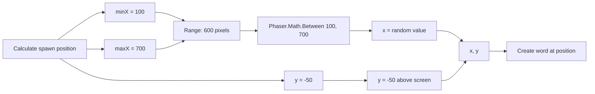

## Word Array Management

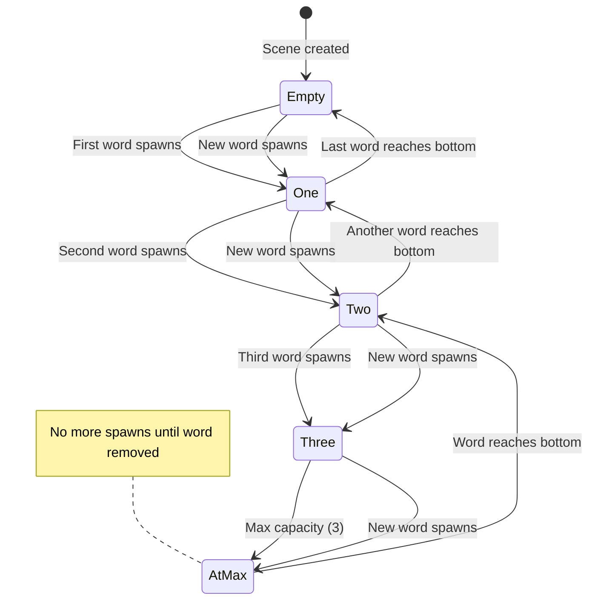

## Integration with WordCatchScene

```mermaid
sequenceDiagram
    participant Scene as WordCatchScene
    participant Create as create()
    participant Update as update()
    participant Spawn as spawnWord()
    participant Word as FallingWord

    Scene->>Create: Initialize scene
    Create->>Create: activeWords = []
    Create->>Create: maxActiveWords = 3
    Create->>Create: Load sight words list

    Create->>Scene: Setup spawn timer
    Scene->>Spawn: First word (delayed 500ms)
    Spawn->>Word: new FallingWord(...)
    Word-->>Spawn: Word created
    Spawn->>Create: activeWords.push(word)

    loop Every 2.5 seconds
        Scene->>Spawn: Timer callback
        Spawn->>Word: new FallingWord(...)
        Spawn->>Create: activeWords.push(word)
    end

    loop Every frame
        Scene->>Update: update(time, delta)
        Update->>Update: updateFallingWords(delta)
        Update->>Word: word.fall(delta)
        Word-->>Update: Position updated
    end
```

## Notes

### Architecture Decisions

**FallingWord as Container vs Sprite**
- Container chosen for flexibility
- Can contain multiple children (background graphics + text)
- Easy to manipulate as single unit
- Can add more visual elements later without refactoring
- Could switch to Sprite if using image assets

**Delta-Based Movement**
- `distance = fallSpeed * delta / 1000`
- Ensures consistent speed regardless of frame rate
- Critical for smooth animation on different devices
- Matches basket movement approach from Phase 23

**Max Active Words Limit**
- Prevents overwhelming player (especially important for ADHD)
- Prevents performance issues
- Forces manageable gameplay pace
- Can be adjusted based on difficulty level later

**Array Management**
- Iterate backwards when removing items (`for i = length-1 to 0`)
- Prevents index shifting issues during removal
- Common pattern for managing dynamic game object lists
- Ensures all words are checked each frame

**Spawn Positioning**
- Random x (100-700) keeps words away from edges
- Prevents words from spawning too close to boundaries
- Ensures words are always within catchable range
- y = -50 ensures smooth entry from top

**Word Selection Logic**
- Avoid consecutive duplicates for variety
- Random selection keeps gameplay interesting
- Can be extended to track recently used words
- Prepares for difficulty progression in later phases

### Performance Considerations

**Object Creation and Destruction**
- FallingWord objects created and destroyed frequently
- Must ensure proper cleanup to avoid memory leaks
- Graphics and Text objects must be explicitly destroyed
- Container.destroy() handles cleanup properly

**Update Loop Efficiency**
- Only update words that exist in array
- Remove words immediately when they reach bottom
- No unnecessary computations on destroyed words
- Maintain 60fps with 3 simultaneous words

**Rendering Optimization**
- Simple graphics (rounded rectangle + text)
- No complex shaders or effects yet
- Static background graphics (not redrawn each frame)
- Text rendering handled by Phaser efficiently

### Design Patterns Used

**Factory Pattern**: `spawnWord()` creates FallingWord instances
**Object Pool Pattern**: Could be added later for performance
**Observer Pattern**: Timer triggers spawn callbacks
**Component Pattern**: FallingWord encapsulates all word behavior

### Extensibility

This architecture prepares for Phase 25:
- Collision detection can be added to update loop
- `markAsCaught()` method ready for catching logic
- Word state tracking (isCaught, isMissed) prepared
- Scene has reference to all active words for collision checks

The structure also supports future enhancements:
- Variable fall speeds based on difficulty
- Different word types (color coding)
- Power-ups or special words
- Multiple lanes or spawn patterns
- Scoring based on word difficulty
