# Phase 25: Word Catch - Collision Detection - UML

## Collision Detection System Architecture

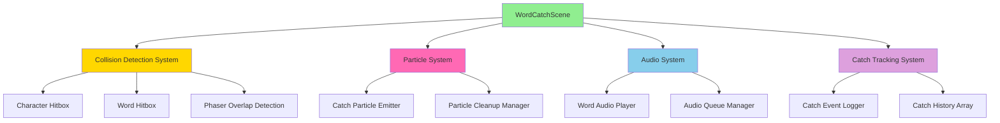

## Class Diagram

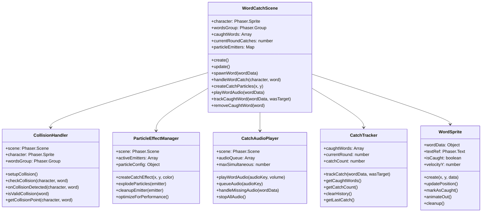

## Collision Detection Sequence Diagram

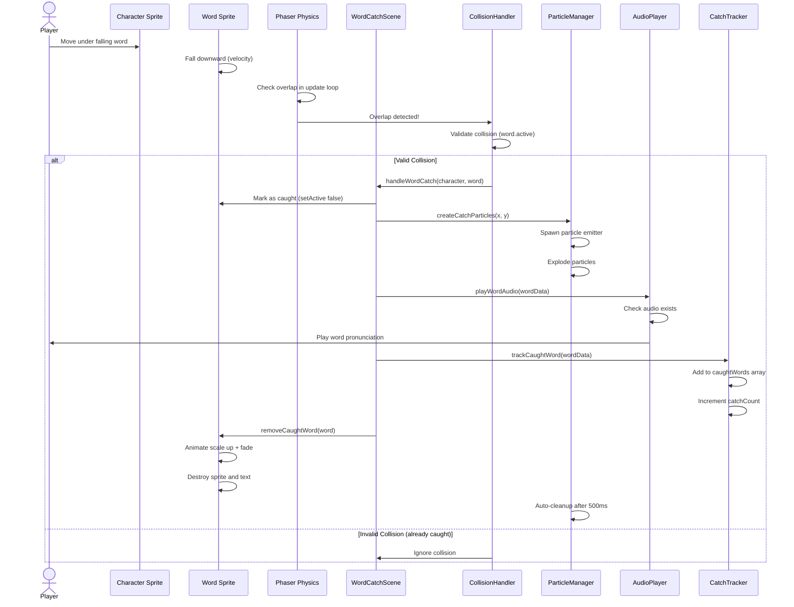

## Collision Detection Flow Diagram

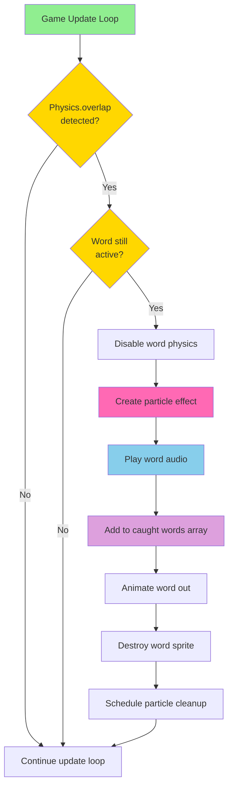

## Particle System State Diagram

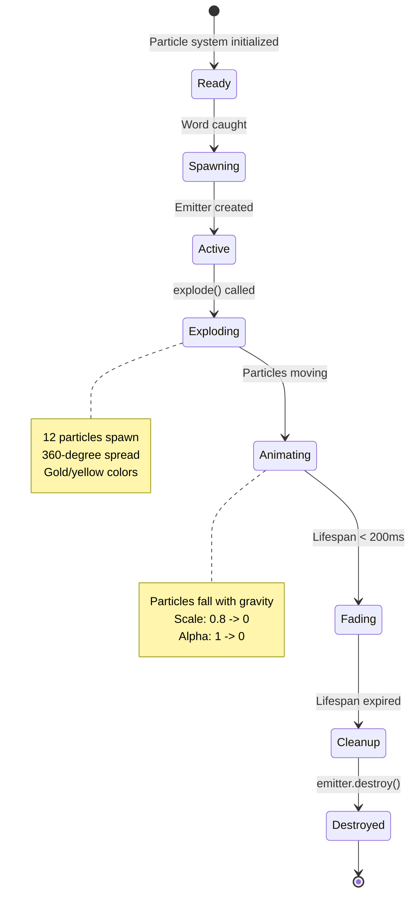

## Collision Hitbox Diagram

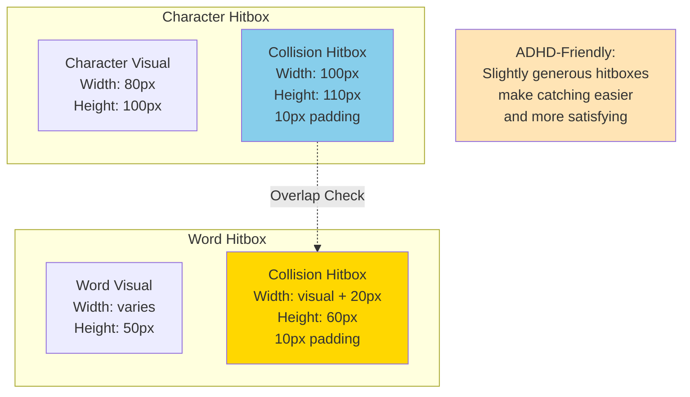

## Audio System Flow

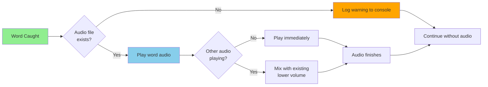

## Catch Tracking Data Structure

```mermaid
graph TB
    subgraph CatchTracker
        CaughtWordsArray[caughtWords: Array]

        subgraph Catch Object
            word[word: string]
            timestamp[timestamp: number]
            wasTarget[wasTarget: boolean]
            position[position: {x, y}]
            round[round: number]
        end

        CaughtWordsArray --> Catch1[Catch 1]
        CaughtWordsArray --> Catch2[Catch 2]
        CaughtWordsArray --> Catch3[Catch 3]
        CaughtWordsArray --> CatchN[Catch N]

        Catch1 --> word
        Catch1 --> timestamp
        Catch1 --> wasTarget
        Catch1 --> position
        Catch1 --> round
    end

    style CaughtWordsArray fill:#DDA0DD
    style word fill:#FFE4B5
    style timestamp fill:#FFE4B5
    style wasTarget fill:#FFE4B5
    style position fill:#FFE4B5
    style round fill:#FFE4B5
```

## Word Removal Animation Timeline

```mermaid
gantt
    title Word Catch Animation Timeline
    dateFormat X
    axisFormat %L ms

    section Collision
    Overlap detected: milestone, 0, 0
    Word marked inactive: milestone, 0, 0

    section Visual
    Particle spawn: 0, 50
    Particle animation: 50, 450
    Word scale up: 0, 200
    Word fade out: 0, 200

    section Audio
    Audio trigger: 0, 50
    Audio playback: 50, 600

    section Cleanup
    Word destroyed: 200, 200
    Particles destroyed: 500, 500
```

## Performance Optimization Flow

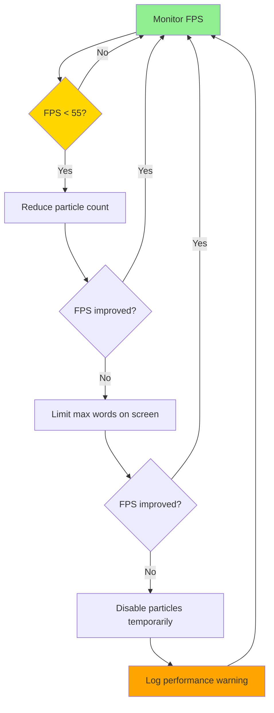

## Component Integration Diagram

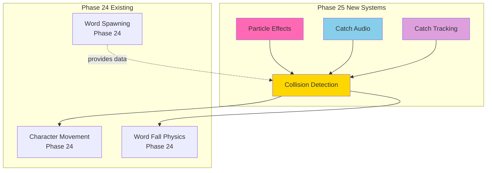

## Edge Case Handling Flow

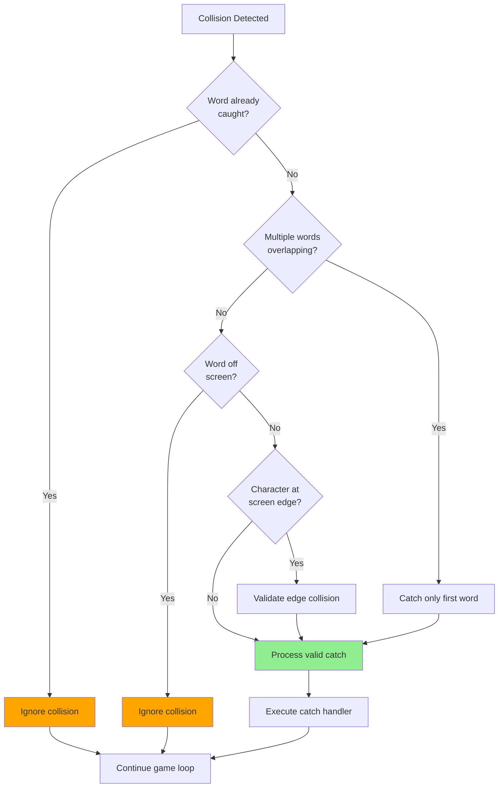

## Notes

### Why This Architecture?

**Phaser Physics Integration**
- Uses Phaser's built-in overlap detection for reliability
- Physics groups for efficient collision checking
- Leverages Phaser's optimization for multiple objects
- Handles edge cases automatically (world bounds, etc.)

**ADHD-Friendly Collision**
- Slightly generous hitboxes make catching easier
- Immediate visual feedback (particles spawn instantly)
- Immediate audio feedback (< 50ms delay)
- Clear cause-and-effect relationship
- Satisfying reward for successful catch

**Particle System Design**
- Brief duration (400ms) prevents visual clutter
- Gold/yellow theme is positive and rewarding
- Gravity makes particles feel natural
- Additive blend mode creates satisfying glow
- Automatic cleanup prevents memory leaks

**Audio Timing**
- Plays immediately on catch for clear feedback
- Handles missing audio gracefully (no crash)
- Volume appropriate for target age
- Can mix multiple catches if rapid
- Uses Phaser's audio system for consistency

**Catch Tracking**
- Foundation for Phase 26 target word logic
- Tracks all necessary data for scoring
- Timestamp enables analytics and debugging
- Position data for future features (heat maps)
- Round tracking for progress analysis

**Performance Considerations**
- Physics groups optimize collision checks
- Particle pooling considered for future
- Immediate word disable prevents double-catch
- Efficient cleanup prevents memory leaks
- 60fps maintained with multiple simultaneous catches

### What This Phase Proves

1. **Reliable Collision**: Detection works consistently
2. **Satisfying Feedback**: Visual and audio reward
3. **Clean Implementation**: No memory leaks or bugs
4. **Good Performance**: 60fps with multiple catches
5. **Foundation Ready**: Prepared for Phase 26 logic

### Integration with Phase 26

This collision system is designed to support Phase 26's target word logic:
- `wasTarget` parameter in tracking ready to use
- Separate feedback possible (correct vs. incorrect catch)
- Audio system ready to play different sounds
- Particle system can have different colors/effects
- All catch data tracked for round completion logic
