# Phase 26: Word Catch - Target Word Logic - UML

## Target Word System Architecture

```mermaid
graph TB
    WordCatchScene[WordCatchScene]

    WordCatchScene --> TargetSystem[Target Word System]
    WordCatchScene --> ValidationSystem[Validation System]
    WordCatchScene --> FeedbackSystem[Feedback System]
    WordCatchScene --> RoundSystem[Round Management System]

    TargetSystem --> TargetSelector[Target Word Selector]
    TargetSystem --> CalloutPlayer[Audio Callout Player]
    TargetSystem --> TargetDisplay[Target Display UI]

    ValidationSystem --> CatchValidator[Catch Validator]
    ValidationSystem --> WordComparator[Word Comparator]

    FeedbackSystem --> CorrectFeedback[Correct Catch Feedback]
    FeedbackSystem --> IncorrectFeedback[Incorrect Catch Feedback]
    FeedbackSystem --> CelebrationEffects[Celebration Effects]
    FeedbackSystem --> GentleOops[Gentle Oops Feedback]

    RoundSystem --> ProgressTracker[Progress Tracker]
    RoundSystem --> RoundCompletion[Round Completion Handler]
    RoundSystem --> RoundTransition[Round Transition Manager]

    style WordCatchScene fill:#90EE90
    style TargetSystem fill:#FFD700
    style ValidationSystem fill:#FF69B4
    style FeedbackSystem fill:#87CEEB
    style RoundSystem fill:#DDA0DD
```

## Class Diagram

```mermaid
classDiagram
    class WordCatchScene {
        +currentTarget: Object
        +lastTargetId: string
        +targetPool: Array
        +currentRound: number
        +correctCatches: number
        +incorrectCatches: number
        +wordsPerRound: number
        +targetDisplay: TargetDisplayUI
        +progressDisplay: ProgressUI
        +create()
        +startNewRound()
        +selectAndAnnounceNextTarget()
        +handleWordCatch(character, word)
    }

    class TargetWordSelector {
        +lastTargetId: string
        +targetHistory: Array
        +selectTargetWord()
        +avoidRecentTargets(word)
        +getRandomTargetFromPool()
        +ensureVariety()
    }

    class AudioCalloutManager {
        +scene: Phaser.Scene
        +currentCallout: Phaser.Sound
        +announceTargetWord(targetWord)
        +playCallout(audioKey)
        +waitForCalloutComplete(callback)
        +handleMissingAudio()
    }

    class WordPoolGenerator {
        +targetWord: Object
        +poolSize: number
        +targetRatio: number
        +generateWordPool(target, size)
        +selectDistractors(count, exclude)
        +shufflePool(pool)
        +ensureTargetFrequency()
    }

    class CatchValidator {
        +currentTarget: Object
        +validateCatch(caughtWord)
        +compareWords(word1, word2)
        +isCorrectCatch(word)
        +logValidation(result)
    }

    class CorrectCatchHandler {
        +scene: Phaser.Scene
        +celebrateCorrectCatch(word)
        +createCelebrationParticles(x, y)
        +playCelebrationAudio()
        +showEncouragementText(x, y)
        +incrementScore()
        +updateProgress()
        +checkRoundComplete()
    }

    class IncorrectCatchHandler {
        +scene: Phaser.Scene
        +handleIncorrectCatch(word)
        +createNeutralParticles(x, y)
        +playGentleOops()
        +showTryAgainText(x, y)
        +trackIncorrectCatch()
        +maintainTargetWord()
    }

    class RoundProgressTracker {
        +correctCatches: number
        +wordsPerRound: number
        +progressDisplay: UI
        +incrementProgress()
        +updateDisplay()
        +isRoundComplete()
        +resetProgress()
    }

    class RoundCompletionHandler {
        +scene: Phaser.Scene
        +currentRound: number
        +maxRounds: number
        +completeRound()
        +playRoundCelebration()
        +showRoundSummary()
        +transitionToNextRound()
        +endGame()
    }

    class TargetDisplayUI {
        +targetPanel: Phaser.Rectangle
        +targetLabel: Phaser.Text
        +targetText: Phaser.Text
        +create()
        +updateTarget(word)
        +animatePulse()
        +show()
        +hide()
    }

    WordCatchScene --> TargetWordSelector
    WordCatchScene --> AudioCalloutManager
    WordCatchScene --> WordPoolGenerator
    WordCatchScene --> CatchValidator
    WordCatchScene --> CorrectCatchHandler
    WordCatchScene --> IncorrectCatchHandler
    WordCatchScene --> RoundProgressTracker
    WordCatchScene --> RoundCompletionHandler
    WordCatchScene --> TargetDisplayUI
```

## Target Word Selection Sequence Diagram

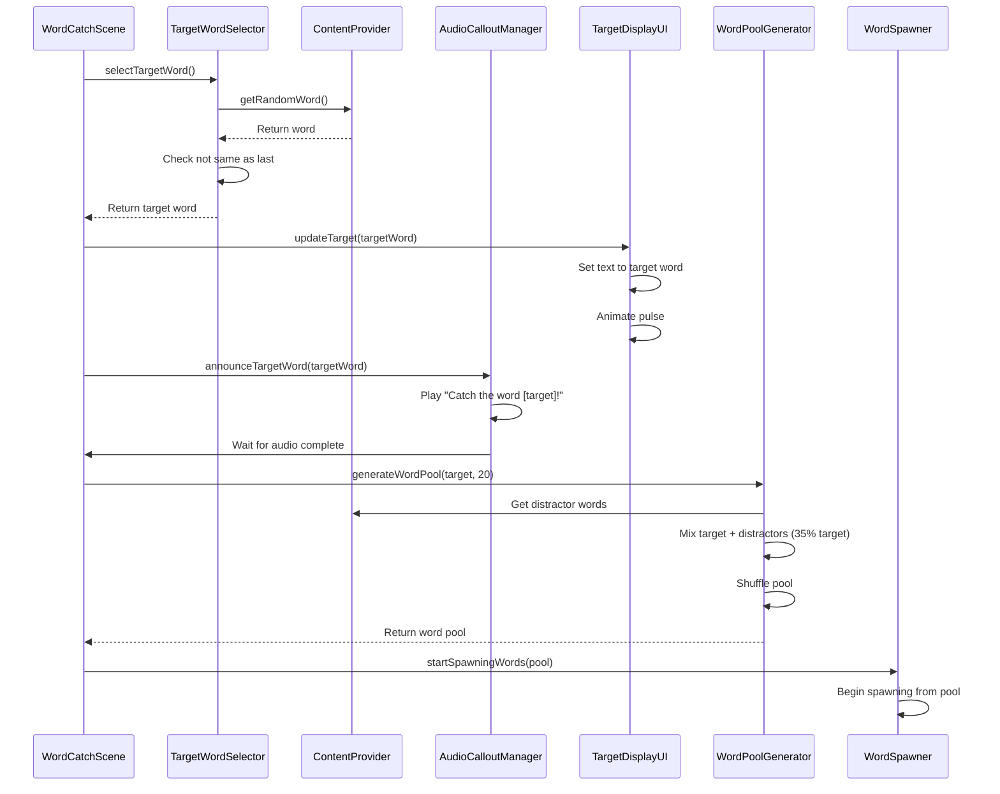

## Catch Validation Flow Diagram

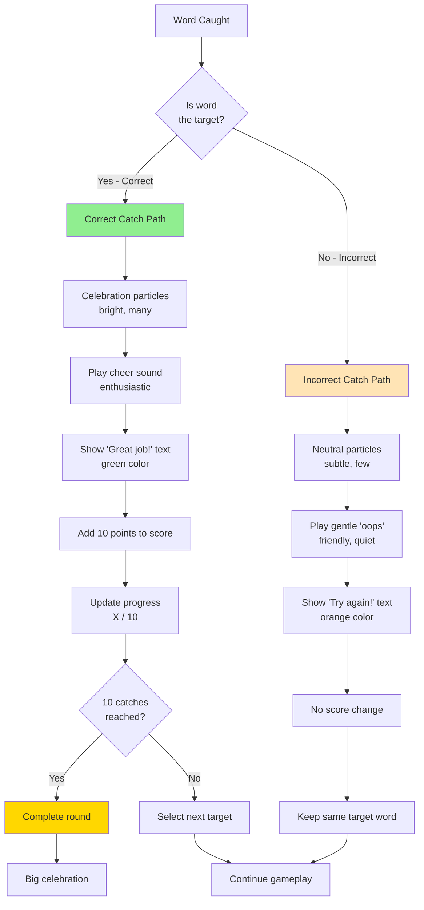

## Feedback System State Diagram

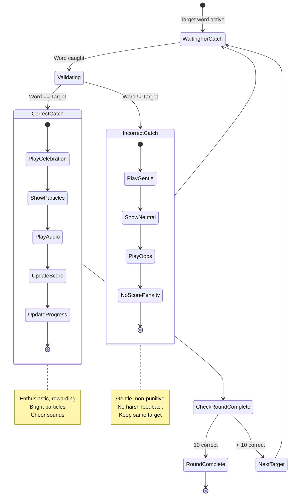

## Word Pool Generation Diagram

```mermaid
graph LR
    Start[Generate Word Pool] --> SelectTarget[Target word: 'cat']
    SelectTarget --> CalcTarget[Calculate target count<br/>20 × 0.35 = 7]

    CalcTarget --> AddTarget[Add 'cat' × 7 times]
    AddTarget --> CalcDist[Calculate distractor count<br/>20 - 7 = 13]

    CalcDist --> SelectDist[Select 13 random distractors]
    SelectDist --> Pool[Pool: 7×'cat', 13 others]

    Pool --> Shuffle[Shuffle pool randomly]
    Shuffle --> Ready[Pool ready for spawning]

    style SelectTarget fill:#FFD700
    style Pool fill:#87CEEB
    style Ready fill:#90EE90
```

## UI Layout Diagram

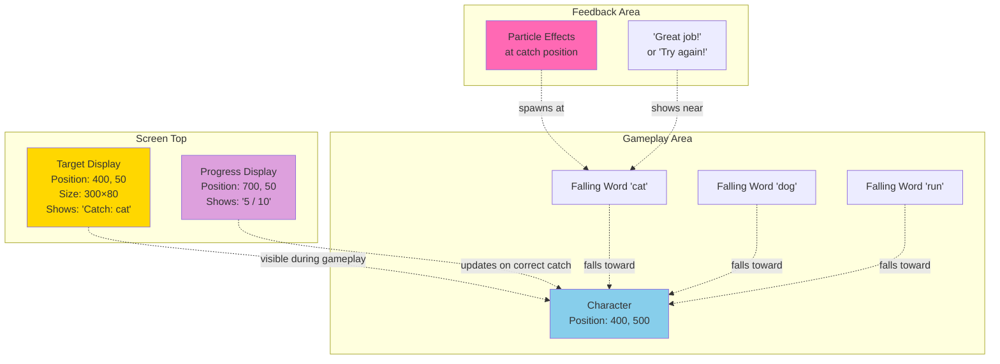

## Round Management Flow

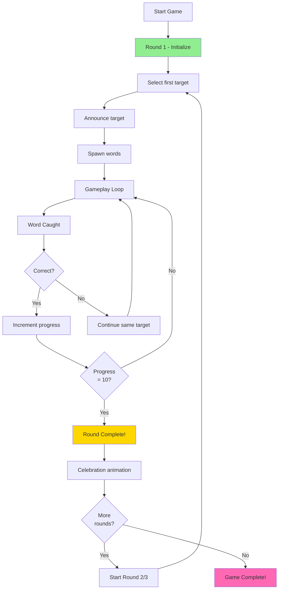

## Correct vs. Incorrect Feedback Comparison

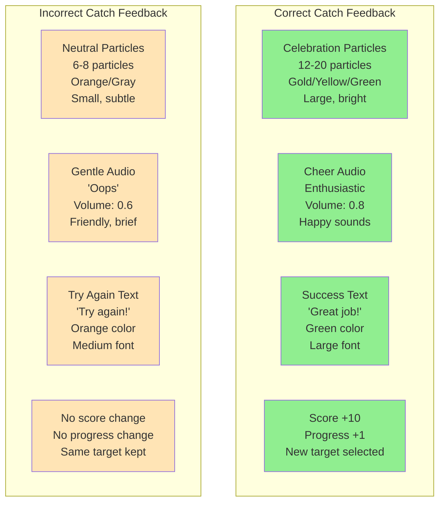

## ADHD-Friendly Feedback Timeline

```mermaid
gantt
    title Feedback Timeline Comparison
    dateFormat X
    axisFormat %L ms

    section Correct Catch
    Collision detected: milestone, 0, 0
    Celebration particles: 0, 600
    Cheer audio plays: 0, 800
    'Great job!' text: 0, 1000
    Score updates: 100, 100
    Progress updates: 100, 100
    New target delay: 1500, 1500

    section Incorrect Catch
    Collision detected: milestone, 0, 0
    Neutral particles: 0, 400
    Gentle 'oops': 0, 600
    'Try again!' text: 0, 800
    Keep same target: 0, 0
    Continue immediately: 800, 800
```

## Target Word Callout Sequence

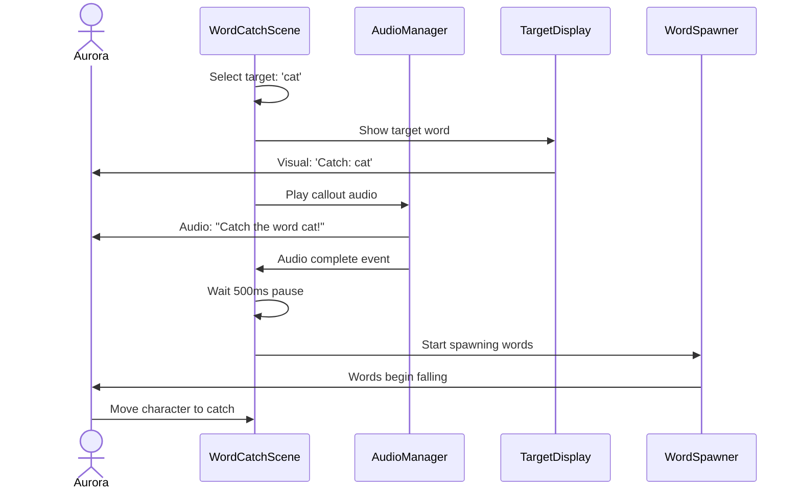

## Round Progress Tracking

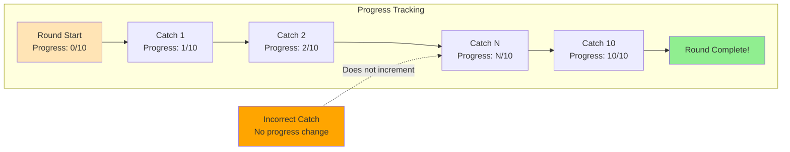

## Edge Case Handling

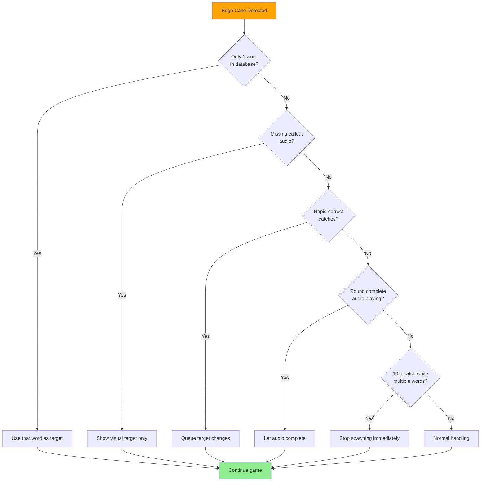

## Integration with Phase 25 Collision System

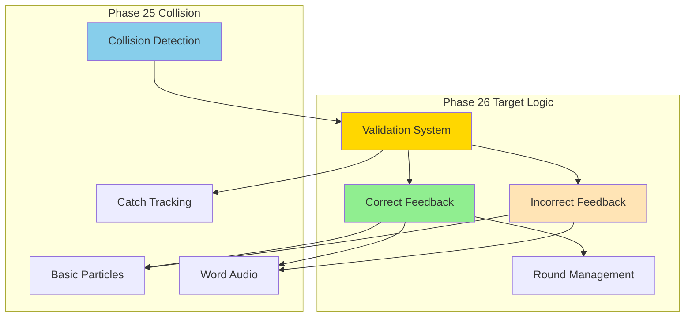

## Notes

### Why This Architecture?

**Target Word System**
- Random selection with variety ensures engagement
- Callout audio provides clear instruction
- Visual display reduces memory load (ADHD-friendly)
- Word pool ensures balanced target frequency

**Validation System**
- Simple boolean validation (correct vs. incorrect)
- Immediate feedback maintains cause-effect clarity
- Separate handling for correct/incorrect enables different feedback
- Logging for debugging and analytics

**ADHD-Friendly Feedback**
- Correct catch is celebrated enthusiastically (dopamine reward)
- Incorrect catch is gentle and non-punitive (reduces anxiety)
- No harsh sounds or red X marks (avoids triggering)
- Orange neutral color instead of punishing red
- Game flow continues uninterrupted on incorrect catch

**Round Management**
- 10 words per round is achievable goal
- Progress tracking provides motivation
- Round completion is celebration moment
- Multiple rounds extend engagement
- Clear end point prevents endless play

**UI Design**
- Target always visible (reduces memory load)
- Progress always visible (motivates completion)
- Clear visual hierarchy (important info at top)
- Non-intrusive positioning (doesn't block gameplay)

### What This Phase Proves

1. **Educational Gameplay**: Word recognition mechanic works
2. **ADHD-Friendly Design**: Feedback is appropriate for target age
3. **Motivation System**: Progress and celebration maintain engagement
4. **Game Logic**: Validation, rounds, completion all correct
5. **Foundation Complete**: Word Catch core gameplay ready

### Comparison to Letter Pop

**Similarities:**
- Target selection (target letter vs. target word)
- Correct/incorrect validation
- Celebration on success
- Round-based progression

**Differences:**
- Word Catch: catch falling objects vs. click bubbles
- Word Catch: character movement vs. pointer input
- Word Catch: sight words vs. single letters
- Word Catch: more forgiving (generous hitbox)
- Word Catch: gentler feedback (ADHD-optimized)

### ADHD Design Principles Applied

1. **Clear Goals**: Target word always visible
2. **Immediate Feedback**: < 50ms validation and response
3. **Positive Reinforcement**: Celebrate success enthusiastically
4. **Non-Punitive**: Gentle handling of mistakes
5. **Progress Visible**: Always know how close to completion
6. **Achievable Chunks**: 10 words is manageable goal
7. **Celebration Moments**: Round completion provides dopamine
8. **No Time Pressure**: Player controls pacing
