# Phase 27: Sight Word Content - UML

## Data Structure Diagram

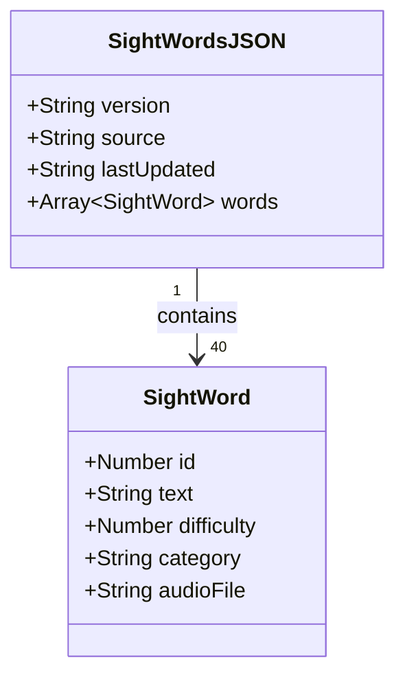

## File Structure Diagram

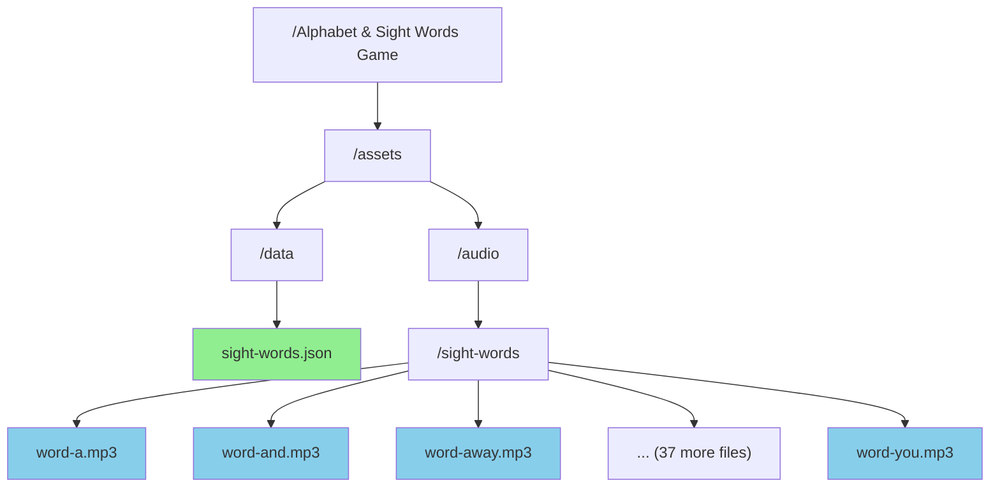

## ContentProvider Class Diagram

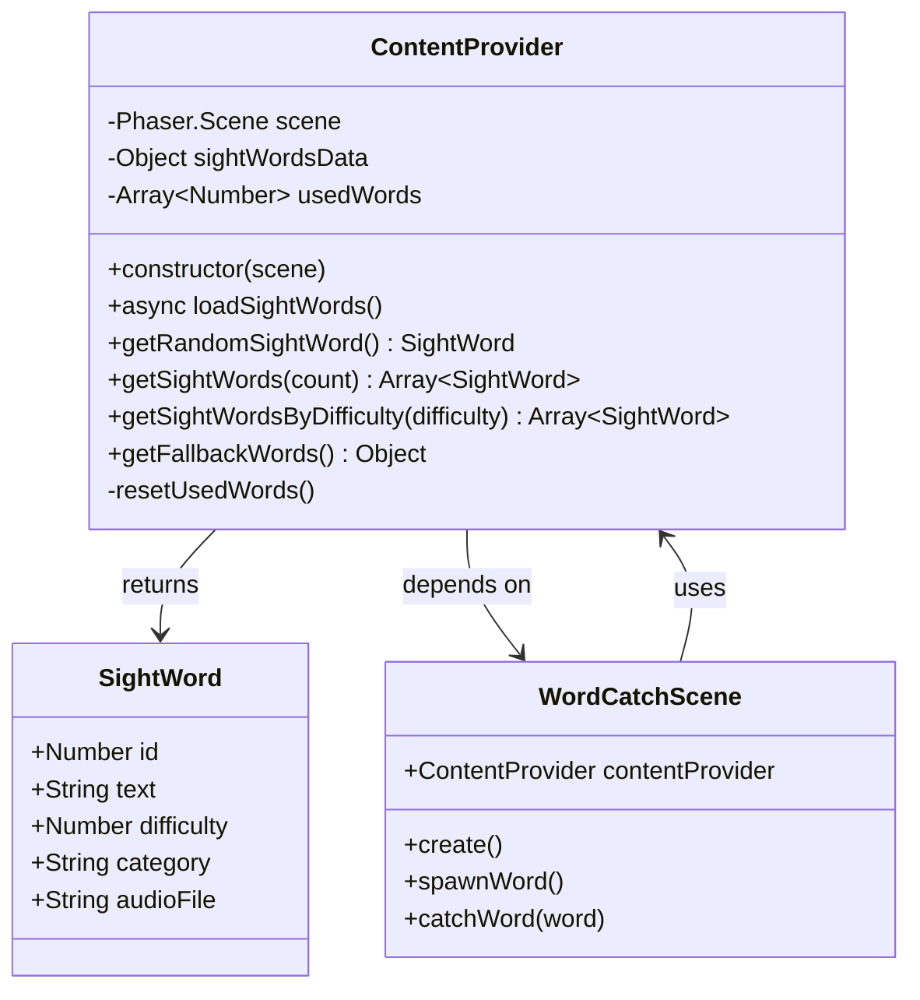

## Sequence Diagram: Loading Sight Words

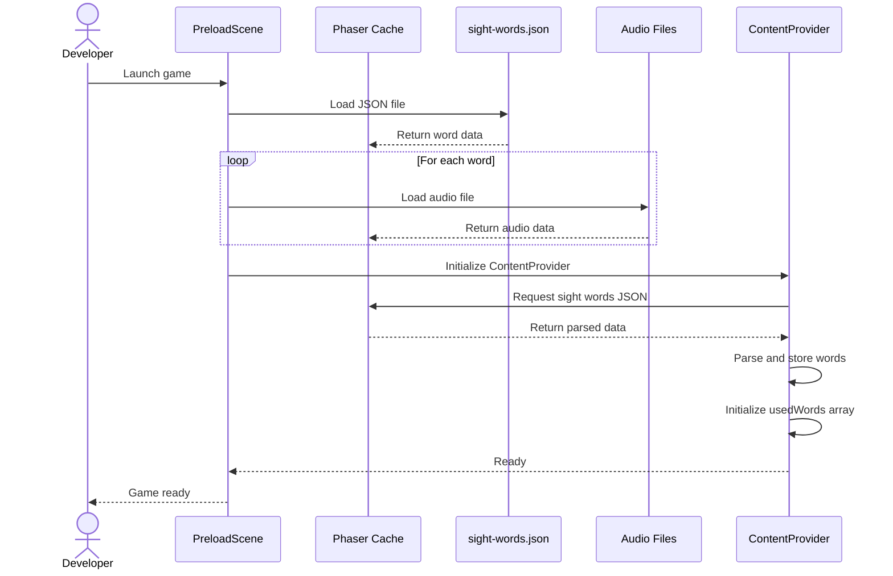

## Sequence Diagram: Getting Random Sight Word

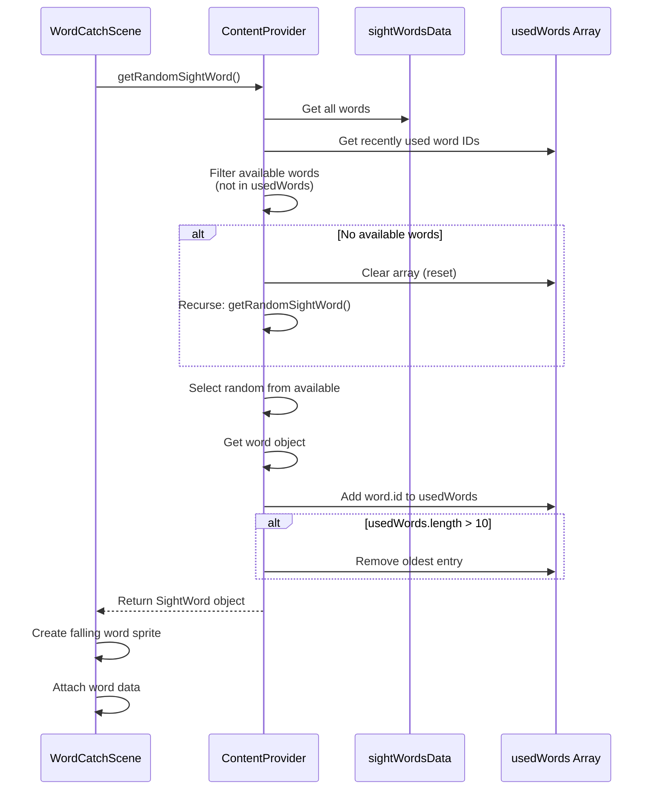

## Sequence Diagram: Word Catch with Audio

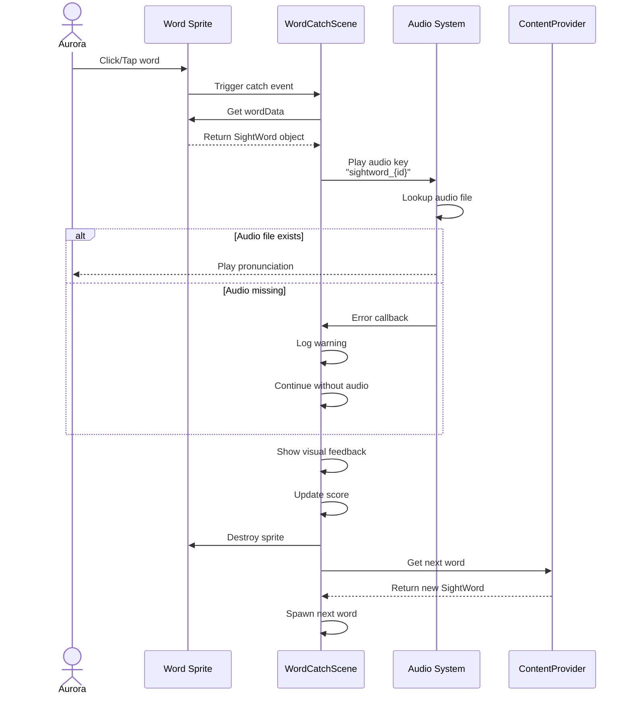

## State Diagram: Sight Word Loading

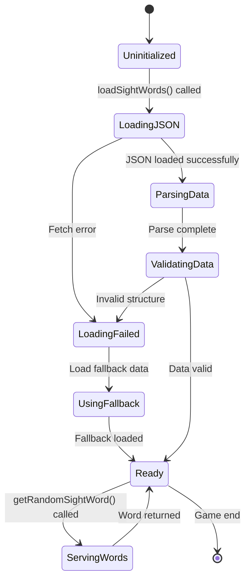

## Component Diagram: Sight Word System

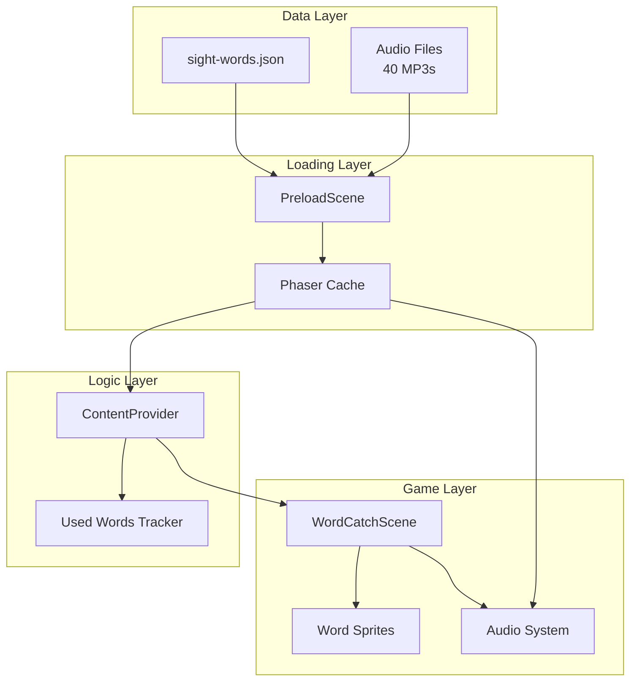

## Activity Diagram: Word Selection Algorithm

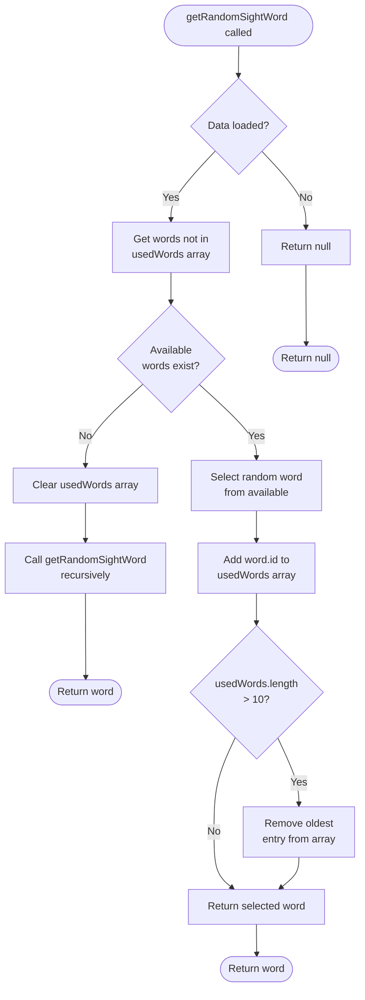

## Class Interaction: Word Spawn Flow

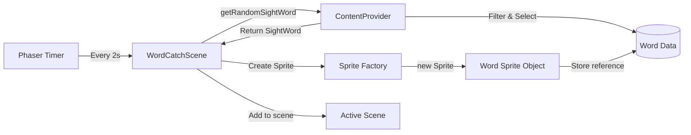

## Data Flow Diagram

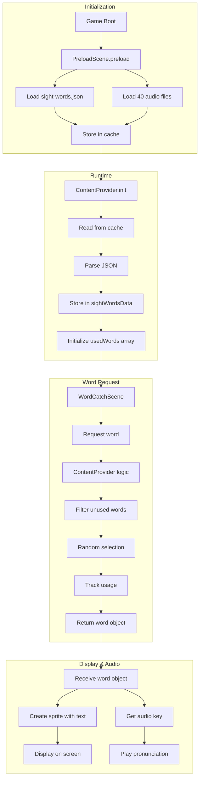

## JSON Schema Diagram

```mermaid
graph TB
    Root[sight-words.json<br/>Object] --> Version[version: String<br/>"1.0.0"]
    Root --> Source[source: String<br/>"Dolch Pre-Primer List"]
    Root --> Updated[lastUpdated: String<br/>"2025-10-12"]
    Root --> Words[words: Array]

    Words --> W1[Word Object 1]
    Words --> W2[Word Object 2]
    Words --> W3[...]
    Words --> W40[Word Object 40]

    W1 --> ID1[id: Number]
    W1 --> Text1[text: String]
    W1 --> Diff1[difficulty: Number]
    W1 --> Cat1[category: String]
    W1 --> Audio1[audioFile: String]

    style Root fill:#FFE4B5
    style Words fill:#98FB98
    style W1 fill:#87CEEB
    style W2 fill:#87CEEB
    style W40 fill:#87CEEB
```

## Memory Management Diagram

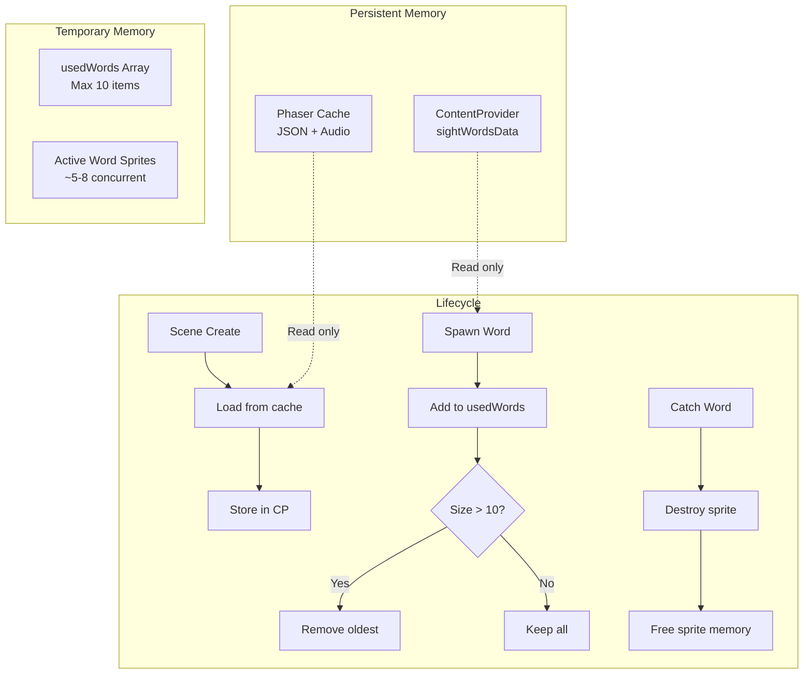

## Error Handling Flow

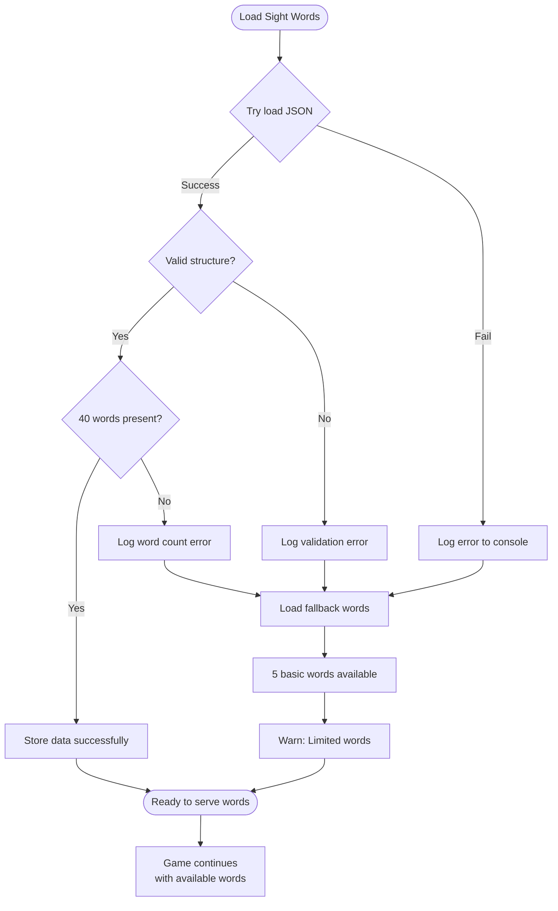

## Notes

### Architecture Decisions

**Why ContentProvider Pattern?**
- Centralizes all content logic
- Makes testing easier (mock data)
- Allows future expansion (multiple word lists)
- Separates data from presentation
- Enables caching and optimization

**Why Track Last 10 Used Words?**
- Prevents immediate repetition (boring)
- Allows eventual repetition (necessary for learning)
- Balance between variety and practice
- Small memory footprint (10 IDs)
- Automatic rotation (no manual management)

**Why Fallback Words?**
- Game doesn't break if JSON fails
- Development continues without all assets
- Graceful degradation (5 words better than crash)
- User still gets experience (with warning)

**Why Separate Audio Files?**
- Smaller individual file sizes
- Load on-demand (performance)
- Easy to replace/update individual words
- Can add new words without regenerating all
- Browser caching works better

### Data Design Rationale

**Difficulty Levels (1-3):**
- 1: Very common, simple words (a, I, the)
- 2: Common, slightly longer (and, see, run)
- 3: Less common, more complex (away, help, where)
- Allows progressive difficulty in future phases

**Categories:**
- Not strictly necessary for Phase 27
- Useful for future themed games
- Helps with language learning
- Enables filtering/searching
- Educational value for parents

### Performance Considerations

**Preloading Strategy:**
- Load JSON at boot (small file, ~5KB)
- Load audio on-demand or preload selectively
- Consider loading first 10 words immediately
- Lazy-load remaining 30 words
- Balance startup time vs runtime performance

**Memory Usage:**
- JSON data: ~5KB (negligible)
- 40 audio files: ~1-2MB total (manageable)
- UsedWords array: 10 integers (bytes)
- Active sprites: 5-8 concurrent (minimal)
- Total memory footprint: < 5MB (excellent)

This architecture is designed to be simple, maintainable, and extensible for future phases.
