# Phase 28: Word Catch Polish - UML

## Scene Architecture Diagram

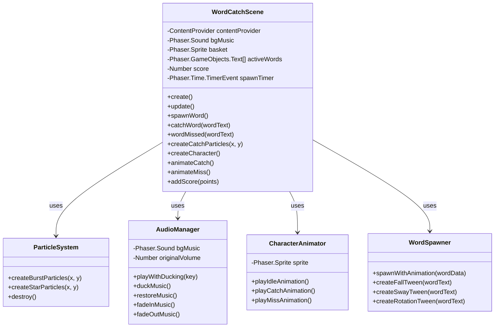

## Component Interaction Diagram

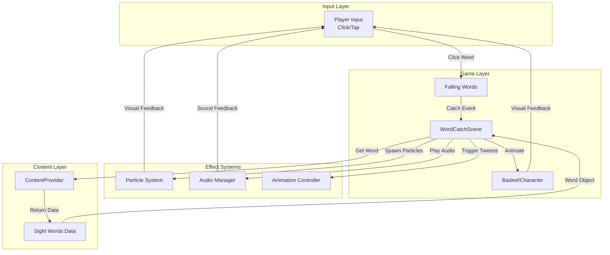

## Sequence Diagram: Word Catch with Full Polish

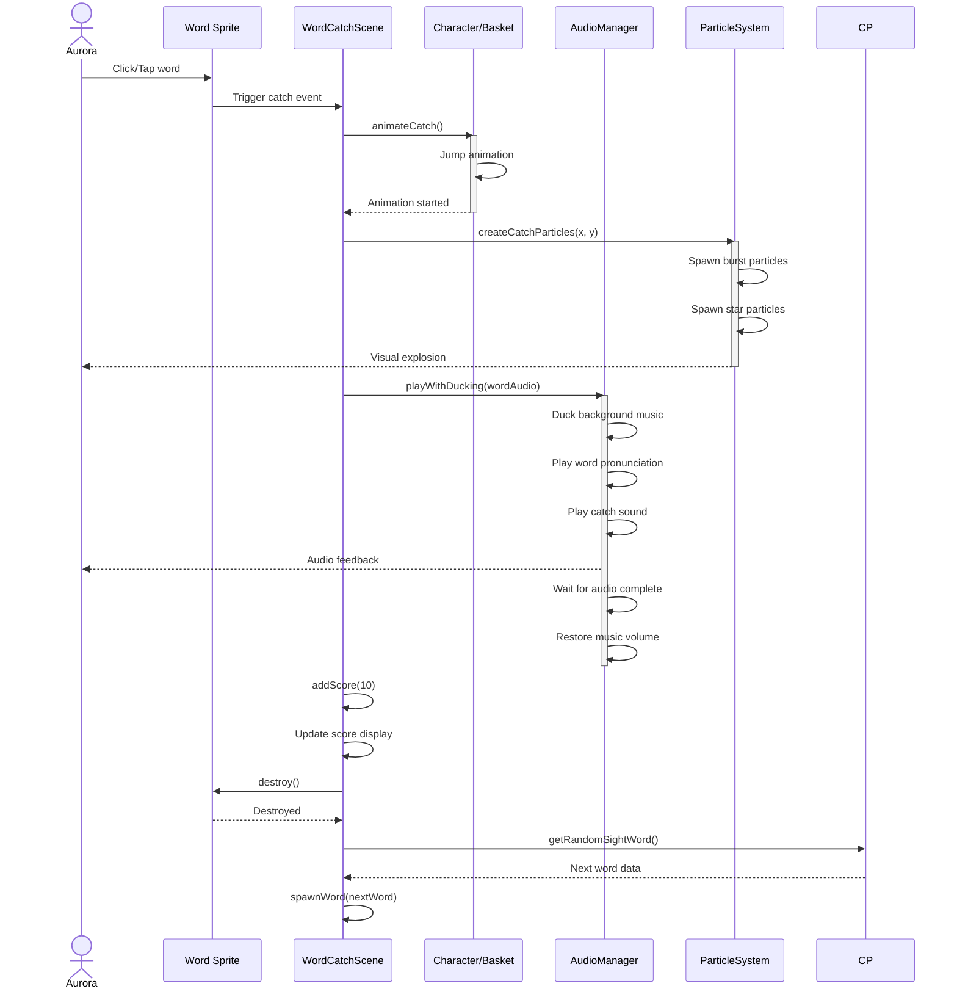

## State Diagram: Word Lifecycle

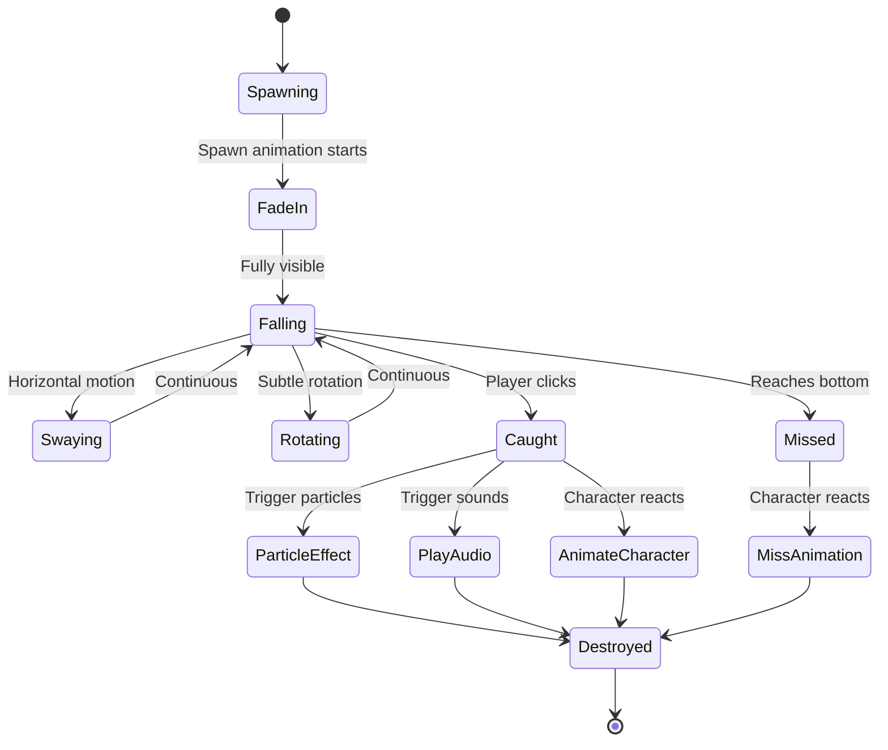

## Particle System Architecture

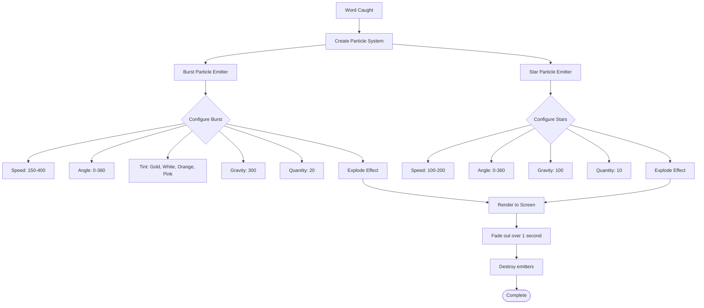

## Audio System Flow Diagram

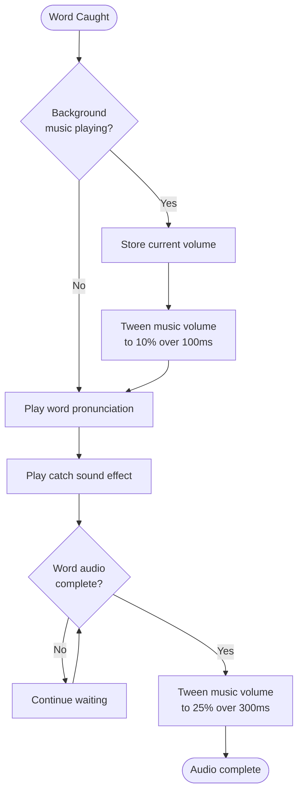

## Character Animation State Machine

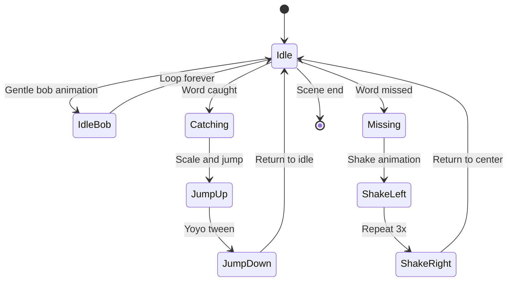

## Word Spawn Animation Flow

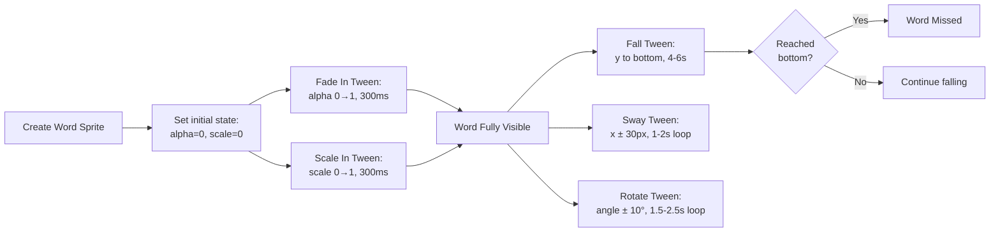

## Memory Management Diagram

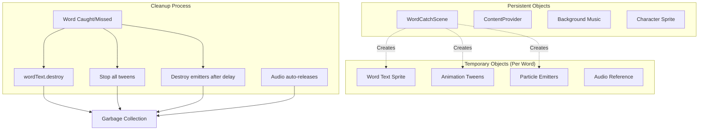

## Asset Loading Structure

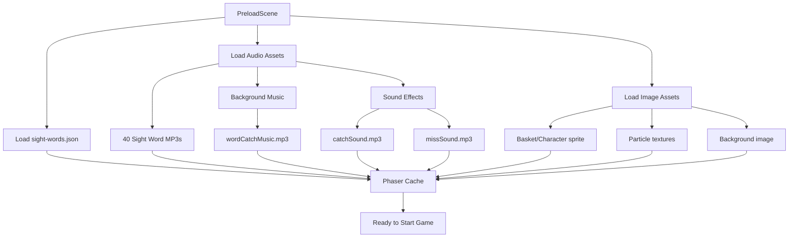

## Visual Layer Architecture

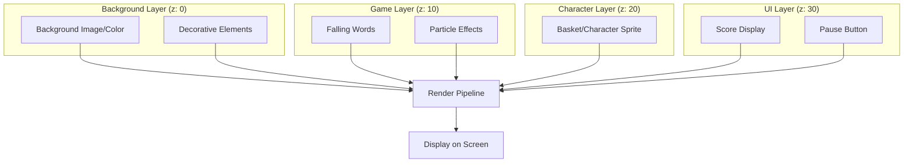

## Polish Systems Integration

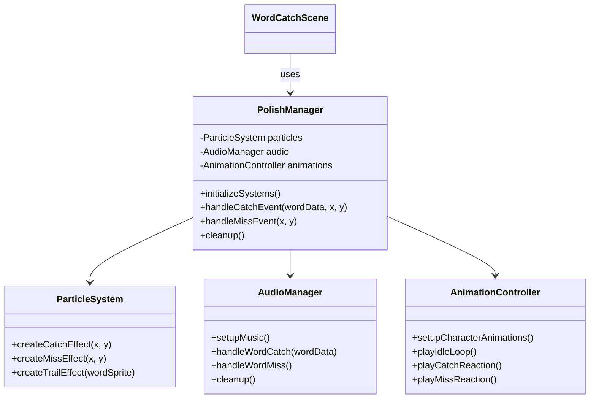

## Performance Optimization Flow

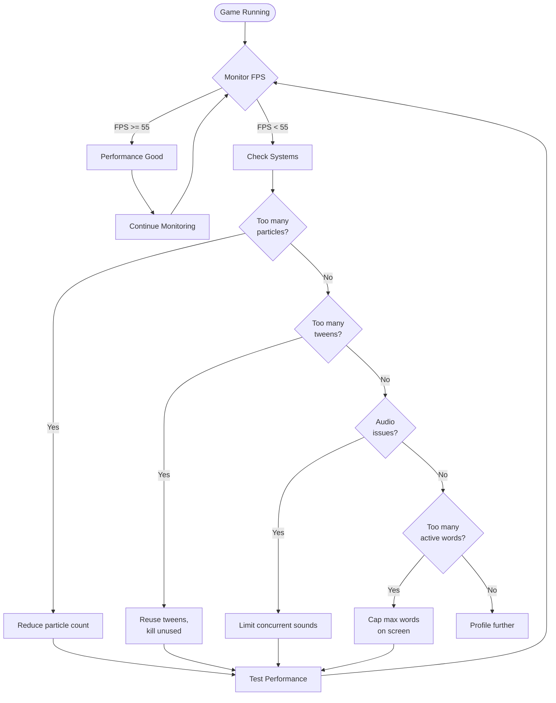

## Event Flow Diagram: Complete Word Catch Cycle

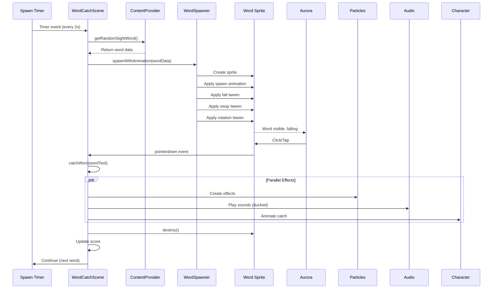

## Notes

### Architecture Decisions

**Why Separate Systems for Polish?**
- **Modularity**: Each polish system (particles, audio, animations) is independent
- **Testability**: Can test each system in isolation
- **Maintainability**: Easy to enhance or replace individual systems
- **Reusability**: Systems can be used in other games (Letter Pop, future games)
- **Performance**: Can optimize or disable systems independently

**Why Animation Controller Pattern?**
- Centralizes all character animation logic
- Makes it easy to add new animations
- Prevents animation conflicts
- Enables animation queuing if needed
- Simplifies testing (mock the controller)

**Why Audio Manager with Ducking?**
- Background music shouldn't overpower educational content
- Professional audio mixing improves experience
- Prevents harsh audio overlaps
- Makes audio feel cohesive and polished
- Easier to adjust volumes globally

**Why Particle System Wrapper?**
- Phaser particle API is powerful but verbose
- Wrapper provides simple, consistent interface
- Easy to create multiple particle effects
- Simplifies cleanup and memory management
- Can easily adjust effects in one place

### Performance Considerations

**Particle Optimization:**
- Limit concurrent particle emitters (destroy after use)
- Use reasonable particle counts (20-30, not 100+)
- Keep particle lifespan short (< 1 second)
- Use simple particle textures (small images)
- Avoid large particle images
- Use `blendMode: 'ADD'` sparingly (more expensive)

**Tween Optimization:**
- Reuse tweens when possible
- Kill tweens when objects destroyed
- Don't create hundreds of simultaneous tweens
- Use `ease: 'Linear'` for simple movements (faster)
- Avoid complex easing functions on many objects

**Audio Optimization:**
- Limit concurrent audio streams (2-3 max)
- Use compressed audio (MP3 128kbps)
- Preload critical audio (music, common SFX)
- Consider audio sprites for many short sounds
- Don't overlap identical sounds rapidly

**Memory Management:**
- Destroy word sprites immediately after catch/miss
- Destroy particle emitters after effect completes
- Stop all tweens on destroyed objects
- Don't keep references to destroyed objects
- Use object pooling for repeated objects (future optimization)

### Visual Design Philosophy

**Cohesion with Letter Pop:**
- Similar color palette (blues, purples, pastels)
- Same font family for text
- Similar particle effects (maintain consistency)
- Same UI style (buttons, score display)
- Matching background style (solid color or simple pattern)
- Consistent animation timing (similar ease functions)

**Child-Friendly Design:**
- High contrast text (easy to read)
- Large, clear fonts
- Bright, appealing colors
- Smooth, non-jarring animations
- Encouraging feedback (no harsh "wrong" indicators)
- Celebratory effects (stars, sparkles, positive sounds)

**Accessibility:**
- ADHD-friendly: calming music, not overstimulating
- Visual clarity: uncluttered screen, clear focus
- Audio clarity: word pronunciation is always clear
- Forgiving gameplay: 70-80% success rate target
- Positive reinforcement: celebrate catches, gentle on misses

This architecture balances polish, performance, and user experience to create a production-quality game.
