# Phase 29: Letter Builder - Scene Setup - UML

## Class Diagram

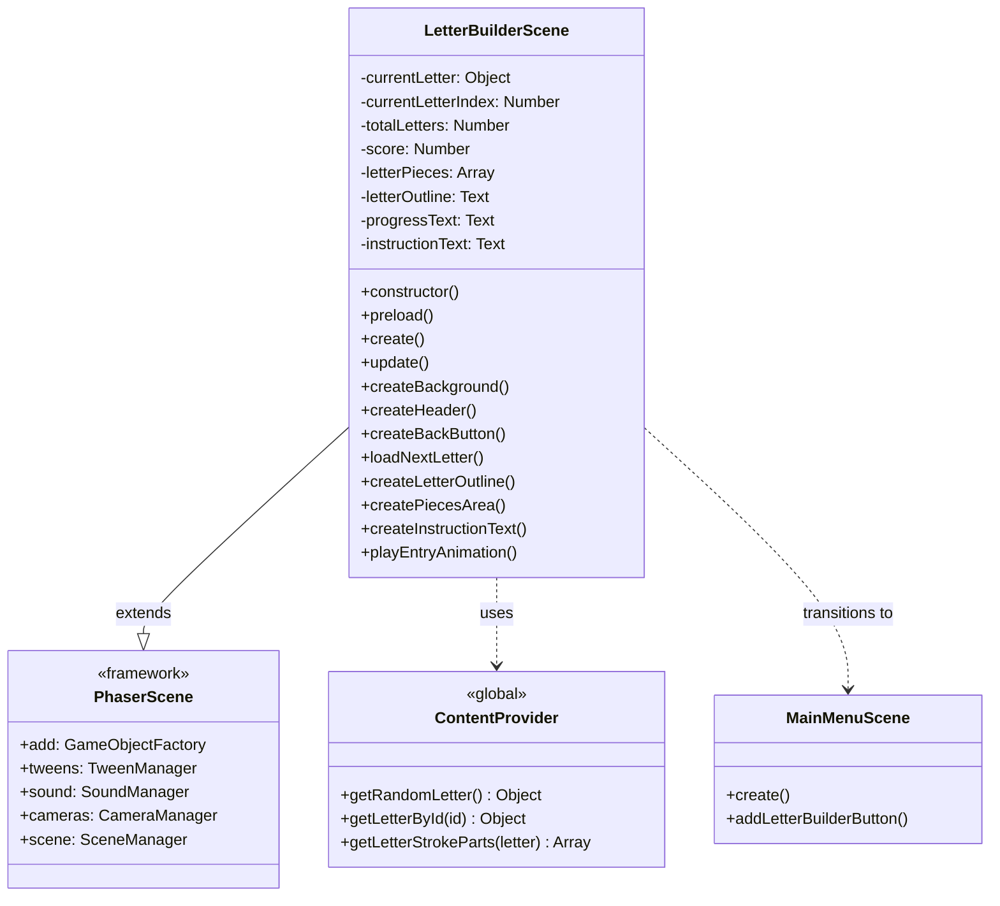

## Sequence Diagram - Scene Initialization

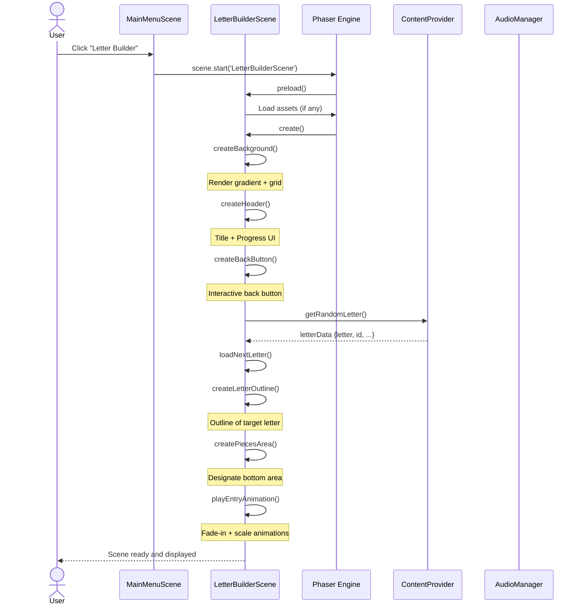

## Sequence Diagram - Back Button Interaction

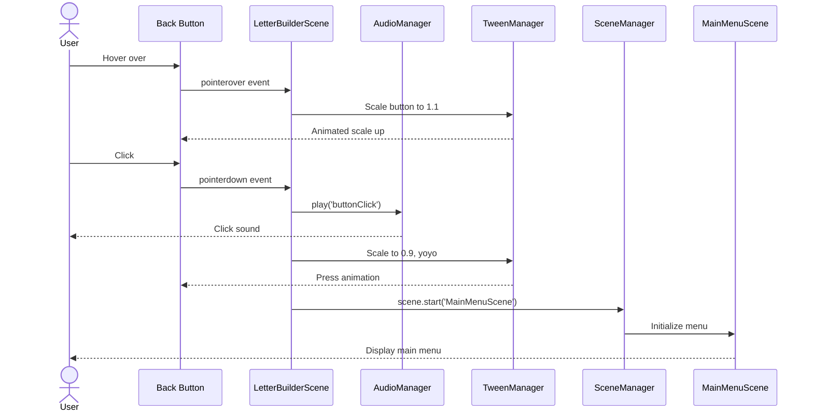

## Component Diagram

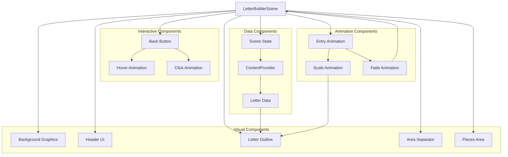

## State Diagram - Scene Lifecycle

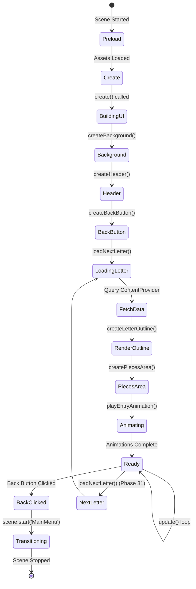

## Object Structure Diagram - Scene State

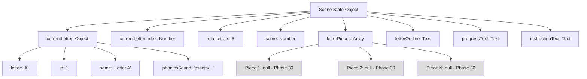

## UI Layout Diagram

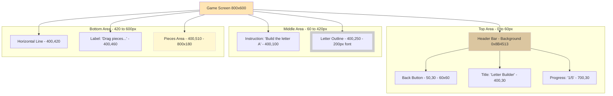

## Animation Timeline Diagram

```mermaid
gantt
    title Entry Animation Sequence (800ms total)
    dateFormat X
    axisFormat %L ms

    section Scene
    Camera Fade-In: 0, 300

    section Letter Outline
    Scale from 0 to 1: 300, 500

    section Ready State
    User Interaction Enabled: 800, 900
```

## Data Flow Diagram

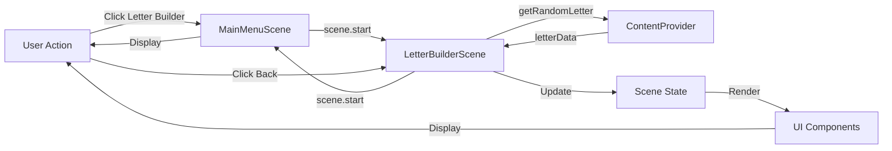

## Background Rendering Strategy

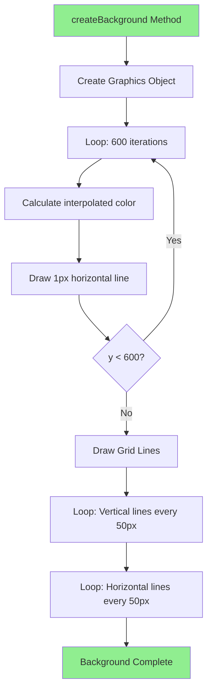

## Component Interaction Matrix

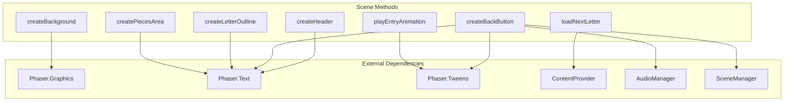

## Notes

### Architecture Decisions

**1. Scene State Management**
- All game state stored as instance variables
- Enables easy access across methods
- Prepares for Phase 30-31 piece tracking
- No external state management needed (simple game)

**2. Background Rendering Approach**
- Graphics API for gradient (programmatic, no assets)
- Grid lines add theme without heavy assets
- Can be optimized by rendering to texture if needed
- Warm colors distinctive from other mini-games

**3. Letter Outline Rendering**
- Text object with stroke, no fill
- Simple and browser-compatible
- Can be enhanced in Phase 32 if needed (dashed outline, SVG)
- Large size (200px) ensures visibility

**4. Component Modularity**
- Each UI element created in separate method
- Easy to modify individual components
- Clear separation of concerns
- Facilitates testing and debugging

**5. Animation Strategy**
- Entry animation for polish (fade + scale)
- Tweens are efficient (no custom frame logic)
- Animations don't block interaction (can be interrupted)
- Total timing <1 second (feels snappy)

### Why This Structure?

**Scene Lifecycle**
- `preload()`: Load assets (minimal in Phase 29)
- `create()`: Build UI, initialize state
- `update()`: Game loop (mostly idle in Phase 29, active in Phase 30-31)

**Method Organization**
- `create*()` methods: Build visual components
- `load*()` methods: Manage data/state
- `play*()` methods: Trigger animations

**State Preparation**
- `letterPieces` array ready for Phase 30
- Progress tracking ready for Phase 31
- Score tracking ready for Phase 32

This architecture provides a solid foundation for Phases 30-32 while keeping Phase 29 simple and testable.
