# Phase 3: Asset Loading Infrastructure - UML

## Asset Loading Sequence Diagram

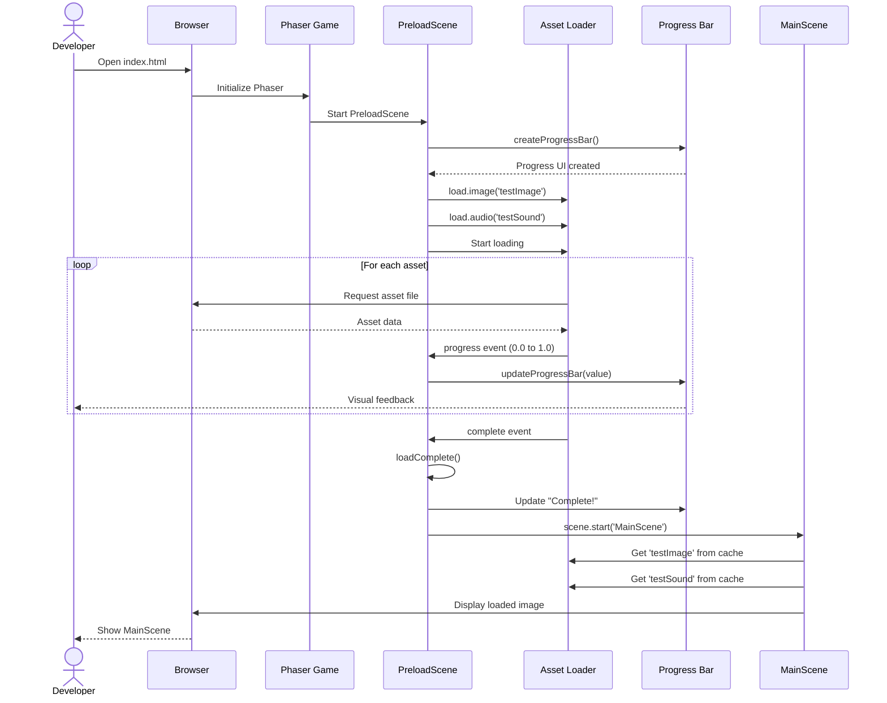

## PreloadScene Class Diagram

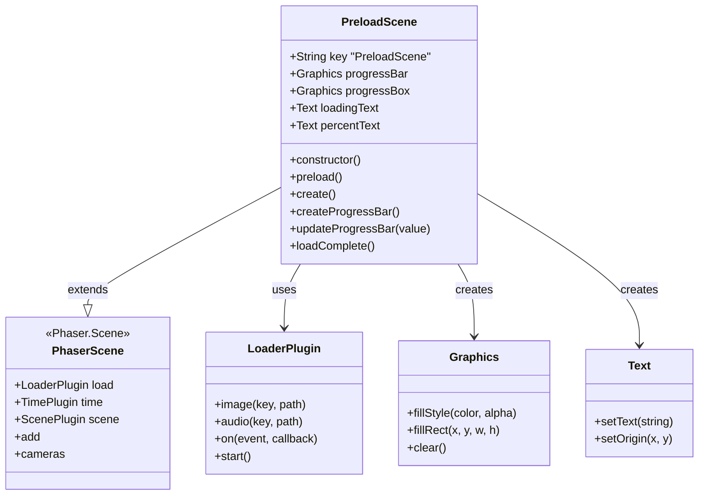

## MainScene Class Diagram (Updated)

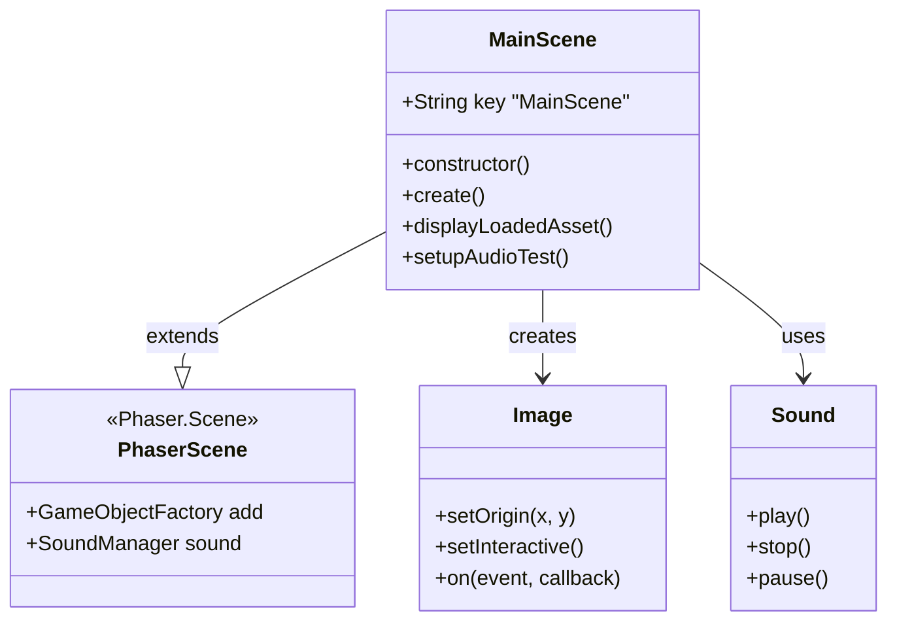

## Asset Loading State Machine

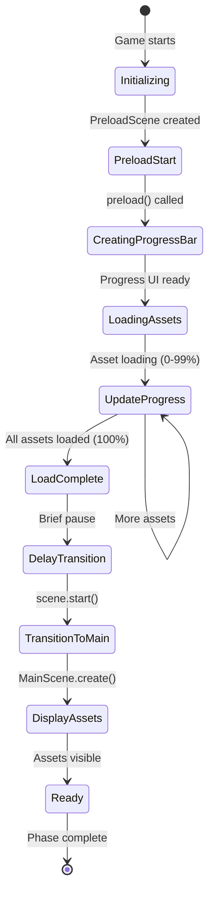

## Progress Bar Component Structure

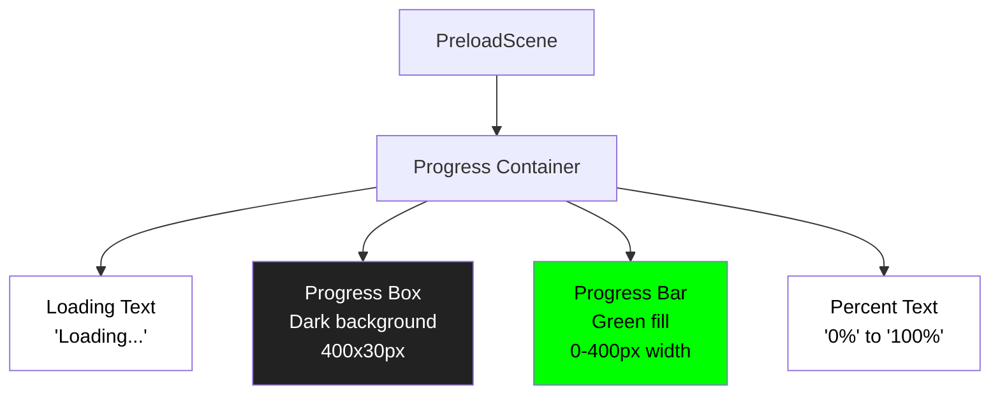

## Asset Loading Flow Diagram

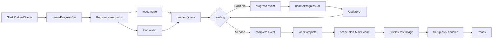

## File Structure Diagram (Updated)

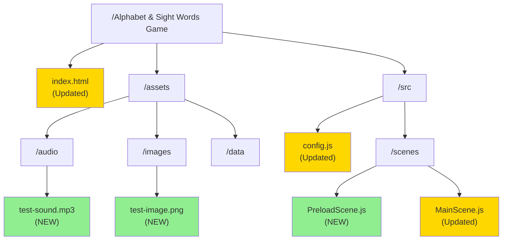

## Progress Bar Visualization

```mermaid
graph TB
    subgraph "Progress Bar States"
        State0["0%: Empty<br/>████████████████<br/>Gray box only"]
        State25["25%: Loading<br/>████░░░░░░░░░░░░<br/>Green fills 1/4"]
        State50["50%: Loading<br/>████████░░░░░░░░<br/>Green fills 1/2"]
        State75["75%: Loading<br/>████████████░░░░<br/>Green fills 3/4"]
        State100["100%: Complete<br/>████████████████<br/>Full green"]
    end

    State0 --> State25 --> State50 --> State75 --> State100

    style State0 fill:#444444
    style State25 fill:#446644
    style State50 fill:#448844
    style State75 fill:#44aa44
    style State100 fill:#00ff00
```

## Scene Transition Diagram

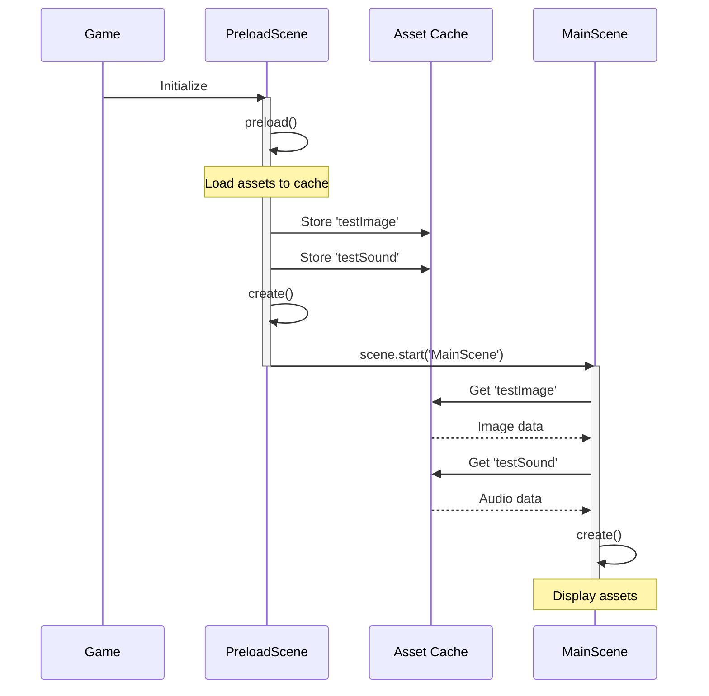

## Asset Cache Structure

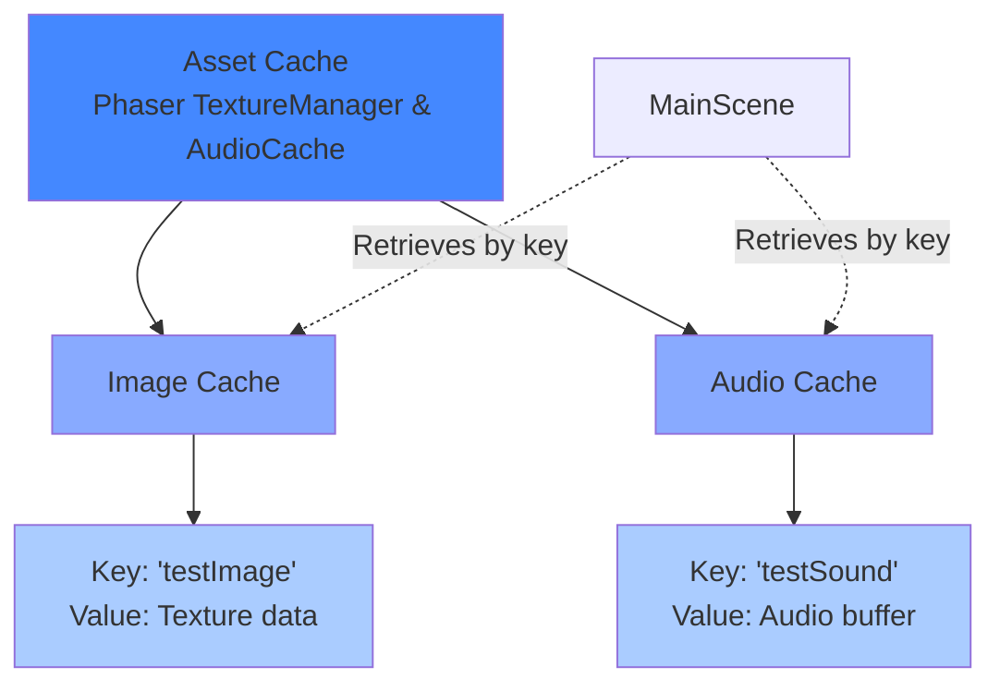

## Component Interaction Diagram

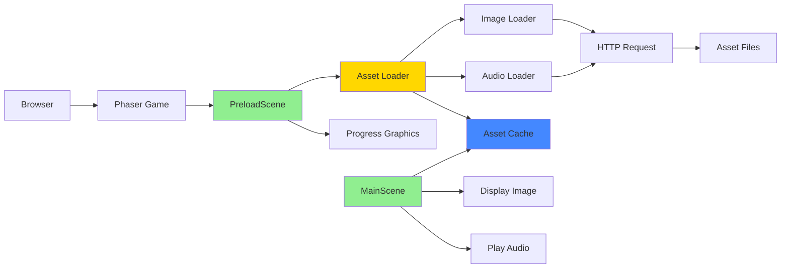

## Error Handling Flow

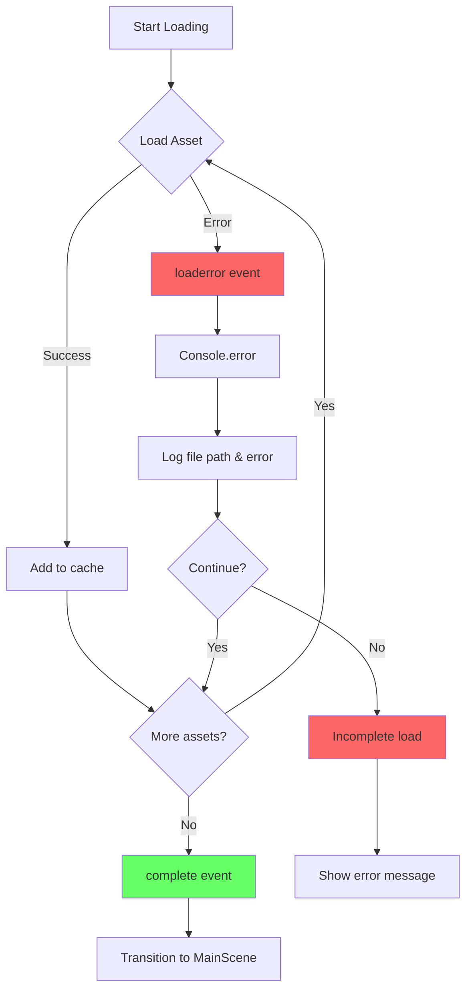

## Notes

### Why This Architecture?

**Dedicated PreloadScene**
- Separates loading logic from game logic
- Provides visual feedback during loading
- Allows for loading screen customization
- Standard pattern in Phaser games

**Progress Bar Implementation**
- Uses Phaser Graphics objects for flexibility
- Updates in real-time with loader events
- Simple and performant
- Easy to customize appearance

**Asset Cache**
- Phaser automatically caches loaded assets
- Assets accessible by key in any scene
- No need to reload between scenes
- Efficient memory management

### Phaser Loader Events

The loader fires these events in order:
1. **start**: Loading begins
2. **progress**: Overall progress (0.0 to 1.0)
3. **fileprogress**: Individual file progress
4. **load**: Individual file loaded successfully
5. **loaderror**: Individual file failed to load
6. **complete**: All files loaded

### Progress Bar Positioning

Centering calculations:
- **X position**: `(canvasWidth - barWidth) / 2`
- **Y position**: `canvasHeight / 2`
- **Text origin**: `(0.5, 0.5)` for center alignment

### Scene Lifecycle

```
PreloadScene.init()
    ↓
PreloadScene.preload() ← Assets loaded here
    ↓
PreloadScene.create()
    ↓
scene.start('MainScene')
    ↓
MainScene.init()
    ↓
MainScene.preload() ← Usually empty
    ↓
MainScene.create() ← Use cached assets here
```

### What This Phase Proves

1. **Asset Loading Works**: Files load from disk/server
2. **Progress Tracking Works**: Visual feedback is accurate
3. **Asset Cache Works**: Loaded assets accessible in other scenes
4. **Scene Transitions Work**: Smooth handoff between scenes
5. **Audio System Works**: Sound playback functional
6. **Interactive Elements Work**: Click handlers functional

This establishes the pattern for all future asset loading in the game.

## Performance Considerations

- **Small Test Assets**: Keep under 100KB for fast testing
- **Progress Events**: Fire frequently, keep handlers lightweight
- **Graphics Objects**: Reuse instead of creating new ones
- **Scene Cleanup**: Phaser automatically cleans up scene objects
- **Cache Management**: Assets stay in cache until manually cleared

## Future Optimizations (Not in Phase 3)

- Asset pack JSON files for organized loading
- Loading screen animations
- Asset compression
- Sprite atlases for multiple images
- Audio sprites for multiple sounds
- Lazy loading for large assets
- Asset preloading strategies
