# Phase 30: Letter Builder - Draggable Pieces - UML

## Class Diagram

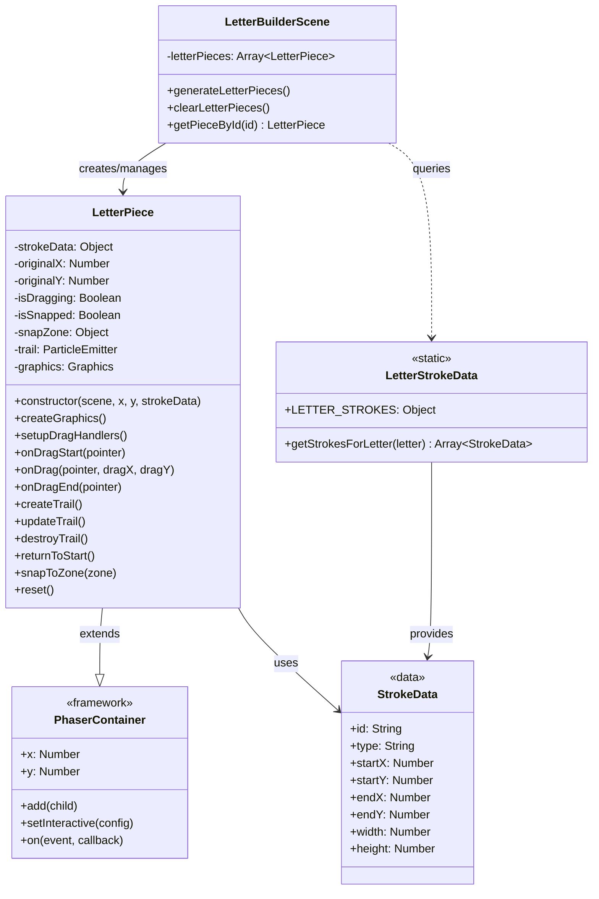

## Sequence Diagram - Piece Generation

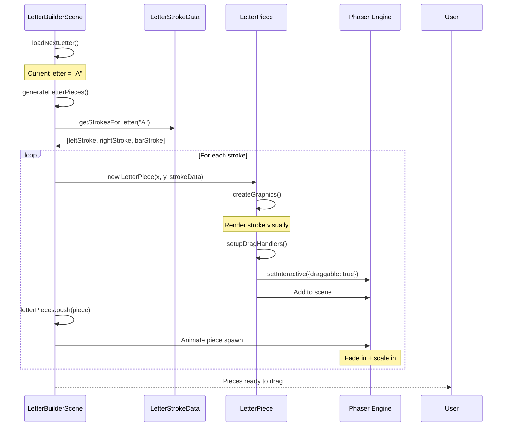

## Sequence Diagram - Drag Interaction

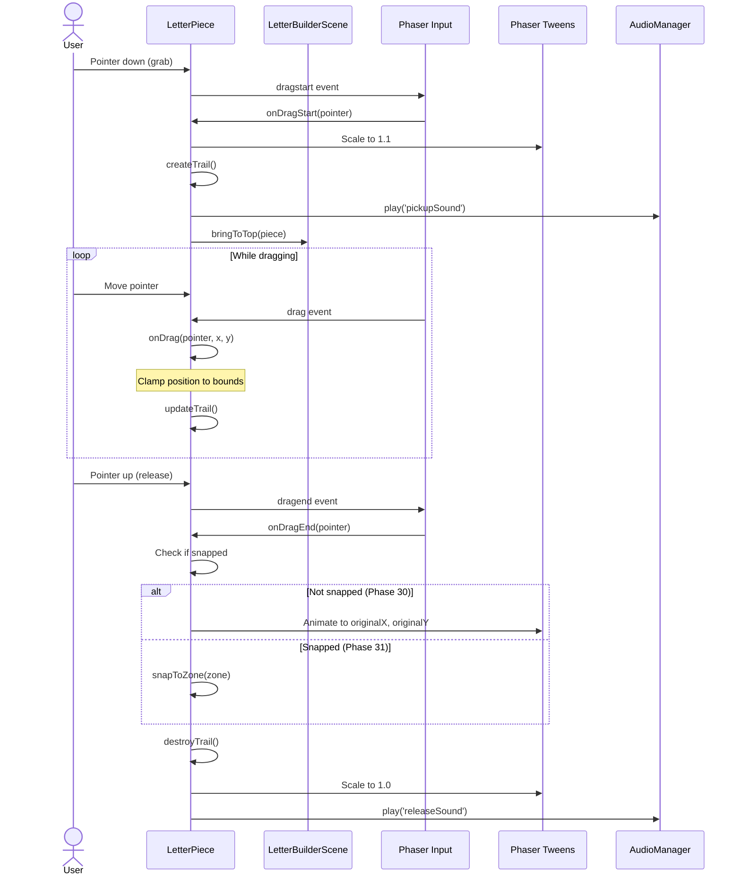

## Component Diagram - Piece Structure

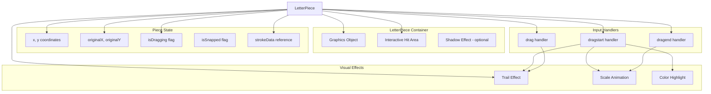

## State Diagram - Piece Lifecycle

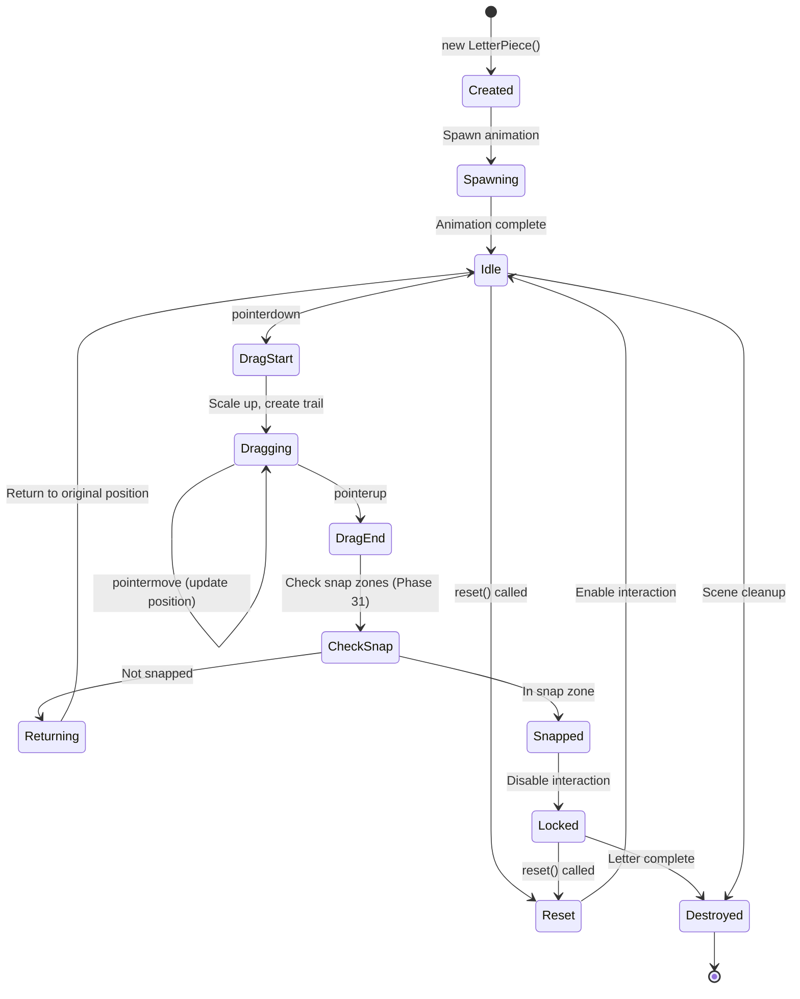

## Data Structure Diagram - Stroke Data

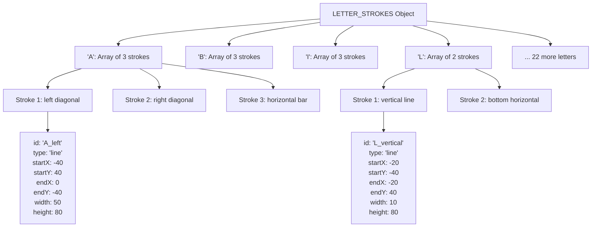

## UI Layout Diagram - Pieces Area

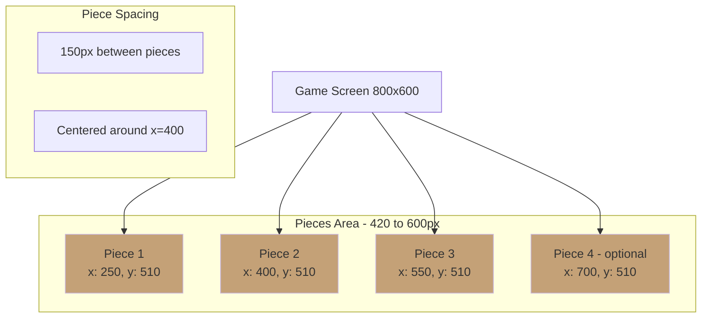

## Animation Timeline - Piece Spawn

```mermaid
gantt
    title Piece Spawn Animation Sequence
    dateFormat X
    axisFormat %L ms

    section Piece 1
    Fade + Scale: 0, 400

    section Piece 2
    Fade + Scale: 100, 500

    section Piece 3
    Fade + Scale: 200, 600

    section Piece 4
    Fade + Scale: 300, 700

    section Enable Drag
    Make Interactive: 700, 710
```

## Drag Performance Flow

```mermaid
graph LR
    PointerMove[Pointer Move Event]

    PointerMove --> InputSystem[Phaser Input System]
    InputSystem --> DragEvent[Emit 'drag' event]
    DragEvent --> OnDrag[piece.onDrag]

    OnDrag --> ClampPos[Clamp position]
    ClampPos --> UpdateXY[Update piece.x, piece.y]
    UpdateXY --> UpdateTrail[Update trail effect]

    UpdateTrail --> RenderLoop[Phaser Render Loop]
    RenderLoop --> Display[Display to user]

    style PointerMove fill:#90EE90
    style Display fill:#90EE90
```

## Trail Effect Strategies

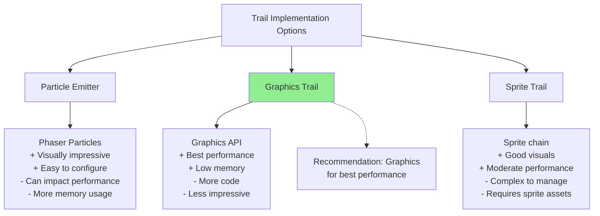

## Piece Bounds Clamping

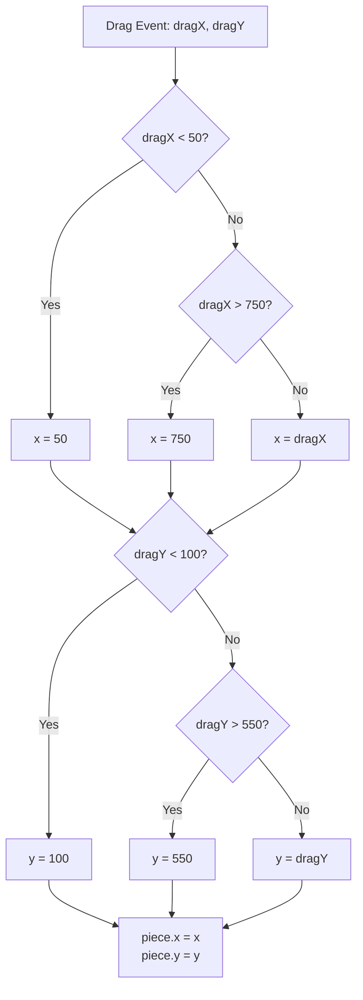

## Object Pooling Strategy (Optional Optimization)

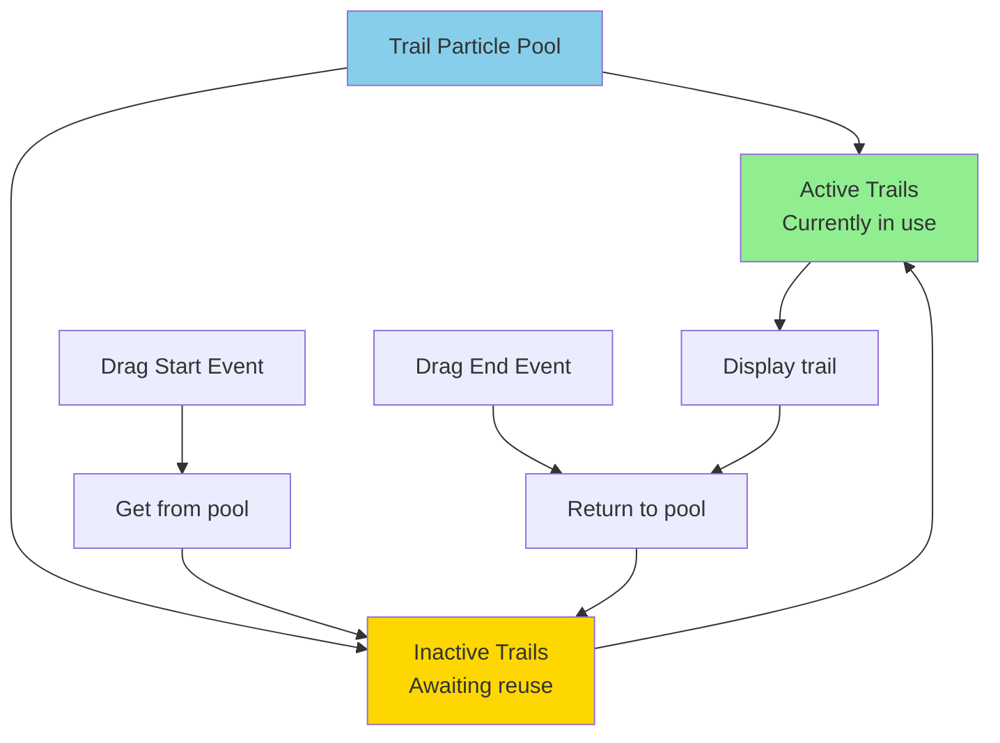

## Notes

### Architecture Decisions

**1. LetterPiece as Container**
- Extends Phaser.GameObjects.Container
- Allows grouping graphics, hit areas, effects
- Easy position/rotation/scale management
- Natural parent for child elements

**2. Stroke Data as Static Object**
- All 26 letters defined in one place
- Easy to modify and test
- Can be loaded from JSON if needed
- Separation of data from logic

**3. Drag Implementation**
- Uses Phaser's built-in drag system
- Reliable and performant
- Automatic pointer tracking
- Multi-touch support

**4. Trail Effect Strategy**
- Graphics API recommended for performance
- Particle emitter as alternative for visual impact
- Trail length limited (max 20 points)
- Auto-cleanup to prevent memory leaks

**5. Bounds Clamping**
- Keeps pieces visible and accessible
- Smooth clamping (no jarring stops)
- Margin from edges (50px) for comfort
- Prevents pieces getting lost

### Performance Considerations

**Optimization Priorities:**
1. **Drag responsiveness**: < 50ms latency critical
2. **Trail rendering**: Use efficient Graphics API
3. **Object creation**: Minimize during drag (no new objects)
4. **Z-index management**: Only update when needed
5. **Animation timing**: Use Phaser tweens (optimized)

**Memory Management:**
- Destroy trails when piece released
- Clear piece references when letter complete
- Pool trail objects if needed
- Avoid circular references

**Frame Rate Targets:**
- Idle: 60fps (easy to maintain)
- Dragging 1 piece: 60fps (must maintain)
- Dragging with trail: 60fps (requires optimization)
- Multiple pieces (sequential): 60fps (should maintain)

### Stroke Data Design Guidelines

**Simple Letters (2-3 strokes):**
- I, L, T, V, X
- Good for beginners
- Clear piece separation
- Easy to assemble

**Medium Letters (3 strokes):**
- A, H, E, F, K, N, Y, Z
- Moderate difficulty
- Some piece overlap
- Requires spatial reasoning

**Complex Letters (4+ strokes):**
- M, W, B
- Advanced difficulty
- Multiple overlapping pieces
- Requires planning

**Stroke Type Considerations:**
- **line**: Straight line (most common)
- **arc**: Curved stroke (B, D, O, P, etc.)
- **diagonal**: Angled line (A, K, M, N, etc.)
- **curve**: Complex curve (S, etc.)

This architecture provides a solid foundation for intuitive, responsive drag-and-drop interaction while maintaining high performance for ADHD-friendly smooth gameplay.
