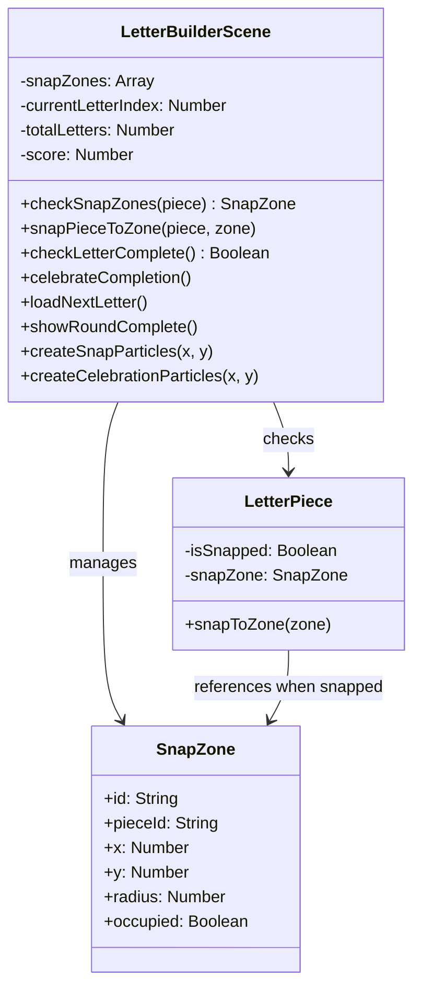
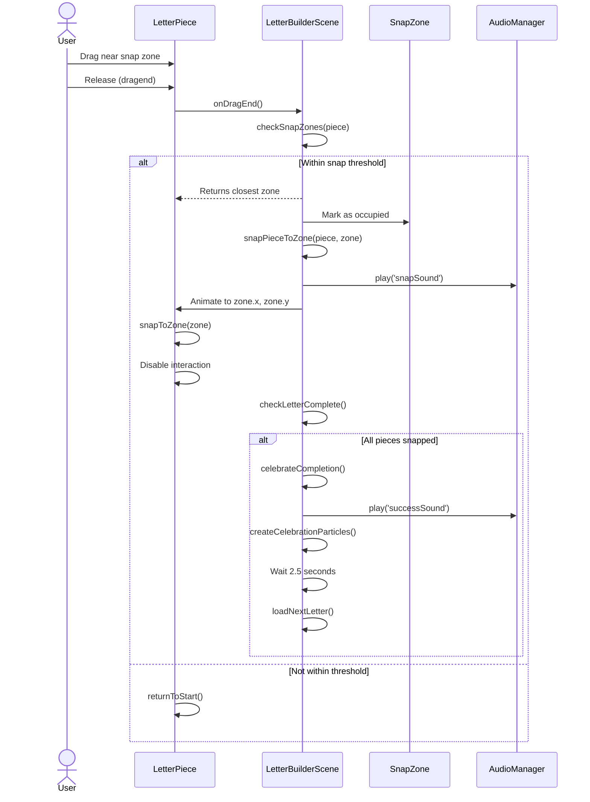
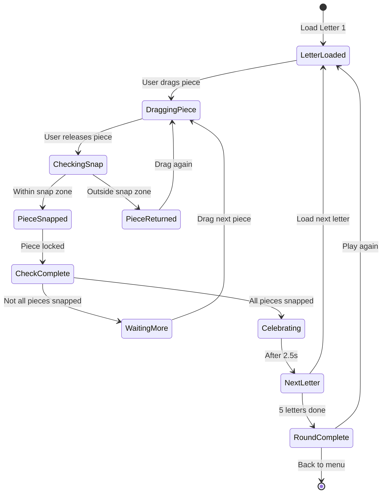
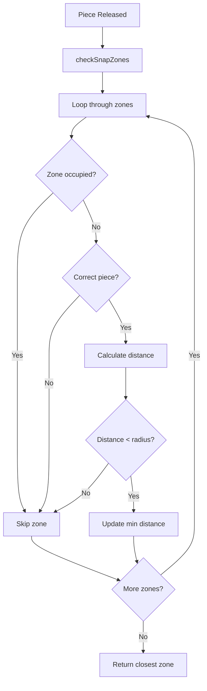
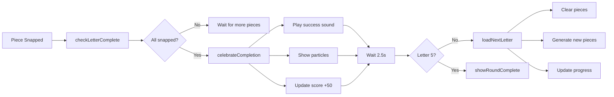

# Phase 31: Letter Builder - Snap and Complete Logic - UML

## Class Diagram

## Sequence Diagram - Snap and Complete

## State Diagram - Game Progression

## Component Interaction - Snap Detection

## Data Flow - Completion and Progression

## Notes

**Snap Detection Algorithm:**
1. Get all snap zones for current letter
2. Filter zones: not occupied, correct piece ID
3. Calculate distance from piece to each zone
4. Find zone with minimum distance < threshold
5. Return closest zone or null

**Completion Check:**
- Simple: `letterPieces.every(p => p.isSnapped)`
- Called after each snap
- Triggers celebration if all true

**Progression Logic:**
- Track currentLetterIndex (1-5)
- After celebration, increment and load next
- At 5, show round complete screen
- Reset index if play again
