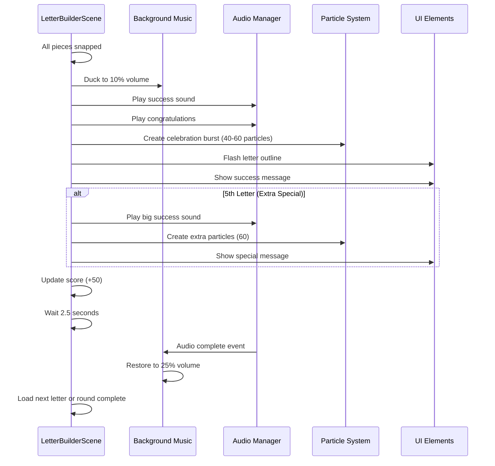
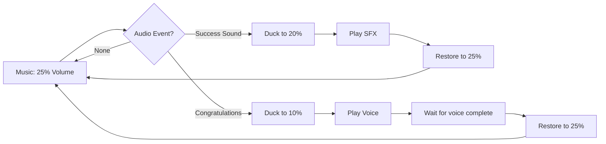
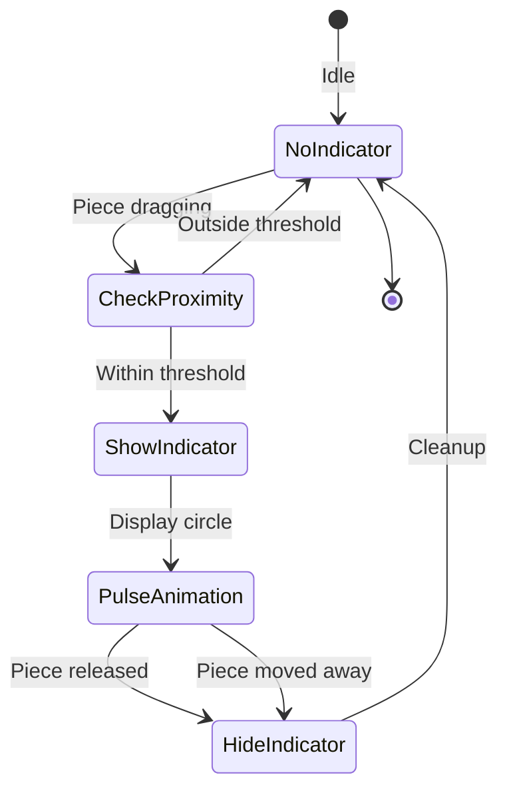
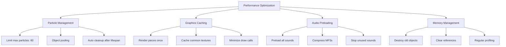
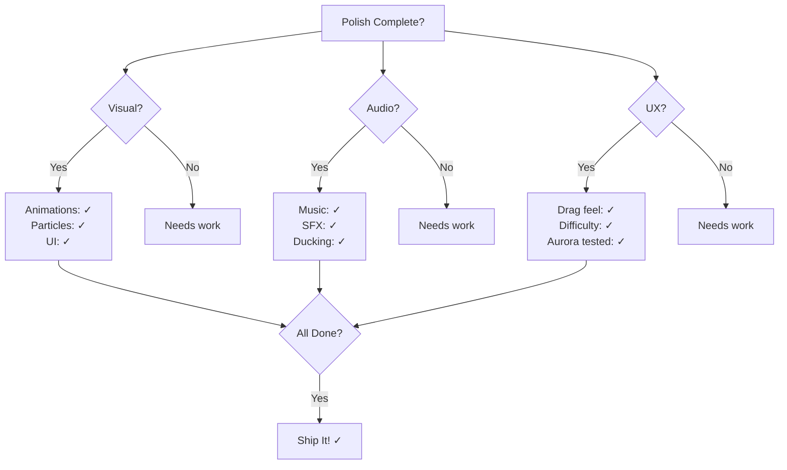

# Phase 32: Letter Builder - Polish - UML

## Polish Architecture Overview

```mermaid
graph TB
    LetterBuilderScene[LetterBuilderScene - Polished]

    subgraph Audio Systems
        BGMusic[Background Music]
        SFX[Sound Effects]
        Ducking[Audio Ducking]
        Voice[Congratulations Audio]
    end

    subgraph Visual Polish
        Animations[Smooth Animations]
        Particles[Particle Effects]
        Feedback[Visual Feedback]
        UI[Polished UI]
    end

    subgraph User Experience
        Physics[Refined Drag Physics]
        Difficulty[Tuned Difficulty]
        ADHD[ADHD-Friendly Design]
        Testing[Aurora Feedback]
    end

    LetterBuilderScene --> BGMusic
    LetterBuilderScene --> SFX
    LetterBuilderScene --> Ducking
    LetterBuilderScene --> Voice

    LetterBuilderScene --> Animations
    LetterBuilderScene --> Particles
    LetterBuilderScene --> Feedback
    LetterBuilderScene --> UI

    LetterBuilderScene --> Physics
    LetterBuilderScene --> Difficulty
    LetterBuilderScene --> ADHD
    LetterBuilderScene --> Testing
```

## Enhanced Celebration Sequence

## Animation Timeline - Letter Transition

```mermaid
gantt
    title Smooth Letter Transition (3 seconds)
    dateFormat X
    axisFormat %L ms

    section Fade Out
    Pieces fade out: 0, 500
    Outline fade out: 0, 500

    section Clear
    Destroy old pieces: 500, 600

    section Fade In
    New outline scale in: 600, 1100
    New pieces spawn: 1000, 1400

    section Ready
    Interactive: 1400, 1500
```

## Audio Ducking Flow

## Proximity Indicator System

## Performance Optimization Strategy

## Polish Checklist Matrix

## Notes

**Polish Priorities:**
1. Aurora's feedback (most important)
2. Performance (60fps non-negotiable)
3. Audio balance (critical for experience)
4. Visual smoothness (animations, particles)
5. ADHD-friendly design (clear, calm, predictable)

**Performance Targets:**
- Idle: 60fps
- Dragging: 60fps
- Celebration: 60fps (even with 60 particles)
- Memory: Stable (no leaks)

**Audio Balance:**
- Music: 20-25% (background, non-intrusive)
- SFX: 30-50% (clear but not overwhelming)
- Voice: 50-70% (prominent, educational)
- Ducking: Music to 10% during voice

**ADHD-Friendly Checklist:**
- Large hit areas (easy to click)
- Immediate feedback (<50ms)
- Clear visual hierarchy
- Calm color palette
- Predictable behavior
- No sudden loud sounds
- Success-oriented (encouraging)
- No time pressure
