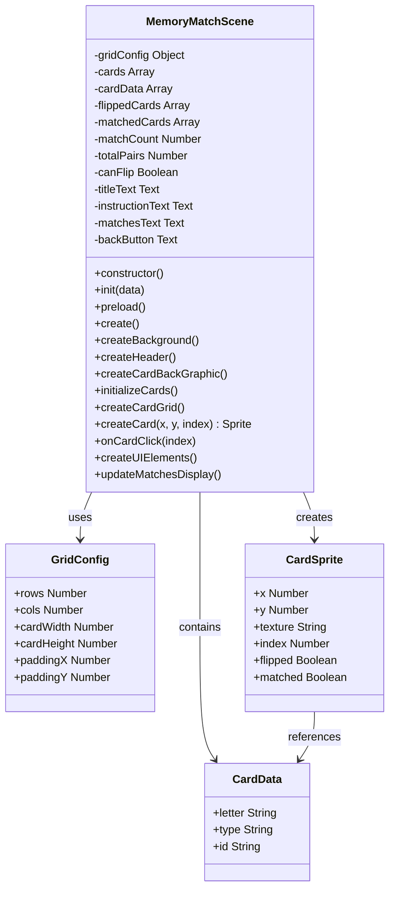
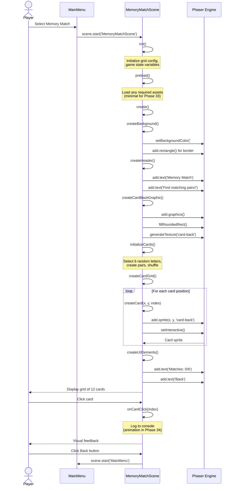
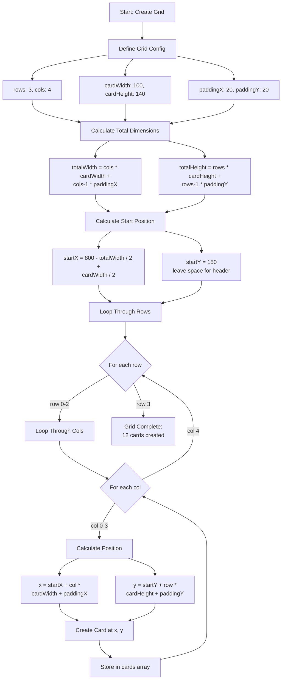
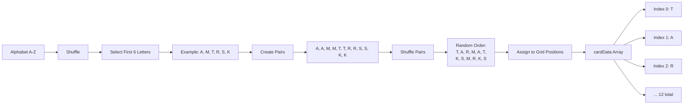
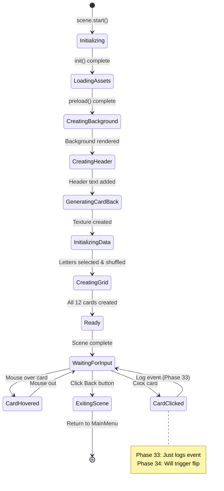
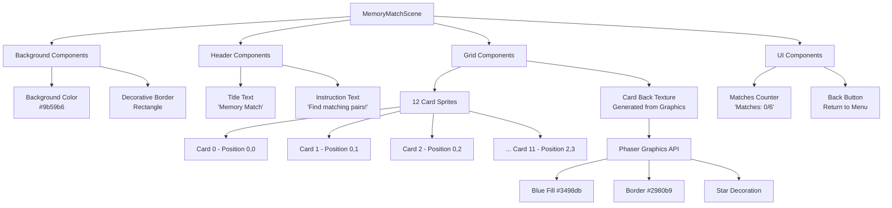
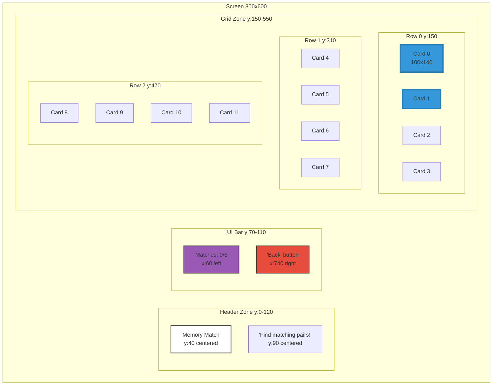
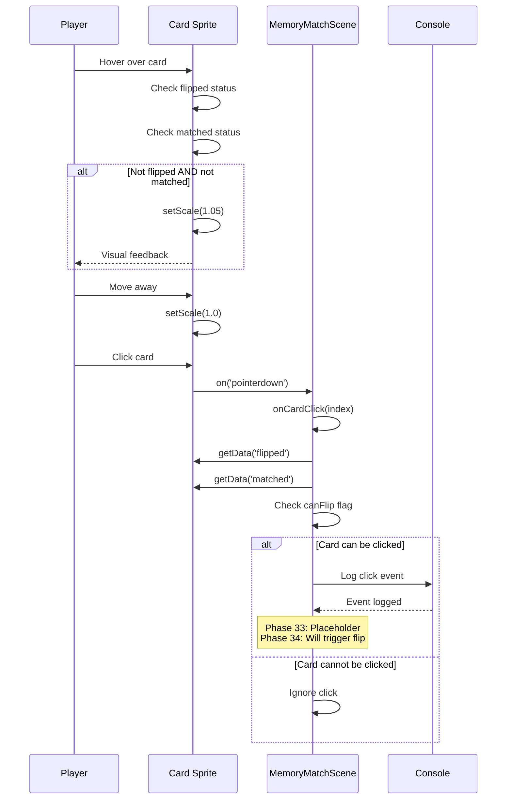
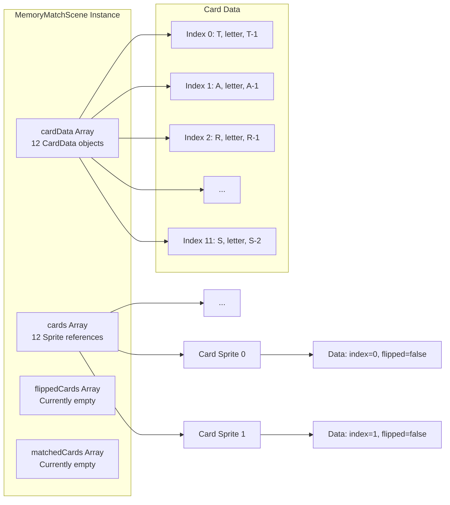

# Phase 33: Memory Match - Scene Setup - UML

## Class Diagram

## Scene Flow Diagram

## Grid Layout Algorithm

## Card Data Structure

## State Diagram

## Component Diagram

## Layout Diagram

## Data Flow: Card Click Event

## Memory Structure

## Notes

### Why This Architecture?

**Grid-Based Layout**
- Mathematical positioning ensures perfect alignment
- Easy to modify grid size (3x4, 4x4, 5x4, etc.)
- Scalable for different difficulty levels
- Centered layout adapts to screen size

**Generated Card Back Texture**
- Single texture for all card backs (memory efficient)
- Programmatically generated (no asset file needed)
- Easy to modify design programmatically
- Consistent appearance across all cards

**Array-Based Card Storage**
- Simple indexing for card access
- Efficient for small number of cards (12)
- Direct mapping to grid positions
- Easy to iterate for updates

**Placeholder Interaction**
- Phase 33 establishes click handlers
- Console logging proves interaction works
- Phase 34 will replace placeholder with animation
- Separation of concerns (layout vs. interaction)

### Design Decisions

**Grid Size: 3x4 (12 cards)**
- 6 pairs is appropriate for young children
- Not overwhelming for ADHD learners
- Fits well in 800x600 canvas
- Standard memory game size

**Purple Color Scheme**
- Distinct from other mini-games (blue, green, etc.)
- Calming and focused aesthetic
- Good contrast for readability
- Gender-neutral color

**Card Dimensions: 100x140**
- Large enough to see clearly
- Appropriate aspect ratio (portrait)
- Room for letter or image on face
- Fits 12 cards with spacing

**Rounded Corners**
- Friendly, approachable design
- Safer visual feel for children
- Modern aesthetic
- Easier to identify as interactive elements

### What This Phase Proves

1. **Scene Setup**: MemoryMatchScene loads correctly
2. **Layout Algorithm**: Grid calculation is accurate
3. **Visual Design**: Card backs are appealing and clear
4. **Interaction Ready**: Click handlers in place for Phase 34
5. **UI Integration**: Scene works within game flow
6. **Performance**: 12 sprites render smoothly

This phase establishes the visual foundation. Phase 34 will add the interactive flip mechanics and card content display.
