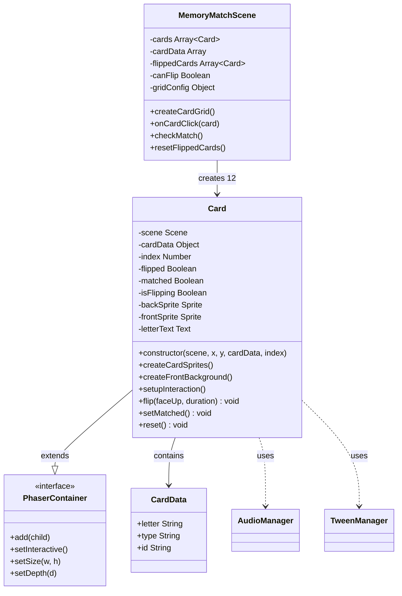
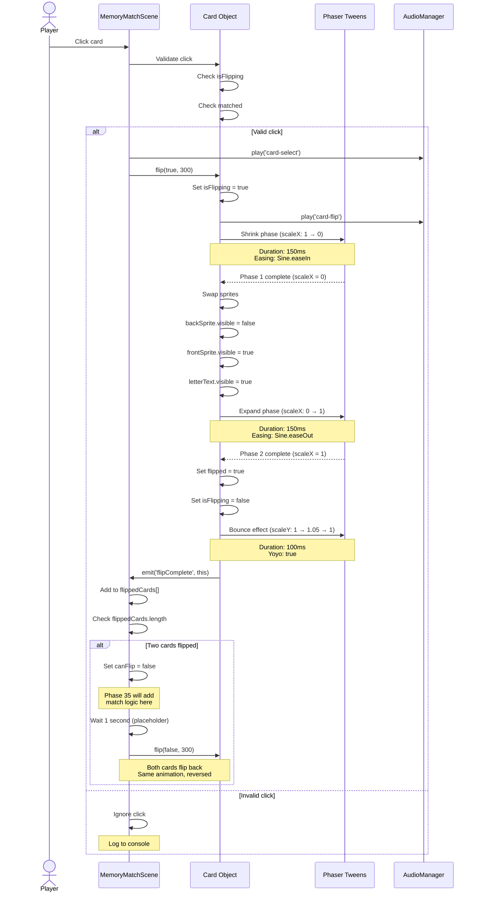
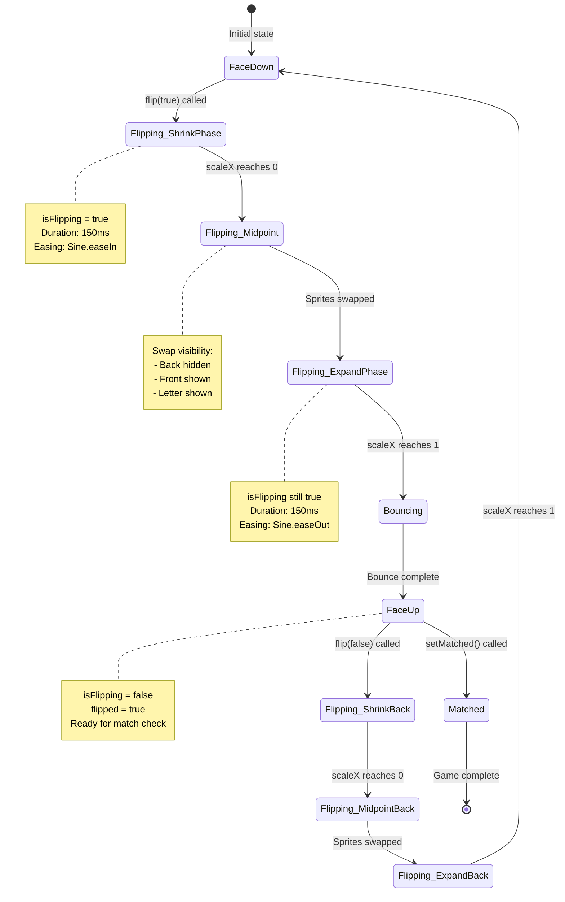
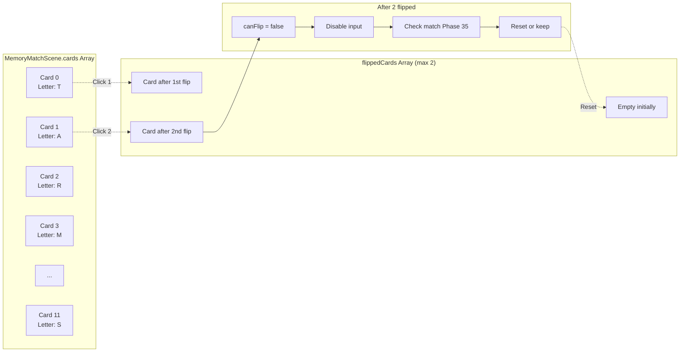
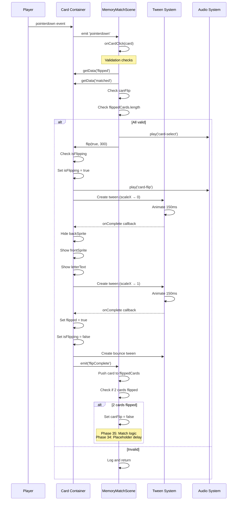
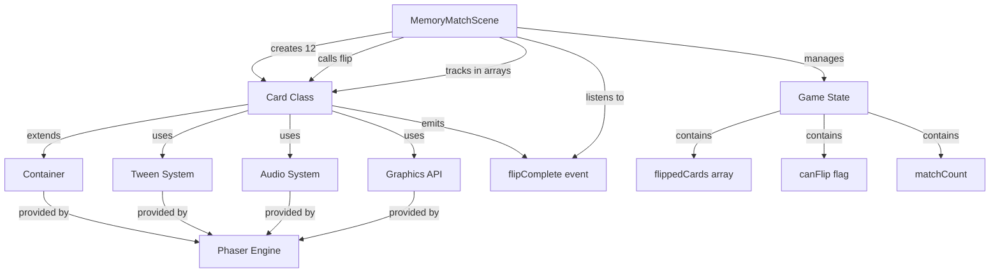
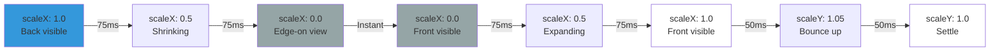

# Phase 34: Memory Match - Card Flip Mechanic - UML

## Class Diagram



## Flip Animation Sequence



## Flip Animation State Machine



## Card Component Structure

```mermaid
graph TB
    subgraph "Card Container"
        Container[Phaser.GameObjects.Container<br/>x, y, depth: 10]

        Container --> BackSprite[Back Sprite<br/>texture: 'card-back'<br/>visible: true initially]
        Container --> FrontSprite[Front Sprite<br/>texture: 'card-front-bg'<br/>visible: false initially]
        Container --> LetterText[Letter Text<br/>fontSize: 64px<br/>visible: false initially]

        BackSprite --> BackTexture[Card Back Texture<br/>Blue, rounded, star icon]
        FrontSprite --> FrontTexture[Card Front Texture<br/>White, rounded, border]
        LetterText --> LetterData[Letter from CardData<br/>Uppercase, bold]
    end

    subgraph "Card State"
        State[Card State Variables]
        State --> Flipped[flipped: boolean]
        State --> Matched[matched: boolean]
        State --> IsFlipping[isFlipping: boolean]
        State --> Index[index: number]
        State --> Data[cardData: object]
    end

    subgraph "Card Interaction"
        Interaction[Interactive Area<br/>100x140 rectangle]
        Interaction --> Hover[Hover: scale 1.05]
        Interaction --> Click[Click: flip()]
    end

    Container --> State
    Container --> Interaction
```

## Two-Card Selection Logic

```mermaid
flowchart TD
    A[Player clicks card] --> B{canFlip?}
    B -->|No| Z1[Ignore click]
    B -->|Yes| C{Card flipped?}

    C -->|Yes| Z2[Ignore click]
    C -->|No| D{Card matched?}

    D -->|Yes| Z3[Ignore click]
    D -->|No| E{2 cards flipped?}

    E -->|Yes| Z4[Ignore click]
    E -->|No| F[Play select sound]

    F --> G[Flip card face up]
    G --> H[Add to flippedCards[]]
    H --> I{flippedCards.length === 2?}

    I -->|No| J[Wait for next click]
    I -->|Yes| K[Set canFlip = false]

    K --> L[Phase 35: Check match]
    L --> M{Match?}

    M -->|Phase 35| N[Keep cards revealed]
    M -->|Phase 35| O[Flip cards back]

    N --> P[Increment match count]
    O --> Q[Wait 1 second]

    P --> R[Set canFlip = true]
    Q --> S[Flip both cards back]
    S --> T[Clear flippedCards[]]
    T --> R

    Z1 --> End[End]
    Z2 --> End
    Z3 --> End
    Z4 --> End
    J --> End
    R --> End

    style K fill:#ffcccc
    style L fill:#ffffcc
    style M fill:#ffffcc
    style N fill:#ccffcc
    style O fill:#ffcccc
```

## Flip Animation Timing Diagram

```mermaid
gantt
    title Card Flip Animation Timeline (300ms total)
    dateFormat SSS
    axisFormat %L ms

    section Phase 1: Shrink
    scaleX 1.0 → 0.0 (Sine.easeIn) :a1, 000, 150ms
    Sprite visible: Back :a2, 000, 75ms

    section Midpoint
    Swap sprites :milestone, 150, 0ms

    section Phase 2: Expand
    scaleX 0.0 → 1.0 (Sine.easeOut) :b1, 150, 150ms
    Sprite visible: Front :b2, 150, 150ms

    section Bounce
    scaleY 1.0 → 1.05 → 1.0 :c1, 300, 100ms

    section Complete
    Emit flipComplete :milestone, 400, 0ms
```



## Card Memory Layout



## Data Flow: Card Click to Flip



## Class Interaction Diagram



## Flip Animation Visual States



## Notes

### Why Container-Based Card?

**Benefits of Container Approach**:
- Groups sprites together as single unit
- Easier to transform (scale, rotate, move)
- Children inherit container transforms
- Clean encapsulation of card logic
- Reusable across different scenes
- Simplifies state management

**Alternative Approaches**:
- Individual sprites: Harder to manage transformations
- Single sprite with texture swap: Less flexible for complex designs
- DOM elements: Poor performance, not game-like

### 3D Flip Animation Technique

**How It Works**:
1. Shrink card horizontally (scaleX: 1 → 0)
2. At midpoint (scaleX = 0), card is edge-on (invisible)
3. Swap sprite visibility (back → front)
4. Expand card horizontally (scaleX: 0 → 1)
5. Front now visible, appears as smooth flip

**Why This Works**:
- Human eye perceives horizontal shrink as rotation
- Midpoint swap is hidden when card is edge-on
- Sine easing makes motion natural
- Total 300ms feels smooth and satisfying
- Works on all devices without 3D rendering

**Math Behind It**:
```
Phase 1: 0ms   → 150ms (scaleX: 1.0 → 0.0, Sine.easeIn)
Midpoint: 150ms (scaleX: 0.0, swap sprites)
Phase 2: 150ms → 300ms (scaleX: 0.0 → 1.0, Sine.easeOut)
```

### Two-Card Selection System

**Game Rule**: Memory match requires comparing 2 cards

**Implementation Strategy**:
1. Allow any card to be clicked (if valid)
2. Track in `flippedCards` array
3. When array length = 2, disable further input
4. Process match check (Phase 35)
5. Either keep cards revealed or flip back
6. Clear array and re-enable input

**Why Array-Based**:
- Simple to track which cards are flipped
- Easy to access both cards for comparison
- Natural JavaScript pattern
- O(1) access time

### Timing Considerations for ADHD

**Animation Duration: 300ms**
- Fast enough to feel responsive
- Slow enough to see what's happening
- Prevents confusion from instant changes
- Industry standard for card flips

**Delay Before Flip-Back: 1000ms (Phase 35)**
- Gives player time to memorize cards
- Not so long that they get impatient
- Allows visual processing
- Can be adjusted based on difficulty

**Sound Feedback**:
- Immediate (0ms delay)
- Reinforces action instantly
- Helps maintain attention
- Short duration prevents overlap

### Design Decisions

**Why Containers Over Sprites**:
- Easier to add more card elements later
- Cleaner code organization
- Better encapsulation
- Standard game development pattern

**Why Two-Phase Tween**:
- Single scaleX tween can't swap sprites mid-animation
- Two phases allow midpoint sprite swap
- Separate easing for each phase feels natural
- Gives precise control over timing

**Why 64px Letter Size**:
- Large enough to read from distance
- Fills card space appropriately
- Good for young children and ADHD focus
- Scales well on different displays

**Why Bounce Effect**:
- Adds satisfying "weight" to card
- Provides feedback that flip completed
- Makes interaction feel polished
- Subtle enough not to distract

### What This Phase Proves

1. **Card Class Works**: Reusable, self-contained card objects
2. **Flip Animation**: Smooth 3D effect without 3D rendering
3. **Input Control**: Two-card limit enforced correctly
4. **State Management**: Tracks flipped/matched states
5. **Integration**: Card class works within scene architecture
6. **Performance**: Animations are smooth at 60fps

This establishes the core interaction mechanic. Phase 35 will add the match logic that makes it a true memory game.
